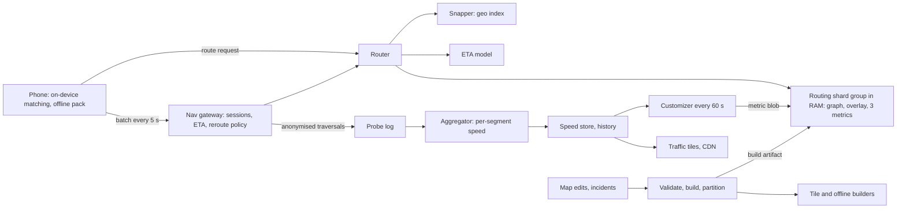
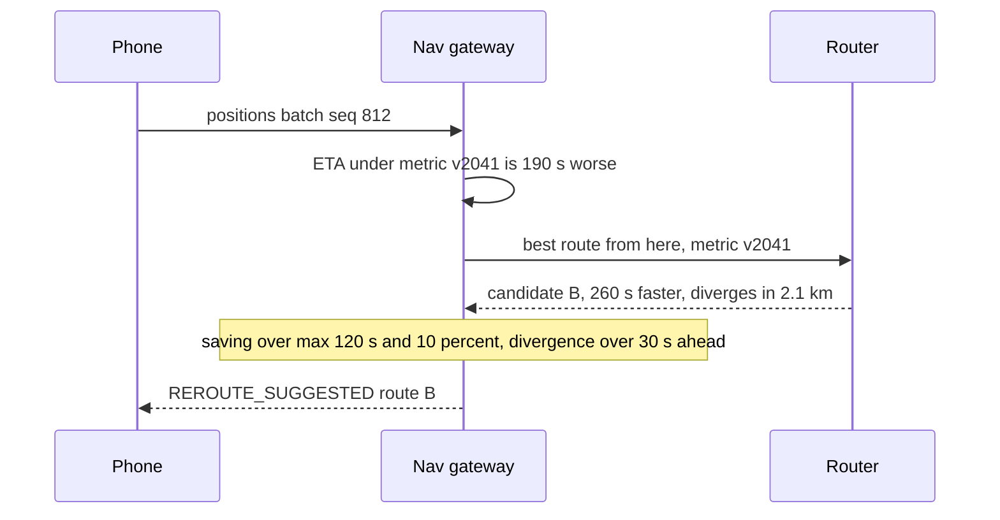

# 034 — Maps Routing and ETA: Full System Design Solution

## Goal and contract

A route is the minimum-time path on a directed road graph whose edge weights blend **live probe speeds, a learned time-of-day profile and free-flow speed**. Continent-scale shard groups hold the graph in RAM. An ML layer corrects the ETA but never edits the path.

- **One snapshot per answer.** Every route names the `build_id` (map version) and `metric_version` (weights) that produced it, so a retry or a replay sees the same numbers.
- **Not promised:** the provably fastest route (search runs on a snapshot metric, candidates are re-priced along their own path, regret is measured), an exact ETA, or a fresh weight on a road nobody drove. No data falls back to the historical profile, never to free flow.
- **The one hard decision: separate topology from metric.** Speeds change every minute, and a speed-up whose preprocessing depends on weights (plain contraction hierarchies) must be redone on every change. So preprocess the graph once per map build and **customize** the weights every minute.
- Probe data is anonymous and aggregate-only. Tiles and snapping are in [026](026_nearby_places_solution.md), dispatch ETAs in [020](020_ride_dispatch_solution.md).

## Estimates

(assumed) marks our numbers, to be load-tested.

| Quantity | Arithmetic | Result | So we need... |
|---|---|---|---|
| Route demand | starts 1M / 1,800 s = 556/s, previews 4× = 2,222/s, off-route 0.1 per trip = 56/s, traffic re-checks 5% of 1M per minute = 833/s | 3,667/s vs 5,000/s peak | 1.36× headroom, so shed by request class in a storm. |
| Status checks | 1M / 5 s = 200,000 req/s × 200 B (5 fixes × 40 B) | 40 MB/s in | A stateful gateway replying with ETA. Sessions 1M × (300 edges × 8 B + 0.5 KB) = 2.9 GB, index 3.6 GB. |
| Dijkstra at 3,000 km | whole continent ~100M nodes at 5M settles/s (assumed) | 20 s vs 0.3 s: 67× over | Deep dive 1. A 90/9/1 short, mid, long mix averages 0.175 core-s: 876 cores at 5,000/s. Throughput is affordable, the **tail is not**. A hierarchy at ~5 ms (search 2, alternatives 2, unpack 1) × 5,000/s is 25 cores, so replicas are set by RAM and zones. |
| Graph in RAM | Asia 330M edges × 20 B = 6.6 GB, 132M nodes × 20 B = 2.6 GB, overlay 0.5 GB + 3 metrics × 16 B/node = 6.3 GB, LIVE spare 2.1 GB, speeds 1.3 GB, +5% halo | 20.5 GB. World (1,000M edges over 6 groups) = 62 GB | It fits one big box, so shard for **fault isolation, rollout and boot time**. Geometry (8 GB) is memory-mapped from NVMe. |
| Probes | navigation 1M / 7 s per 100 m edge = 143k traversals/s, passive 10M × 10% driving / 10 s × 1.4 edges = 140k/s | 283k/s = 17M/min, ~10M distinct edges/min (1% of edges) | Upload matched traversals at 16 B: 4.5 MB/s = 391 GB/day, 8.2 TB for 7 days × 3. History: 200M edges × 96 buckets × 4 B × 84 days = 6.5 TB, so fit profiles offline (512 templates × 672 slots + 3 B/edge). |
| Customization | CRP papers: ~10 s on 12 cores for 18M-node Europe (order of magnitude) = 120 core-s × 132M/18M = 880 core-s for Asia = 28 s on 32 cores, 30% cells dirty = 8 s | World 2,667 core-s × 30% / 60 s = 13 cores | A 60 s cycle. Ship dirty cells: 2.1 GB × 30% × 6 replicas / 60 s = 63 MB/s per group. |
| Freshness | emit 30 s + lag 10 s + cycle wait 60 s + customize 28 s + ship 20 s + swap 1 s | 149 s vs 180 s target | A 120 s cycle would give 209 s and break the SLO. |
| Latency at 3,000 km | gateway 10 + snap 5 + search 20 + alternatives 20 + unpack and geometry 30 + re-price 2 + ETA 10 + network 30 | 127 ms vs 300 ms | 2.4× tail slack. Payload 72 + 2 × 24 KB = 120 KB. |
| Offline pack | CH: (10M edges + 10M shortcuts) × 8 B + 4M nodes × 8 B + turns 8 MB = 200 MB | + ~200 MB tiles and search | No slack under 400 MB: cap regions at 10M edges. |

## API

```text
POST /v1/routes:compute {origin, destination, waypoints[], depart_at | arrive_by, alternatives:3, avoid[], request_id}
  → {routes:[{route_id, build_id, metric_version, distance_m, eta_s, eta_range_s:[lo,hi], geometry, legs[], segment_ids}]}
POST /v1/sessions {route_id}  → {session_id, route_epoch}
POST /v1/sessions/{id}/positions {seq, fixes[]:{t, lat, lon, acc_m, speed, bearing, matched?:{segment_id, offset_m}}}
  → {eta_s, eta_range_s, remaining_m, status: ON_ROUTE | REROUTE_SUGGESTED | REROUTED, route?}
GET  /v1/traffic/tiles/{z}/{x}/{y}      → vector traffic overlay, CDN, TTL 60 s
GET  /v1/offline/regions/{id}/manifest  → {version, bytes, delta_from[]}
```

`request_id` replays the cached response for 10 minutes, `seq` drops resends, and a reroute is decided once per `(session_id, route_epoch)`. Errors: `NO_ROUTE`, `422 TOO_MANY_WAYPOINTS`, `429 retry_after`, `503`. Maneuvers stream in 100 km chunks.

## Data model

| Entity | Fields | Where and why |
|---|---|---|
| Graph build | CSR edges `{head, base_time, profile_id, flags}`, **stable 64-bit `segment_id`**, coordinates, cell id per level, overlay topology | Immutable artifact in RAM. Source of truth is the map database. |
| Metric | `{group, build_id, metric_version, kind LIVE/PEAK/OFFPEAK, edge speeds, overlay weights}` | Immutable blob, two kept: rollback is a pointer flip. |
| Segment speed, history | `segment_id → {v, n_devices, ts}` plus 15-minute buckets `{mean, p10, p90, n}` | Stream state partitioned by (group, S2 cell), so a customizer reads local data. |
| Nav session | `{session_id, route_epoch, build_id, segment_ids[], pos, last_seq, eta, cooldown_until}` | Gateway RAM, checkpoint every 30 s, TTL 6 h, partition by `hash(session_id)`. |
| Incident | `{id, segment_ids, type, start, end?, source, confidence}` | KV store, broadcast to shards as an infinite weight. |

Shards partition **geographically**, sessions **by hash** (no locality to exploit). Sessions hold `segment_id`, so a build swap keeps them valid.

## Architecture



**Read walk (a 2,400 km request).** The router snaps both ends (4 candidate edges each), picks the group, runs the bidirectional overlay search on `LIVE`, adds alternatives, unpacks, re-prices each path time-dependently, calls the ETA model and stamps the versions.

**Write walk (a position batch, 200k/s).** The gateway dedups by `seq`, matches fixes to the route, reads remaining time from prefix sums under the current metric, applies the reroute policy, replies, and forwards `{segment_id, enter_t, exit_t}` under a random per-trip id to the probe log.

## Deep dive 1: why Dijkstra fails, and the algorithm ladder

Dijkstra settles every node closer than the target, so work grows with the **area** of a disc of radius d:

| Trip | Nodes in the disc (density, assumed) | Settled | At 5M/s |
|---|---|---|---|
| 10 km metro | π·10²·300/km² | 94k | 19 ms |
| 100 km | π·100²·30/km² | 0.94M | 0.19 s |
| 1,000 km | π·1000²·10/km² | 31M | 6.3 s |
| 3,000 km | whole continent | 100M | 20 s |

300 ms buys 1.5M to 3M settles, a 220 to 310 km radius, a tenth of the trip. Bidirectional search halves the area: 2×, not 67×.

| Technique | Preprocess and query (reported on ~18M-node Europe, order of magnitude) | Live weights? |
|---|---|---|
| ALT landmarks (Goldberg and Harrelson, SODA 2005) | 16 landmarks × 2 × 4 B = 128 B/node = 17 GB for Asia, nearly twice the graph. Roughly 10 to 50× fewer settles: still 0.4 to 2 s | Yes, while weights stay at or above the free-flow ones (bounds stay admissible), loosening under congestion. |
| Contraction hierarchies (Geisberger et al., WEA 2008) | Contract nodes by importance, add shortcuts, search only upward from both ends. Minutes to preprocess, sub-millisecond queries | **No.** Order and shortcut weights depend on the metric. |
| Customizable CH (Dibbelt, Strasser, Wagner, SEA 2014) | Order from nested dissection, recompute shortcut weights per metric in seconds. Queries a few times slower than CH | Yes |
| Customizable Route Planning (Delling, Goldberg, Pajor, Werneck, SEA 2011) | Multilevel partition, overlay of boundary-to-boundary distances per cell and metric. About a millisecond, reported deployed in Bing Maps | **Yes**, the design goal |
| Time-dependent CH (Batz et al., ALENEX 2009), hub labels | Function-valued shortcuts or labels: fastest, largest, fixed at build | No |

Survey: Bast et al., *Route Planning in Transportation Networks* (2016). Our world is 22× that benchmark.

**Decision: a CRP-style customizable overlay online and a static CH offline.** It gives millisecond queries and a 60 s metric refresh, at the cost of a partition per build, a customization service and 16 B/node per metric. Cheap here: 13 cores and 62 GB. The 16 B: 4 levels, boundary b ≈ √s per cell of s nodes (assumed) means b² = s entries per cell, one per node per level, × 4 B. Offline packs use plain CH because their metric is static (OSRM ships CH and a CRP-style MLD mode).

## Deep dive 2: partitioning, shard groups and boundaries

Choice: **6 continent-scale groups with a ~5% halo, cells inside**, so a trip is one machine and only rare inter-group trips need stitching. Rejected: hashing nodes across shards (a network hop per relaxation), one world replica (one blast radius, slow boot), country shards (most European trips cross shards).

**Cells** come from a natural-cut partitioner (PUNCH, Delling et al., IPDPS 2011) that cuts along rivers and mountains, keeping b near √s. Keep the partition stable across builds so unchanged cells reuse overlays. The **halo** lets Lisbon to Riga stay inside Europe when the best road dips across a border. Europe to Asia goes through ~3,000 interface nodes (assumed) with a clique per metric of 3,000² × 4 B = 36 MB, replicated to every router: search forward in the origin group, backward in the destination group, join on the interface overlay. A few ms in-region, on a rare class. Groups sit near users in 3 zones with a warm replica in another region: failover adds ~100 ms, so 127 + 100 = 227 ms holds ([27](../building_blocks/27_multi_region_and_global_traffic.md)).

## Deep dive 3: live traffic, staleness and time dependence

**Estimator.** Per segment, a recency-weighted median of traversal speeds over 5 minutes, published only with at least 3 distinct devices (privacy, and one double-parked van cannot close a street). Confidence `c = min(1, n/5) × 2^(−age/5 min)`, weight `v = c·v_live + (1−c)·v_profile(t)`. After 10 silent minutes `c ≤ 0.25`, so the segment reads its typical rush-hour speed.

**No data is not free flow.** A closed road gets no probes. Incident feeds and reports write explicit weights, an upstream speed collapse with downstream silence flags a suspected closure, and silent busy segments widen the ETA range.

**Time dependence.** A 4-hour trip reaches hour 3 under conditions that do not exist yet: `v(e,t) = v_profile(t) × (1 + (r − 1)·e^(−(t − now)/45 min))`, where `r` is the live-to-profile ratio and 45 min is an assumed persistence. Exact search requires the FIFO property (leaving later never arrives earlier), which smoothed profiles satisfy. We search on a snapshot metric (`LIVE`, `PEAK` or `OFFPEAK`, by expected passage time) and **re-price each candidate exactly along its own path** (3 × 30k edges × 20 ns = 2 ms). Cost: some suboptimality, acceptable because we measure it: shadow-run exact time-dependent A* on 1% of queries (50/s) and track the extra minutes as **regret** ([block 20](../building_blocks/20_specialized_data_structures.md)).

**Spoofing.** A 2020 art project's handcart of 99 phones was widely reported to paint a false jam. Weight by distinct devices, classify motion (vehicle or walking), bound speeds by road plausibility, require neighbours to agree.

## Deep dive 4: the ETA layer and map matching

**ETA is two layers.** The engine ETA (sum of edge times) is physical and debuggable. A model predicts the **residual ratio** actual/engine from route length, road-class mix, turns, signals, live-to-profile ratio, time, weather and region, and emits a corrected ETA plus a quantile range. Labels come from completed trips: 1M × 48 half-hours × 0.3 (assumed) = 14M/day, 14 GB. Trees are cheap: 16,700 refreshes/s × 1 ms = 17 cores. Google describes a graph neural network over "supersegments" (Derrow-Pinion et al., CIKM 2021), a heavier variant. Clamp the correction to [0.7, 2.0]× (assumed) and fall back to the engine ETA if the model is down.

**Map matching.** Nearest-road snapping fails on parallel roads and tunnels. An HMM (Newson and Krumm, SIGSPATIAL 2009) makes nearby edges the states, scores emission by a Gaussian on distance to the road and transition by road distance versus straight-line distance, and decodes with Viterbi. Match **on the device** during navigation with the route as a prior (few candidates, offline, sub-second) and upload traversals. Match **on the server** only raw passive traces: 100k fixes/s × 0.2 ms = 20 cores (assumed), fixed-lag decode.

## Deep dive 5: rerouting, alternatives and map updates



**Triggers.** (1) *Off-route:* the device sees more than 50 m from the route for 3 fixes and asks at once (top priority, 56/s). (2) *Traffic:* the gateway re-prices with each metric version and searches only if ETA rose 60 s or 10%, at most every 60 s per session (833/s). (3) *Incident:* the index finds affected sessions, jittered over 30 s. Suggest only if the saving is at least max(120 s, 10%) and the fork is 30 s ahead, then a 5-minute cooldown unless the saving doubles, or users flip. Randomise among near-equal candidates so one is not saturated (design judgment).

**Storm.** A bridge closure re-routes 100k sessions: 100k × 5 ms = 500 core-s, over 30 s = 3,300/s, 17 cores (Dijkstra: 100k × 0.175 = 17,500 core-s). Shed proactive checks first, then previews, new routes, off-route last ([28](../building_blocks/28_overload_control_and_graceful_degradation.md)).

**Alternatives.** The via-node (plateau) method (Abraham, Delling, Goldberg, Werneck, SEA 2010): the forward and backward search spaces already meet at candidate vias, so keep those whose route is at most ~25% longer, shares limited length with the best and is locally optimal (thresholds per the paper, hedged). One query plus a filter, not 3 searches. Fallback: the penalty method (raise weights on the found route, search again).

**Map updates.** Closures and traffic are **weights**: customization, ≤ 30 min for closures (verification), 150 s for traffic. New roads, one-way flips and turn restrictions are **topology**: a new build daily, or for an urgent fix only the affected cells and parents while the partition is stable. Pipeline: validate (islands, one-way conflicts), build with stable `segment_id`s, partition, publish an immutable artifact, roll out canary first behind a **shadow diff** (replay 100k historical queries on old and new, alert on shifted route time). Rollback is a pointer flip, and a session whose segments vanished is re-routed. Route geometry rides in the response, not tiles. The traffic overlay is a separate 60 s CDN layer.

## Failure behaviour

| Failure | Behaviour |
|---|---|
| Replica or zone lost | Router retries another replica (3 zones per group). Routes are stateless. |
| Whole group down in a region | Warm replica elsewhere, +100 ms. Gateways keep ETA from cached prefix sums. |
| Traffic pipeline or customizer down | Serve the last metric, confidence decaying toward profile. Freshness p99 over 6 min is a ticket. |
| ETA model down, or overload and reroute storm | Engine ETA with no range. Shed by class, alternatives 3 to 1, clients slow checks 5 s to 15 s. |
| Bad map build | Shadow diff blocks it, canary catches the rest, rollback is a pointer flip. |
| Poisoned probes | Distinct-device weighting, plausibility bounds, neighbour agreement, revert to profile. |
| Phone offline | On-device CH and typical profile, no live traffic. |

## Observability and interview close

- **SLIs:** route success and p99 by distance bucket, **freshness** (now minus newest probe in the serving metric), ETA error by trip length, regret, map-match off-road rate, reroute flip rate, customization duration, coverage (edges with `c > 0.5`), shadow-diff outliers.
- **The one paging alert:** routes answered within 300 ms below 99.9% over 5 minutes (burn rate). Stale traffic degrades quality but routing works from profile, so freshness over 6 minutes is a ticket.

Trade-off to state: "I chose a CRP-style customizable overlay served from RAM by continent-scale groups with a 60-second metric refresh, so a 3,000 km route is milliseconds of search and live speeds reach routing in about 150 seconds. The cost is a partition per map build, a customization service and approximate time-dependent search bounded by measured regret. Plain contraction hierarchies stay for static weights, like offline packs."

## Follow-ups the interviewer will ask

1. **"Multi-region?"** Each group runs where its users are, with a warm replica elsewhere. Probes and metrics are per group, so only the 36 MB interface overlay is global.
2. **"10× and 100×?"** At 10× (10M navigating): 2M status checks/s and 400 MB/s in, yet routing is only 50,000/s × 5 ms = 250 cores, so the gateway scales first. At 100×, push only edge deltas that touch a route (the index makes it a subscription) and let the phone sum its own remaining time.
3. **"Stricter consistency?"** Fleet SLAs need one answer from every replica: pin `metric_version` in the request and log it with `build_id` for replay, holding the previous metric a few minutes longer (2.1 GB per group).
4. **"Cost?"** 24 routing machines (3 zones × 6 groups + 6) × 16 cores = 384, ~25 busy, plus ~60 gateway, ~50 traffic, ~30 ETA, ~13 customization: ~540 cores × $0.04 × 8,760 h (assumed) is about $190k a year. The Dijkstra tail alone (50 long queries/s × 14 s) is 700 cores.
5. **"Fake traffic?"** Deep dive 3. Never publish a segment under 3 devices.
6. **"Why not contraction hierarchies with frequent rebuilds?"** Assuming shortcuts about equal edges, the world set is 2 billion edges (16 GB) and scaling the paper's minutes by 22× puts preprocessing near an hour, far beyond 60 s. If pressed: a CH per time band suits systems without minute-level traffic.
7. **"A tunnel closes at rush hour."** The storm paragraph: jitter, class-based shedding, herding guard.

## Common mistakes

1. **Dijkstra or Euclidean A\*.** Area grows with distance squared: 20 s at 3,000 km. Use a hierarchy and quote settle counts.
2. **Rebuilding contraction hierarchies per traffic update.** Preprocessing is metric-dependent: separate topology from metric.
3. **No probes means free flow.** Closed roads look empty. Use the profile and incident feeds.
4. **Hash-sharding the graph.** Every relaxation becomes a hop. Shard geographically with a halo.
5. **Re-routing on every ETA wobble.** Add a minimum saving, fork lead time and hysteresis, or drivers flip and herd.
6. **Nearest-road snapping as map matching.** Use an HMM with a route prior.
7. **ML replacing the router.** A pathless trip-time model is unexplainable. Learn the residual.
8. **Edge ids that change between builds.** Live sessions break at the swap. Use stable `segment_id`s.

## Going from L5 to L6

- **Build vs buy.** Start with OSRM (MLD), Valhalla or GraphHopper on licensed or open map data. Build the traffic pipeline, ETA model and gateway, the differentiators. Check licence terms.
- **Phases.** Static profiles, then live probes and customization, then ML ETA, each gated on regret and ETA error.
- **Blast radius.** Map data, traffic, routing and ETA are separate teams behind `build_id` and `metric_version`, so a poisoned feed cannot corrupt a build.
- **Measure first.** Trip-length distribution (the 90/9/1 assumption drives p99), coverage by road class, regret, ETA error, reroute acceptance. Cost is RAM per vehicle profile: trucks and bikes each add one.

## Build exercise

Build a 200×200 grid graph with random speeds, a two-level overlay, Dijkstra and an HMM matcher.

- `test_overlay_matches_dijkstra_and_settles_20x_fewer`: 1,000 random pairs give equal distances, with at least 20× fewer settled nodes on long ones.
- `test_customize_only_dirty_cells`: changing 50 edges recomputes only their cells and parents, and results still match Dijkstra.
- `test_missing_probes_fall_back_to_profile`: a silent segment reads rush-hour speed, not free flow.
- `test_alt_bound_admissible_when_weights_only_increase`: free-flow ALT potentials stay valid after weights rise.
- `test_reroute_hysteresis`: alternating routes 100 s apart flip at most once per 5 minutes.
- `test_matcher_recovers_route_under_noise`: with 10 m noise on parallel roads, Viterbi returns the true path.
