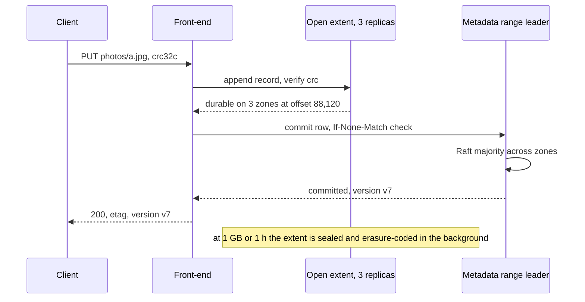

# 035 — Distributed Object Store: Full System Design Solution

## Goal and contract

An object store is two systems glued by a pointer: a **metadata index** that maps `(bucket, key, version)` to a location, and a **data layer** of large append-only **extents** spread over thousands of disks. The design follows the public shape of Azure Storage's stream layer (Calder et al., SOSP 2011), Facebook's Haystack and f4 (OSDI 2010, OSDI 2014) and the S3 consistency write-up (Vogels, "Diving Deep on S3 Consistency", 2021). The contract:

- **An acknowledged `PUT` is durable and visible.** Bytes are on disks in 3 zones before the metadata commit, and the metadata commit is the single moment the object becomes visible. `GET`, `HEAD` and `LIST` after that see it (strong read-after-write, which S3 has offered since December 2020).
- **Data is immutable; only metadata changes.** An overwrite writes new bytes and swings the pointer. The old bytes are garbage, reclaimed later. That one rule makes caching, repair and GC tractable.
- **11 nines is a design target over independent failures, and correlated failures are the real risk.** The arithmetic (Deep dive 1) shows the code is not what limits durability; failure domains, repair speed, checksums and safe deploys are.
- **Zone loss:** reads, writes and `LIST` continue with no data loss.
- Not promised: atomic multi-object operations, a `LIST` snapshot across pages, rename (it is copy plus delete), or cross-region durability (replication to another region is an opt-in feature with its own lag).

The one hard decision is **how bytes are laid out and protected**: small objects packed into shared extents that are replicated while open and erasure-coded once sealed. It cuts raw storage from 3× to 1.67× without paying erasure coding's I/O cost on 30 KB objects.

## Estimates

Constraints from the question; (assumed) marks our numbers.

| Quantity | Arithmetic | Result | So we need... |
|---|---|---|---|
| Egress | 1,000,000 GET/s × 250 KB | 250 GB/s = **2 Tbps** peak | Front-ends sized by NIC: at 20 Gbps usable each, about 100 front-ends plus headroom. |
| Ingest | 100,000 PUT/s × 100 KB; average half | 10 GB/s peak, 5 GB/s = **432 TB/day, 13 PB/month** gross | Gross ingest is 4× net growth (3 PB): about 10 PB/month is deleted or overwritten. GC is a first-class workload. |
| Raw capacity | 100 PB × 3 (replication) vs × 15/9 (RS(9,6)) | 300 PB vs **167 PB** | Erasure coding saves 133 PB of disk. |
| Disks today | 167 PB / 0.8 fill / 20 TB | **10,420 disks, 435 servers**, 145 per zone | A year of growth (136 PB logical) is 14,170 disks, 590 servers. |
| Disk IOPS | 10,420 × 120 = 1.25 M random reads/s; keep ≤ 30% for tail latency | 375,000 reads/s usable | 1 M uncached GETs would need **27,800 disks**: IOPS binds, not capacity. |
| With a cache | 80% of GETs served from front-end RAM/SSD (assumed, Zipf) | 200,000 disk reads/s = 19 per disk | Fits at 16% utilisation. The cache is part of the storage design, not an add-on. |
| Metadata | 200 B objects × 300 B (key 100 B, version, size, ETag, locator, owner) | 60 TB, **180 TB** with 3 replicas | Fits on NVMe: about 12,000 ranges of 5 GB. |
| Metadata ops | 1 M lookups + 100,000 commits + 20,000 deletes + 20,000 LIST scans per second | about 1.2 M ops/s | At 20,000 ops/s per server (assumed): 60 range leaders' worth; run 90 servers, 30 per zone. |
| Disk failures | 10,420 disks × 2% AFR (assumed) | 208 a year, **4 a week** | Repair is continuous, never an incident. |
| Repair of one disk | 16 TB used × 9 fragments read | 144 TB read. Spread over 435 servers at 200 MB/s: **28 min** | Rebuild onto one spare disk would take 22 h. Always rebuild spread out. |
| Repair of one server | 24 disks × 144 TB = 3.5 PB read; fleet NIC 2.7 TB/s, throttled to 10% | **3.5 h** | Wait 15 min before repairing: most outages are reboots. |
| Scrubbing | 133 PB used raw / 14 days | 138 GB/s = 7% of the fleet's 2 TB/s sequential | Every byte is read and checksummed every two weeks. |

## API

```text
PUT    /{bucket}/{key}           body, Content-MD5 or x-checksum-crc32c, If-None-Match: *   → 200 {etag, version_id}
GET    /{bucket}/{key}?versionId  Range: bytes=a-b, If-Match                                 → 200 | 206 | 304 | 404
HEAD   /{bucket}/{key}                                                                        → 200 {size, etag, ...}
DELETE /{bucket}/{key}?versionId                                                              → 204 (idempotent)
GET    /{bucket}?list-type=2&prefix=logs/&delimiter=/&max-keys=1000&continuation-token=...   → {contents[], common_prefixes[], next_token}
POST   /{bucket}/{key}?uploads                        → {upload_id}
PUT    /{bucket}/{key}?uploadId=u&partNumber=n  body  → {etag}
POST   /{bucket}/{key}?uploadId=u  {parts: [{n, etag}]}  → {etag: "md5-of-md5s-N"} | 400 InvalidPart
```

- **Idempotency.** `PUT` is naturally idempotent on content: a retry writes a second copy of the bytes and the later commit wins, the earlier becomes garbage. `DELETE` of a missing key returns 204. Completing a multipart upload twice returns the same result because the upload record is consumed atomically.
- **Conditional writes.** `If-None-Match: *` (create only if absent) and `If-Match: <etag>` (compare-and-swap) are checks inside the metadata commit, which gives clients a lock-free way to build leases and manifests on top. S3 added both in 2024; check the current docs for its exact semantics.
- **Errors.** `412 PreconditionFailed`, `503 SlowDown{retry_after}` when a key range is throttled, `400 BadDigest` when the checksum does not match.

## Data model

| Entity | Key → fields | Where it lives |
|---|---|---|
| Object version | `(bucket_id, key, version_desc)` → size, ETag, checksums, storage class, owner, user metadata, **locator** `[(extent_id, offset, length)]` or a manifest id, `is_delete_marker` | Metadata store, range-partitioned by `(bucket_id, key)`, Raft-replicated across 3 zones. Source of truth for what exists. |
| Multipart upload | `(bucket_id, key, upload_id)` → parts `[(n, etag, locator)]`, created_at | Same store, next to the object key. |
| Manifest | `manifest_id` → ordered locators for objects over 1 GB (a 5 TB object is 5,000 entries, 160 KB) | Same store, own rows. |
| Extent | `extent_id` → state (open or sealed), replicas or 15 fragment locations, length, checksums, `sealed_at` | Extent manager, its own Raft group: 167 PB / 1 GB = about 170 M extents × 200 B = 34 GB, held in RAM. |
| Extent bytes | Append-only 1 GB file of records `(key hash, version, length, crc32c, bytes)` with a footer index | Storage servers. The record header makes a lost index rebuildable from the extent itself. |
| Bucket | `bucket_id` → name, owner, region, versioning, lifecycle rules, policy | Small global table, cached everywhere. |

**Keys.** The metadata table is sorted by `(bucket_id, key)`, so a bucket is one contiguous key range split across servers, a prefix `LIST` is a range scan, and `version_desc` (inverted timestamp) puts the newest version first. The data layer never sees keys: it stores extents by id. That separation is what lets placement, repair and GC move bytes without touching the index, and lets the index split hot ranges without moving bytes.

## Architecture

```arch
%% caption: Front-ends look up or commit the pointer in the metadata ranges and move bytes to or from extents spread over three zones; the extent manager and background workers stay off the request path.
node C "Clients" at 1,0 icon=users sub="signed HTTPS"
node FE "Front-end API" at 1,1 icon=api sub="auth, checksum, data cache"
node MD "Metadata ranges" at 0,2 icon=index sub="Raft per key range"
node EM "Extent manager" at 2,2 icon=scheduler sub="placement, seal, health"
group za "Zone A" color=blue icon=region
node SA "Storage servers" at 0,3 in za icon=disk sub="extents, 24 HDD"
group zb "Zone B" color=blue icon=region
node SB "Storage servers" at 1,3 in zb icon=disk
group zc "Zone C" color=blue icon=region
node SC "Storage servers" at 2,3 in zc icon=disk
node BG "Background workers" at 1,4 icon=worker sub="repair, GC, scrub, lifecycle"
C -> FE
FE:L -> MD:T : "lookup, commit"
FE:R -> EM:T : "open extent"
FE -> SB : "read, append"
FE ..> SA
FE ..> SC
EM ..> SC : "seal, encode"
SB:B ..> BG:T
BG:L ..> MD:B : "scan"
```

**Write walk (small object).** The front-end authenticates, streams the body while computing CRC32C and MD5, and appends it to an **open extent** it holds, which has 3 replicas, one per zone. It waits for all 3 appends to reach NVMe journals, then commits the metadata row with the locator (a Raft write to the key's range, a majority across zones). Only now does it return `200`. If a replica is slow or dead, the front-end asks the extent manager to **seal** that extent at the last length all replicas have and opens a new one (the Azure "seal on failure" approach), so a write never waits for a repair. Large parts skip the replicated stage and are erasure-coded as they stream in.

**Read walk.** The front-end reads the newest version's row from the range leader (or a follower holding a read lease), which is where strong consistency comes from. The locator names one extent and offset. On a sealed extent the object sits inside one data fragment, so a healthy read is **one disk seek** on one server. The front-end verifies the record checksum and streams the bytes. Because data at a given `version_id` never changes, it can be cached by `(bucket, key, version_id)` with no invalidation at all.



## Deep dive 1: erasure coding versus replication, and the durability arithmetic

**What erasure coding is.** A Reed-Solomon code RS(k, m) splits data into `k` fragments and computes `m` parity fragments. Any `k` of the `k + m` rebuild the data, so it survives `m` losses at a storage cost of `(k + m) / k`. Replication is the special case of one data fragment and copies.

| Scheme, 3 zones | Overhead | Raw for 100 PB | Survives | Healthy small read | One-fragment repair reads |
|---|---|---|---|---|---|
| 3× replication, one copy per zone | 3.0× | 300 PB | Zone + 1 disk | 1 seek | 1 copy |
| RS(6,3), 3 fragments per zone | 1.5× | 150 PB | Zone, with **zero** margin | 1 seek | 6 fragments |
| **RS(9,6), 5 fragments per zone** (chosen for sealed extents) | 1.67× | 167 PB | Zone + 1 more fragment | 1 seek | 9 fragments |
| LRC (Azure, Huang et al., USENIX ATC 2012: 12 data, 2 local, 2 global parities) | 1.33× | 133 PB | Any 3 fragments | 1 seek | 6, from the local group |

RS(6,3) is out: with a zone down, one more disk failure makes data unavailable, and if the zone is gone for good, lost. RS(9,6) keeps one fragment of slack after losing a zone. LRC is cheaper and repairs with fewer reads but its plain form is not placed for zone loss; a zone-aware local-parity code is the evolution (L6 section).

**The arithmetic.** With disk failure rate `λ` per year and repair time `T`, data is lost only if enough further fragments of the same stripe fail while the first is being repaired. For `r` replicas the loss rate is about `r! λ^r T^(r−1)`; for a stripe of `n` fragments that dies at `m + 1` losses, about `n!/(n−m−1)! · λ^(m+1) · T^m`. With `λ = 2%` (assumed):

| Repair time `T` | 3× replication | RS(9,6), n = 15 |
|---|---|---|
| 24 h | 3.6 × 10⁻¹⁰ per year: **9.4 nines** | 1.8 × 10⁻²⁰: 19.8 nines |
| 6 h | 2.3 × 10⁻¹¹: 10.6 nines | 4 × 10⁻²⁴ |
| 1 h | 6.3 × 10⁻¹³: 12.2 nines | 10⁻²⁸ |

Three lessons. **Repair time is a durability lever as strong as the code:** 3× replication only reaches 11 nines if repair finishes within about 6 hours, which is why repair is spread over the fleet (28 minutes) instead of onto one spare disk (22 hours). **The code is not the limit:** under independent failures RS(9,6) is 8 orders of magnitude beyond the target. **So the real risk is correlated failure**: a bad batch of drives, a rack losing power, a zone fire, a storage-software bug that writes bad bytes everywhere, an operator deleting the wrong thing. Google's study of its storage fleet (Ford et al., OSDI 2010) found correlated failures dominate and most unavailability is transient. What 11 nines means at this size: 200 B objects × 10⁻¹¹ = **2 objects a year**, and that budget is spent by bugs, not by disks.

Decision: RS(9,6) across zones for sealed extents, 3× replication across zones for open extents, and the effort spent on failure domains (no two fragments of a stripe on the same server or rack, 5 per zone), end-to-end checksums, scrubbing and zone-by-zone deploys. That gives 1.67× storage and zone survival, at the cost of 9× read amplification on repair and degraded reads, acceptable because healthy reads never pay it.

## Deep dive 2: small objects, extents and the write path

**Why pack.** Erasure-coding a 30 KB object into 9 data fragments makes 3.3 KB fragments: one `GET` becomes 9 seeks and a 30 KB object costs 15 index entries on 15 servers. Storing each object as its own file puts 200 B inodes on the servers, and file-system metadata then costs more I/O than the data (the problem Haystack was built to fix). So objects are records appended into **1 GB extents**, and only extents are erasure-coded. A sealed extent is cut into 9 contiguous data fragments of 111 MB and the writer never lets a small record straddle a fragment boundary (it pads), so a healthy read of any object under a fragment is one seek on one disk.

**Lifecycle of an extent.** Open: 3 replicas, appended by one front-end at a time, bytes land in the NVMe journal and flush to HDD sequentially. Sealed at 1 GB or 1 hour (whichever first), or immediately on a replica failure. Encoded: a background encoder reads one replica, writes 15 fragments (5 per zone), verifies, updates the extent record, then deletes the 3 replicas. Open data is only an hour of ingest, about 18 TB logical and 54 TB raw, so the 3× cost applies to 0.05% of the bytes.

**Large objects.** Parts of 8 MB and up stream straight into erasure-coded stripes: each part is split as it arrives and written to 15 servers in parallel, so a 5 GB part never takes the 3× detour, saving 2× write amplification on the bytes that dominate ingest.

**Latency budget for a 1 MB `PUT`** (assumed): receive 1 MB at 25 Gbps 0.3 ms + 3 parallel appends with cross-zone RTT 1 ms + NVMe journal 0.2 ms + Raft commit (majority across zones) 2 ms + client network, about **5 to 10 ms p50**. The p99 risk is one slow replica, handled by sealing and switching extents rather than waiting.

**Read tail.** An HDD seek is about 10 ms and queues behind others. For open extents a read can be **hedged** to a second replica after the p95 (about 30 ms, assumed). For sealed extents the only hedge is a reconstruct read of 9 fragments, so it is allowed for at most 2% of reads (assumed) to avoid a hedge storm that makes every disk slower.

## Deep dive 3: the metadata index, strong consistency and `LIST`

**Why a separate index.** Placement wants to spread bytes randomly for repair parallelism and even disk fill. `LIST` wants keys sorted and adjacent. One structure cannot do both, so the index is a sorted, range-partitioned, Raft-replicated table (the Bigtable or Spanner shape, block [06](../building_blocks/06_database_internals.md)) and the data layer is addressed only by extent id.

**Consistency.** The Raft commit of the object's row is the linearization point, and reads go to the range leader or a follower with a read lease, so read-after-write, overwrite and delete are strongly consistent. The trap is a metadata cache in front of the index: that is how stores used to become eventually consistent. If you add one for load, every lookup must first confirm the cached version is current (S3's published design uses a replicated "witness" that tracks per-object change ordering for exactly this). Data needs no such care: bytes under a `version_id` are immutable.

**Hot ranges.** A range leader handles about 20,000 ops/s (assumed). Ranges split on load as well as size, and S3 documents a comparable per-prefix budget (3,500 writes and 5,500 reads per second per prefix, scaling as it splits). The pattern splitting cannot fix is **append at the tail**: time-ordered keys (`logs/2026-09-25T10:00:01...`) all land in the last range, and splitting only creates a new last range. The answer is on the client side: prefix keys with a hash or shard number, or accept the per-range write cap. Say this; interviewers look for it.

**`LIST` at scale.** A page is a range scan from `(bucket, prefix or continuation key)` returning up to 1,000 rows, read at one MVCC timestamp, so a page is consistent and includes every committed write before it. The continuation token is the last key returned, encrypted so clients cannot forge it. With a delimiter the server returns **common prefixes** and, after emitting `photos/2019/`, seeks directly to the first key after `photos/2019/\xff` instead of scanning the millions of keys under it.

| Listing problem | Why | Fix |
|---|---|---|
| A 1-billion-key bucket listed serially | 1 M pages × 200 ms = **55 h** | Parallel listers over split key ranges (`start-after`), or a daily inventory file written by a batch job |
| Pages slow in versioned buckets | Old versions and delete markers are scanned then skipped | Lifecycle rules that expire noncurrent versions and orphaned delete markers |
| Pages not a snapshot across pages | Each page has its own timestamp | Documented: an object written behind the cursor is missed until the next listing |
| `LIST` storms (clients polling for new files) | 20,000 scans/s compete with lookups | Event notifications on commit so clients stop polling, and a per-bucket `LIST` rate limit |

## Deep dive 4: repair, scrubbing and integrity

**Detection.** Storage servers heartbeat to the extent manager. A server silent for **15 minutes** is declared lost and its fragments are queued for repair; waiting that long avoids repairing every reboot and rolling upgrade (the transient-failure finding of Ford et al.). A failed disk is repaired immediately.

**Priority.** Repair stripes with the most missing fragments first: a stripe missing 6 of 15 is one failure from loss, a stripe missing 1 can wait. With 5 fragments per zone, a whole-zone outage leaves every stripe at 10 of 15, and the right move is to **not** rebuild 56 PB while the zone is probably coming back, but to raise the priority of any stripe that drops to 9.

**Bandwidth.** Repair reads 9 fragments to rebuild 1, so a 16 TB disk costs 144 TB of reads, at least 4 of every 9 cross-zone. Throttle repair to 10% of NIC and disk while it is routine and raise the cap as stripes approach `k`. Spreading makes it fast: each of 435 servers rebuilds 330 GB, 28 minutes. LRC codes cut repair reads by grouping; Facebook's HDFS work on locally repairable codes (Sathiamoorthy et al., VLDB 2013) is the classic reference.

**Integrity.** CRC32C per record checked on every read, per-fragment checksums, and the client's MD5 or CRC checked before the commit, so corruption on the wire or disk is caught before the object is visible. A **scrubber** reads every fragment every 14 days (7% of disk bandwidth) and repairs silent bit rot before a second failure makes it unrecoverable. **Delete protection:** an extent is never erased immediately; dropped extents sit in a 7-day quarantine so a GC or placement bug is recoverable.

## Deep dive 5: deletes, overwrites and garbage collection

`DELETE` and overwrite only change metadata. About 10 PB a month of bytes become unreferenced, spread through extents that are still partly live.

**Marking.** A daily job scans the metadata ranges (60 TB, about an hour at 18 GB/s across 90 servers) and sums live bytes per extent. Counting on each delete would make every `DELETE` a cross-partition write to the extent's counter; a periodic scan keeps the request path single-range.

**Compaction.** An extent whose live ratio falls below 60% is rewritten: live records copied into a new extent, each row's locator swung with a **compare-and-swap** that succeeds only if the row still points at the old location (so an overwrite that raced the copy wins), then the old extent quarantined. Rewriting at a 60% threshold writes 1.5 bytes per byte reclaimed.

**Co-location is the real saving.** If objects with the same lifetime share extents (same bucket and lifecycle rule, written in the same hour), whole extents die at once and are dropped with no copy. Assume 70% of deleted bytes free whole extents: compaction then handles 3 PB a month and rewrites 4.5 PB, about 1.7 GB/s against 5 GB/s of ingest.

**The race that loses data.** A `PUT` appends bytes, then commits the pointer, so for a moment the bytes are unreferenced. A mark that runs in between sees them as garbage. Rules: only extents sealed more than 24 hours ago (assumed) are compacted, multipart upload records count as references until the upload completes or is aborted, and abandoned uploads are aborted by lifecycle after 7 days so they do not leak.

**Lifecycle.** A background scanner applies expiration and transition rules daily, as ordinary deletes and copies at a throttled rate, so a rule expiring a billion objects cannot flood the metadata tier.

## Failure behaviour

| Failure | Behaviour |
|---|---|
| Disk | Its fragments are rebuilt across the fleet in about 28 min. Reads of affected objects are degraded reads (9 fragments) until then. |
| Storage server | Wait 15 min, then repair (3.5 h at 10% NIC). Open extents on it are sealed at once and writers move on. |
| Zone | Metadata Raft groups keep a majority (2 of 3). Sealed stripes keep 10 of 15 fragments and serve degraded reads; open extents are sealed and new ones opened with 2 zones. Writes continue with one fragment of margin. Page. |
| Metadata range leader | Raft elects a new leader in a few seconds; that range's writes stall meanwhile, other ranges are unaffected. |
| Extent manager down | Reads and writes to already-open extents continue; opening, sealing and repair stop. Page if longer than minutes. |
| Hot object or hot range | Data served from the front-end cache by version. Range splits on load; tail-append hotspots are throttled with `503 SlowDown`. |
| Silent corruption | Checksum failure on read triggers a reconstruct and a repair of that fragment. Scrubbing catches it on data nobody reads. |
| Bad storage-software deploy | One zone at a time, a canary of servers first, gated on checksum error rates. A bug that corrupts writes in one zone costs at most 5 fragments per stripe. |

## Observability and interview close

- **SLIs:** GET and PUT success rate and p99 first-byte by size class, `LIST` page p99, stripes by number of missing fragments (the durability gauge), repair backlog in bytes and oldest item, scrub coverage age, checksum failures per million reads, range leader load and split rate, GC reclaim lag, raw fill per zone.
- **The one paging alert:** any stripe with fewer than `k + 1 = 10` fragments available for more than 15 minutes, because it is one failure from loss. Availability burn pages too; repair backlog growth is a ticket.

Trade-off to state: "I pack objects into 1 GB extents that are replicated while open and erasure-coded RS(9,6) across three zones once sealed. That stores 100 PB in 167 PB instead of 300 PB and survives a zone, at the cost of 9× read amplification on repair and degraded reads, which is fine because healthy reads are one seek and the durability arithmetic says our real risk is correlated failure, so that is where the engineering goes."

## Follow-ups the interviewer will ask

1. **"How do you do multi-region?"** Keep each region's store independent and strongly consistent, and offer asynchronous cross-region replication per bucket (replication lag is the RPO). A global strongly consistent namespace would put a cross-region round trip in every `PUT`. For archival data, a geo-distributed code across 3 regions (f4 used XOR of blocks across regions to reach an effective 2.1× overall) is the cost-efficient alternative to full copies.
2. **"What changes at 10× and 100×?"** At 1 EB, raw disks are about 104,000 and metadata 1.8 PB, so the metadata tier and repair traffic are the hard parts, and the region is split into independent cells behind a bucket-to-cell map. At 100× disk IOPS per TB keeps falling as drives grow, so the SSD cache tier and a colder, wider code for rarely read data carry the economics.
3. **"Why not just replicate three times? It's simpler."** It is, and for hot small data some stores do. Here it costs 133 PB more disk, and with a 24 h repair it only gives 9.4 nines. Replicate while open, encode once sealed.
4. **"How do you make `LIST` strongly consistent?"** The listing index is the metadata table itself, so there is nothing to lag. Stores that kept a separate listing index had to keep it in step, which is where eventual consistency came from.
5. **"A customer says an object vanished."** Check the metadata log for a delete or overwrite (versioning shows it), then the extent's quarantine. Offer versioning and object lock (write-once retention) as the customer's defence against their own bugs.
6. **"What does it cost?"** Disk (167 PB raw, 1.67×), then servers bound by IOPS, then cross-zone bytes: writes cross zones twice, repair 4 of 9 reads, and a random fragment read is 2/3 cross-zone. Levers: colder classes with wider codes, lifecycle to delete old versions, the cache to keep IOPS off HDDs.
7. **"How do you handle abuse?"** Per-account request and bandwidth quotas at the front-end, `503 SlowDown` per range, limits on `LIST` rate and on incomplete multipart uploads, and signed URLs with short expiry for public sharing.

## Common mistakes

1. **Erasure-coding each small object.** A 30 KB object becomes 15 fragments and 9 seeks per read. Pack into extents, code the extents.
2. **Sizing by capacity only.** 20 TB disks give 1.25 M IOPS for 167 PB; uncached GETs need 27,800 disks. Show IOPS and the cache.
3. **Putting the key index on the storage servers**, so `LIST` becomes a scatter-gather over every server and a hot prefix cannot be split.
4. **Making the object visible before the bytes are durable**, or writing bytes in place on overwrite. Bytes first, pointer last, data immutable.
5. **Quoting 11 nines without the arithmetic or the caveat.** Show the formula, show repair time matters, then say correlated failures dominate.
6. **Repairing onto one replacement disk.** 22 h of exposure instead of 28 min.
7. **GC that races uploads.** Collecting bytes whose pointer has not been committed yet deletes a live object. Use a grace period and count upload records.
8. **Forgetting the tail-append hotspot** of time-ordered keys.

## Going from L5 to L6

- **Build vs buy.** Almost every company should buy object storage. Building one pays off only at exabyte scale, for hardware cost control, or for a new medium (SMR, archival). Say so, then design it.
- **Codes as a product line.** Hot: 3× or RS(6,3) on SSD. Standard: zone-aware LRC so a single-disk repair reads inside one zone. Cold: wide codes such as RS(17,3)-style stripes in one zone plus a geo copy. Transitions are background copies driven by lifecycle.
- **Blast radius.** Cells of a few hundred servers with their own metadata and extent managers, buckets mapped to cells, so a metadata bug or overload affects a fraction of customers.
- **Migration and rollout.** New code rates and extent formats roll out by writing new extents in the new format and converting old ones in the background, never in place. Deploy storage software zone by zone and hold the next zone on checksum and repair metrics.
- **Measure first.** Object size histogram (it decides packing and part sizes), read-to-write ratio by age (it decides tiering), deletion by age (it decides co-location), and real AFR by drive model and age.

## Build exercise

Build an in-process store with 15 fake servers in 3 zones, an extent layer, an RS(9,6) encoder (a library is fine), a sorted metadata map with compare-and-swap, and a fake clock.

- `test_put_visible_only_after_commit`: crash between the append and the commit; assert `GET` returns 404 and GC later reclaims the bytes.
- `test_read_after_write_and_list`: after `PUT` and `DELETE`, `GET`, `HEAD` and a prefix `LIST` reflect them immediately.
- `test_zone_loss_reads_and_writes_continue`: kill 5 servers of one zone; every object reads back byte-identical and new `PUT`s succeed.
- `test_seven_losses_is_data_loss_six_is_not`: remove 6 fragments of a stripe and read it; remove a seventh and assert the loss is detected, not silent.
- `test_small_objects_one_read`: a healthy `GET` of a 30 KB object touches exactly one server.
- `test_gc_cas_loses_to_concurrent_overwrite`: compaction copies an object while a client overwrites it; the overwrite wins and nothing is lost.
- `test_list_delimiter_skips_subtrees`: with 100,000 keys under `a/b/`, a delimiter listing of `a/` returns `a/b/` after reading a bounded number of rows.
- `test_scrub_detects_bit_flip`: flip a byte in a fragment; the scrubber repairs it before a read ever sees it.
