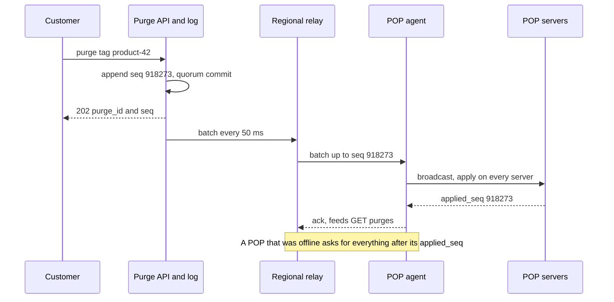

# 036 — Content Delivery Network: Full System Design Solution

## Goal and contract

A multi-tenant reverse-proxy cache with about 500 POPs: right bytes from a nearby healthy POP, rare origin contact, purge in seconds, <abbr title="Transport Layer Security - A cryptographic protocol designed to provide communications security over a computer network.">TLS</abbr> at the edge.

- **Tenant isolation is an invariant.** Cache key and certificate are scoped to the zone. `private`, `no-store` and `Set-Cookie` responses are never shared.
- **Freshness is bounded, not perfect.** Purge p99 is 5 s, and correctness never depends on it: content that must change atomically uses immutable versioned URLs ([29](../building_blocks/29_cdn_and_streaming_media.md)).
- **The data plane is autonomous.** A POP serves from its last-known-good snapshot, certificates and cache when the control plane is unreachable. No request waits on a control-plane call.

The one hard decision is what gives when these conflict: keep the request path local and eventually consistent with the control plane, bound and observe the staleness, and sell strict lease-based purge only to tenants who accept its availability cost (follow-up 3).

## Estimates

| Quantity | Arithmetic | So we need… |
|---|---|---|
| Traffic | 12.5M rps × 500 KB = 6.25 TB/s = **50 Tbps** peak. Peak-to-mean 1.6 (assumed): 31 Tbps mean, 10 EB/month | Capacity and peering ports, not per-GB pricing. Keep bytes inside the metro. |
| Edge fleet (assumed) | 50 tier-A POPs carry 55% (550 Gbps each), 150 tier-B 35% (117), 300 tier-C 10% (17). Server: 100 Gbps NIC at 70% = 70 Gbps, 100 TB flash. Size at 1.5× peak: A ceil(825/70) = 12, B 3, C floor of 2 | **1,650 servers**, 115 Tbps usable. Tier C is sized by redundancy: 36% of servers for 10% of traffic, **5.5× the cost per Gbps** of tier A (8.3 vs 45.8 Gbps per server). Plus 200 regional servers (20 × 10, sized by the tail they hold, not the 72 that bandwidth needs). |
| Hierarchy | Edge byte hit 90%, regional catches 80% of the rest, shield 50%: 50 × 0.1 × 0.2 × 0.5 | 5 → 1 → **0.5 Tbps** to origins (1%). Requests: 12.5M × 0.08 = 1.0M → 200K → **100K rps**. |
| Placement in a POP | Zipf s = 1 over 10B objects of 300 KB, hit = H(k)/H(N), H(n) ≈ ln n + 0.577. Independent caches: 333M objects → 85.6%. Hashed over 12 servers: 4B objects → 96.1% | **3.7× more fills** (14.4% vs 3.9% miss) without hashing. Traffic-weighted the model gives 93.3%, a ceiling that leaves 3 points for churn and large objects. |
| Flash writes | 5 Tbps of fills = 625 GB/s ÷ 1,650 = 379 MB/s = 33 TB/day per 100 TB device | **0.33 drive-writes/day** unfiltered: admit selectively. <abbr title="Random Access Memory - A form of computer memory that can be read and changed in any order, typically used to store working data.">RAM</abbr> index: 333M objects × 64 B = 21 GB per server. |
| Purge | 2,000/s (assumed) × 300 B × 500 POPs = 2.4 Gbps. Latency: commit 50 + relay hops 100 + 100 + fan-out 20 + apply 10 = 280 ms | Bandwidth is trivial, delivery is the problem. 4.7 s of slack under the 5 s p99 pays for batching, retries and catch-up. |
| <abbr title="Transport Layer Security - A cryptographic protocol designed to provide communications security over a computer network.">TLS</abbr> | 12.5M rps ÷ 10 per connection = 1.25M connections/s, half resumed → 625K handshakes/s × 0.15 ms = **94 cores**. Bulk: 6.25 TB/s ÷ 2 GB/s per core = 3,100 cores | Terminate <abbr title="Transport Layer Security - A cryptographic protocol designed to provide communications security over a computer network.">TLS</abbr> on the cache servers (4.4 cores per server). |
| Certificates | 5M hostnames, 80% managed, 4 KB each = 20 GB. CA/Browser Forum SC-081v3 (2025): maximum validity 200 days from Mar 2026, 100 from Mar 2027, 47 from Mar 2029. Renew at 2/3 | 4M ÷ 31 days = **128K renewals/day** at 47 days. Automate, and load by SNI. |
| DDoS | 2 Tbps ÷ 500 POPs = 4 Gbps each. A 20 Tbps attack at 10× skew: 400 Gbps at one POP vs 200 Gbps (2 × 100) at tier C | Small POPs need edge filtering and spill (fleet spare 65 Tbps). |

## <abbr title="Application Programming Interface">API</abbr>

```text
PUT  /v1/zones/{zone}/config    {base_version, rules:[{match, ttl, key, swr, sie}]}
                                 → {config_version} | 409 stale base_version | 422 invalid rule
POST /v1/zones/{zone}/purge     Idempotency-Key: <uuid>
     {"urls":[…]} | {"prefix":"…"} | {"tags":["product-42"]} | {"all":true,"mode":"soft"}
                                 → 202 {purge_id, seq}     # 429 + Retry-After when over rate
GET  /v1/purges/{id}            → {seq, pops_acked: 497, pops_total: 500}

GET /img/a.jpg → 200 Cache-Status: EdgeCDN; fwd=stale; fwd-status=503   # stale-if-error
```

`Cache-Status` is RFC 9211, freshness headers are RFC 9111 and RFC 5861. Purge is idempotent and the key makes the `202` replay-safe. Config uses compare-and-set on `base_version`. Internal calls: signed `GET /snapshots/{version}`, `Subscribe(from_seq)`, `GetCert(sni)` over mTLS, and `PushCounters(pop, window, seq)`.

## Data model

| Entity | Key → fields | Source of truth, partition |
|---|---|---|
| `Zone` | `zone_id` → hostnames, origin pool, rules, `config_version` | Config DB, consensus-replicated over 3 regions, by `zone_id` (rare writes, linearizable <abbr title="Compare-And-Swap. An atomic instruction used in multithreading to achieve synchronization by comparing and potentially modifying a memory location.">CAS</abbr>). Per-cell `Snapshot` is derived. |
| `Cert` | hostname → chain, KMS-wrapped key, `not_after` | Key service, by hostname hash |
| `PurgeLog` | `seq` → zone, selector | One append-only log, so a POP tracks one `applied_seq` (2,000/s is trivial) |
| Edge object | `key128` → full key, `purge_seq_at_fill`, TTL, SWR, SIE, tags ≤ 16, ETag, slice map | Derived from the origin. Owner by rendezvous hash. |

## Architecture

```arch
%% caption: The request path touches only POP-local state, and config, certificates and purges flow one way from the control plane, so a POP keeps serving from its last snapshot if that flow stops.
node U "Client" at 1,0 icon=client
node L4 "L4 balancer" at 1,1 icon=lb sub="flow hash"
group POP "Edge POP: 2 to 12 servers" icon=edge color=purple
node S1 "Server A" at 0,2 in POP icon=server sub="TLS, HTTP, cache"
node S2 "Server B" at 2,2 in POP icon=server sub="owner of this key"
node R "Regional parent" at 2,3 icon=cache
node SH "Origin shield" at 2,4 icon=shield sub="one per origin"
node O "Customer origin" at 2,5 icon=db
node CP "Control plane" at 0,4 icon=scheduler sub="config, certs, purge log, mapping"
U -> L4 : "anycast or DNS-mapped IP"
L4:L -> S1:T
L4:R -> S2:T
S1:R <-> S2:L : "peer fetch from owner"
S2 -> R : "miss, collapsed"
R -> SH : "miss, collapsed"
SH -> O : "pooled HTTP/2"
CP:L ..> S1:L : "snapshots, purge stream, certs by SNI"
S1:B ..> CP:T : "counters and logs"
```

**Read.** <abbr title="Domain Name System - A hierarchical and decentralized naming system for computers, services, or other resources connected to the Internet.">DNS</abbr> or anycast lands the client on a POP and the L4 balancer picks any server by flow hash (Maglev, NSDI 2016). The server completes <abbr title="Transport Layer Security - A cryptographic protocol designed to provide communications security over a computer network.">TLS</abbr> from its <abbr title="Random Access Memory - A form of computer memory that can be read and changed in any order, typically used to store working data.">RAM</abbr> certificate cache, builds the key from the zone snapshot and checks its <abbr title="Random Access Memory - A form of computer memory that can be read and changed in any order, typically used to store working data.">RAM</abbr> index. A fresh, un-purged hit goes out with `sendfile`, and a local miss goes to the key's owner over the POP LAN. An owner miss joins or starts one collapsed fetch up the regional parent, shield and origin, and the response streams to every waiter while written to disk. **Write.** Config and purges are validated, committed, then pushed down a relay tree (deep dive 4).

## Deep dive 1: Steering and DDoS

Mechanics are in [27](../building_blocks/27_multi_region_and_global_traffic.md). The <abbr title="Content Delivery Network - A geographically distributed network of proxy servers and their data centers used to deliver content with low latency.">CDN</abbr>-specific choice is between two.

- **<abbr title="Domain Name System - A hierarchical and decentralized naming system for computers, services, or other resources connected to the Internet.">DNS</abbr> mapping** (Akamai-style, Nygren et al., 2010) gives load-aware answers and per-POP capacity control, but the resolver is not the client (ECS, RFC 7871, helps) and a 30 s TTL plus 3 × 5 s checks is **45 s** to drain.
- **Anycast** (Cloudflare publicly describes it) spreads attacks over all POPs with no TTL, but BGP ignores capacity, so shedding is by prepend or withdraw, and flaps break long <abbr title="Transmission Control Protocol - A core protocol of the Internet Protocol Suite that provides reliable, ordered, and error-checked delivery of a stream of bytes.">TCP</abbr> flows.

**Decision:** anycast for authoritative <abbr title="Domain Name System - A hierarchical and decentralized naming system for computers, services, or other resources connected to the Internet.">DNS</abbr> and the web/<abbr title="Application Programming Interface">API</abbr> pool, <abbr title="Domain Name System - A hierarchical and decentralized naming system for computers, services, or other resources connected to the Internet.">DNS</abbr> mapping for the few hundred zones that carry most bytes. That gives DDoS spreading and per-POP load control where each matters, at the cost of two steering systems, acceptable because the mapper only handles the head and freezes its last map if it fails.

**DDoS layers.** Spread by anycast. Drop L3/L4 floods in the NIC driver (XDP/eBPF, SYN cookies) before the kernel stack. The cache absorbs cacheable floods and per-zone rate limits handle the rest. Cache-busting (`?x=random`) bypasses the cache, so unknown parameters on static paths leave the key and each origin has a fetch cap. A flood beyond a small POP's 200 Gbps means spilling legitimate traffic to neighbours and scrubbing upstream.

## Deep dive 2: Cache hierarchy, placement inside a POP, hot objects

| In-POP placement | Unique capacity (12 servers) | Hit (Zipf) | Weakness |
|---|---|---|---|
| Independent caches per server | 100 TB | 85.6% | Each object stored 12 times |
| L7 director routes to the owner | 1.2 PB | 96.1% | Viral object saturates its owner |
| **L4 spread, peer fetch from owner, hot promotion** | about 1.2 PB | about 96% | One LAN hop on a local miss |

**Decision:** one owner per key by rendezvous hashing, so losing one of `N` servers moves only `1/N` of keys. Any server accepts the connection, so hits have no L7 hop. That gives 3.7× less fill traffic for the cost of a peer-fetch protocol.

**Hot objects.** A live segment with 100K viewers in a POP at 5 Mbps is **500 Gbps** for one object against 70 Gbps per server, so at least 8 servers must hold it. Above a threshold (assume 5,000 rps) the owner marks the peer response `hot` and each peer keeps a <abbr title="Random Access Memory - A form of computer memory that can be read and changed in any order, typically used to store working data.">RAM</abbr> copy for 10 s. Bounded-load hashing (Mirrokni et al., 2016) is the safety net.

**Admission.** Maggs and Sitaraman (SIGCOMM CCR, 2015) report roughly three-quarters of objects on typical Akamai servers were requested once, and writing them wastes endurance. **Cache on second hit:** a rotating pair of Bloom filters holds the last hour of keys, 7,600 rps per server × 3,600 s = 27M keys × 9.6 bits ≈ **33 MB**. A key reaches flash only if already in the filter, and small objects bypass it. An object with exactly two requests misses twice, which is acceptable because every singleton saves a write. AdaptSize (NSDI 2017) is the size-aware refinement.

**Three tiers.** A cold object wanted at 500 POPs costs 500 origin fetches flat, 20 with regional parents, 1 with a shield, and only 1.6% of requests go past the regional tier, so the extra hop is cheap.

## Deep dive 3: Cache key, request collapsing, origin failure

Key = `zone | host | path | allowlisted query, sorted | normalised Vary dims | slice index`.

- **Out of the key:** signed-URL tokens (validated, then stripped), session ids, `utm_*`, cookies. One per-viewer value drives the hit ratio to about 0.
- **In the key, reduced:** `Accept-Encoding` to three classes, device or language only if configured, capped at 8 variants per URL.
- **Poisoning.** Forward only an allowlist of headers and key what you forward, since unkeyed reflected input is the cache-poisoning pattern (Kettle, 2018). Store the full key and compare it on hit, so collisions cannot serve the wrong object.
- **Slices.** Cache 1 MB slices so a `Range` on a 4 GB file fetches only what it needs.

**Collapsing** ([07](../building_blocks/07_caching.md)): a per-key in-flight table at each tier, streaming to waiters while writing to disk. Waiters time out after 3 s (assumed) and fetch independently, capped at 4 parallel fetches per key. An uncacheable response stores a 10 s "hit-for-miss" marker so later requests go upstream in parallel instead of queueing behind serial fetches.

| Origin state | Edge behaviour |
|---|---|
| Errors on a revalidation | Serve stale under `stale-if-error` (RFC 5861, default 24 h), tag `fwd=stale` |
| Errors on a true miss | Negative-cache 5 to 10 s so 100K retries become one, and serve an error page |
| Slow or flapping | Circuit breaker (open at 50% errors in 10 s), per-shield cap of 500 concurrent fetches, one retry inside a 10% budget, shed uncacheable misses first ([28](../building_blocks/28_overload_control_and_graceful_degradation.md)), fail over to a secondary origin pool. |

At a 92% hit ratio an origin outage is about an 8% error rate for the zone, not 100%. A hard purge deletes the copy `stale-if-error` would serve, so fragile origins should use **soft purge** (mark stale, keep servable).

## Deep dive 4: Purge and invalidation at scale

The job: tell 1,650 servers that unknown objects are dead, in seconds, without enumerating them. TTL-only and versioned URLs distribute nothing but leave takedowns waiting for the TTL, and revalidating every request turns each hit into a parent round trip. So use a **purge log with lazy enforcement**: one small ordered message per purge whatever the object count, paid for with a per-hit check and a catch-up protocol.



**Lazy enforcement.** A URL purge deletes the key at the owner and any hot replicas (so broadcast to all servers). Tag, prefix and zone purges never enumerate: each server keeps `purged_before[(zone, tag)] = highest seq` (50M tags × 40 B = 2 GB), and object headers carry tags and `purge_seq_at_fill`. A hit whose fill sequence is below a matching purge is stale, at the cost of one or two hash lookups.

**The in-flight race.** A fetch that started before a purge can finish after it and re-cache old bytes. Use sequence numbers, not clocks: a fill records the applied purge sequence at start, and if a later matching purge exists on completion it serves the waiters without storing.

**Delivery and <abbr title="Service Level Objective - A specific target level for the reliability of a service, usually defined by a numerical goal for a metric.">SLO</abbr>.** Relays keep 24 h of log (2,000/s × 86,400 × 300 B = 52 GB). A POP offline longer enters **purge-safe mode**: every object is revalidated with `If-None-Match` until it catches up. Measure with purge canaries (purge a synthetic object each minute, probe every POP, alarm on p99). **Purge-all** at a 92% hit ratio is a **12.5×** origin surge, so it is soft by default: a 304 of about 500 B replaces a 500 KB refetch (1,000× fewer bytes), under per-origin caps.

## Deep dive 5: <abbr title="Transport Layer Security - A cryptographic protocol designed to provide communications security over a computer network.">TLS</abbr> and certificate management

Keys on every disk are simplest, but one compromised server exposes them all. Keyless signing (Cloudflare's Keyless <abbr title="Secure Sockets Layer - The predecessor to TLS, a cryptographic protocol providing communications security over a network.">SSL</abbr>, 2014) keeps the key with its owner at +1 RTT per full handshake and a new dependency. Envelope-encrypted keys loaded by SNI into <abbr title="Random Access Memory - A form of computer memory that can be read and changed in any order, typically used to store working data.">RAM</abbr> only give a small blast radius and lazy loading, at a 5 to 20 ms fetch on the first handshake per SNI per server.

**Decision:** the third, with keys KMS-wrapped. A server fetches `(cert, key)` over mTLS on an SNI miss and evicts <abbr title="Least Recently Used - A cache replacement policy that discards the least recently used items first when the cache reaches its capacity.">LRU</abbr>. The top 1% of hostnames is 50K × 4 KB = 200 MB per server, and the last-known cert survives a control-plane outage. Compliance tenants get keyless.

**Issuance.** An ACME (RFC 8555) service answers <abbr title="Hypertext Transfer Protocol - The foundation of data communication for the World Wide Web, operating on a client-server model.">HTTP</abbr>-01 at the edge, uses <abbr title="Domain Name System - A hierarchical and decentralized naming system for computers, services, or other resources connected to the Internet.">DNS</abbr>-01 for wildcards, keeps two CAs and renews at 2/3 lifetime, which at 47 days leaves **16 days** of retries (alert under 14 days left). Sessions use <abbr title="Transport Layer Security - A cryptographic protocol designed to provide communications security over a computer network.">TLS</abbr> 1.3 resumption (RFC 8446) with per-POP ticket keys rotated every 12 h and held in <abbr title="Random Access Memory - A form of computer memory that can be read and changed in any order, typically used to store working data.">RAM</abbr>, since a leaked key breaks forward secrecy for the sessions it covers. 0-RTT is for idempotent methods only, because it can be replayed.

## Control plane, data plane, and rollout

Data plane: L4, <abbr title="Transport Layer Security - A cryptographic protocol designed to provide communications security over a computer network.">TLS</abbr>, cache. Control plane: config, certificates, purge log, mapping, telemetry. **Config path:** edit → validate (schema, rule-complexity lint, dry run on sampled traffic) → signed snapshot per cell → a tier-C canary POP for 30 s, 1% of POPs for 60 s, 10% for 60 s, then 100%, about 3 minutes, with automatic rollback on error, <abbr title="Central Processing Unit - The primary component of a computer that acts as its 'brain', executing instructions of a computer program.">CPU</abbr> or TTFB regression. Emergencies skip stages with a second approver (under 60 s). Two public post-mortems are the lesson: Cloudflare, 2 July 2019 (a WAF rule pushed globally at once exhausted <abbr title="Central Processing Unit - The primary component of a computer that acts as its 'brain', executing instructions of a computer program.">CPU</abbr>) and Fastly, 8 June 2021 (a valid customer config hit a latent bug).

**Fail-static:** servers persist the last-known-good snapshot and certs and boot from disk. **The repair path must not depend on what is broken:** snapshots travel through the <abbr title="Content Delivery Network - A geographically distributed network of proxy servers and their data centers used to deliver content with low latency.">CDN</abbr> hierarchy with an object-store fallback. The config DB runs consensus across 3 regions ([19](../building_blocks/19_consensus_and_coordination.md)).

## ISP-embedded caches

Per Netflix Open Connect's public partner documentation (openconnect.netflix.com) and APNIC's 2018 overview: Netflix supplies appliances that ISPs install in their networks (or at internet exchanges), with the ISP providing space, power and connectivity. Appliances fill off-peak, and a cloud control plane steers each client to a ranked list of appliances using the BGP prefixes they learn from the ISP. The cheapest byte never crosses a paid link.

For a **multi-tenant** <abbr title="Content Delivery Network - A geographically distributed network of proxy servers and their data centers used to deliver content with low latency.">CDN</abbr> (my reasoning) the catch is keys: Open Connect is single-tenant, while many tenants' private keys on ISP-hosted hardware are a much larger risk. Embed only for tenants who accept it or use keyless, and only where demand justifies a box (I would assume above about 20 Gbps per site).

## Edge logging and billing pipeline

Raw logs are 7.8M mean rps × 86,400 × 500 B = **337 TB/day**, so none is backhauled raw. A per-POP aggregator rolls log lines into 1-minute rows per `(zone, status class, cache state, country)` (500 POPs × 100K active rows × 200 B = 1.3 Gbps), the billing source, flushing every 10 s. Raw logs ship only for subscribed zones plus a 1% sample. Transport is at-least-once keyed by `(pop, window, seq)` with last-write-wins, so retries cannot double-count, and billing reads windows closed for 15 minutes. The store is a column-oriented OLAP database (Cloudflare has described using ClickHouse, 2018).

## Failure behaviour

| Failure | Behaviour |
|---|---|
| Edge server | Health check drops it in about 3 s, only `1/N` of keys move, refilled from peers or the regional tier. |
| POP, interconnect or regional parent | Mapper drains and BGP withdraws, neighbours are cold and the regional tier absorbs fills (a tier-A loss moves up to 550 Gbps, covered by 1.5× sizing). Edges skip a dead parent for a sibling or the shield, and per-origin caps bound the surge. |
| Origin | `stale-if-error`, negative cache, breaker, secondary pool. |
| Control plane (one region or all) | Fail-static, alarm on purge and config lag, leader failover in about 30 s. Purge gap: replay, or purge-safe mode past 24 h. |
| Bad config or binary | Staged rollout, automatic rollback, blast radius is the canary tier. |
| Cert expiry or CA outage | Renew at 2/3, second CA, alert under 14 days. |
| DDoS or BGP hijack | XDP filtering, spill, upstream scrubbing. RPKI origin validation, tight max-prefix lengths, announcement monitoring. |
| POP restart herd | Warm from peers, cap fills per origin during ramp. |

## Observability and interview close

SLIs: cacheable-request success, edge request and byte hit ratio, hit TTFB p99, purge p99 from canaries, config propagation time, minimum certificate days-to-expiry, origin error rate per shield, POP port utilisation. **The one paging alert:** fast burn of the 99.99% cacheable-success <abbr title="Service Level Objective - A specific target level for the reliability of a service, usually defined by a numerical goal for a metric.">SLO</abbr> at any tier-A POP or globally. Purge and config lag open tickets.

Trade-off to state: "I keep the data plane autonomous and only eventually consistent with the control plane, so a POP serves what it last knew instead of stopping. That costs a bounded window in which a purge has not reached a partitioned POP, acceptable because the alternative turns a control-plane outage into a global one. Tenants needing 'purged means purged' get a fail-closed lease."

## Follow-ups the interviewer will ask

1. **"How do you do multi-region?"** A <abbr title="Content Delivery Network - A geographically distributed network of proxy servers and their data centers used to deliver content with low latency.">CDN</abbr> is multi-region by construction, so the question is the control plane. Config and cert stores are consensus-replicated across 3 regions with a leader (rare writes, so a 150 ms commit is fine), purges are accepted anywhere, POPs pull from the nearest of three, and losing a region never touches serving.
2. **"What changes at 10× and 100×?"** At 500 Tbps bandwidth alone needs 500 × 1.5 ÷ 0.07 = 10,700 servers, about 16,500 with redundancy floors. Bytes outgrow POP count, so ports, power and index memory bind first, while purge and config volume scale with tenants, and at 100× the hot set must live inside ISPs.
3. **"Make purge strongly consistent."** Give each POP a 30 s lease renewed by heartbeat. The purge <abbr title="Application Programming Interface">API</abbr> succeeds when every live-lease POP has acked or its lease expired, and a POP without a lease stops serving purge-critical zones. Worst-case purge latency is the lease and a partitioned POP loses availability for those tenants, so it is paid.
4. **"What dominates cost?"** Bandwidth. One point of edge byte hit ratio is 0.5 Tbps = 500,000 Mbps, about $100K/month at an assumed $0.20 per Mbps-month if it all rode paid transit, so peering and embedded caches beat tuning. Then flash, then the tier-C tail (5.5× cost per Gbps).
5. **"How do you handle abuse?"** Cache-busting (normalised keys, per-origin caps), open-proxy and reflection use (verified hostnames only, private-range and cloud-metadata origins rejected), free-tier abuse (quotas, takedown via the purge path), request smuggling (strict parsing) and slow requests (timeouts).
6. **"Just use anycast for everything."** For web and <abbr title="Application Programming Interface">API</abbr> traffic I agree, since it is simpler and better against DDoS. I would keep <abbr title="Domain Name System - A hierarchical and decentralized naming system for computers, services, or other resources connected to the Internet.">DNS</abbr> mapping only for the media head. Without it I lose per-POP load control and shed by prepending or splitting prefixes.

## Common mistakes

1. **Independent caches per server.** A 12-server POP acts like one server (85.6% vs 96.1% hit). Hash to an owner.
2. **Per-viewer values in the key.** Tokens, session ids and `utm_*` push the hit ratio to about 0. Strip them.
3. **No collapsing, or collapsing without hit-for-miss.** A cold object costs 500 origin fetches, and uncacheable responses serialise clients.
4. **Correctness that depends on purge.** It is bounded-latency delivery. Use immutable URLs for anything exact.
5. **A control-plane call on the request path, or a global atomic config push.** Both make a control-plane fault a global outage. Fail static and stage rollouts.
6. **Writing every fill to flash.** About three-quarters of objects are requested once (one Akamai study), so you burn endurance and evict useful content.
7. **Treating anycast as a load balancer, and forgetting the origin is someone else's.** BGP ignores capacity, and the 100K rps to origins can all be one customer's. Plan shedding and cap fetches.

## Going from L5 to L6

- **Rollout path.** Shadow tenants, then a weighted <abbr title="Domain Name System - A hierarchical and decentralized naming system for computers, services, or other resources connected to the Internet.">DNS</abbr> cutover. Phase it: v1 is 30 POPs, a flat cache, one shield and versioned URLs, v2 adds the hierarchy and purge log, v3 adds mapping and embedded caches.
- **Cost model and build versus buy.** Cost per delivered TB by POP tier, the value of a hit-ratio point, peering versus transit. Buy until volume justifies peering and hardware.
- **Blast radius.** Snapshots per cell, tenants shuffle-sharded over servers, separate control-plane and data-plane teams and SLOs.
- **Measure first.** Hit ratio and one-hit-wonder share per tenant, purge canary p99, origin fetches per shield.

## Build exercise

Build a one-POP simulator with 8 servers, an in-memory origin and a purge log, and assert:

- `test_owner_stability`: removing 1 of 8 servers moves at most `1/8 + 2%` of 100K keys.
- `test_collapsing`: 1,000 concurrent requests for one cold key cause exactly 1 origin fetch, and an uncacheable response makes later requests fetch in parallel.
- `test_hot_promotion`: an object above the rps threshold is served by at least 4 servers within 3 rounds.
- `test_second_hit_admission`: a key requested once is never written to disk, a key requested twice is.
- `test_purge_race`: a fill that started before a purge and finished after it is served but not cached, and a tag purge over 1M objects does no per-object work.
- `test_stale_if_error`: with the origin returning 503 a cached object is served with `fwd=stale`, and a miss is negative-cached for 5 s.
