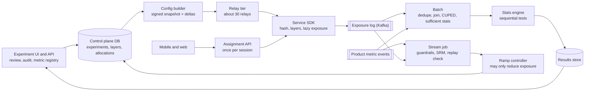

# 037 — Experimentation Platform: Full System Design Solution

## Goal and contract

The platform is a **traffic allocator with a statistics gate**. Assignment is a pure function `variant = f(config_version, unit_id)` evaluated in-process; every exposure is logged with the variant and config version that produced it; every readout uses deduplicated exposures, is blocked if the sample ratio is wrong, and uses error bounds that survive peeking. Concepts and formulas are in [building block 31, Part 2](../building_blocks/31_ranking_recommendation_and_experimentation.md); this page applies them.

- **Promised:** decision p99 < 1 ms with no remote call; a user's variant is stable while an experiment runs; a change or pause reaches all servers within 60 s; guardrails at most 15 min stale; decision-grade results within 6 h of each UTC day; 5% false positives under daily looks.
- **Not promised:** an instant global flip (bounded staleness, logged), a final number before D+3 (late data), or a causal estimate under interference unless cluster-randomized.
- **The one hard decision:** assignment code is the easy part. Correctness lives in the **exposure log and the pre-readout checks (SRM, replay)**; the scarce resource is bucket space.

## Estimates

(assumed) marks our numbers; the question's constraints are the contract.

| Quantity | Arithmetic | Result | So we need... |
|---|---|---|---|
| Decisions | 10 B / 86,400 = 116 K/s, peak 3× (assumed) = 347 K/s; about 2 µs each (murmur3 of about 24 B is about 25 ns, a few layers touched, assumed) | 0.7 core fleet-wide | Local evaluation: a central service is 347 K RPS, and one hop's p99 exceeds 1 ms. |
| Config | 1,000 × 2 KB = 2 MB, gzip 4:1 = 500 KB; bootstrap 30,000 × 500 KB = 15 GB (rolling restart: 17/s = 8 MB/s). Changes: 1,000 / 14 d = 71 starts/day × about 6 changes ≈ 500/day; delta 2 KB × 30,000 = 60 MB | 30 GB/day | Relays with signed snapshots and deltas as in [019](019_feature_flags_solution.md), about 30 relays of 1,000 SDKs. |
| Exposures | 5 B/day = 58 K/s (peak 174 K/s) × 100 B = 500 GB/day. Eager logging would be 10 B × about 20 experiments = 200 B/day, 40× more | 6 MB/s | Log lazily where the parameter is read, dedupe in process, buffer to disk. |
| First exposures | 1,000 × (2 arms × 2 M exposed) = 4 B pairs per 14 d = 286 M/day; 5 B / 286 M = 17.5×; × 60 B = 17 GB/day | 17 GB/day | One row per (experiment, unit), earliest exposure kept. |
| Bucket budget | 50 layers; average experiment 4% (2% per arm): 1,000 × 4% = 40 of 50 layer-units | 80% used | Bucket space limits experiment count (deep dive 1). |
| Batch join | Per-user-day table 100 M × 50 × 8 B = 40 GB/day. Per experiment (4 M exposed users): 14-day recompute 4 M × 14 × 50 × 8 B = 22 GB, × 1,000 = 22 TB/day; incremental cumulative state 1.6 GB, × 1,000 = 1.6 TB/day | 14× less | Incremental. With D−1..D−3 reprocessing, 4 × 1.6 = 6.4 TB/day; at 20 MB/s per core (assumed) 89 core-hours, about 45 cores for 2 h. |
| Stats input | 1,000 × 3 variants × 50 metrics × 14 days × 7 sums × 8 B | 118 MB | The engine reads sufficient statistics (n, Σx, Σy, Σxy, Σx², Σy²), never events. |

## API

Writes carry `Idempotency-Key`; state changes carry `expected_version` (`409` on conflict).

```text
POST /v1/experiments {name, owner, layer, unit: user|device|cluster, variants[{name, params}], eligibility_expr,
     arm_pct, primary_metric, secondary[], guardrails[{metric, max_regress}], planned_days}
  → {experiment_id, state: DRAFT, bucket_range, exp_salt, power{n_per_arm, mde}} | 409 ALLOCATION_CONFLICT | 422 UNDERPOWERED
POST /v1/experiments/{id}:transition {to: CANARY|RAMP|RUN|PAUSED|SHIP|STOPPED, expected_version, reason} → {version, effective_at}
GET  /v1/experiments/{id}/results → {srm{p, ok}, replay_mismatch, data_through, provisional, metrics[{name, delta, ci_seq, p_adj, n}]}
GET  /v1/assignments?unit=&ctx=   → {assignments{layer: variant, params}, cfg_version, ttl_s}     # web and mobile, once per session
```

In process: `sdk.resolve(unit_ids, ctx)` picks variants and `params.get("page_size", default)` emits the exposure lazily, once per (unit, experiment, variant) per hour per process. Event: `{event_id, unit_id, experiment_id, variant_id, layer_id, config_version, ts, source}`; `event_id` hashes (unit, experiment, variant, hour), so redelivery is a no-op.

## Data model

| Entity | Key fields | Lives in |
|---|---|---|
| Experiment version | `experiment_id`, immutable version rows (params, eligibility, weights, `exp_salt`, `hash_version`), state, owner, `planned_days` | Relational store with serializable transactions: **system of record** |
| Layer, allocation | `layer_salt`, 10,000 buckets; `allocation(layer, start, end, experiment, active)` with an exclusion constraint on overlapping active ranges | Same store: conflicts are a database constraint |
| Metric definition, audit | versioned SQL, unit, direction; experiments bind to a version. Append-only audit log | Same store |
| `exposure_raw` | the event above | Kafka (key `hash(unit_id)`), warehouse 30 days |
| `first_exposure` | `(experiment, unit) → variant, first_ts, config_version` | Warehouse, partitioned by `(experiment, day)`, rewritten idempotently |
| `user_metric_day`, `exp_user_cum`, `exp_stats` | 40 GB/day, 1.6 GB per experiment, sufficient statistics | Warehouse, user-hash partitioned so the exposure join is co-located |

Everything downstream of the control-plane store is derived and recomputable; it takes about 500 writes/day, so consistency is cheap.

## Architecture



**Write walk (start).** One transaction validates metric bindings, computes power (`422` if the MDE misses), reserves the bucket range (the exclusion constraint rejects overlaps), and writes an immutable version plus an audit row. The builder emits a signed delta with `effective_at` = now + 120 s.

**Read walk (request).** The edge resolves `f(config_version, user_id)` for each layer the request touches: `bucket = murmur3(layer_salt ‖ unit_id) mod 10,000`, find the experiment owning that bucket, check eligibility, then choose the variant by `murmur3(exp_salt ‖ unit_id)`. The map `{layer: variant}` and `config_version` travel downstream in a header (about 20 experiments × 6 B), so downstream services do not re-evaluate. Reading a parameter emits one exposure.

## Deep dive 1: assignment, salts, layers, and bucket space

**Design.** The layer hash decides *which experiment* a user is in (each owns a disjoint bucket range: mutual exclusion). The experiment's own salt decides *which variant*. So layers are independent (orthogonal; declare known interactions as conflicts), a ramp only widens the range and never moves a user's variant, and a re-run with a fresh `exp_salt` re-randomizes the same users, balancing carryover across the new arms. Pin `hash_version` in config and share test vectors across all SDKs.

**Traffic is the budget.** Baseline 5%, α = 0.05 two-sided, 80% power ((1.96 + 0.84)² = 7.85), half the assigned users reach the surface (assumed):

| Per arm | Assigned | Exposed | MDE relative | With CUPED (ρ = 0.5) | Full-size experiments per layer |
|---|---|---|---|---|---|
| 1% | 2 M | 1 M | 1.7% | 1.5% | 50 |
| **2%** | 4 M | 2 M | **1.2%** | 1.1% | 25 |
| 5% | 10 M | 5 M | 0.77% | 0.67% | 10 |

Default 2% per arm meets the 1–2% target, fits 25 per layer, and runs at 80% of capacity. MDE shrinks as 1/√n, so doubling allocation buys only a 29% smaller MDE, while variance × 0.75 needs 25% less traffic for the same MDE: **1.33× more experiments in the same layers**. Choice → a per-team quota (at most 20% of a layer) → fairness → queueing when a layer is full → acceptable because waiting beats an underpowered launch; creation refuses (`422`) an experiment that cannot detect its target.

**Identity.** Logged-in surfaces randomize on `user_id`, logged-out on `device_id`; experiments spanning login use the device id. A 1% holdout (2 M users) is a reserved range in an upstream layer.

## Deep dive 2: config distribution and consistency

Distribution is the flag platform's mechanism ([019](019_feature_flags_solution.md): signed snapshots, deltas, relays, poll fallback, safe defaults). Experiments add a **consistency** need: servers that disagree produce mixed-variant users and a polluted analysis. Applying on arrival skews servers by up to 60 s per change. A per-request central check spends the 1 ms budget on a hop and couples availability. So starts and ramps are distributed early and **applied at `effective_at`** = now + 2 × p99 propagation = 120 s: skew is then clock skew (ms), not propagation skew, at the cost of a two-minute start. Instances that miss the deadline report snapshot age and are excluded by the version on their exposures. Ramps only add buckets, so a user flips at most once. Pause and kill apply on arrival: safety beats consistency. Mobile fetches assignments once per session, so a ramp lands on the next session and a mobile-only kill needs a server-side override (the UI says so).

## Deep dive 3: exposure logging and the sample-ratio mismatch trap

**Where to log.** Where the parameter is used, for every variant including control: 5 B/day, not 200 B (estimates). It is also what the exposure-triggered analysis needs; analysing all assigned users dilutes the effect and costs 1/reach² = 4× the sample at 50% reach.

**SRM.** Sensitivity here: 4 M exposed users, α = 10⁻⁵, 80% power: (4.42 + 0.84) × 0.5 / √4 M = 0.13 pp of the split, so an arm short by 0.26% (about 5,300 of 2 M users) is flagged. Hourly checks are 24,000 tests/day, so 10⁻⁵ gives 0.24 false alarms/day. SRM comes from a treatment that crashes or redirects before exposure is logged, a slower exposure path in one arm, a bot filter after assignment, config skew, or a join dropping rows. Three defences: (1) the **replay check**: batch recomputes each exposure's variant from `(config_version, unit_id)` and counts mismatches (about 0; catches SDK hash bugs and skew); (2) the **SRM gate**: readout hidden and marked invalid, never "fixed" by dropping users; (3) **symmetric loss**: under overload, shed whole units by hash range across all arms, never single events, or the shedding creates an SRM. Analyse constant-allocation windows only.

## Deep dive 4: the metrics pipeline, stream versus batch, and late data

| | Stream (guardrails, SRM, ramp gate) | Batch (decisions) |
|---|---|---|
| Method | Join events to assignment state (100 M DAU × 100 B = 10 GB, assumed); 5-min windows of (n, Σy, Σy²) per (experiment, variant, guardrail): 1,000 × 2 × 10 × 288 ≈ 6 M rows/day | Dedupe to `first_exposure`, join `user_metric_day`, update `exp_user_cum`, emit sufficient statistics |
| Correctness | Event-level, approximate, `event_id` dedupe, events past a 5-min watermark dropped | User-level, exact, idempotent partition overwrite, re-runnable |

One metric definition compiles to both paths ([013](013_metrics_platform_solution.md), [027](027_ad_click_aggregation_solution.md)); the stream is never used for a ship decision. **Late data:** mobile events can arrive 72 h late (assumed: 99% within 24 h, 99.9% within 72 h). Day D closes at 00:00 UTC; wait 3 h for stragglers, join and aggregate 2 h, statistics 1 h: **6 h, the whole budget with no slack**, so the fallback is publishing `provisional: true`. Each day re-runs D−1..D−3 (6.4 TB) and results are final at D+3. `first_exposure_ts` only moves earlier when a late exposure arrives, so those users' rows are recomputed. Ship decisions read only final windows.

## Deep dive 5: the statistics engine

- **Peeking.** A fixed-horizon test read on 14 daily looks gives 22% false positives (simulated, 200,000 paths). Options: hide until day 14, always-valid mSPRT (Johari et al., 2017), or group-sequential with an O'Brien-Fleming-type boundary (1979). **Decision:** the primary metric uses boundaries C√(14/k) over the 14 planned looks with C = 2.11 (simulation-calibrated to 5%): day 1 needs |z| > 7.9, day 14 needs 2.11 instead of 1.96. Cost: at most (2.95/2.80)² = 1.11, up to 11% more sample at equal power (an upper bound). Guardrails have no horizon and use mSPRT. That is why `planned_days` is required.
- **Multiple comparisons.** The primary carries the whole α; at most five secondary metrics use Benjamini-Hochberg at q = 0.10; guardrails are one-sided non-inferiority tests; segments are exploratory; two treatments use Bonferroni (|z| > 2.24).
- **CUPED.** Covariate = the metric over the 14 days before first exposure, from `user_metric_day` (no extra pipeline); ρ = 0.5 cuts variance to 0.75 (MDE 1.22% → 1.06%). No history means θ = 0. **Ratio metrics** use the delta method on user-level sums (Deng, Knoblich, Lu, KDD 2018).
- **Interference.** Feeds and messaging break independence, so randomize by cluster: 200 M / 50 = 4 M clusters, with `cluster_id` in request context from the profile store (a 200 M × 4 B = 0.8 GB map never enters the SDK). Design effect 1 + 49 × 0.05 = 3.45×: 2 M exposed per arm act like 0.58 M, MDE 1.2% → 2.3%, or allocate 7% per arm (14% of a layer). Use it only where spillover is the effect.

## Deep dive 6: ramps, guardrails, and the control plane

Stages: CANARY (1%) → RAMP (5%) → RUN (constant allocation, 14 days) → SHIP (100% minus holdout); PAUSED from anywhere. Stage length is derived. Crash guardrail, baseline 0.5%, one-sided α = 10⁻⁴, 80% power, n per arm = (3.72 + 0.84)² × 2 × 0.005 × 0.995 / δ²; exposed per arm per day 0.5 M at 1%, 2.5 M at 5%:

| Regression | n per arm | Time at 1% | Time at 5% |
|---|---|---|---|
| +50% relative | 33 K | 1.6 h | 19 min |
| +25% | 132 K | 6.4 h | 1.3 h |
| +10% | 828 K | 40 h | 8 h |

So the 1% stage is 2 h (catches +50%), the 5% stage about 8 h (catches +10%), and smaller effects fall to the sequential guardrail during the run: a 30-minute rollback holds only for large regressions at 5%. **False pauses:** a fixed α = 10⁻⁴ tested every 15 min over 10,000 (experiment, guardrail) pairs gives 1,000 × 10 × 96 × 10⁻⁴ = 96 false pauses/day; an always-valid test spends 10⁻⁴ over the whole run: 1 per 14-day cycle. The **ramp controller may only reduce exposure**; raising allocation needs a human, so a controller bug can lose data but not ship harm, and it fails closed when guardrail data is older than 15 min.

## Failure behaviour

| Failure | Behaviour |
|---|---|
| Control plane or relay outage | SDKs keep the last snapshot; no starts or ramps. Break-glass "all to control" is an override held on the relays. |
| Exposure pipeline outage | 24 h disk ring (5.8 MB/s / 30,000 = 193 B/s per instance, 17 MB/day); backfill later. Any loss is by whole unit range, so no SRM. |
| Stream lag or batch miss | Freshness alert, controller holds; batch results carry `provisional` and `data_through`. |
| Bad SDK deploy | Replay-mismatch spike within minutes; SDK canary on 1% of instances; `hash_version` pins behaviour. |
| Zone or region loss | SDKs are local and unaffected; relays fail over; control plane multi-AZ with a warm standby region; Kafka per region, mirrored (up to 1 h more lateness). |

## Observability and interview close

- **SLIs:** decision p99, snapshot age p99, share of instances within 60 s, exposure loss (events versus requests), replay mismatch rate, SRM alarms/day, stream freshness, batch completion versus 06:00, and a continuous **A/A experiment** (about 5% flagged at α = 0.05, none failing SRM).
- **The one paging alert:** guardrail freshness over 30 minutes (twice the SLO) while any experiment is above 1%: the safety net is blind with real users exposed. Replay mismatch and SRM auto-invalidate readouts and open tickets.

Trade-off to state: "I chose local deterministic assignment with early-distributed config and an exposure-triggered, SRM-gated, sequentially tested readout, so requests pay microseconds and a wrong result is blocked, not shipped. The cost is two-minute starts, results final only at D+3, and bucket space as a queue; that is acceptable because a false launch costs far more than a late one."

## Follow-ups the interviewer will ask

1. **"Make it multi-region."** Assignment is a pure function, so a user gets the same variant anywhere. Exposures go to regional Kafka and mirror to one batch region (up to 1 h more lateness); the control plane is single-primary with read replicas; a cut-off region serves its snapshot.
2. **"10× and 100×?"** Decisions barely matter (3.5 M/s × 2 µs = 7 cores). Scope snapshots per service (20 MB raw at 10×). At 100×, exposures are 50 TB/day and joins scan 160 TB/day: log a fixed hash range of units (a unit sample stays valid, widening intervals √10 at 10%) and precompute per-experiment aggregates. The real ceiling is bucket space.
3. **"A user must never see two variants."** `effective_at` already removes propagation skew. For legal or pricing cases persist `(unit, experiment) → variant` at first exposure in a KV store (about 1 ms per new pair, 4 B pairs per 14 days): a new dependency and cost.
4. **"Cost?"** 500 GB/day × 30 days = 15 TB raw; first exposures 17 GB/day × 2 years = 12.5 TB; per-user-day 40 GB/day × 2 years = 29 TB; about 45 cores for 2 h daily. Decisions are free; exposures and joins dominate.
5. **"Abuse and mistakes?"** A 20%-of-layer cap per team, review above 5%, server-side assignment only, client exposures validated and rate-limited per unit, bots filtered before assignment so the filter is symmetric.
6. **"Why not a central assignment service?"** At 347 K/s with a 1 ms budget the hop alone spends it, and its outage is everyone's; a cached one is local evaluation with extra steps. We do run one for mobile and web, once per session, off the hot path.
7. **"Day 3 shows +2%, p = 0.03. Ship?"** No: that is a fixed-horizon p-value in a sequential design (day 3 needs |z| > 2.11 × √(14/3) = 4.6), novelty may still be in it, and SRM and replay must pass first.

## Common mistakes

1. **Logging exposure at assignment, or only for treatment.** Diluted, asymmetric counts. Log where the parameter is used, for every variant.
2. **Reading metrics before the SRM check.** A 0.3% shortfall is invisible on a dashboard and invalidates everything. Gate on SRM.
3. **One salt for everything, or a process-random hash.** The same users land in every treatment; Python's `hash()` differs per process. Salt per layer and experiment.
4. **Analysing all assigned users, or a unit unlike the randomization unit.** Dilution and too-narrow intervals. Exposure-triggered, user-level, delta method.
5. **Fixed-horizon tests with daily looks, or per-look auto-rollback α.** 22% false positives, or 96 false pauses/day. Use sequential boundaries.
6. **Pooling ramp stages, or moving users on a ramp.** Simpson's paradox and flips. Ramps only add buckets.
7. **A remote assignment call on the request path, or ignoring late data.** The hop breaks the 1 ms budget; results change under people's feet. Local evaluation, `provisional`, final at D+3.

## Going from L5 to L6

- **Build versus buy.** Under about 100 experiments, self-host an open-source engine and put effort into metrics. Build when assignment must unify with flags and config; the exposure log and metric definitions always end up in house.
- **Migration.** Shadow-run on the same traffic, compare assignments per unit (target 100%), migrate metric definitions first, retire the old system after an A/A passes.
- **Blast radius and ownership.** A layer is the blast radius, quotas the team boundary, and the controller may only reduce. Platform owns assignment, exposure integrity and statistics; product owns metrics and decisions.
- **Phasing.** Assignment, exposure log, SRM and fixed-horizon results first; layers, CUPED and sequential tests next; ramp automation, holdouts and clusters last.
- **Measure first.** A/A false-positive rate, SRM rate, share of experiments reaching a decision, time to decision, experiments blocked waiting for a layer.

## Build exercise

Build the assignment library (Python plus one other language), an event simulator and a sufficient-statistics batch job.

- `test_assignment_matches_vectors`: both languages agree, including non-ASCII ids.
- `test_ramp_only_adds_users`: 1% to 5% keeps every existing variant and adds only new users.
- `test_layers_orthogonal`: the joint distribution of two layers matches the product of marginals (χ²).
- `test_srm_gate`: an arm short by 0.5% of 4 M is flagged; 1,000 A/A experiments at α = 10⁻⁵ raise about 0.01 alarms.
- `test_peeking_rates`: 14 daily looks give about 22% fixed and at most 5.5% with C√(14/k).
- `test_cuped_variance_ratio`: ρ = 0.5 gives 0.75 ± 0.02 and an unbiased estimate.
- `test_late_events_rerun_idempotent`: replaying a late-event day twice yields identical statistics.
- `test_controller_only_reduces_exposure`: it cannot raise allocation and refuses data older than 15 minutes.
