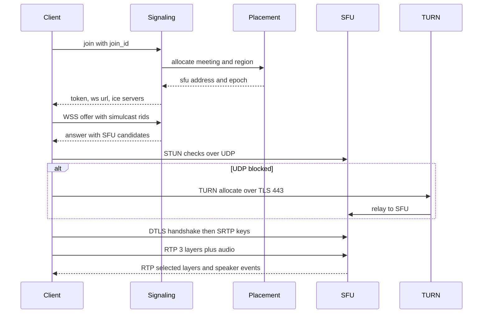

# 038 — Video Conferencing: Full System Design Solution

## Goal and contract

Real-time audio and video for small groups, interactive to about 500 people, with view-only fan-out beyond. **The invariant: media is forwarded, never re-encoded, on the live path. Each sender publishes a few layers once, and each receiver gets exactly the layers its screen and downlink can use.**

- Media is best-effort with a deadline. A packet later than the jitter buffer is worthless, so loss is repaired only when the repair fits the budget (retransmit) or is pre-paid (FEC). Audio outranks video.
- Control (roster, mute, host actions, layout) is reliable and ordered per meeting: at-least-once, idempotent commands.
- SFU media state is **soft**. Clients hold the truth (their tracks and subscriptions) and rebuild it after a node dies. Durable state is only meeting metadata, recordings and transcripts.
- Not promised: every frame arrives, or server access to media in the end-to-end-encrypted (E2EE) mode.

The hard decision is the topology. Mesh is quadratic on the client and an MCU costs about 70× an SFU's CPU (estimates), so: an SFU with simulcast, per region and cascaded. Public detail on Meet and Zoom internals is thin, so this design follows the RFCs and open-source SFUs (Jitsi Videobridge, mediasoup, LiveKit).

## Estimates

| Quantity | Arithmetic (rates on the wire, all assumptions) | So we need… |
|---|---|---|
| Sizes | Mix: 2 people 50%, 3-5 27%, 6-10 15%, 11-25 5%, 26-100 2.7%, 100+ 0.3%, mean **6.03**. 1M × 6.03 = **6.0M** participants. Above 25 people: 32% of participants in 3% of meetings | Big meetings are a participants problem. One node holds a meeting up to about 500 |
| Rates | Layers 720p 1.5, 360p 0.5, 180p 0.15 Mbps: simulcast uplink 2.15 Mbps (1.43×). Opus 32 kbps + 60 B × 50 pps headers = 56 kbps. 1,200 B packets: 156 pps at 720p, 5 per frame | Headers matter for audio, not video |
| SFU bandwidth | 70% cameras on. Ingress 6.03M × (0.7 × 2.15 + 0.02) = **9.2 Tbps**. Egress per receiver 1.1 Mbps (1:1) to 2.0 (25+), mean 1.68: **10.1 Tbps** | About 19 Tbps through the SFU tier: a bandwidth business |
| SFU fleet | 10 Gbps egress per node (25 GbE at 40%): 10.1T ÷ 10G = 1,010, × 1.5 for regional peaks and N+1 = **1,500 nodes**, about 1,000 meetings each | Place by bitrate headroom, not meeting count |
| CPU, SFU vs MCU | SFU 32 cores per node (3.2 cores/Gbps for per-receiver SRTP and UDP sends) = **48K cores**. MCU: decode 0.1 core per camera, encode 0.5 core per receiver: 6.03M × (0.07 + 0.5) = **3.4M cores** | MCU is 71× the CPU for a similar bandwidth |
| Signaling | Little's law, 45 min mean: 1M ÷ 2,700 s = 370 meetings/s = 2,200 joins/s. Top-of-hour × 5 = **11K joins/s** × 10 messages = 110K/s. 6M sockets ÷ 100K = 60 nodes, 120 with headroom | Sockets, not messages, size it |
| Relay | 10% of participants cannot use UDP. 10% × 19.3 Tbps = **1.9 Tbps** (1.0 per direction) ÷ 10 Gbps = 100 nodes, 150 with headroom | Relay fleet about 10% of the SFU tier. Measure your share |
| Recording | 100K recorded meetings. Raw top-layer tracks: 100K × (0.7 × 6.03 × 1.5 + 0.17) = **650 Gbps** = 81 GB/s = **3.5 PB/day** at 50% occupancy, 6.4% of SFU egress. Composite 720p: 150 Gbps = 0.81 PB/day, **24 PB** per 30 days. A live-compositing bot: 100K × (4.2 × 0.1 + 1.0) = **142K cores** | Tap raw tracks, composite offline, delete raw after 24 h |
| Bandwidth cost | 1.68 Mbps × 3,600 s = **0.75 GB** per participant-hour × 6.03M = **4.5 PB/hour**, about $91K/hour at an assumed $0.02/GB | Own backbone and peering, not metered egress |

## API

```text
POST /v1/meetings {title, start, settings:{e2ee, waiting_room, webinar:{panelists:50, attendees:50000}}} → 201 {meeting_id, join_url}
POST /v1/meetings/{id}/join {join_id:"<client uuid>", display_name, caps:{codecs:[…], simulcast:true}}
   → 200 {participant_id, role:"host|panelist|attendee", token:<JWT 10 min>, signaling:{wss:"wss://sig-eu3…/ws"},
          ice_servers:[{urls:["stun:…"]}, {urls:["turns:…:443?transport=tcp"], username:"<expiry>:<pid>", credential:<HMAC>}]}
   # 202 {waiting:true} until admitted. The same join_id returns the same slot.
WSS → {"t":"offer","sdp":"…"}  ← {"t":"answer",…}  {"t":"cand",…}                       # JSEP with trickle ICE
    → {"t":"sub","cid":"c41","tiles":[{"p":"p7","w":1280,"h":720,"prio":1},{"p":"p9","w":320,"h":180,"prio":3}]}
    ← {"t":"speakers","seq":9120,"dominant":"p3","top":["p3","p9","p2"]}  {"t":"roster","seq":9121,…}  {"t":"migrate","sfu":"…"}
POST /v1/meetings/{id}/recordings {mode:"composite"} → 202 {recording_id}  (Idempotency-Key)
GET  /v1/recordings/{id} → {state, mp4_url:<signed>, transcript_url:<signed>}
```

Errors: 401 expired token, 403 no grant, 409 meeting locked, 429 join rate. The JWT carries meeting, participant, role and publish/subscribe grants, so the SFU verifies it locally with a public key. TURN credentials are short-lived HMACs (the common TURN REST convention). Commands carry a `cid` deduplicated for 5 minutes, and roster and speaker events carry a per-meeting `seq` so a reconnecting client resumes after its last one.

## Data model

| Entity | Key → fields | Source of truth, partition |
|---|---|---|
| `Meeting` | `meeting_id` → owner, schedule, settings, e2ee flag, recording policy | Durable SQL or Spanner-style store |
| `Room` (runtime) | `meeting_id` → home region, `[(sfu, region, origin or edge)]`, epoch | Strongly consistent store with lease and epoch fencing ([19](../building_blocks/19_consensus_and_coordination.md)) |
| `Participant` (runtime) | `(meeting_id, pid)` → sfu, role, tracks `[(rids, ssrcs)]`, subscriptions | **SFU memory, soft state.** Roster mirrored to the control plane |
| `NodeLoad` | `sfu` → egress, ingress, meetings, drain flag | Placer memory, rebuilt from 1 s heartbeats |
| Roster log | `(meeting_id, seq)` → event | Single writer per meeting (its signaling shard), 24 h |
| `Recording` | `recording_id` → track manifest, state, transcript | Object store plus metadata DB |

Everything is keyed by `meeting_id`: subscriptions depend on the other participants, so the meeting is the unit of placement, ordering and failure ([25](../building_blocks/25_partitioning_and_hot_keys.md)).

## Architecture

```arch
%% caption: Signaling and placement pick an SFU per region, media flows as SRTP with cascade links carrying only the layers a remote region needs, and recording and webinar fan-out hang off the SFU as ordinary subscribers.
node sg "Signaling shards" at 0,0 icon=websocket sub="by meeting id"
node c1 "Client A" at 1,0 icon=video sub="3 simulcast layers"
node tn "TURN relay" at 2,0 icon=proxy
node pl "Placement" at 0,1 icon=scheduler sub="power of two choices"
node rs "Room store" at 0,2 icon=kv sub="lease and epoch"
node s1 "SFU region 1" at 1.5,2 icon=server
node s2 "SFU region 2" at 3,2 icon=server
node rc "Recorder tap" at 1,3 icon=video
node lf "Webinar leaf SFUs" at 2,3 icon=server
node c2 "Client B" at 3,3 icon=video sub="tiles by size"
node os "Object store" at 1,4 icon=blob sub="raw tracks"
node at "Attendees" at 2,4 icon=users
node cw "Composite and ASR workers" at 1,5 icon=worker
c1:L -> sg:R : "WSS signaling"
sg -> pl -> rs
pl:R ..> s1:L : "reserve room"
c1:B ==> s1:T : "SRTP over UDP"
c1:R ..> tn:L : "TURN over TLS 443"
tn:B -> s1:T
s1:R <-> s2:L : "cascade, needed layers only"
s2 ==> c2
s1:B -> rc:T : "top layer RTP fork"
rc -> os -> cw
s1:B -> lf:T : "panelist layers"
lf -> at
```

**Join** (sequence diagram below): signaling authenticates, the placer picks the room's SFU, the client gets a token and ICE servers, and media starts. **Media:** a camera encodes three layers and the SFU receives them over SRTP. For each receiver it picks one layer per tile, rewrites SSRC, sequence number and timestamp so each tile is one continuous stream, encrypts with that receiver's key and sends. Nothing is decoded or written to disk on the live path. In-meeting chat reuses [006](006_chat_solution.md), and socket and presence mechanics are in [22](../building_blocks/22_realtime_and_collaboration.md).

## Deep dive 1: Mesh, MCU or SFU

| | Mesh | MCU (server mixes) | SFU (server forwards) |
|---|---|---|---|
| Client uplink, N=6 | 5 × 1.5 = **7.5 Mbps** | 1.5 | 2.15 (3 layers) |
| Client downlink, N=6 | 7.5 Mbps | 1.5 (one composite) | 1.5 + 4 × 0.15 = 2.1 |
| Client CPU | 5 encodes + 5 decodes | 1 + 1 | 1.3× one encode, 1 large and 4 small decodes |
| Server CPU, 6-person meeting | 0 | 6 × (0.1 + 0.5) = **3.6 cores** | about 0.04 cores |
| 1M meetings | **210M** peer links, 57% in the 3,000 meetings above 100 | 3.4M cores | 48K cores, 19 Tbps |
| Added latency | none | decode, mix, encode: +50 to 100 ms (assumed) | about +3 ms |
| Breaks when | N = 5 to 6 (N = 500 needs 749 Mbps up) | the bill | a client cannot decode N streams |

**Decision:** an SFU. It gives linear client cost, no transcoding and per-receiver quality. It costs the sender 1.43× uplink, makes receivers decode several streams, and moves bandwidth logic into the server, so recording and E2EE become their own problems. That is acceptable because a camera uplink is cheap next to N² links and 71× the CPU. An MCU survives only at an edge for dial-in phones and SIP room systems.

**Last-N.** Forward the dominant and most recent speakers, not everyone. A 500-person meeting with 350 cameras would send each receiver 350 × 0.15 = 52 Mbps of 180p tiles (26 Gbps total, more than a node). Last-N of 9 gives 1.5 + 8 × 0.15 = 2.7 Mbps and 1.35 Gbps total, **19× less**. Audio is limited to the loudest 3: 500 × 56 kbps = 28 Mbps becomes 168 kbps. One node then holds the meeting (0.75 Gbps in, 1.35 out, 13% of a node). Peer-to-peer for 1:1 would save 1.1 Tbps (11% of egress) but loses recording and layer control, so treat it as a later cost optimisation.

## Deep dive 2: Signaling, ICE, TURN and session setup



Signaling is not part of WebRTC: it is our WebSocket protocol carrying SDP offers and answers (JSEP, RFC 8829) and trickled candidates (RFC 8838). Media keys come from DTLS-SRTP (RFC 5764).

**NAT traversal is easy here, which changes the relay estimate.** An SFU has a public address, so it runs as an ICE-lite endpoint (RFC 8445 defines a lite mode for public agents) and the client does the checks. STUN only reveals the client's public address. TURN (RFC 8656) is needed only when a firewall blocks UDP to the SFU, so the relay share is the **UDP-blocked share, not the NAT share**: the 10% assumed above. Fallback ladder: UDP to the SFU, TURN over UDP, then TURN over TLS on 443 (or ICE-TCP, RFC 6544). Each rung costs latency, because TCP head-of-line blocking turns 1% loss into stalls, so cap video at lower layers on TCP paths and put relays beside the SFUs.

**Join time.** TCP + TLS + WebSocket 3 RTT, offer/answer 1, ICE 1, DTLS 2, first frame 1 = **8 RTT**: 0.35 s at 40 ms and **1.2 s at 150 ms**. To keep p95 under 2 s, warm up (open the socket and fetch ICE servers on the lobby page, gather candidates early) and have the SFU request a keyframe on the first packet. **Failure detection.** Consent freshness (RFC 7675) stops sending after 30 s of silence, which protects third parties but is too slow for failover, so SFUs heartbeat the placer at 1 s and clients time out media at about 2 s.

## Deep dive 3: The media plane against a latency budget

**Simulcast or SVC.** Simulcast sends three independent encodes (2.15 Mbps up), works with every codec including H.264, and switching layers needs a keyframe. SVC (VP9 or AV1 scalability modes) is one stream with dependent layers that the SFU drops by packet header (the AV1 Dependency Descriptor extension) with no keyframe, but it needs codec and hardware support. **Decision:** simulcast with temporal layers (30 and 15 fps) inside each, SVC where supported. The cost is 1.43× uplink and encoder CPU, which buys per-receiver quality on any codec.

**Per-receiver selection.** The receiver reports tile sizes and priorities. The SFU allocator per subscriber spends 0.85 × its downlink estimate in order: audio, speaker, pinned, thumbnails, giving each tile the highest layer not taller than its pixels (a 320×180 tile never gets 720p, a 10× saving). If short, thumbnails drop to 180p, then pause. Layer switches need a keyframe (PLI, RFC 4585, or FIR, RFC 5104), and the SFU **coalesces** requests to at most one per sender per layer per second, so 400 receivers reacting to a blip cost at most 100 keyframes (one per camera).

**Bandwidth estimation.** The **uplink** is estimated by the client with Google Congestion Control (an IETF draft: delay-gradient plus loss based, from transport-wide feedback), which switches simulcast layers off when short. The **downlink** is estimated by the SFU per subscriber connection, since the sender cannot know each path. The draft describes multiplicative increase of about 8% per second, so climbing from 0.15 to 1.5 Mbps takes ln(10) ÷ ln(1.08) = **30 s**, and 0.65 to 1.5 takes 11 s. So use padding probes, downgrade at once, and upgrade only after the estimate exceeds 1.2× the need for 3 s (assumed). Slow up and fast down avoids flapping at the cost of 10 to 30 s of lower quality after a dip, which beats oscillation.

**Loss and jitter.** NACK with retransmission (RFC 4585, 4588) is **hop by hop**: the SFU caches recent packets and answers downlink NACKs itself, so the loop is 25 + 25 = 50 ms, inside a 60 ms jitter buffer, allowing one attempt. With 5-packet frames and independent loss, 3% loss freezes 14.1% of frames unrepaired but **0.45%** with one retransmit (0.03² = 0.09% per packet, one frame per 7.4 s), and 5% gives 22.6% against 1.2%. Real Wi-Fi bursts are worse. Use **FEC** (FlexFEC, RFC 8627) at about 20% overhead (1.5 becomes 1.8 Mbps) when RTT exceeds the jitter depth or on a lossy uplink. Audio uses Opus in-band FEC and DTX. A lost video frame freezes until a keyframe, several times a delta frame (assumed 5 to 10×), so PLI is rate-limited. The jitter buffer is the dial between latency and glitches: target the p99 of inter-arrival jitter with a 20 to 40 ms floor. Lip sync uses the RTCP sender-report NTP-to-RTP mapping (RFC 3550).

| Stage | One way (ms) |
|---|---|
| Capture (30 fps) 33, encode 20, packetize and pace 10 | 63 |
| Uplink to nearest SFU 25, SFU forward and SRTP 3 | 28 |
| Cascade hop (same region 0) | 0, or 107 NYC-Singapore |
| Downlink 25, jitter buffer 60 | 85 |
| Decode 10, render (vsync) 17 | 27 |
| **Video total** | **203** (310 cross-continent) |

Cascade delay is distance × 1.4 (assumed route factor) ÷ 200,000 km/s: NYC-London 5,570 km = 39 ms, SF-Frankfurt 9,100 km = 64 ms, NYC-Singapore 15,300 km = 107 ms. Audio is 20 + 5 + 25 + 3 + 25 + 40 + 10 = **128 ms**. ITU-T G.114 treats about 150 ms one way as good for most uses and 400 ms as the outer limit. So 250 ms p95 holds with nearest-SFU access and one cascade hop of about 40 ms, **and intercontinental pairs miss it**: accept 300 to 350 ms there, protect audio, and add no hops.

## Deep dive 4: Placement, cascading and giant meetings

| Option | Gives | Costs |
|---|---|---|
| Pin the meeting to one SFU | One node holds all state | Remote people hairpin: 100 in Sydney on a Frankfurt SFU pull 100 × 2.7 = **270 Mbps** across the ocean, with the full path on both legs |
| Cascade: nearest SFU each, SFUs linked | One copy per remote SFU of needed layers only: **2.7 Mbps**, 100× less. Jitsi Videobridge documents bridge-to-bridge cascading (Octo) | Distributed track state, one more hop, more failure modes |

**Decision:** place at first join in the first joiner's region (or the organiser's hint). Add an edge SFU and cascade link only when someone joins from another region or the node passes 60% egress. Choose by power of two choices on **egress headroom**, not participant count, reserving invited size × 2 Mbps. Never migrate a live meeting to rebalance: cascade new joiners elsewhere. Placement is a strongly consistent write, 370/s mean, 1,850/s at peak. **Drain for deploys:** stop placing, then wait. With exponential durations (assumed) 26% remain after 1 h, 7% after 2 h, 1.8% after 3 h, so after 2 h send `migrate` and ICE-restart stragglers (a 1 to 2 s glitch) or move them through a cascade child.

| Audience | Design |
|---|---|
| Up to about 500 interactive | One SFU with last-N, then cascade. The limit is the UI and attention, not bandwidth |
| Webinar, 50K view-only | Up to 50 panelists publish to an origin SFU. Attendees hang off leaves: 50K × 2.0 Mbps = **100 Gbps** = 10 leaves, **20 with headroom**, about 5,000 each. Origin to leaves is 20 × 4 Mbps = 80 Mbps. One extra hop, sub-second. Raise hand upgrades the token to panelist |
| Above about 50K, or public | Composite to a CDN as low-latency HLS, 3 to 10 s ([033](033_live_streaming_and_comments_solution.md), [29](../building_blocks/29_cdn_and_streaming_media.md)). 100K on leaves would be 200 Gbps with no shared cache |

## Deep dive 5: Speaker, recording and end-to-end encryption

**Active speaker.** Each client sends its audio level in an RTP header extension (RFC 6464: 7-bit level plus voice-activity flag), which the SFU reads without decoding. Jitsi Videobridge documents a dominant-speaker algorithm from Volfin and Cohen's research that compares short, medium and long windows so a cough does not flip the layout. Add hysteresis (a challenger must lead 300 to 500 ms, assumed). Output: the top 3 audio to forward, `dominant` for the large tile, and the last-N video set, sent at most 4 times per second with a `seq`.

| Recording option | Gives | Costs |
|---|---|---|
| Bot participant composites live | Simple, MP4 at the end | 142K cores at peak, layout fixed at record time |
| **SFU tap of raw tracks, offline composite** | No decode at record time (650 Gbps of bandwidth). Layout chosen later. One audio track per speaker | 3.5 PB/day raw, kept 24 h, post-processing delay |
| Client-side recording | No server cost | Lost on a crash, uneven, not compliant |

**Decision:** tap raw tracks. The SFU forks each camera's top layer and audio to recorders as per-track files with sender-report timing. Streaming ASR runs per speaker track, so labels come free: 603K tracks × 0.05 core (assumed) = 30K cores. Afterwards batch workers on preemptible capacity decode, lay out and encode a 720p MP4, inside the 15-minute target. The recorder is an ordinary subscriber, so its failure never touches the meeting: it re-attaches and marks a gap, and jobs are idempotent by `recording_id`.

**End-to-end encryption.** SFrame (RFC 9605, 2024) encrypts whole encoded frames in the client (WebRTC encoded transforms) while RTP headers and extensions stay readable, so the SFU still does simulcast, last-N, NACK, bandwidth estimation and speaker detection. Group keys come from something like MLS (RFC 9420, 2023), where a join or leave costs O(log N) messages instead of O(N). You lose **anything that needs media**: server recording, transcription, captions, the CDN webinar path, and a compliance recorder can only be a client holding the keys. **Decision:** per-meeting, opt-in, capped smaller (200, assumed) because rekeying and identity verification grow with N. The cost is fewer features and a lower cap, which is acceptable because the people who choose it want that trade.

## Failure behaviour

| Failure | Behaviour |
|---|---|
| SFU node (about 6,000 participants) | Detect 2 s, re-place 0.3 s, warm reconnect and keyframe: about **4 s**. Reconnects arrive at about 2K/s against 11K/s of signaling capacity. The meeting continues |
| Signaling node | Sockets reconnect with jitter and resume by `seq`. Media is unaffected. Roster and layout updates stall for seconds |
| TURN node, UDP blocked | Next relay in the ICE list, or the fallback ladder with capped layers |
| Weak link | Sender drops its top layer, receiver drops tiles, audio kept |
| Cascade link | Remote SFU lowers requested layers, or its people re-attach to the origin (hairpin) |
| Region | Leases expire, a surviving region creates a new epoch, participants rejoin nearby in 10 to 20 s (assumed). Recordings lose their tail. Metadata replicated ([27](../building_blocks/27_multi_region_and_global_traffic.md)) |
| Overload (egress above 85%) | Brownout ([28](../building_blocks/28_overload_control_and_graceful_degradation.md)): cap 720p to 360p (speaker slot is 1.05 of 1.68 Mbps, so −0.7 = **−42%**), limit gallery tiles, audio-only for new joiners, pause new recordings |
| Recorder or ASR | Meeting unaffected. Gap marker, re-attach, idempotent re-run |
| Bad deploy | Canary SFU pool on internal and small meetings, drain-based rolling, freeze around :00 and :30. Only new meetings land on the new build |

## Observability and interview close

SLIs: join-to-first-media success and p95, one-way latency and RTT, freeze rate, audio concealment ratio, loss after recovery, relay share, SFU egress headroom, share of tiles per layer, migrate success, recording-ready p95. **The one paging alert:** join-to-first-media success below 99% for 3 minutes in any region, since signaling, placement, ICE, relay and SFU capacity all surface there.

Trade-off to state: "I forward instead of mixing: an SFU with three simulcast layers and receiver-driven selection, cascaded across regions, so 1M meetings cost about 19 Tbps and 48K cores instead of 3.4M cores for an MCU. The cost is 1.43× sender uplink, clients that decode several streams, and recording and encryption needing their own design. If the product needed legacy dial-in I would add an MCU only at that edge."

## Follow-ups the interviewer will ask

1. **"How do you do multi-region?"** Each participant joins the nearest SFU and SFUs cascade, so only the layers a remote region needs cross the WAN (2.7 Mbps instead of 270 for 100 remote people). Intercontinental one-way is about 310 ms because of physics. Control state has a home region with epoch fencing.
2. **"What changes at 10× and 100×?"** 10M meetings is 190 Tbps and 15,000 SFU nodes, so cost is bandwidth and it forces peering and in-ISP presence. Placement reaches 18,500/s at peak, handled by sharding on `meeting_id`, and signaling grows to 1,200 nodes. Last-N keeps big meetings flat.
3. **"Host mute must take effect before the next word."** Enforce it at the SFU by dropping the muted track (client-side mute can lag), and sequence control through the per-meeting log so roster and mute are linearizable. The cost is one writer per meeting and about 100 ms more for cross-region participants.
4. **"What dominates cost?"** Egress: 0.75 GB per participant-hour, 4.5 PB/hour at peak. Levers: layer caps, audio-only defaults in large meetings, fewer thumbnails, peering, newer codecs (more client CPU), P2P for 1:1 (−11%). Recording is a retention decision.
5. **"How do you handle abuse?"** Meeting-bombing (passcodes, waiting room, lock, host-only sharing), join floods (per-IP and per-account limits), TURN abuse (expiring HMAC credentials, bandwidth caps, no relay to private ranges), reflection (ICE consent and DTLS must complete before media flows).
6. **"An MCU is simpler, or make E2EE the default."** MCU: agreed for dial-in and SIP rooms, but fleet-wide it is 3.4M cores against 48K and +50 to 100 ms. E2EE default: recording, captions and the webinar path vanish, so default it on for 1:1 and small meetings and keep it opt-in elsewhere.

## Common mistakes

1. **Mesh beyond 4 people.** N(N-1) links, 7.5 Mbps up at N = 6. Use an SFU.
2. **An MCU by default.** 71× the CPU and +50 to 100 ms. Forward, and mix only at a legacy edge.
3. **Forwarding every stream to everyone.** 26 Gbps for one 500-person meeting and 28 Mbps of audio per receiver. Use last-N and top-3 audio.
4. **Treating TURN as the fix for NAT.** A public SFU makes NAT easy. The relay serves UDP-blocked networks: size it near 10% and place it beside the SFU.
5. **Retransmitting past the deadline, or defaulting to TCP.** A late NACK is wasted and TCP stalls the whole stream. Use FEC above about 60 ms RTT.
6. **Letting the sender pick quality.** It cannot know the receivers, and 720p to a 180p tile wastes 10×. Select per receiver and coalesce keyframe requests.
7. **Placing by participant count, or migrating live meetings to rebalance.** A 1:1 and a 500-person meeting differ 100× in bitrate. Place by headroom, cascade new joiners, drain on deploys.

## Going from L5 to L6

- **Phasing.** v1: single-region SFU, one layer, TURN. v2: simulcast, last-N, per-receiver allocation. v3: raw-track recording and ASR. v4: cascade. v5: webinar tree and CDN path, then E2EE. Judge each step by join success and freeze rate.
- **Cost model.** Bandwidth is the product (0.75 GB per participant-hour), so build the SFU and the peering relationships, and buy or open-source TURN and ASR until volume justifies owning them.
- **Migration.** Move a live meeting by adding the new node as a cascade child, shifting participants gradually, then retiring the old one, at the price of temporarily doubled bandwidth for that meeting.
- **Blast radius.** Cells per region, the meeting as the unit of failure, cohort deploys with drains, a separate relay fleet, and recorders that cannot affect a live meeting.
- **Measure first.** The real meeting-size mix (this one is assumed), relay share by network type, and freezes, join success and latency by region and access network.

## Build exercise

Build a forwarding simulator with a fake clock and assert:

- `test_layer_selection`: no tile gets a layer taller than its pixels, and selected bitrate stays within 0.85 × the estimate.
- `test_last_n_bound`: in a 500-person meeting each receiver gets at most 9 video tiles and 3 audio streams.
- `test_rewrite_continuity`: after a layer switch the outgoing SSRC, sequence numbers and timestamps are gapless and monotonic.
- `test_pli_coalescing`: 400 keyframe requests produce at most one per sender per second.
- `test_nack_budget`: retransmit only if RTT is below the jitter-buffer depth, otherwise FEC.
- `test_dominant_speaker_hysteresis`: a 200 ms cough does not change the speaker, and a sustained 500 ms lead does.
- `test_cascade_traffic`: 100 remote receivers cost one copy of the needed layers on the cascade link.
- `test_reconnect_resume`: killing an SFU rebuilds subscriptions from clients, and `seq` resume delivers each roster event once.
