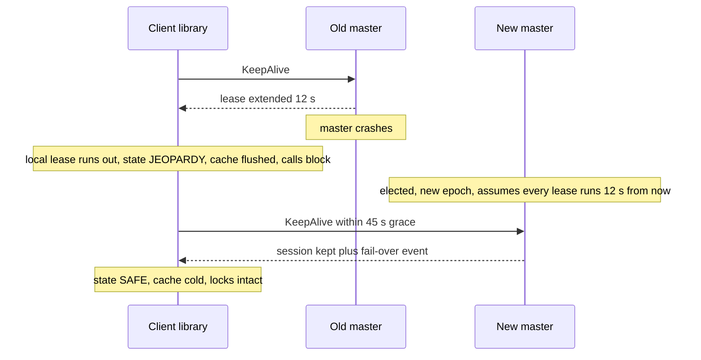
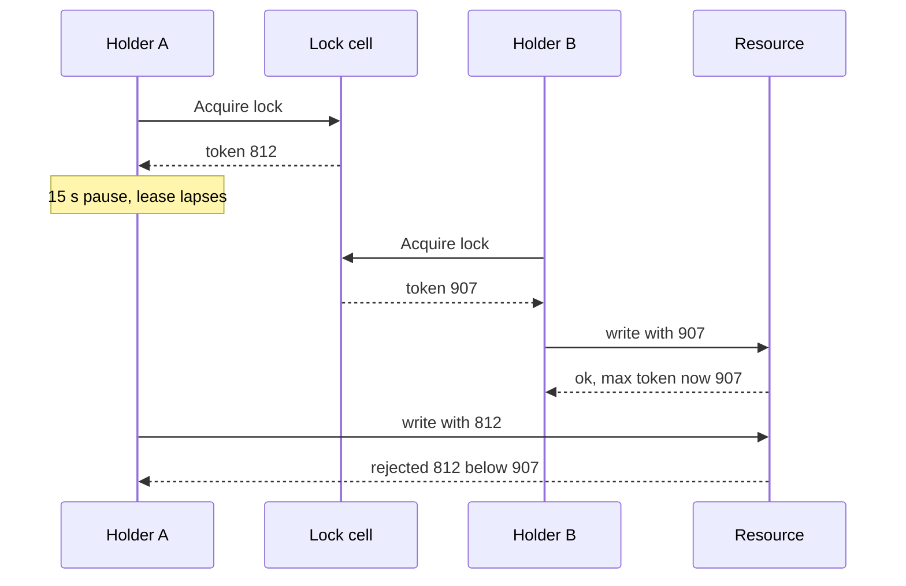

# 040 — Distributed Lock and Coordination Service: Full System Design Solution

## Goal and contract

A **cell** is a 5-replica, consensus-replicated state machine holding a small tree of nodes (files, locks, membership entries) and a table of client **sessions**. It follows the Chubby paper (Burrows, OSDI 2006) and borrows watch and recipe ideas from ZooKeeper (Hunt et al., USENIX ATC 2010) and etcd. The contract:

- **Mutual exclusion with a bounded blast.** At any instant at most one exclusive holder. A holder that stops renewing loses the lock within one lease (12 s), and the next grant carries a **higher fencing token**.
- **The cell cannot see a paused process, only the resource can reject it.** A lock is safe for correctness only if the resource checks the token; otherwise it is an efficiency hint. This is the one hard decision, and why `Acquire` returns a token, not a boolean.
- **Sessions survive a master failover** that ends inside the grace period, so a 15 s repair does not depose every leader in the company.
- Cached reads are never stale while the session is valid, writes are linearizable, and watch events arrive in commit order and before newer data.
- Not promised: fine-grained or high-rate locking, large values, cross-cell transactions, or availability with 3 of 5 replicas gone.

## Estimates

Question constraints are the contract; (assumed) marks our numbers, to be load-tested.

| Quantity | Arithmetic | Result | So we need... |
|---|---|---|---|
| KeepAlive rate | 30,000 sessions / (12 s lease − 2 s slack) | 3,000/s | Leases in master memory. Through the log they add 3,000 to 200 writes/s: 15× the real write rate, 3,200/s vs an assumed 2,000/s ceiling. |
| Restart writes | 30,000 / 1,800 s = 17/s × ~5 writes | 83 writes/s | Consistent with the stated 200/s peak. |
| Read misses | 200 writes/s × ~10 cachers = 2,000 refetches/s, + 17 × 30 cold reads = 500/s | 2,500/s (2.5% of 100,000) | A client cache: uncached, 100,000/s is 3.3× a master's assumed 30,000 RPCs/s. |
| Master load | 3,000 + 2,500 + 200 | 5,700/s = 19% of 30,000 | About 5× headroom. |
| Reconnect storm | 30,000 × ~6 RPCs = 180,000: in 5 s 36,000/s (120%), in 15 s 12,000/s + 5,700 = 17,700/s (59%) | Spread over ≥ 15 s | Jittered backoff and a cap of 2,000 new sessions/s: 30,000 re-admit in 15 s, inside the 45 s grace. |
| State and log | 200,000 × (2 KB + ~0.5 KB metadata) = 500 MB. Log 200/s × 500 B = 100 KB/s = 8.6 GB/day | Tree in RAM on every replica | Snapshot at a 1 GB log (every 2.8 h): 500 MB at 200 MB/s = 2.5 s, replica catch-up at 100 MB/s = 5 s. fsync latency, not bandwidth, bounds writes. |
| Hot-node fan-out | 30,000 events / 30,000 sends/s | 1.0 s at the master | The whole 1 s budget: fan out via 300 proxies × 100 clients: 300 sends = 10 ms, then 100 each = 3 ms. |
| Failover budget | Election 1 to 2 s + wait out old leases 12 s | ~14 s | Survivable window 12 s + 45 s grace = 57 s: 4× margin. |

## <abbr title="Application Programming Interface">API</abbr>

Every write carries `(session_id, seq)`; the master keeps the last `seq` and response per session and replays it on a retry (client sessions, Ongaro's Raft dissertation, 2014), so retries across a master change are idempotent.

```text
OpenSession(client_id, lease_s)              → {session_id, lease_s, epoch}
KeepAlive(session_id, ack_ids[], t_sent)     → {lease_s, invalidations[], events[]}   # parked until near lease end
CloseSession(session_id)                     → ok                                     # releases locks now
Create(path, data, type, acl)                → {rev}     type = PERSISTENT | EPHEMERAL | EPHEMERAL_SEQUENTIAL
Get(path, watch?)                            → {data, rev, version}                   # cached when valid
Set(path, data, expect_version?)             → {rev} | VERSION_CONFLICT               # compare-and-set
Acquire(path, mode, wait_ms)                 → {sequencer{path, mode, token, epoch, sig}} | HELD{holder}
Release(path)                                → ok
Watch(path or prefix, from_rev)              → stream of {rev, type, path}
```

Errors: `SESSION_EXPIRED` (terminal), `IN_JEOPARDY` (retryable), `NOT_MASTER{hint}`, `QUOTA_EXCEEDED{retry_after}`, `COMPACTED{oldest_rev}`.

## Data model

| Entity | Fields | Where it lives |
|---|---|---|
| Node and lock | `path` (key), `data ≤ 256 KB`, `version`, `create_rev`, `mod_rev`, `acl`, `type`, `owner_session`, lock `mode`, `holders`, `token`, FIFO `waiters` by commit index | Raft log + snapshot (source of truth), RAM tree |
| Session | `session_id`, `client_id`, `epoch`, ephemeral paths | Create and close in the log |
| Lease deadlines, watch table, cacher sets | per-session timers, `path → sessions`, `node → caching sessions` | Master memory only, rebuilt from client re-registration after failover |

`rev` is the Raft commit index, one monotonic counter per cell, so it doubles as the fencing token and the watch resume point. A ring keeps the last 10 minutes of events by `rev`: 200/s × 600 s = 120,000 × ~200 B = 24 MB. There is no partition key: **the cell is the shard**. Top-level prefixes map to cells via config, and no operation spans cells.

## Architecture

```arch
%% caption: Clients reach one master through an optional proxy tier, the master commits through a 5-replica log, and protected resources verify fencing tokens themselves.
grid 150x120
group Clients "Client processes" icon=app color=slate
node C1 "App + client library" at 0,0 in Clients icon=app sub="session, cache, watches"
node C2 "App + client library" at 1.5,0 in Clients icon=app
node R "Protected resource" at 0,1 icon=lock sub="stores highest token seen"
node P "Proxy tier" at 1.5,1 icon=proxy sub="batched KeepAlive, shared cache"
group Cell "Cell: 5 replicas over 3 zones (2-2-1)" icon=region color=blue
node M "Master = Raft leader" at 1.5,2 in Cell icon=server sub="tree, sessions, leases, watches in RAM"
node F1 "Follower A" at 0,3 in Cell icon=replica
node F2 "Follower B" at 1,3 in Cell icon=replica
node F3 "Follower B" at 2,3 in Cell icon=replica
node F4 "Follower C" at 3,3 in Cell icon=replica
C1:R -> P:L
C2 -> P
P -> M
M -> F1 : "append, commit at 3 of 5"
M:B -> F2:T
M:B -> F3:T
M -> F4
C1 -> R : "write + token"
```

**Write walk (`Set` on a file cached by 10 clients).** The master (1) checks the session and dedup table, (2) sends invalidations to the 10 cachers on their parked KeepAlive replies and waits for acks or lease expiry, (3) appends, fsyncs, replicates and commits at 3 of 5, (4) applies to the tree, queues watch events and replies. Invalidating first means an aborted write costs only a harmless re-read.

**Read walk.** The library answers from cache while its session is safe and no invalidation has arrived: zero RPCs. On a miss the master answers from RAM under its master lease (no log round), records the session as a cacher, and returns `{data, rev}`.

## Deep dive 1: the consensus core and the replica count

**Problem.** State must survive 2 failures and never allow two masters. A Raft or Multi-Paxos log with one leader (Chubby uses Paxos, etcd Raft) gives linearizable compare-and-set and one master to fence, at the cost of an election gap and an unavailable minority. A leaderless quorum ([023](023_distributed_key_value_store_solution.md)) has no single lock owner: the wrong invariant.

**Replica count.** Assume 99.9% independent availability per replica (optimistic, since correlated failures dominate). Unavailability = P(fewer than a quorum up):

| Replicas | Steady state | While one replica is down for an upgrade |
|---|---|---|
| 3 (quorum 2) | 3.0e-6 | 2.0e-3 (both others must be up) |
| 5 (quorum 3) | 1.0e-8 | 6.0e-6 (3 of the remaining 4) |

The 99.99% target is 52.6 min/yr, about 225 failovers of 14 s, so the binding terms are failovers, bad deploys and correlated failures, not this independent-failure math. Planned work is 333× safer with 5, so every upgrade is one replica at a time behind a health gate. Placement is 2-2-1 over three zones: any single zone loss leaves 3. Choose 5 → survive a planned plus an unplanned failure, or a zone → two follower acks per commit and 5 machines per cell → fine at 200 writes/s. A commit is leader fsync (~2 ms) plus the RTT to the 2nd-fastest follower (~1 ms), both assumed, so an acquire is about 5 ms p50 against the 50 ms p99 target.

**Reads and the deposed master.** Serve from memory only under a **master lease** shorter than the minimum election timeout by more than the clock-rate drift bound (say 1 s under 1.5 s, assumed), and step down on losing a heartbeat quorum; `ReadIndex` is the fallback (Raft, 2014). Only clock *rate* must be roughly right, not absolute time. Group commit batches entries arriving during one fsync; we size for an assumed 2,000 writes/s, 10× the peak.

## Deep dive 2: sessions, leases, KeepAlive and jeopardy

**Problem.** Detect dead clients without false positives, and survive master failover. The Chubby paper's defaults: **12 s** lease, **45 s** grace. The client sends `KeepAlive`, the master parks it and replies near lease end, extending by 12 s, and the client sends the next. Invalidations and events ride on these replies.



**Safety rule: `client_expiry ≤ master_expiry`.** The client times from when it *sent* the KeepAlive, minus a drift allowance, so it gives up first. A new master cannot know when the last KeepAlive arrived (deadlines live in memory), so it assumes each lease runs to failover + 12 s; that wait is the price of not logging renewals. After 57 s the session is expired and its locks and ephemeral nodes are gone.

| Option | Gives | Costs | Verdict |
|---|---|---|---|
| Memory-only lease, conservative after failover | 3,000 KeepAlives/s cost nothing in the log | ≤ 12 s extra at failover | Chosen |
| Renew through the log | Durable deadlines, instant failover | 3,200 writes/s vs 2,000/s ceiling | Rejected |

In jeopardy a passive reader keeps its last config (fail static); a **leader** starts no unfenced irreversible work and abdicates on expiry.

## Deep dive 3: locks, the paused holder, and fencing

**Problem.** The lease can lapse while the holder is frozen (stop-the-world GC, VM live migration, `SIGSTOP`); it then writes believing it still holds the lock. "Am I still the holder?" and the write are not atomic, so no timeout fixes it. Sequencers are in the Chubby paper and the pattern is argued in Kleppmann's 2016 essay; the generic mechanism is in [block 19](../building_blocks/19_consensus_and_coordination.md), so here is this service's version.



- **Token = Raft commit index of the grant:** unique, strictly increasing across every lock in the cell, stable across master changes. The **sequencer** `{path, mode, token, epoch, sig}` is signed so a resource can verify it offline.
- **Resource rule.** Store `max_token` beside the data, updated in the same atomic operation as the write, and reject `token < max_token`. A max kept elsewhere or in memory lets a restarted resource re-admit the stale writer. Cost: 8 bytes and one comparison per write.

| Protection | Correct when | Cost |
|---|---|---|
| Token compared at the resource | Resource can persist and compare | One field |
| `CheckSequencer` RPC per write | Rare writes | An RTT and cell load per protected write |
| Lock-delay (paper: up to a minute) | Legacy resource cannot check | Safe only if the worst pause is under the delay, and every crash release waits |

Decision: token check by default with lock-delay 0; legacy resources get 60 s, a minute of unavailability per crash for partial protection.

**Waiters and the herd.** With 5,000 candidates on one election lock, waking everyone means 5,000 write attempts / 2,000 writes/s = 2.5 s of write queue for everyone else. Instead waiters queue FIFO by commit index (etcd's mutex waits on the key just before its own, and the ZooKeeper recipe watches only its predecessor), so a release wakes **one** waiter after checking its session is alive. **Election** is a lock plus a file: the winner writes `{address, token}` to `/svc/leader`; others read it from cache and watch it.

## Deep dive 4: client caching, watches, and ordering

| Model | Staleness | Server cost | Used by |
|---|---|---|---|
| TTL cache | Up to the TTL (12 s) | None | DNS-like lookups |
| Invalidate, then write | None while the session is valid | Write waits for every ack or lease expiry: worst case 12 s | Chubby (paper) |
| Watch and re-read | Event delay | No blocking, fan-out only | ZooKeeper, etcd |

Decision: **invalidation for files and leader records, watches for the rest.** A "who is the leader?" answer stale for 12 s sends traffic to a deposed leader, so the strict model earns its cost, namely a write blocked for up to one lease by an unreachable cacher. Guard it: a node with writes × cachers above 3,000 invalidations/s (10% of the master) becomes uncacheable, served by proxies with a short TTL.

**Watch guarantees** (ZooKeeper's documented model plus etcd-style revisions):

- **Order.** Events for a session arrive in commit order, and a client sees a path's event before it can read the changed data.
- **Resume.** Events carry `rev`. After a reconnect, `Watch(from_rev = last_seen + 1)` replays from the ring: 120,000 events against about 3,000 in a 15 s failover, 40× margin. Older than the ring gives `COMPACTED`: re-read, re-watch (as in etcd).
- **At-least-once.** Handlers de-duplicate by `rev`. A slow watcher with 1,000 buffered events is marked `RESYNC`, never blocking the master.

## Deep dive 5: scaling reads and fan-out, and abuse

At 150,000 sessions (5×): KeepAlives 15,000/s (50%) plus read misses 12,500/s (42%) is 92% of a master.

| Lever | Helps | Doesn't help | Notes |
|---|---|---|---|
| Followers or observers (ZooKeeper observers, etcd learners) | Read misses | KeepAlives (leases live at the master). Reads may be stale | Non-voting: the write quorum stays small |
| **Proxies with batched KeepAlive** | KeepAlives, shared misses | Writes | 150,000 / 500 = 300 proxies: 30 batched RPCs/s at the master, 500× fewer (the paper makes this argument). Misses shrink an assumed 2× to 6,250/s: total about 22% |

Decision: proxies first, observers for cold reads, more cells by namespace last (they cost cross-cell locks). Sessions stay owned by the master, so a proxy crash only moves its clients to another proxy.

**Quotas** (shared fate):

- Writes: weighted fair share per tenant, burst 10×; 2,000/s ÷ 100 tenants (assumed) = 20/s each.
- Watches: 100 per session, 10× the mean of 10: worst case 3 M × ~200 B = 600 MB (typical 300,000 = 60 MB).
- Node size 256 KB (the paper also limits file size), depth 16, and per-directory node and byte quotas within the 500 MB budget.
- KeepAlive floor 1/s per session and 2,000 new sessions/s per cell (storm control).

A loop creating ephemeral nodes at 10,000/s is 5× the write ceiling and stalls all 30,000 clients.

## Failure behaviour

| Failure | Behaviour |
|---|---|
| Follower crash | Invisible (4 of 5). Replacement catches up from a snapshot in about 5 s. |
| Master crash | Election 1 to 2 s, then the new master waits out old leases (≤ 12 s): writes down about 14 s. Clients silent for 12 s enter jeopardy, then recover with locks intact. |
| Zone loss (2 replicas) | 3 of 5 remain, quorum holds after an election. A second failure means no quorum: page. |
| Master partitioned from majority | It stops serving reads when its lease lapses and steps down. Minority clients go into jeopardy and expire at 57 s. |
| Client paused or partitioned | Session expires within 12 s, locks free, next token is higher, the client gets `SESSION_EXPIRED` and is fenced at the resource. |
| Entire cell down | Jeopardy at 12 s, expiry at 57 s. Readers fail static. Leaders stand down: an unverifiable lock is no lock. |
| Reconnect storm | Session cap 2,000/s plus jittered backoff: 15 s to re-admit 30,000. |
| Bad deploy | Canary one non-master follower (same log, so a bad entry crashes it while 4 of 5 stay healthy), then followers one at a time, master last with leadership transfer (about 2 s, far under the 12 s jeopardy threshold). New behaviour waits for a cluster-version log entry committed once every replica runs the new binary (etcd negotiates cluster version similarly). |
| Corruption, or clock drift beyond bound | Checksums, replica rebuilt from snapshot. Drift makes leases unsafe: fencing is the backstop, and drift is alerted. |

## Observability and interview close

- **SLIs:** KeepAlive service ratio and p99, session expiries per minute (excluding clean closes), commit and fsync p99, leader changes per hour, watch delivery lag p99 (< 1 s), lock acquire p99 (< 50 ms), invalidation wait p99, sessions in jeopardy (client-reported), quota rejections by tenant.
- **The one paging alert:** no KeepAlives served for 20 seconds. Failover is expected in about 15 s and sessions die at 57 s, so 20 s is the earliest point meaning "not a normal failover". Single-replica loss and elections are tickets.

Trade-off to state: "I chose a Chubby-style coarse-grained lock service on a 5-replica consensus cell with session leases and fencing tokens, so a crashed leader is replaced in about 15 seconds and a paused one is rejected by the resource rather than trusted. The cost is that renewals live in master memory, so a failover waits out one lease, and a write can block for one lease when a cacher is unreachable. For fine-grained, high-rate locking I would not use it."

## Follow-ups the interviewer will ask

1. **"How do you make it multi-region?"** One cell per region: a quorum spread over regions puts a WAN round trip in every commit (an assumed 60 ms to the nearest majority misses the 50 ms target). For rare cross-region elections use a small global cell, replicas 2-2-1 over three regions, accepting 60 to 100 ms writes; reads stay cached ([block 27](../building_blocks/27_multi_region_and_global_traffic.md)).
2. **"What changes at 10× and 100×?"** At 10× (300,000 sessions) KeepAlives alone are 30,000/s, 100% of a master, so proxies are mandatory (600 × 500 leaves 60/s), and writes hit the 2,000/s ceiling, so partition by tenant. At 100× (3 M sessions): 3 M / 150,000 = 20 cells and 6,000 proxies. A cell does not scale writes, so we add cells.
3. **"Can reads be linearizable at fan-out scale?"** Cached reads under invalidation already are, at no master cost. Uncached ones use `ReadIndex` on the leader or a follower that fetches the read index and waits (etcd). ZooKeeper follower reads are only sequentially consistent and need `sync`.
4. **"What does this cost?"** Five machines per cell plus one proxy per 500 clients (0.2% of the fleet); the real cost is operating cells. Non-production can run 3 replicas.
5. **"How do you stop abuse?"** The quotas above, enforced at the master with a weighted fair queue so a burst queues behind its own limit, plus use-case review: teams misuse coordination services as stores or event buses (the Chubby paper reports similar experience).
6. **"Why not `SET key NX PX 10000` in Redis?"** Fine as an efficiency lock. For correctness it issues no monotonic token from a consensus log and a paused holder still writes, so you would still need something that issues fencing tokens, which is this service.
7. **"Why not a 2 s lease so crashes are found sooner?"** KeepAlives become 30,000 / 1.5 = 20,000/s (67% of a master) and every GC pause over 2 s loses a session. Leaders live for hours, so 12 s is cheap stability.

## Common mistakes

1. **A TTL lock with no fencing, or trusting "my lease is valid" across a pause.** It was true when checked, and the check and the write are not atomic. Return a token and make the resource reject older ones, or call it an efficiency lock.
2. **A token that is not monotonic at the resource.** Timestamps and per-client counters fail after a clock step, and a max not persisted with the write fails after a resource restart. Use the commit index.
3. **KeepAlives through consensus.** 200 writes/s becomes 3,200/s. Keep leases in memory, pay one lease at failover.
4. **Treating jeopardy as expiry.** Deposing every leader on a 15 s failover causes a fleet-wide storm. Jeopardy means wait, expiry (57 s) means abdicate.
5. **Waking every waiter on release.** 5,000 waiters means 2.5 s of write backlog. Queue and wake the head.
6. **Using it as a database or queue.** State the limits (256 KB nodes, 200 writes/s per cell) and put that traffic elsewhere.
7. **Even replica counts, or 2-2 over two zones.** Four replicas tolerate no more than three, and losing a zone of a 2-2 split loses quorum. Use 5 as 2-2-1.

## Going from L5 to L6

- **Build vs buy.** Run etcd or ZooKeeper (or a managed one) unless a cell must exceed about 150,000 sessions or needs blocking-invalidation caches. What you build is the client library, fencing-aware SDKs, quotas and dashboards; most bugs live in the client state machine, so test it like a protocol.
- **Migration and rollout.** Migrate lock by lock in shadow mode, comparing decisions, elections last, cutting over per namespace with the old system as a read-only fallback.
- **Blast radius.** One cell per environment and criticality class; never share one between the production control plane and batch jobs. Break the circular dependency (services that need the lock service to start) with a bootstrap path that avoids it.
- **Measure first.** Lock hold times (are they coarse?), the share of lock users with no fencing, session-expiry causes (pause, partition, crash), watch fan-out per node, top clients by write rate.

## Build exercise

Build a fake-clock simulation of a lock cell (sessions, leases, tokens), a client library (jeopardy and expiry states) and a resource storing `max_token`. Inject a 15 s pause, a master failover and a partition.

- `test_paused_holder_is_fenced`: A pauses past its lease, B acquires, A wakes and writes with the old token, and the resource rejects it.
- `test_token_strictly_increases_across_failover`: tokens never repeat or decrease across grants or a master change.
- `test_failover_under_grace_keeps_session_and_locks`: a 15 s gap yields jeopardy then safe with locks intact, and a 60 s gap yields `SESSION_EXPIRED`.
- `test_release_wakes_only_head_waiter`: 1,000 waiters, one release, exactly one wake-up and grant.
- `test_write_blocks_until_cache_invalidated`: a cacher withholds its ack, the write completes only at ack or lease expiry, and no read returns stale data.
- `test_watch_order_and_resume`: a watcher never reads new data before its event, and resume from `rev` replays every event once.
