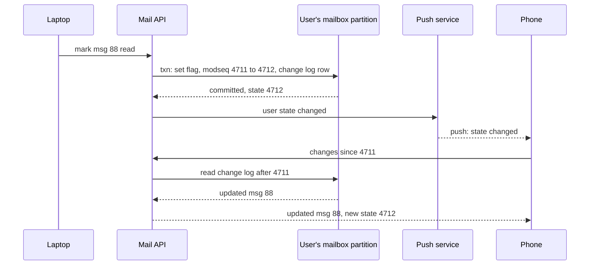

# 041 — Email Service: Full System Design Solution

## Goal and contract

An email service is three systems that share one mailbox store: an **inbound pipeline** that takes mail from any server on the internet and decides where it goes, a **mailbox service** that keeps each user's messages, labels and flags and serves web, mobile and IMAP clients, and an **outbound pipeline** that delivers users' mail to other providers without getting the service's IP addresses blocked. The protocols are old and fixed (SMTP, RFC 5321; the message format, RFC 5322; IMAP, RFC 9051), so most of the design is about where to put durability, spam decisions and per-user state. The contract:

- **`250 OK` means we own the message.** RFC 5321 says that once the receiver replies `250` to the end of `DATA`, it has taken responsibility for delivering the message or reporting its failure. So we reply `250` only after the message is on disk in two zones. Before that point any failure is a `4xx` (try again later), and the sending server retries for days, so an internal outage delays inbound mail but never loses it.
- **Reject in the session, never bounce later.** A confident "no" (unknown recipient, malware, a DMARC `p=reject` failure) is a `5xx` reply while the sender is still connected. Accepting and then sending a bounce to the `MAIL FROM` address sends junk to whoever the spammer forged (backscatter), which gets our servers blocklisted.
- **The mailbox is the unit of consistency.** Every change to one user's mail (a delivery, a label, a flag, a delete) is a transaction on that user's partition and bumps one per-mailbox counter, the **modification sequence** (`modseq`). Sync cursors, search indexing and push notifications all hang off that counter. Nothing ever needs a transaction across two users.
- **Search is per user.** Each mailbox has its own inverted index next to its data, so a query touches one user's mail and cannot leak another's.
- **Spam goes to the spam folder, not into the void.** A false positive (real mail in spam) costs more than a false negative, so anything short of a confident reject is delivered, to the inbox or the spam folder, with a visible reason.
- Not promised: end-to-end encryption of normal mail (the server must read mail to filter spam and to search it), instant delivery to other providers, or recall of mail already delivered elsewhere.

The one hard decision is **when to say `250`**, because it moves responsibility for the message from the sender to us. Everything else in the inbound path is ordered around it: cheap checks before, durable spool at it, expensive classification after.

## Estimates

Constraints from the question; (assumed) marks our numbers.

| Quantity | Arithmetic | Result | So we need... |
|---|---|---|---|
| SMTP transactions offered | 10B/day / 86,400 | 116,000/s average, **350,000/s** peak | Ingest servers sized by TLS handshakes and connections, not bytes: at 2,000 transactions/s each (assumed), 175 at peak, about 300 with zone headroom. |
| Rejected before `DATA` | 40% (assumed) refused on IP reputation, rate limits or unknown recipient | 4B/day never transferred | 4B × 75 KB = **300 TB/day of bytes we never receive**. The cheap checks exist to save bandwidth and storage, not CPU. |
| Accepted | 6B/day | 69,000/s average, **210,000/s** peak | The spool, classifier and delivery writers are sized for 210,000 messages/s. |
| Inbound bandwidth | 6B × 75 KB = 450 TB/day | 5.2 GB/s = 42 Gbps average, **125 Gbps** peak | Spread over several regions' MX endpoints. |
| Spool for a stall | 210,000/s × 3,600 s × 75 KB × 2 copies | **113 TB per hour** of stall | Size the spool for 2 hours of peak (about 230 TB) before ingest must start replying `4xx`. |
| Mailbox growth | 5B/day kept (1B to spam, deleted after 30 days) × 75 KB, 20% saved by storing multi-recipient copies once (assumed) | 300 TB/day, **110 PB/year** logical | Bodies and attachments go to an erasure-coded blob store ([035](035_distributed_object_store_solution.md)): about 165 PB/year raw at 1.5×. |
| Per-message metadata | 1 KB (headers, snippet, labels, flags, thread) × 5B/day | 5 TB/day, 1.8 PB/year, **5.5 PB/year** with 3 replicas | A sharded metadata store keyed by user: fine, but metadata, not bodies, is what every list view and sync reads. |
| Per mailbox | 5B / 500M = 10 messages/day received | 3,650/year, about 3.7 MB metadata/year | A 10-year mailbox is about 37 MB of metadata: one user's data fits on one shard with room to spare. |
| Search index | about 2 KB per message (assumed: ~8 KB of text at ~25%) | 10 TB/day, 3.7 PB/year | Too big to hold in RAM for everyone: per-user indexes live on SSD, cached for active users. |
| Search queries | 200M DAU × 3/day | 6,900/s average, **21,000/s** peak | Each touches one user's index of a few tens of MB. |
| Sync checks | 200M × 2.5 devices × 50/day | 290,000/s average, **870,000/s** peak | Almost all are "anything new?": answer from a cache of each mailbox's current `modseq` (500M × 16 B = 8 GB) without touching storage. |
| Push notifications | 10 deliveries/day × 200M active × 2.5 devices | 5B/day, 58,000/s | Coalesce per user over a few seconds; send "state changed", never the message. |
| Outbound | 400M/day × 1.3 destination domains | 520M transactions/day, 6,000/s average, 18,000/s peak | Small next to inbound; the constraint is reputation, not capacity. |
| Deferred outbound | 3% temp-failed (assumed), retried for up to 5 days | about 16M messages, 1.2 TB queued | A durable outbound queue with per-destination scheduling. |

## API

The client API follows JMAP (RFC 8620 and RFC 8621), the JSON successor to IMAP; Gmail's own API has the same shape with a `historyId` cursor. IMAP clients get the same state through a gateway that maps `modseq` to IMAP's CONDSTORE and QRESYNC extensions (RFC 7162).

```text
GET  /mailboxes/{user}/threads?label=INBOX&page_token=...      → {threads[{thread_id, snippet, labels, last_date, unread}], next_token, state}
GET  /messages/{id}?format=metadata|full                       → {headers, labels, flags, body parts, attachment refs}
GET  /changes?since_state=S123&max=500                          → {created[], updated[], destroyed[], new_state, has_more} | 410 CANNOT_CALCULATE_CHANGES
POST /messages/modify {ids[], add_labels[], remove_labels[], if_in_state?}   → {new_state} | 409 STATE_MISMATCH
GET  /search?q=from:alice invoice after:2025/01/01&page_token  → {message_ids[], next_token, index_lag_s}
POST /drafts            {draft, client_id}                      → {draft_id}          # idempotent on client_id
POST /send              {draft_id | raw_mime, idempotency_key}  → {message_id, queued}
POST /push/subscribe    {device_token, types[]}                 → ok
```

Inbound is SMTP itself: `EHLO`, `STARTTLS`, `MAIL FROM`, `RCPT TO` (one per recipient), `DATA`, and the final reply. `4xx` means "try again" and `5xx` means "never".

- **Idempotency.** Sends carry an idempotency key, because a double-sent email cannot be taken back. Inbound delivery is at least once (a sender retries after a lost `250`), so the delivery writer deduplicates on the `Message-ID` header plus a hash of the body within each mailbox.
- **Conditional writes.** `if_in_state` gives a client compare-and-set on the mailbox state, which IMAP exposes as `UNCHANGEDSINCE`.

## Data model

| Entity | Key → fields | Where it lives |
|---|---|---|
| Raw message | `blob_id` (content hash) → the MIME bytes, attachments as separate parts | Blob store, immutable, reference-counted. One copy per accepted message, shared by every local recipient. |
| Message | `(user_id, msg_id)` → blob_id, thread_id, internal_date, from, to, subject, snippet, size, label set, flags, `modseq`, Message-ID | Mailbox metadata store, partitioned by `user_id`. Source of truth for what a user has and how it is labelled. |
| Thread | `(user_id, thread_id)` → message ids, label summary, last date | Same partition. |
| Label counts | `(user_id, label)` → total, unread | Same partition, updated in the same transaction as the message change. |
| Change log | `(user_id, modseq)` → change type, msg_id | Same partition, kept 30 days (assumed). This is the sync cursor's history. |
| Message-ID index | `(user_id, message_id_header)` → msg_id, thread_id | Same partition. Used for dedup and threading. |
| Search index | per user: term → posting list of msg_ids | Search tier, placed next to the user's metadata shard. Derived; rebuildable from the store. |

**Keys.** Everything keyed by `user_id` sits on one partition, so "deliver a message" is one local transaction that writes the message row, the thread row, the label counts and the change-log entry and bumps the mailbox `modseq`. That is the whole consistency story: labels and counts can never disagree, and a client that holds cursor `S` can always be told exactly what changed since `S`. The cost is that a user's partition is a hot spot for shared or robot mailboxes, handled with per-mailbox write limits (Deep dive 3).

## Architecture

```arch
%% caption: Inbound mail is spooled in two zones before 250, classified, and written as one per-user transaction whose change log drives sync, push and indexing; outbound mail leaves through a separate queue and IP pools.
grid 170x110
node S "Sending servers" at 0,0 icon=internet sub="the internet"
node MX "SMTP ingest" at 0,1 icon=email sub="MX, SPF, DKIM, DMARC"
node SP "Durable spool" at 0,2 icon=queue sub="2 zones before 250"
node SPM "Spam and malware" at 0,3 icon=shield sub="rules, ML, sandbox"
node DW "Delivery writer" at 0,4 icon=worker sub="dedup, thread, label"
node U "Web, mobile, IMAP" at 2,0 icon=users
node API "Mail API" at 2,1 icon=api sub="read, sync, search, send"
node OQ "Outbound queue" at 3,1 icon=queue sub="per destination domain"
node OM "Outbound servers" at 3,2 icon=email sub="DKIM sign, IP pools"
group St "Per-user mailbox shard" icon=db color=blue
node BL "Blob store" at 0,5 in St icon=blob sub="bodies, attachments"
node MD "Mailbox metadata" at 1,5 in St icon=db sub="labels, flags, modseq"
node IX "Search index" at 2,5 in St icon=search sub="one per user"
node CL "Change log" at 1,3 icon=stream sub="modseq events"
S -> MX -> SP -> SPM -> DW
DW -> BL
DW:R -> MD:L
MD -> CL
CL ..> IX : "index"
CL:T ..> API:L : "push"
U -> API
API -> IX : "search"
API -> OQ : "send"
OQ -> OM
```

**Inbound walk.** A sending server looks up our MX record and connects. The ingest server (1) checks the connecting IP against reputation data and rate limits and replies `421` or `554` to known-bad sources, (2) offers `STARTTLS`, (3) at each `RCPT TO` checks that the mailbox exists and is not over quota (`550` otherwise), (4) receives `DATA`, checks size, SPF, DKIM and DMARC and runs a fast signature virus scan, (5) writes the message to the spool on two zones and only then replies `250`. After that, off the SMTP session: the classifier chooses inbox, spam or quarantine; the delivery writer stores the blob once, then for each local recipient runs one transaction on that user's partition (message row, thread, label counts, change-log entry, `modseq + 1`), and removes the spool entry after every recipient is written.

**Read walk.** The client opens the inbox: the API reads the first page of threads for `INBOX` from the user's metadata partition (a range read sorted by date), with snippets, so no bodies are fetched. Opening a message fetches its blob. The response carries the current state, which the client keeps as its sync cursor.

**Send walk.** The client posts a draft and `send` with an idempotency key. The API writes the message into the user's `SENT` label (one mailbox transaction), checks the user's sending limits and an outbound spam check, and puts the message on the outbound queue. An outbound server signs it with DKIM, looks up the recipient domain's MX records, and delivers from an IP pool chosen by message class.

## Deep dive 1: SMTP ingest and when to say `250`

**Problem.** The sending server holds the message until we say `250`; after that we hold it. Say it too early and a crash loses mail we promised to deliver. Say it too late (after a slow classifier) and connections pile up. RFC 5321 gives the sender up to 10 minutes to wait for the final reply, so a few seconds of in-session work is allowed, but connections are the scarce resource at 350,000 transactions/s.

| Checks before `250` (in session) | Checks after `250` (async) |
|---|---|
| IP reputation and DNS blocklists, per-IP connection and rate limits | ML spam classifier over headers, body and URLs |
| Recipient exists, quota, per-recipient rate | Attachment detonation in a sandbox |
| SPF, DKIM and DMARC evaluation | URL reputation lookups, image and QR-code analysis |
| Size limit, fast signature virus scan | Threading, labels, user filters |
| Two-zone spool write | Delivery to each recipient's mailbox |

The rule for the split: before `250` go the checks that can end in a **reject** (they must happen while the sender is connected, or we are back to backscatter) and that finish in milliseconds. After `250` go the checks whose worst outcome is the **spam folder or quarantine**. If a sandbox finds malware after `250`, the message is quarantined and the user sees a notice; we never bounce it.

**Authentication in one paragraph.** SPF (RFC 7208) says which IPs may send for the envelope domain. DKIM (RFC 6376) signs headers and body with a key published in DNS. DMARC (RFC 7489, being revised as DMARCbis) ties them to the visible `From:` domain: a message passes if SPF or DKIM passes *and* the passing domain aligns with `From:`, and the domain owner publishes a policy (`none`, `quarantine`, `reject`) for failures. Forwarders and mailing lists break SPF and often DKIM, so we also evaluate ARC (RFC 8617) signatures from forwarders we trust before applying a `reject` policy; otherwise legitimate list mail gets rejected.

**Backpressure.** When the spool passes 70% of its 2-hour budget, ingest starts replying `451 4.3.0 try again later` to the lowest-reputation sources first, then to everyone. Senders queue and retry (RFC 5321 suggests giving up only after 4 to 5 days), so a downstream outage turns into delay, not loss. This is the reason the question's "never fail permanently" is cheap to honour: `4xx` is built into the protocol.

**Transport security.** Opportunistic `STARTTLS` is downgradable by an attacker who strips it. We publish an MTA-STS policy (RFC 8461) and DANE records where the sender supports DNSSEC, so senders that honour them refuse to deliver to us without TLS, and we collect TLS failure reports (TLS-RPT, RFC 8460).

## Deep dive 2: the spam and abuse pipeline

**Problem.** More than half of offered mail is spam, attackers adapt within hours, and a false positive (a job offer in spam) is the most damaging error. Stage the checks cheapest first so that expensive ones see little traffic.

| Stage | Signal | Cost | Share of mail it decides (assumed) |
|---|---|---|---|
| Connection | IP and ASN reputation, blocklists, connection rate, reverse DNS | microseconds, from an in-memory table | about 40% rejected before `DATA` |
| Envelope and auth | recipient validity, SPF/DKIM/DMARC, sending-domain age and reputation | a few DNS lookups, cached | a few percent more |
| Content | ML classifier over headers, text, URLs and layout; bulk-sender rules | milliseconds of CPU | most of what remains |
| Attachments | signature scan in session; sandbox detonation for risky types (macros, executables, archives) | seconds to a minute, for about 1% of messages | small, but it is where malware lives |
| User feedback | "report spam", "not spam", moving mail out of spam | offline | retrains models and adjusts sender and domain reputation |

The CPU is not the problem: 6B messages × 5 ms of classifier CPU (assumed) is 30M core-seconds a day, about 350 cores. Sandbox detonation of 1% at 30 s each is about 2,100 cores. What costs is **precision**, and that comes from reputation and feedback, not from bigger models.

- **Reputation is per domain and per IP, and it decays.** A domain that sent clean mail for years earns trust; a new domain starts neutral. Spammers rotate IPs cheaply, so authenticated-domain reputation (DKIM or SPF with DMARC alignment) is the more stable signal.
- **Bulk senders.** Since February 2024 Gmail and Yahoo require senders of more than about 5,000 messages a day to authenticate with SPF, DKIM and DMARC, to offer one-click unsubscribe (RFC 8058), and to keep the user-reported spam rate under 0.3%. Enforcing the same rules inbound turns "is this bulk mail legitimate?" into a checklist.
- **Per-user signals.** A message from someone the user has written to before is almost never spam. That signal is cheap (a lookup in the user's own contacts) and sharply cuts false positives.
- **Feedback is adversarial too.** Spammers report their own mail as "not spam" from farmed accounts, so feedback is weighted by account age and history.

**Decision.** Reject only on confident signals (malware, DMARC `reject` without a trusted ARC chain, blocklisted IP). Everything else is delivered, with the classifier's score deciding inbox or spam and the reason shown to the user ("this message failed authentication").

## Deep dive 3: mailbox storage, threading and hot mailboxes

**Problem.** Bodies are large and immutable; labels and flags are small and change constantly. Store them separately.

- **Bodies in a blob store.** The raw MIME message is written once, keyed by content hash, and never modified. A message to 1,000 local recipients (a company announcement) is one blob and 1,000 small metadata rows, which is where the 20% saving comes from. We deliberately do *not* deduplicate attachments across unrelated users: the saving is small next to multi-recipient sharing, and cross-user dedup can reveal that another user holds a file.
- **Metadata in a store partitioned by `user_id`** (a Bigtable- or Spanner-style store; [block 05](../building_blocks/05_databases.md)). Rows are ordered so "INBOX threads by date" is a range read. Each mailbox change is a single-partition transaction.

**Threading.** At delivery, the writer looks up the message's `In-Reply-To` and `References` header values in the user's Message-ID index. If one matches and the normalised subject (without `Re:` or `Fwd:`) is similar, the message joins that thread; otherwise it starts a new one. Threading is per user: the same message can sit in different threads for the sender and the recipient.

**Labels versus folders.** Gmail-style labels are a set per message, so "move to folder" is remove one label, add another. IMAP clients see each label as a folder; the gateway maps a message with two labels into two folders and translates IMAP `MOVE` and `EXPUNGE` into label operations.

**Hot mailboxes.** An average mailbox gets 10 messages a day, but a shared support address or a robot receiving alerts can get 100 a second. That is still one partition. Cap each mailbox at, say, 50 deliveries/s (assumed) with a per-mailbox queue in the delivery writer, so a flood to one mailbox delays that mailbox and nobody else. Large local fan-out (a mailing list with 1M local members) is expanded by the delivery writer in batches, with the blob stored once.

**Deletion and retention.** Delete moves to trash; trash and spam are purged after 30 days. A purge writes tombstones in metadata and decrements the blob's reference count; the blob store's garbage collector reclaims unreferenced blobs later ([035](035_distributed_object_store_solution.md), deep dive 5). Legal hold is a flag on the mailbox that blocks purge, checked by the purge job, not by the client.

## Deep dive 4: sync cursors and push

**Problem.** A user has a phone, a laptop and an IMAP client. Each must show the same labels and read flags within 5 seconds, survive being offline for a week, and not re-download 50,000 messages to find out what changed.



- **The cursor is the mailbox `modseq`.** Every change bumps it inside the same transaction, and the change log holds `(modseq, msg_id, type)`. `changes(since=S)` is a range read of the log after `S`, collapsed to the latest change per message. This is IMAP's CONDSTORE and QRESYNC `MODSEQ`, JMAP's `state` and Gmail's `historyId` under different names.
- **Old cursors.** The log keeps 30 days. A device offline longer gets `CANNOT_CALCULATE_CHANGES` and resyncs: it fetches the current list of message ids and labels (about 50 bytes each, so 2.5 MB for 50,000 messages) and diffs locally, then downloads only missing bodies.
- **Cheap polling.** 870,000 sync checks/s at peak mostly ask "has state moved?". A cache of `user_id → current modseq` (8 GB, updated from the change log) answers them without touching the partition.
- **Push.** Mobile devices get an APNs or FCM notification carrying only "state changed", coalesced per user over a couple of seconds; the message itself never goes through the push provider (payload limits and privacy). Web clients hold a long-lived connection; IMAP clients use `IDLE`.
- **Conflicts.** Flags and labels are set operations, so "phone marks read" and "laptop adds label" commute and both apply in arrival order. A client that must not overwrite a newer change sends `if_in_state` (IMAP `UNCHANGEDSINCE`) and re-reads on `409`. Expunge wins over any later flag change to the same message.

## Deep dive 5: per-user search

**Problem.** Search "invoice from alice last spring" over a user's own mail in under 500 ms, never returning another user's mail, with new mail findable within a minute.

| Option | Query cost | Isolation | Verdict |
|---|---|---|---|
| One global index sharded by term, filtered by `user_id` | The posting list for "invoice" covers every user; each query reads and filters a huge list | A filter bug leaks mail across users | Rejected |
| One global index sharded by document, filtered by `user_id` | Every query fans out to every shard | Same leak risk | Rejected |
| **An index per user, placed with the user's data** | One user's index: tens of MB for a 10-year mailbox | Structural: there is nothing else to read | Chosen |

- **Indexing.** An indexer consumes the change log, fetches new bodies, extracts text (including from PDFs and office attachments, at lower priority), and updates that user's index. Label and flag changes update small per-document fields, not the text postings. Typical lag is seconds; the API returns `index_lag_s` and merges in a scan of the newest unindexed messages, so a message that arrived a second ago still shows up.
- **Hot and cold.** 200M daily users have indexes on SSD and their recent segments in RAM. A user who has not logged in for months has an index on cheaper storage, and their first search pays a load of about a second (state it). Indexes are derived, so a corrupt one is rebuilt from the mailbox.
- **Latency budget.** A 36,000-message mailbox has posting lists of at most tens of thousands of entries per term: reading and intersecting a few is milliseconds from SSD. The p99 comes from cold loads and huge mailboxes, so cap the work per query and page results.
- **Encryption.** Mail is encrypted at rest with per-user keys held in a key service. Client-side encryption (an enterprise option) removes server-side search and spam scanning for those messages; say so rather than promise both.

## Deep dive 6: outbound delivery and deliverability

**Problem.** Other providers decide whether our users' mail lands in their inboxes, based on the reputation of our IPs and domains. One compromised account sending a million spam messages can get a shared IP blocklisted for everyone.

- **Authenticate everything.** SPF records for our sending IPs, DKIM signatures on every message (keys rotated, 2048-bit RSA), a DMARC `reject` policy on our own domains, and help for custom-domain customers to publish theirs.
- **Separate IP pools by class.** Ordinary user mail, high-volume senders, and mail flagged as suspicious leave from different pools, so a spam burst from a hijacked account damages the quarantine pool, not everyone's.
- **Outbound abuse control.** Per-account sending limits (Gmail publishes a limit of about 500 recipients a day for consumer accounts), a spam classifier on outbound mail, and anomaly detection on new accounts and sudden volume spikes. A compromised account is stopped by throttling it, not by sending its mail and hoping.
- **Per-destination scheduling.** The outbound queue is partitioned by destination domain. Each domain gets a concurrency and rate limit that adapts to replies: `421` or `4.7.x` throttling responses halve the rate, clean deliveries raise it. Temporary failures retry with exponential backoff for up to 5 days, then return a delivery status notification (RFC 3464) to the sender.
- **Warm-up.** A new sending IP has no reputation, and big providers throttle unknown IPs, so new IPs take a small share of traffic that grows over a few weeks.
- **Feedback.** Hard bounces add the address to a suppression list; complaint reports from feedback loops (the ARF format, RFC 5965) and postmaster dashboards feed per-sender reputation.

## Failure behaviour

| Failure | Behaviour |
|---|---|
| Ingest server crash mid-session | Nothing was acknowledged; the sender reconnects to another MX and retries. |
| Crash after `250`, before delivery | The spool copy in the other zone is picked up by another writer. Delivery is at least once; the Message-ID dedup stops a duplicate. |
| Classifier or sandbox slow | Messages wait in the spool, inbox latency grows. Past the p99 budget, deliver with the cheap checks' verdict and re-scan later (a late malware hit moves the message to quarantine). |
| Spool near its budget | `451` to low-reputation senders first, then to all. Mail is delayed, not lost. |
| One mailbox partition unavailable | Deliveries for those users stay in the spool and retry; reads for those users fail; everyone else is unaffected. |
| Blob store slow | Inbox lists still load from metadata snippets; opening a message is slow. |
| Search index lagging or lost | Results carry `index_lag_s`; a lost index is rebuilt from the mailbox, and search for that user falls back to a slower metadata scan meanwhile. |
| Push provider outage | Clients still poll on open and on a timer; sync is correct, only slower. |
| A destination provider throttles us | Per-domain backoff; other destinations are unaffected. |
| One sending IP blocklisted | Drain it, move traffic to healthy IPs in the same class, find the account that caused it. |
| Region loss | The spool is replicated across zones in a region, so acknowledged mail waits for recovery rather than being lost. MX records list several regions, so new inbound mail goes elsewhere; users homed in the lost region fail over to their replica with a stated RPO for the metadata. |

## Observability and interview close

- **SLIs:** accept-to-inbox latency (p95 under 10 s, p99 under 60 s), SMTP `4xx` and `5xx` rates by reason, spool depth in minutes of peak, spam false-positive rate (from "not spam" reports) and false-negative rate (from "report spam"), sync lag between devices, search p99 and index lag, outbound deferral and bounce rates by destination domain, complaint rate, and blocklist status of every sending IP.
- **The one paging alert:** accept-to-inbox p99 above 60 s for 10 minutes. It catches a stalled classifier, a full spool or a failing delivery writer, all of which users feel as "my email is late".

Trade-off to state: "I reply `250` only after a two-zone spool write and push every expensive check after it, so accepted mail is never lost and an outage becomes a delay that the protocol's own retries absorb. The cost is that anything I find after `250` cannot be rejected, only quarantined or foldered. And I keep one index and one consistency domain per user, which makes search private and sync simple, at the price of hot partitions for shared mailboxes."

## Follow-ups the interviewer will ask

1. **"Why not reject everything that looks like spam?"** A reject is permanent and invisible to the user, and a false positive becomes lost mail. The spam folder keeps it recoverable. Reject only when the signal is near certain.
2. **"How do you avoid delivering the same message twice after a retry?"** Dedup per mailbox on `Message-ID` plus a body hash, in the same transaction as the delivery. A missing or forged `Message-ID` falls back to the hash.
3. **"How would you make it multi-region?"** Home each user in a region, with synchronous replication across zones and asynchronous to a second region. MX records in several regions accept for any user and forward internally to the home region. The spool, not the mailbox, is what must survive a region loss for inbound mail, and it already has two copies.
4. **"What changes at 100×?"** Per-user partitioning scales linearly with users. What does not: ingest connection counts (more MX regions and anycast front ends), the blob store (tier mail older than a year to colder erasure codes), and the classifier's feature stores. Outbound reputation does not scale with hardware at all.
5. **"How do you support IMAP?"** A gateway that maps labels to folders, `modseq` to `MODSEQ`, and holds `IDLE` connections. IMAP's per-folder UIDs are allocated per label in the metadata store.
6. **"Why not one big search cluster like web search?"** Web search indexes shared documents for everyone; mail is private per user and each query needs one user's documents. A per-user index is both cheaper per query and safe by construction ([025](025_web_search_engine_solution.md) is the contrast).
7. **"What about scheduled send and undo send?"** Undo send is a short delay (a few seconds to 30) before the message enters the outbound queue; scheduled send is a durable timer ([012](012_workflow_scheduler_solution.md)). Once another server has said `250`, the mail cannot be recalled.

## Common mistakes

1. **Replying `250` before the message is durable,** or after a slow classifier. The first loses mail; the second ties up connections.
2. **Accepting and then bouncing spam.** The bounce goes to a forged address: backscatter, then blocklisting.
3. **A shared search index filtered by user.** One filter bug is a cross-user data leak, and every query pays for everyone's postings.
4. **Syncing by timestamp.** Clocks skew and many changes share a millisecond. Use a per-mailbox counter bumped in the change transaction.
5. **Storing bodies in the metadata database.** It makes every list view and backup pay for attachments.
6. **One outbound IP pool for everything.** A hijacked account's spam run blocklists every user's mail.
7. **Forgetting that `4xx` exists.** The protocol already gives you days of retry; designing ingest to be "always up" is solving the wrong problem.

## Going from L5 to L6

- **Build vs buy.** For a company that is not an email provider, buy transactional sending (a provider handles reputation) and use a hosted mailbox service. Build only when mail is the product; then the differentiators are the spam models, the reputation system and the client sync, not the SMTP server.
- **Migration.** Moving users between storage generations is per mailbox: copy in the background, double-write during cutover, flip the user's home pointer, verify counts and `modseq` continuity, keep the old copy read-only for rollback.
- **Blast radius.** Classifier model rollouts are shadowed, then canaried by a small percentage of traffic with the false-positive rate as a gate, because a bad spam model silently sends real mail to spam for everyone.
- **Measure first.** Share of offered mail rejected at each stage, false-positive rate by sender type, the size distribution of mailboxes (the p99.9 mailbox sets search and sync limits), and outbound complaint rate by account age.

## Build exercise

Build a toy SMTP ingest, spool and mailbox store with a fake clock, a fault injector and a two-device sync client.

- `test_no_250_before_durable_write`: kill the server between receiving `DATA` and the spool write; the client sees no `250` and a retry delivers exactly one copy.
- `test_retry_after_lost_250_is_deduplicated`: drop the `250` reply, let the sender retry, and the mailbox has one message.
- `test_unknown_recipient_rejected_in_session`: `RCPT TO` a missing user returns `550` and no bounce is ever generated.
- `test_changes_since_cursor`: device A labels and flags messages; device B's `changes(since=S)` returns exactly those messages and the new state.
- `test_expired_cursor_forces_resync`: a cursor older than the log's retention returns `CANNOT_CALCULATE_CHANGES`, and the resync converges.
- `test_search_never_crosses_users`: two users with the same words in their mail; each search returns only its own messages.
- `test_outbound_backoff_per_domain`: one destination returns `421`; its rate halves and other domains are unaffected.
