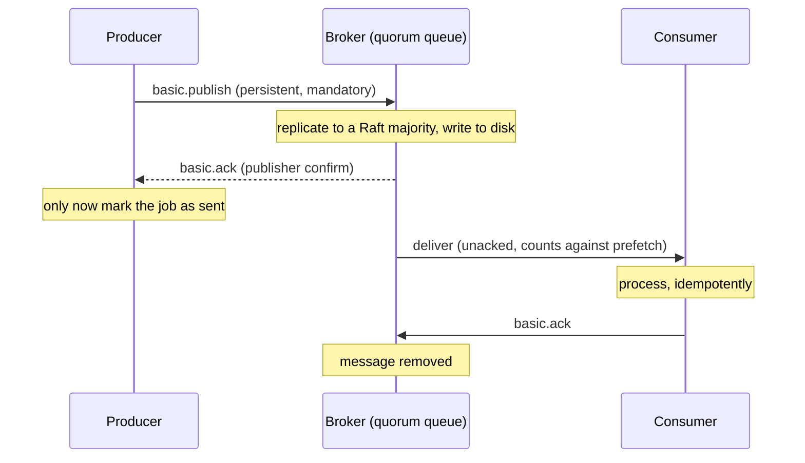

# RabbitMQ and Message Brokers

Kafka is a durable, replayable log built for stream processing. RabbitMQ is a traditional
message broker built for **routing messages to queues and handing each message to one
worker, which acknowledges it**. It is the natural tool for task queues, background jobs,
and flexible routing between services. This chapter explains from zero what a broker does,
then covers RabbitMQ's model (exchanges, bindings, queues, channels), the queue types in
RabbitMQ 4.x (classic, quorum, streams), how to make delivery reliable end to end
(publisher confirms, consumer acks, prefetch), dead-lettering and retries, flow control,
clustering and operations. It closes with how RabbitMQ compares with SQS, Pub/Sub, NATS,
Redis Streams and Kafka.

## Foundations — What is a message broker, and why put one between services?

### The problem

A photo-sharing app must make thumbnails after each upload. Doing it inside the upload
request makes the user wait several seconds, and a spike of uploads overloads the web
servers. Doing it in a background thread loses the work if the server restarts. What you
want is a place to **write down the job durably**, return to the user at once, and let a
pool of worker processes take jobs at their own pace, retrying failures.

That place is a **message broker**: a server that accepts messages from **producers**,
stores them in **queues**, and delivers each one to a **consumer**, keeping it until the
consumer confirms it's done. The broker **decouples** the two sides in time (the worker
can be down for a minute), in rate (a spike becomes a backlog instead of an outage) and
in location (the producer doesn't know which worker, or how many).

### The pieces (AMQP 0-9-1, RabbitMQ's core protocol)

| Piece | What it is | Everyday analogy |
|---|---|---|
| **Producer / publisher** | An app that sends messages | Someone posting letters |
| **Exchange** | Receives every published message and routes copies to queues by rules; stores nothing | The sorting office |
| **Binding** | A rule linking an exchange to a queue, often with a **binding key** or pattern | "Letters for postcode 94xxx go to bin 7" |
| **Routing key** | A string the producer attaches to each message, e.g. `image.resize` | The address on the envelope |
| **Queue** | An ordered buffer that holds messages until a consumer acknowledges them | A pigeonhole |
| **Consumer** | An app that receives messages from a queue and acks them | The person emptying the pigeonhole |
| **Connection / channel** | One TCP connection per app, with many lightweight **channels** multiplexed inside it | A phone line with several conversations |
| **Virtual host (vhost)** | An isolated namespace of exchanges, queues and permissions | Separate post offices in one building |
| **Ack** | The consumer's "done, delete it" | A signature on delivery |

### How they fit

```arch
%% caption: Producers publish to an exchange with a routing key; bindings decide which queues get a copy; each queue's messages go to one of its consumers.
grid 170x100
node p "Upload service" at 1,0 icon=service sub="routing key image.resize"
node ex "Exchange media" at 1,1 icon=sitemap sub="type: topic"
node q1 "Queue thumbnails" at 0,2 icon=queue sub="bound: image.*"
node q2 "Queue audit" at 2,2 icon=queue sub="bound: #"
node w1 "Worker 1" at 0,3 icon=worker
node w2 "Worker 2" at 1,3 icon=worker
node au "Audit consumer" at 2,3 icon=worker
p -> ex : "publish"
ex -> q1
ex -> q2
q1 -> w1
q1 -> w2
q2 -> au
```

A concrete walk-through: the upload service publishes `{"photo_id": 42}` with routing key
`image.resize` to the `media` exchange. The `thumbnails` queue is bound with pattern
`image.*`, the `audit` queue with `#` (everything), so both get a copy. Two workers
consume from `thumbnails`; RabbitMQ gives the message to one of them. When that worker
finishes and acks, the message is deleted from `thumbnails`. The audit copy is independent.

## 1. Exchanges and routing

Producers **never publish directly to a queue**; they publish to an exchange. (Publishing
to the empty-named **default exchange** with routing key `q` delivers to queue `q`, which
looks direct but is still an exchange: a direct exchange every queue is automatically
bound to by its name.)

| Exchange type | Routing rule | Example |
|---|---|---|
| **direct** | Routing key equals binding key exactly | Key `pdf` → queue bound with `pdf` |
| **topic** | Dot-separated words; binding patterns with `*` = **exactly one** word and `#` = **zero or more** words | `logs.*.error` matches `logs.auth.error` but not `logs.auth.db.error`; `logs.#` matches both, and `logs` itself |
| **fanout** | Ignores the key; copies to every bound queue | Broadcast a cache-invalidation event |
| **headers** | Matches message header values (`x-match: all` or `any`) instead of the key | Route on `{format: pdf, region: eu}` |

Other routing features: **alternate exchanges** (where messages that match no binding go,
instead of being dropped), exchange-to-exchange bindings, and the **consistent hash
exchange** plugin (spread messages across queues by a hash of the key to keep per-key
ordering with parallelism).

**Unroutable messages are silently dropped** by default. Publish with the `mandatory`
flag (the broker returns unroutable messages to the producer) or configure an alternate
exchange, so a typo in a binding doesn't lose data.

## 2. Queue types in RabbitMQ 4.x

| Queue type | Replication | Use for | Notes |
|---|---|---|---|
| **Classic** | None (lives on one node) | Transient or low-value work, single-node setups | Classic *mirrored* queues were **removed in RabbitMQ 4.0** (2024); don't use them in new designs |
| **Quorum** | Raft across 3 (or 5) nodes; a majority must confirm each write | The default for anything you can't lose | Survive node failure; built-in poison-message handling (delivery limit, default 20 in 4.x); no non-durable or exclusive mode |
| **Stream** | Raft-replicated append-only log | Replay, large fan-out, very long backlogs | Consumers read by offset without removing messages, Kafka-style; a dedicated binary protocol for throughput |

Declare the type when creating the queue (`x-queue-type: quorum`); it can't be changed
later. RabbitMQ 4.x also speaks **AMQP 1.0** natively (alongside 0-9-1, MQTT and STOMP),
and its internal metadata store is moving from Mnesia to **Khepri**, a Raft-based store,
which makes cluster metadata behave predictably under network partitions.

## 3. Consuming: acks, prefetch and competing consumers

### Acknowledgement modes

- **Automatic ack** (`auto_ack=True`): the broker considers the message delivered the
  moment it writes it to the socket. If the consumer crashes before finishing, **the
  message is lost**. At-most-once; only for data you can afford to drop.
- **Manual ack**: the consumer sends `basic.ack` after the work is done. If the channel
  or connection closes before the ack (crash, network drop), the broker **requeues** the
  message and redelivers it with `redelivered=true`. At-least-once, so handlers must be
  idempotent.
- **Negative ack**: `basic.nack` / `basic.reject` with `requeue=True` puts it back;
  `requeue=False` discards it or, if configured, **dead-letters** it (§5).

RabbitMQ also enforces a **delivery acknowledgement timeout** (`consumer_timeout`,
default 30 minutes): a consumer that holds an unacked message longer has its channel
closed and the message requeued. Long jobs need a higher timeout or a different design
(ack early and track progress elsewhere).

### Competing consumers and prefetch

Several consumers on one queue share its messages round-robin (the competing consumers
pattern), which is how you scale workers horizontally. Without a limit, RabbitMQ pushes
as many messages as the network allows to each consumer, so one consumer can hold
thousands of unacked messages while others idle, and a crash sends all of them back.
**Prefetch** (`basic.qos(prefetch_count=N)`) caps unacked messages per consumer:

| Prefetch | Effect |
|---|---|
| 1 | Fairest dispatch, one message at a time; lowest throughput when round trips dominate |
| 10–100 (typical) | Hides network latency; good for short tasks |
| Unlimited (0) | Maximum throughput, poor fairness, memory risk on the consumer |

A reasonable start is prefetch ≈ (processing concurrency per consumer) × a small factor,
then measure.

```python
# pip install pika   (needs a running RabbitMQ; illustrative worker)
import json
import pika

params = pika.ConnectionParameters(host="rabbitmq", heartbeat=30)
conn = pika.BlockingConnection(params)
ch = conn.channel()

ch.exchange_declare("media", exchange_type="topic", durable=True)
ch.queue_declare("thumbnails", durable=True, arguments={
    "x-queue-type": "quorum",
    "x-dead-letter-exchange": "media.dlx",
    "x-delivery-limit": 5,                  # quorum queues: dead-letter after 5 redeliveries
})
ch.queue_bind("thumbnails", "media", routing_key="image.*")
ch.basic_qos(prefetch_count=10)

def handle(ch, method, props, body):
    job = json.loads(body)
    try:
        make_thumbnail(job["photo_id"])     # idempotent: same photo_id → same output path
        ch.basic_ack(method.delivery_tag)
    except PermanentError:
        ch.basic_reject(method.delivery_tag, requeue=False)   # straight to the DLX
    except Exception:
        ch.basic_nack(method.delivery_tag, requeue=True)      # retry; delivery limit bounds it

ch.basic_consume("thumbnails", on_message_callback=handle)
ch.start_consuming()
```

(`make_thumbnail` and `PermanentError` stand for your code.) Note what's declared:
a durable topic exchange, a quorum queue with a dead-letter exchange and delivery limit,
a binding, and a prefetch. Declarations are idempotent, so every service can declare what
it depends on at startup.

## 4. Reliable publishing: from producer to disk

A message can be lost at three points, and each has its own fix:



| Risk | Fix |
|---|---|
| Producer crashes or the network drops before the broker has the message | **Publisher confirms**: enable confirm mode on the channel; the broker acks (or nacks) each publish once it is safely enqueued (for quorum queues, after a majority has it). Retry on nack or timeout, which means duplicates are possible, so consumers dedupe |
| Message routed nowhere | `mandatory` flag + return handler, or an alternate exchange |
| Broker restarts | **Durable** exchange and queue, **persistent** messages (`delivery_mode=2`); quorum queues always persist |
| Broker node dies | Quorum queues (replicated), not classic |
| Consumer crashes mid-work | Manual acks after the work |
| Database commit and publish disagree | The **transactional outbox**: write the event to an outbox table in the same DB transaction, relay it afterwards ([Messaging and Streaming](../SystemDesign/building_blocks/09_messaging_and_streaming.md)) |

AMQP transactions (`tx.select`) exist but are slow; confirms are the standard mechanism.

## 5. Dead-lettering, TTLs and retries

A queue with `x-dead-letter-exchange` (DLX) republishes a message to that exchange when:

- a consumer rejects/nacks it with `requeue=false`;
- its **TTL** expires (`x-message-ttl` per queue or `expiration` per message);
- the queue exceeds `x-max-length` / `x-max-length-bytes` with `overflow=drop-head`;
- (quorum queues) it has been redelivered more than `x-delivery-limit` times.

The dead-lettered message carries an `x-death` header recording why, from which queue and
how many times. Routing it to a **dead-letter queue (DLQ)** gives you a place to inspect
and replay failures instead of losing them or blocking the queue.

```arch
%% caption: A retry loop built from TTL and dead-lettering; after N attempts the message is parked for a human.
grid 190x120
node pub "Producer" at 0,0 icon=service
node main "orders.work" at 1,0 icon=queue sub="consumers here"
node worker "Worker" at 2,0 icon=worker sub="nack on failure"
node retry "orders.retry.30s" at 1,2 icon=timer sub="TTL 30 s, no consumers"
node dlq "orders.parked" at 2,2 icon=warn sub="after 5 attempts"
pub -> main
main -> worker
worker ..> retry : "transient"
retry ..> main : "TTL → DLX"
worker ..> dlq : "> 5 tries"
```

Retry design:

- **Transient errors** (timeouts, 503s): retry with a delay. Immediate requeue makes a
  tight hot loop against a struggling dependency. Use a TTL'd "wait" queue that
  dead-letters back to the work queue (above), several of them for exponential backoff
  (1 s, 10 s, 60 s), or the community delayed-message exchange plugin.
- **Permanent errors** (invalid payload, a bug): no amount of retrying helps. Reject
  without requeue to the parking DLQ with the error in a header.
- **Count attempts** with the `x-death` header or the quorum queue's delivery limit.
- **Own the DLQ**: alert on its depth and have a replay tool; a DLQ nobody reads is
  just slow data loss.

## 6. Ordering, priorities and message size

- A queue is FIFO, but with **multiple consumers, processing order is not guaranteed**,
  and requeued or redelivered messages come back out of order. For per-key order use a
  single active consumer (`x-single-active-consumer: true`), or the consistent hash
  exchange to shard keys over several queues each with one consumer.
- **Priority queues** (`x-max-priority`, classic queues) deliver higher priority first;
  keep the number of levels small. Quorum queues in 4.x support a simpler two-level
  priority.
- **Keep messages small** (kilobytes). Put large payloads in object storage and send a
  reference (the claim-check pattern).

## 7. Flow control, memory and disk alarms

RabbitMQ protects itself before it runs out of resources:

- **Memory alarm**: when the node's memory use exceeds `vm_memory_high_watermark`
  (default 0.6 of available RAM), it **blocks all publishing connections** cluster-wide
  until memory drops. Consumers keep going.
- **Disk alarm**: when free disk falls below `disk_free_limit`, publishing is blocked
  too.
- **Per-connection credit flow**: a fast publisher is throttled when queues can't keep
  up; its connection shows state `flow`.

In production this shows up as publishers hanging (the client blocks on write) rather
than erroring. Monitor for blocked connections and alarms, and treat a long queue as an
incident: RabbitMQ is designed for queues that are usually near empty. A queue with
millions of messages uses a lot of memory and disk, slows restarts and failovers, and
usually means consumers are down or too slow. Set `x-max-length` with `overflow:
reject-publish` so producers get a nack instead of the broker tipping over, and scale
consumers.

## 8. Clustering, federation and operations

- **Cluster**: several nodes sharing metadata (users, vhosts, exchanges, queue
  definitions). Run an odd number (3 or 5) so quorum queues and the metadata store keep a
  majority. Clients connect through a load balancer or a list of hosts, and reconnect
  and redeclare on failure.
- **Federation** and **Shovel** move messages between separate clusters (across regions
  or data centers) over AMQP, tolerating WAN links, without stretching one cluster over a
  WAN (don't: clusters expect low latency between nodes).
- On Kubernetes use the **RabbitMQ Cluster Operator** (a StatefulSet with persistent
  volumes) or a managed service (Amazon MQ for RabbitMQ, CloudAMQP).

Operations commands and endpoints:

```bash
rabbitmq-diagnostics status                 # node health, memory, alarms
rabbitmq-diagnostics check_port_connectivity
rabbitmqctl list_queues name type messages_ready messages_unacknowledged consumers
rabbitmqctl list_connections name state     # "blocked"/"flow" means backpressure
rabbitmq-queues check_if_node_is_quorum_critical   # before taking a node down
rabbitmq-plugins enable rabbitmq_management rabbitmq_prometheus
# management UI on :15672, Prometheus metrics on :15692/metrics
```

Metrics to alert on: `messages_ready` growing (consumers not keeping up), a high
`messages_unacknowledged` (stuck or slow consumers), zero consumers on a queue that
should have some, DLQ depth, publisher confirms latency, memory/disk alarms, and
connection churn (apps opening a connection per message, a common anti-pattern: open one
long-lived connection per process and a channel per thread).

## 9. RabbitMQ among the alternatives

| | RabbitMQ | Kafka | Amazon SQS | Google Pub/Sub | NATS JetStream | Redis Streams |
|---|---|---|---|---|---|---|
| Model | Broker: exchanges route to queues | Partitioned log | Managed queue | Managed pub/sub topics with subscriptions | Lightweight messaging + persistent streams | Log inside Redis |
| Delivery | Push, per-message ack | Pull, offset commit | Pull, visibility timeout, delete | Push or pull, per-message ack deadline | Push or pull, ack | Pull, consumer groups with XACK |
| Replay | Streams only | Yes | No | Seek to a time/snapshot | Yes | Yes (while retained) |
| Routing | Rich | Topic + key | None (SNS for fan-out) | Topic + filter | Subject wildcards | Stream name |
| Ordering | Per queue (single consumer) | Per partition | FIFO queues per group ID | Per ordering key | Per stream/subject | Per stream |
| Ops | Self-host or managed | Self-host or managed | None | None | Light | Part of Redis |
| Sweet spot | Task queues, routing, RPC, priorities, delayed retries | Event streaming, replay, high throughput | Simple durable queues on AWS | Fan-out on GCP | Edge/IoT, low latency | Small-scale streams where Redis already runs |

**Choose RabbitMQ over Kafka when** you need per-message acks and redelivery for work
items, flexible routing (topic/headers exchanges), priorities, delayed retries and DLQs
out of the box, or many competing consumers on one queue without planning partition
counts. **Choose Kafka when** several independent consumers need the same events, you need
replay or long retention, very high throughput, or stream processing. Many companies run
both. See [Kafka and Event Streaming](04_kafka_and_event_streaming.md).

## Common interview questions

**"How does RabbitMQ route a message?"**
The producer publishes to an exchange with a routing key. The exchange type (direct,
topic, fanout, headers) and the bindings decide which queues get a copy. If nothing
matches, the message is dropped unless `mandatory` or an alternate exchange is set.

**"In a topic exchange, what's the difference between `*` and `#`?"**
`*` matches exactly one dot-separated word; `#` matches zero or more words. `a.*` matches
`a.b` but not `a.b.c`; `a.#` matches `a`, `a.b` and `a.b.c`.

**"How do you make sure no message is lost?"**
Durable exchanges, quorum queues, persistent messages, publisher confirms with retries on
the producer, `mandatory` or an alternate exchange, manual acks after processing on the
consumer, and idempotent handlers because redelivery is possible.

**"What is prefetch and why does it matter?"**
The maximum number of unacked messages delivered to a consumer. Too high: one consumer
hoards work, others idle, and a crash requeues a lot. Too low: throughput suffers from
round trips. It is the fairness and backpressure knob.

**"A poison message keeps crashing the consumer. What do you do?"**
Stop infinite requeue: reject without requeue into a dead-letter exchange after N attempts
(quorum queue delivery limit or `x-death` count), park it in a DLQ with the error, alert on
DLQ depth, fix and replay.

**"How do you implement delayed retries in RabbitMQ?"**
A retry queue with a message TTL and no consumers that dead-letters back to the work queue;
a chain of them for exponential backoff; or the delayed-message exchange plugin.

**"Why is a queue with ten million messages a problem in RabbitMQ?"**
RabbitMQ is optimized for short queues; a huge backlog costs memory and disk, triggers
alarms that block publishers, and slows failover. It signals consumers that are down or too
slow. Use max-length limits with `reject-publish`, scale consumers, or use a stream/Kafka if
a long backlog is the design.

**"Classic mirrored queues vs quorum queues?"**
Mirrored classic queues were removed in RabbitMQ 4.0. Quorum queues replicate with Raft,
need a majority to accept writes, survive node loss without split-brain surprises and
include poison-message handling.

## What Each Engineering Level Should Know

| Level | Industry title | Google ladder | What they should know |
|---|---|---|---|
| Student/Intern | Intern | — | Explain producer, queue, consumer and ack; why a broker decouples services; run a hello-world producer and consumer |
| Junior (L3) | Software Engineer I / New grad | L3 | Declare exchanges, queues and bindings; pick direct/topic/fanout; manual acks and prefetch; idempotent handlers; read the management UI |
| Mid (L4) | Software Engineer II | L4 | Publisher confirms, durable/persistent settings, quorum queues, DLX and TTL-based retries, poison-message handling, connection/channel hygiene, key metrics and alerts |
| Senior (L5) | Senior Software Engineer | L5 | Design end-to-end reliable messaging (confirms + acks + outbox + idempotency), ordering strategies, flow control and backlog limits, capacity planning, choosing RabbitMQ vs Kafka vs a managed queue with reasons |
| Staff+ (L6+) | Staff / Principal Engineer | L6–L7 | Own the messaging platform: multi-cluster topology with federation/shovel, upgrade paths across 3.x → 4.x (mirrored-queue removal, Khepri), standards for retries and DLQ ownership, and when to consolidate on one broker technology |

## Interview checklist

- [ ] I can explain exchanges, bindings, routing keys, queues, channels and vhosts.
- [ ] I can route with direct, topic (`*` vs `#`), fanout and headers exchanges.
- [ ] I know unroutable messages are dropped unless `mandatory` or an alternate exchange is used.
- [ ] I can compare classic, quorum and stream queues, and know mirrored queues are gone in 4.0.
- [ ] I can explain auto vs manual acks, nack/reject with and without requeue, and redelivery.
- [ ] I can explain prefetch and choose a value.
- [ ] I can make publishing reliable with publisher confirms, persistence and quorum queues.
- [ ] I can build delayed retries with TTL + DLX and park poison messages in a DLQ.
- [ ] I can explain why ordering breaks with multiple consumers and how to keep per-key order.
- [ ] I can explain memory/disk alarms and why long queues are dangerous.
- [ ] I can list the metrics and alerts for a RabbitMQ deployment.
- [ ] I can choose between RabbitMQ, Kafka, SQS/Pub/Sub, NATS and Redis Streams.

Related: [Kafka and Event Streaming](04_kafka_and_event_streaming.md),
[Messaging and Streaming](../SystemDesign/building_blocks/09_messaging_and_streaming.md) (visibility timeouts, DLQ
design, idempotency, outbox), [Distributed Log Internals](../SystemDesign/building_blocks/26_distributed_log_internals.md)
(log vs queue comparison), [Observability and Monitoring](06_observability_and_monitoring.md).
