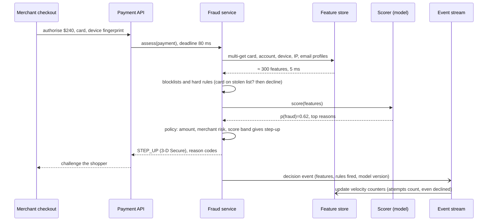

# System Design: Fraud Detection

Search and recommendations can be a little wrong and the user scrolls on. Fraud detection
has to make a decision, usually *before* money moves: approve, decline, ask for more
verification, or send to a human. It must do so in tens of milliseconds, against
adversaries who change tactics when they are blocked, with labels that arrive weeks or
months later, and with a class imbalance where 99.8% of events are legitimate. This
chapter works **real-time payment fraud detection for an online payments platform** as
an ML system design answer: requirements, scale, architecture, rules and models, features,
labels and imbalance, thresholds chosen by cost, evaluation, monitoring, and the
trade-offs and follow-ups interviewers push on. It corrects a few common oversimplifications
along the way, marked **Precision note**.

## Foundations — How does a system catch fraud in real time?

### The problem

A shopper pays $240 for headphones with a card. In the ≈ 100 ms before the payment
platform must answer the merchant, it has to decide whether the person using the card is
the card's owner. If it approves a stolen card, the real owner disputes the charge weeks
later (a **chargeback**), and the merchant or platform loses the money, the goods and a
fee. If it declines a genuine customer (a **false decline**), it loses the sale and often
the customer. Both mistakes cost money, in different amounts.

### The pieces

| Piece | What it does | Example |
|---|---|---|
| **Rules engine** | Hand-written, explainable checks; instant to change | "Block cards on the stolen-card list"; "decline if more than 5 cards tried from one device in 10 min" |
| **ML model** | Scores the probability of fraud from hundreds of features | Gradient-boosted trees over velocity, device, history features |
| **Feature platform** | Real-time counters and profiles (chapter 02) | `card_txn_count_1h`, `device_distinct_cards_24h` |
| **Decision layer** | Turns scores and rules into an action by policy and cost | Approve / step-up (3-D Secure, OTP) / decline / manual review |
| **Asynchronous analysis** | Heavy work that can't fit in 100 ms | Graph analysis linking accounts, devices and cards into fraud rings |
| **Case management** | Human analysts review queued transactions and label them | Review queue, investigation tools |
| **Label pipeline** | Chargebacks, confirmed fraud reports, analyst decisions joined back to transactions | Training data, weeks later |

```arch
%% caption: Synchronous path decides within the payment's deadline; the asynchronous path finds rings and slow signals and feeds them back as lists and features.
grid 150x105
node pay "Payment request" at 1,0 icon=payment sub="card, device, amount"
group sync "Synchronous, ≤ 100 ms" color=blue icon=timer
node feat "Feature fetch" at 0,1 in sync icon=kv sub="velocity, profiles"
node rules "Rules" at 1,1 in sync icon=code sub="lists, hard limits"
node model "Model" at 2,1 in sync icon=model sub="GBDT score"
node dec "Decision" at 1,2 in sync icon=decision sub="approve, step-up, decline"
group async "Asynchronous" color=slate icon=workflow
node graph "Graph analysis" at 0,3 in async icon=graph sub="rings, shared devices"
node stream "Event stream" at 1,3 in async icon=stream sub="every payment"
node review "Case review" at 2,3 in async icon=users sub="analysts label"
pay -> rules
feat -> rules
rules -> model
model -> dec
dec -> stream
stream -> graph
stream -> review : "flagged"
graph ..> feat : "ring scores"
```

### Vocabulary

| Term | Meaning |
|---|---|
| **Chargeback** | The cardholder disputes a charge through their bank; the main fraud label, arriving weeks to months later |
| **False decline** | A legitimate transaction declined; lost revenue and customer trust |
| **Step-up / challenge** | Extra verification such as 3-D Secure or a one-time code; adds friction but shifts liability and stops many fraudsters |
| **Velocity feature** | A count or sum over a recent window: transactions per card in the last hour |
| **Account takeover (ATO)** | A fraudster logs into a real user's account |
| **Card testing** | Many small transactions to find which stolen card numbers work |
| **Fraud ring** | A coordinated group using many accounts, cards and devices |
| **Label maturity** | Time after which a transaction's label can be trusted as final |
| **Precision / recall** | Of declined, how many were fraud; of fraud, how much was caught |

## 1. Clarify requirements

**Problem:** "Design fraud detection for card payments on an online payments platform."

**Functional**

- Score every payment authorisation and return a decision: approve, step-up, decline,
  or approve-and-review.
- Support rules that analysts can add and change within minutes, with shadow mode.
- Explain decisions with reason codes for analysts and merchant support.
- Learn from confirmed fraud, chargebacks and analyst labels.
- Detect coordinated fraud (rings, card testing) across accounts.

**Non-functional**

- Latency: fraud decision within ≈ 50–100 ms p99 of the payment's overall budget (assumed).
- Availability: the payment path must not fail if fraud scoring fails; define a
  fail-open or fail-closed policy per risk tier.
- Consistency: velocity counters must count every attempt, including declined ones,
  quickly (seconds).
- Auditability: every decision reproducible (features, rules, model version).
- Compliance: card data under PCI DSS; personal data under privacy law; decisions
  affecting people may need to be explainable.

**Objective.** Minimise total cost = fraud losses + false-decline losses + review cost +
step-up friction, subject to constraints such as "fraud rate under X basis points" and
"approval rate above Y%". Ask which constraint the business cares about.

## 2. Estimate scale

Assumptions (ours): 300M payments per day, peak 4× average, fraud rate 0.1–0.3% of
transactions, 300 features per decision, 90-day training window.

| Quantity | Arithmetic | Result | So we need |
|---|---|---|---|
| Decision rate | 300M ÷ 86,400 ≈ 3.5k/s, × 4 | ≈ 14k decisions/s peak | Horizontally scaled stateless scorers |
| Feature reads | 14k/s × ≈ 10 entity lookups (card, account, device, IP, email, merchant…) | ≈ 140k reads/s | Low-latency KV store, multi-get per decision |
| Counter updates | Every attempt updates ≈ 20 windowed counters | ≈ 280k updates/s at peak | Stream processor keyed by entity; tiled windows |
| Positives per day | 300M × 0.2% | ≈ 600k fraud labels/day (eventually) | Enough positives; negatives down-sampled |
| Training set | 90 days × 300M | ≈ 2.7×10¹⁰ rows | Keep all positives, sample ≈ 1–5% of negatives, re-weight |
| Decision log | 300M × ≈ 2 KB (features + scores + rules fired) | ≈ 600 GB/day | Required for audit and training (log-and-wait) |

## 3. Architecture and the request path



**Why rules and a model, not one or the other.** Rules encode hard knowledge (sanctions
and stolen-card lists, regulatory limits, merchant-specific policies), react in minutes to
a new attack pattern, and are explainable. Models generalise across hundreds of weak
signals that no human would combine by hand. Rules alone become an unmaintainable tangle
with many false positives; a model alone reacts slowly (it needs labels) and can't express
hard policy. Mature systems run both, with the model's score as an input to the decision
policy.

**Precision note.** A claim you will hear is that "rules catch 80% of fraud". There is no
general number: it depends entirely on the business, the attack mix and how good the
rules are. What is true in general is that rules handle the known, obvious and urgent
cases cheaply, and the model handles the long tail.

### Decisions are a policy, not a threshold

The decision layer maps (score, amount, merchant, customer tier, rules fired) to an
action, for example:

| Score band | Low amount | High amount |
|---|---|---|
| < 0.2 | Approve | Approve |
| 0.2–0.6 | Approve | Step-up |
| 0.6–0.9 | Step-up | Decline or review |
| > 0.9 | Decline | Decline |

Step-up (3-D Secure, one-time codes, biometric confirmation) is a powerful middle option:
genuine customers usually pass with some friction, and many fraudsters cannot.
**Manual review** is reserved for high-value, uncertain cases because analyst time is
expensive and slow.

## 4. Features

Fraud features are mostly about **behaviour over time and links between entities**, far
more than the transaction itself.

| Group | Examples | Freshness |
|---|---|---|
| **Velocity** | Attempts per card / device / IP / email in 1 min, 1 h, 24 h; distinct cards per device; declined attempts in the last hour; sum of amounts in 24 h | Seconds (stream) |
| **Deviation from profile** | Amount vs this customer's typical amount; new merchant category for this card; time of day unusual for the account | Seconds to daily |
| **Device and network** | Device fingerprint age, emulator or automation signals, IP reputation, proxy/VPN/data-centre IP, IP geolocation vs billing country | Request + daily lists |
| **Account** | Account age, time since password or email change, failed logins recently (account takeover signal) | Seconds |
| **Geography and travel** | Distance from the last transaction and the implied speed ("impossible travel") | Request time |
| **Entity links (graph)** | Number of accounts sharing this device, card or address; distance to known fraud in the entity graph; ring membership score | Minutes (async) |
| **Merchant** | Merchant category, merchant's historical fraud rate, new merchant | Daily |

**Velocity must include declined and failed attempts.** Card testing shows up as many
declined small attempts; a counter that only counts approved payments misses it.
**Graph features** come from the asynchronous path: it computes ring scores and shared-
entity counts in minutes and writes them to the online store, so the next transaction
from that ring is caught synchronously.

Point-in-time correctness matters here more than anywhere (chapter 02): a feature like
`account_flagged_as_fraud` is set *after* the fraud is discovered and would leak the label.
Log served features at decision time and train on those.

## 5. Model

- **Gradient-boosted trees** (XGBoost, LightGBM, CatBoost) are the default for tabular
  fraud: strong accuracy, fast CPU inference (well under a millisecond per transaction,
  ≈), robust to feature scales and missing values, and per-decision explanations with
  SHAP values for reason codes.
- **Neural models** help with sequences (the order of a user's events) and learned
  embeddings of merchants and devices; many systems feed their outputs to the GBDT as
  features.
- **Graph neural networks** or graph algorithms (connected components, label propagation
  over shared devices and cards) run asynchronously to score rings.
- **Anomaly detection** (isolation forests, autoencoders) helps for new attack types with
  no labels yet, usually as features or alerts rather than decisions.
- Often there are **separate models by segment** (card-present vs online, new vs existing
  accounts, account takeover vs payment fraud) because the patterns differ.

## 6. Labels and class imbalance

### Labels

| Source | Delay | Quality |
|---|---|---|
| Chargebacks coded as fraud | Weeks to months; card-network dispute windows commonly allow up to ≈ 120 days | Noisy: some "fraud" disputes are friendly fraud (the customer made the purchase), some fraud is never disputed |
| Confirmed fraud reports (issuer alerts, customer reports) | Days | Good |
| Analyst review outcomes | Hours to days | Good, but only for reviewed cases |
| Step-up outcomes | Seconds | A failed challenge is weak evidence; passing is weak evidence of legitimacy |

**Label maturity:** only train and evaluate on transactions old enough that most fraud
would have been reported (e.g. 60–90 days), or model the remaining delay explicitly.
Treating recent unlabelled transactions as legitimate biases the model toward "not fraud".

**Selection bias from your own decisions.** Declined transactions never become
chargebacks, so you never learn whether they were really fraud. A model trained only on
approved transactions sees a biased world, and it gets worse with every retrain. The
standard fix is a small **random holdout**: let a tiny, randomly chosen fraction of
would-be-declined, lower-risk transactions through (or send them to step-up rather than
decline), record the propensity, and use those outcomes for unbiased training and
evaluation. Stripe has described this approach publicly as counterfactual evaluation of
its fraud models.

### Imbalance

**Precision note.** Tutorials often say you *must* use SMOTE (synthetic minority
oversampling) for fraud. In production tabular fraud systems, the more common and
usually more reliable approach is simpler:

- **Down-sample negatives** (keep all fraud, keep a few percent of legitimate
  transactions) for training speed, then **re-weight** or **recalibrate** so scores are
  real probabilities again (the decision policy and dollar costs need calibrated scores).
- Or keep all data and use **class weights** (`scale_pos_weight` in XGBoost).
- Choose the operating point by **cost** (below), not by default 0.5.

SMOTE interpolates between fraud examples in feature space; with high-dimensional,
mixed categorical and count features the synthetic points are often unrealistic, and it
does not address the real problems (label delay, drift, selection bias). Try it only
against a proper baseline.

## 7. Choosing the threshold by cost

Accuracy is useless here: approving everything is 99.8% accurate and catches nothing.
Precision and recall move in opposite directions as the threshold moves, and the right
point depends on what each mistake costs.

```python
# fraud_threshold.py  (stdlib only): pick a decision threshold by expected cost, not accuracy
import random

random.seed(7)
N, FRAUD_RATE = 200_000, 0.002
txns = []
for _ in range(N):
    is_fraud = random.random() < FRAUD_RATE
    amount = random.lognormvariate(3.5, 1.0)                 # median ≈ $33
    # a decent but imperfect model: fraud scores skew high, legit scores skew low
    score = random.betavariate(4, 2) if is_fraud else random.betavariate(1, 6)
    txns.append((score, is_fraud, amount))

FALSE_DECLINE_COST = 0.30   # lost margin + customer friction, as a share of the amount (assumed)
FRAUD_LOSS = 1.00           # chargeback: we lose the full amount (plus fees, ignored here)

always_approve_acc = sum(not f for _, f, _ in txns) / N
print(f"accuracy of 'approve everything': {always_approve_acc:.2%}  (catches 0 fraud)")
print(f"{'threshold':>9} {'precision':>9} {'recall':>7} {'declined':>8} {'cost $':>9}")
best = None
for t in [0.3, 0.4, 0.5, 0.6, 0.7, 0.8, 0.9]:
    tp = fp = fn = 0
    cost = 0.0
    for s, f, amt in txns:
        decline = s >= t
        if decline and f:
            tp += 1
        elif decline and not f:
            fp += 1
            cost += FALSE_DECLINE_COST * amt
        elif f:
            fn += 1
            cost += FRAUD_LOSS * amt
    precision = tp / (tp + fp) if tp + fp else 0.0
    recall = tp / (tp + fn)
    print(f"{t:>9.1f} {precision:>9.2%} {recall:>7.1%} {(tp + fp) / N:>8.2%} {cost:>9,.0f}")
    if best is None or cost < best[1]:
        best = (t, cost)
print(f"lowest expected cost at threshold {best[0]}")
```

Output:

```text
accuracy of 'approve everything': 99.79%  (catches 0 fraud)
threshold precision  recall declined    cost $
      0.3     1.69%   96.4%   12.00%   388,906
      0.4     3.97%   92.4%    4.89%   156,165
      0.5     9.60%   81.7%    1.79%    56,498
      0.6    23.50%   65.2%    0.58%    22,530
      0.7    52.07%   45.0%    0.18%    14,907
      0.8    89.08%   25.2%    0.06%    17,768
      0.9   100.00%    8.1%    0.02%    21,172
lowest expected cost at threshold 0.7
```

With these synthetic scores and assumed costs, the cheapest threshold catches only 45%
of fraud: declining more would insult too many good customers. That is why real systems
add the **step-up** band: transactions between, say, 0.5 and 0.7 get challenged instead of
approved or declined, which recovers much of the remaining fraud at a far lower cost than
declining. In production, costs vary per transaction (amount, merchant margin, customer
lifetime value), so the policy uses expected cost per decision, and thresholds are
revisited as fraud patterns and costs change.

## 8. Evaluation

**Offline**

| Metric | Why |
|---|---|
| **PR-AUC** (average precision) | Summarises precision/recall across thresholds; far more informative than ROC-AUC when positives are 0.2% |
| **Recall at a fixed false-positive rate or decline rate** | Matches the business constraint: "catch as much as possible while declining ≤ 0.5% of good traffic" |
| **Dollar-weighted recall and cost** | A missed $5,000 fraud matters more than a missed $5 one |
| **Calibration** | The policy multiplies probabilities by amounts; scores must be probabilities |
| **Per-segment metrics** | New accounts, countries, merchant categories, payment methods; fraud concentrates |

Always split **by time**: train on months 1–3, test on month 5 (leaving a gap for label
maturity). Random splits leak future fraud patterns into training.

**Online**

- **Shadow mode** first: score live traffic, log what the new model *would* have decided,
  compare with the champion and, weeks later, with labels.
- **Champion/challenger** on a random share of traffic, comparing fraud rate (on mature
  labels), false-decline rate (via random holdout and customer complaints), approval rate
  and step-up rate. Fraud labels are slow, so these experiments run for weeks.
- **Rules in shadow:** every new rule runs in log-only mode first, reporting how many
  transactions it would have hit and how many of those turned out to be fraud.

## 9. Monitoring and adversarial drift

Fraud is **adversarial**: when you block a pattern, fraudsters change it. Drift is
constant, fast and targeted.

- **Decision mix:** approval, step-up, decline and review rates by merchant, country and
  segment. A spike in declines is either an attack or a broken feature; both need a human
  quickly.
- **Score distribution** and **feature drift** (chapter 04) with extra attention to
  top features and to null/default rates: a failing device-fingerprint service silently
  turns into "every device is new".
- **Early labels:** issuer fraud alerts, analyst decisions and step-up failure rates as
  fast proxies while chargebacks mature.
- **Attack detection:** bursts of declined attempts per BIN range or merchant (card
  testing), new clusters in the entity graph, spikes in new accounts from one IP range.
- **Retraining cadence:** frequent (weekly or faster) retraining on the most recent mature
  window, plus rules for immediate response in between.

## 10. Reliability and latency

- **One round trip for features:** multi-get all entity profiles at once; keep hot
  profiles in a local cache with short TTLs.
- **In-process model:** a GBDT runs inside the scoring service; no network hop to a
  model server.
- **Timeouts and fallbacks:** if the feature store is slow, score with available features
  (the model was trained with missing values) and mark the decision degraded; if the model
  is unavailable, fall back to rules only. Decide **fail-open vs fail-closed** per risk
  tier ahead of time: failing closed for all payments is an outage, failing open for all is
  an invitation.
- **Idempotency:** retries of the same authorisation must not double-count velocity
  counters (dedupe by payment ID).
- **Audit:** log features, rules fired, model version and decision for every transaction,
  so any decision can be explained and replayed.

## 11. Trade-offs to state

| Decision | Options | Lean |
|---|---|---|
| Rules vs model | Rules only / model only / both | Both: rules for hard policy and fast response, model for the long tail |
| Decision | Binary threshold / policy with step-up and review bands | Policy with step-up; thresholds by cost per segment |
| Imbalance | SMOTE / class weights / negative down-sampling + recalibration | Down-sample + recalibrate, or class weights |
| Labels | Chargebacks only / plus analyst and issuer signals | Combine, with maturity rules |
| Feedback loop | Train on approved only / random holdout with propensities | Holdout, despite the cost of letting some risk through |
| Graph analysis | Synchronous / asynchronous | Asynchronous, feeding features and lists |
| Failure | Fail open / fail closed | Per risk tier, decided ahead of time |

## 12. Follow-ups the interviewer will ask

1. **"A new attack starts at 2 a.m. The model hasn't seen it."** Rules and lists respond
   in minutes (analysts, or automated rules from velocity anomalies); velocity features
   often catch it generically; retrain once labels exist.
2. **"How do you catch card testing?"** Velocity of attempts and declines per device, IP,
   merchant and card-number range (BIN), small amounts, high decline ratio; rate-limit or
   challenge at the edge.
3. **"How do you explain a decline to a merchant or a regulator?"** Reason codes from the
   rules fired and the top SHAP contributions, logged with the decision; for credit
   decisions, regulations such as adverse-action notice requirements make this mandatory.
4. **"How do you know your false-decline rate?"** You can't observe it directly from
   declines. Use the random holdout, step-up pass rates, customer complaints and retries
   that succeed with another method.
5. **"What about account takeover rather than stolen cards?"** Different signals (login
   behaviour, device changes, password resets followed by payout changes) and often a
   separate model scoring login and account-change events.
6. **"What if the fraud rate is 10× higher on a new market?"** Segment-specific
   thresholds, market as a feature, more step-up, and extra rules until enough labels exist.
7. **"How do you prevent the model from discriminating unfairly?"** Exclude protected
   attributes and review proxies, measure false-decline rates across groups where lawful
   and possible, and keep humans in the loop for high-impact decisions.

## Common interview questions

**Why not use accuracy?**
With 0.2% fraud, approving everything is 99.8% accurate. Use precision, recall, PR-AUC,
recall at a fixed decline rate, and dollar-weighted cost.

**Why do fraud systems use both rules and ML?**
Rules express hard policy and respond in minutes with full explainability; the model
combines hundreds of weak signals for the long tail. Each covers the other's weakness.

**How do you handle label delay?**
Train and evaluate on mature windows, use faster proxy labels (issuer alerts, analyst
decisions) for monitoring, and respond to new attacks with rules until labels arrive.

**What is the selection-bias problem in fraud?**
Declined transactions never get labels, so the model only learns from what it approved.
A small random holdout with logged propensities gives unbiased data.

**How do you handle class imbalance?**
Down-sample negatives and recalibrate, or use class weights; choose the threshold by
cost. SMOTE is rarely the answer for tabular fraud.

**How would you set the threshold?**
Estimate the cost of a false decline and of a missed fraud (amount-dependent), compute
expected cost across thresholds on a mature, time-split validation set, add a step-up
band between approve and decline, and revisit per segment.

**What runs synchronously and what asynchronously?**
Synchronously: feature fetch, lists and rules, the model, the decision policy, all within
the payment deadline. Asynchronously: graph and ring analysis, counter updates, case
review, label joins and retraining.

## What Each Engineering Level Should Know

| Level | Industry title | Google ladder | What they should know |
|---|---|---|---|
| **Student / Intern** | Intern | Intern (pre-L3) | Explains why accuracy fails on imbalanced data and defines precision and recall with a fraud example. |
| **Junior (L3)** | ML Engineer I | L3 | Builds velocity features without leakage; trains a GBDT with class weights on a time-based split; reports PR-AUC and recall at a fixed decline rate. |
| **Mid (L4)** | ML Engineer II | L4 | Owns a fraud model end to end: feature logging, label maturity, recalibration after down-sampling, cost-based thresholds, shadow and champion/challenger rollout, drift monitoring. |
| **Senior (L5)** | Senior ML Engineer | L5 | Designs the system in an interview: sync/async split, rules + model + policy with step-up, features across entities, selection bias and holdouts, adversarial drift, fail-open/closed policy, auditability. |
| **Staff+ (L6+)** | Staff / Principal | L6–L8 | Sets risk strategy with product, finance and compliance: loss vs approval-rate targets, holdout budgets, regulatory explainability, fairness reviews, and the shared risk platform across payments, accounts and payouts. |

## Interview checklist

- [ ] I can explain the costs of fraud losses vs false declines and frame the objective as total cost under constraints.
- [ ] I can estimate decision QPS, feature reads, counter updates and training set size.
- [ ] I can draw the synchronous and asynchronous paths and say what runs where.
- [ ] I can justify rules plus model plus a decision policy with a step-up band.
- [ ] I can list velocity, profile, device, account, geography, graph and merchant features, and why velocity must count declines.
- [ ] I can explain label delay, maturity, friendly fraud and selection bias, and the random-holdout fix.
- [ ] I can handle imbalance without SMOTE-by-default and pick a threshold by expected cost.
- [ ] I can choose offline metrics (PR-AUC, recall at fixed FPR, dollar-weighted) with time-based splits.
- [ ] I can describe monitoring for adversarial drift and the fail-open/fail-closed decision.

Related: [Feature Stores and Data Leakage](02_feature_stores.md) (real-time features, leakage),
[Monitoring and Model Drift](04_model_drift_and_monitoring.md) (delayed labels),
[Payment Ledger](../../interview-core/SystemDesign/solutions/017_payment_ledger_solution.md), [Checkout](../../interview-core/SystemDesign/solutions/008_checkout_solution.md),
[Stream Processing Fundamentals](../../ship-and-run/DataEngineering/04_stream_processing.md), [Module 5 — Graph Databases & GraphRAG: Knowledge Representation & Traversal](../Agentic-AI/05_graph_databases_and_graphrag.md).
