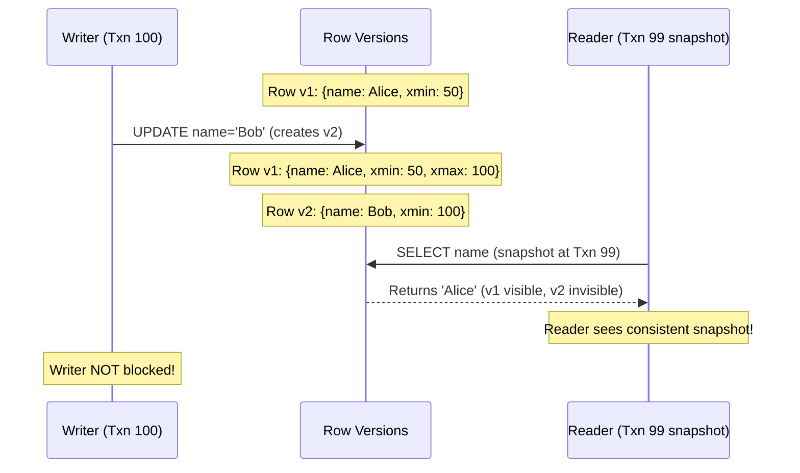
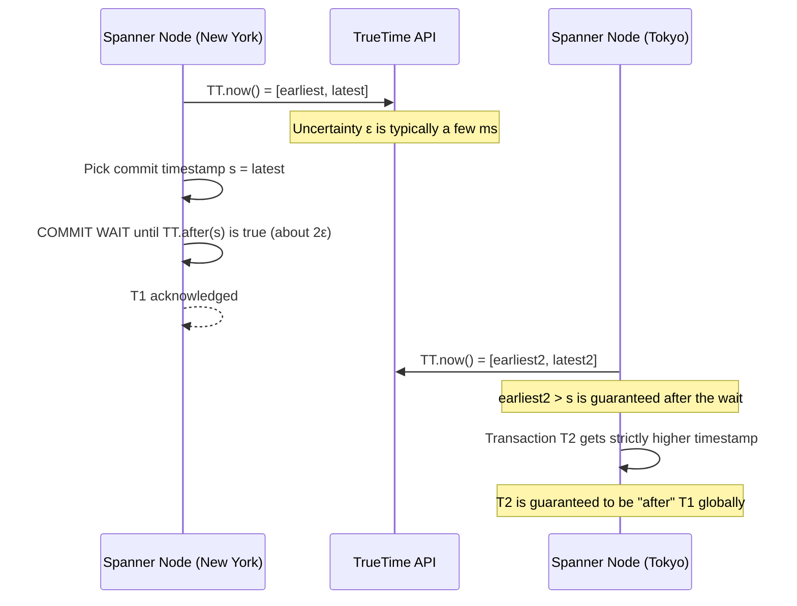

# Database Storage Engines & Advanced Structures

A database's job sounds simple — remember data, give it back correctly, don't lose
it — and almost every interesting detail in this file is a consequence of doing that
*fast*, *concurrently*, and *durably* at the same time. This chapter starts from first
principles — what a database actually is, what its major components are, and how a
query travels through them — then goes as deep as a Senior Software Engineer (L5)
interview loop expects: you must understand how data actually reaches durable storage.
"Indexes make reads fast" is an incomplete statement. You choose between B+ trees and
LSM trees based on your read/write profile, pick an isolation level knowing which
anomalies it allows, explain how distributed databases agree and order events, and
place a real system precisely on the CAP/PACELC map instead of reciting "pick two".
Corrections of common myths are marked **Precision note**. Sections 11–14 then measure the
claims with programs you can run: isolation anomalies in a small MVCC engine, LSM
amplification, what random keys cost a B-tree, and the price of a durable commit. A side-by-side breakdown of
what Junior through Staff+ engineers are expected to know closes out the chapter, just
before the interview checklist.

## Foundations — What Is a Database, and How Does It Work?

### Why Databases Exist

Every program keeps data in memory while it runs, and memory forgets everything when
the process exits or the machine loses power. The first answer was "write it to a
file", and that works for one program writing one file. It stops working the moment
any of these become true — and in a real product all of them are true at once:

- **Many writers at the same time.** Two web requests update the same customer's
  balance. With plain files, one write can overwrite the other, or a reader can see
  half of each.
- **Crashes in the middle of a change.** A transfer debits one account and the power
  fails before it credits the other. The file now holds money that exists nowhere.
- **Finding things quickly.** "All orders for customer 42 in March" should not mean
  reading every order ever placed.
- **Data outliving the code.** The data will be read by programs that don't exist yet,
  written in languages you haven't chosen, for years after the original author left.

A database is the piece of software that solves those four problems once, carefully,
so every application doesn't solve them badly on its own. Every section below is a
more precise version of one of them: **concurrency** (§2 MVCC, §3 isolation),
**crash safety** (the WAL, §9), **fast lookup** (§1 storage engines, §2 indexes, §8
query planning), and **a durable, shared contract** (schemas, §4).

### What a Database Actually Is

A **database management system (DBMS)** is a long-running server process (or, for
SQLite, a library inside your process) that owns a set of files on disk and is the
*only* thing allowed to change them. Clients never touch those files; they send
requests over a connection, and the DBMS decides how to satisfy them safely. Like an
operating system ([Operating Systems & Hardware Symbiosis](01_operating_systems_deep_dive.md)), it does two jobs at once:

1. **Resource manager** — it decides which of many concurrent requests may read or
   change which rows, and in what order, so they don't corrupt each other.
2. **Abstraction layer** — you describe *what* you want (`SELECT name FROM users WHERE
   id = 5`); it decides *how* (which file, which page, which index), and it hides the
   fact that the data is really fixed-size pages on a disk, half of them cached in RAM.

A **relational** database organizes data into **tables** (like a spreadsheet): each
**row** is one record, each **column** one field, and a **primary key** is the column
(or columns) that uniquely identifies a row. A **schema** declares the tables, their
columns and types, and **constraints** (unique, not null, foreign key, check) the
database will enforce on every write, for every client, forever.

### The Core Components of a Database

A database isn't one monolithic blob either. It is a handful of cooperating
subsystems, each responsible for one part of "store it, find it, protect it":

| Component | What it's responsible for | Covered deeper in |
|---|---|---|
| **Connection & protocol layer** | Accepts client connections, authenticates them, parses the wire protocol | `content/data-and-apis/SQL/` (pooling), §8 |
| **Parser & planner (optimizer)** | Turns SQL text into a tree, then picks the cheapest plan: which index, which join order, which join algorithm | §8 |
| **Executor** | Runs the plan: scans, index lookups, joins, sorts, aggregations | §8 |
| **Buffer pool (page cache)** | Keeps hot disk pages in RAM and decides what to evict | §1, §9 |
| **Storage engine & access methods** | Lays data out on disk (heap, B+ tree, LSM) and maintains indexes | §1, §2 |
| **Transaction & concurrency manager** | Snapshots, row locks, MVCC versions, isolation levels, deadlock detection | §2, §3 |
| **Log & recovery manager** | Writes the write-ahead log, checkpoints, replays the log after a crash | §9 |
| **Replication & distribution layer** | Ships changes to replicas, elects leaders, partitions data across machines | §5, §6, §7, §10 |

### How the Pieces Fit Together

Every query crosses the same pipeline. The part that surprises people is that the
**write-ahead log**, not the data files, is what makes a commit durable:

```arch
%% caption: A query is parsed, planned and executed against pages in the buffer pool; a commit is durable once its WAL record is fsynced, and data pages are written back later.
grid 170x105
node client "Client" at 1,0 icon=client sub="SQL over a connection"
group front "Query processing (§8)" color=blue icon=search
node parse "Parser" at 0,1 in front icon=code sub="SQL → syntax tree"
node plan "Planner" at 1,1 in front icon=decision sub="cheapest plan by cost"
node exec "Executor" at 2,1 in front icon=process sub="scans, joins, sorts"
group core "Storage & transactions" color=purple icon=db
node txn "Txn manager" at 0,2 in core icon=lock sub="snapshots, locks (§2–3)"
node buf "Buffer pool" at 1,2 in core icon=memory sub="hot pages in RAM"
node log "WAL writer" at 2,2 in core icon=logs sub="append + fsync (§9)"
group disk "Disk" color=green icon=disk
node data "Data files" at 1,3 in disk icon=storage sub="tables + indexes (§1)"
node wal "WAL segments" at 2,3 in disk icon=file sub="sequential log"
node rep "Replicas" at 3,3 icon=replica sub="stream the WAL (§5)"
client -> parse
parse -> plan -> exec
exec -> txn
exec -> buf
exec -> log
buf -> data : "write back later"
log -> wal : "commit = fsync"
wal ..> rep : "ship"
```

Read it top to bottom for a single `UPDATE`: the planner picks an index; the executor
asks the transaction manager whether it may change the row (a lock, a snapshot check);
it modifies the page **in the buffer pool** (RAM); it appends a WAL record describing
the change; at `COMMIT` the WAL is flushed with `fsync`, and only then does the client
hear "OK". The modified data page is written back to its file minutes later, by a
background checkpoint — if the machine crashes first, recovery replays the WAL.

### Why Indexes, Transactions, Logs, and Replicas All Exist

These four ideas are the connective tissue between the components above and the deep
sections below. Each one is a direct answer to one of the four problems at the top:

- **Indexes exist because full scans don't scale.** Without an index, finding "every
  row where `email = 'x@y.com'`" means reading every row (a **full scan**) — correct,
  but slow on a large table. An **index** is a separate, smaller structure the
  database keeps in sync with the table, sorted so it can jump straight to matching
  rows — exactly like a book's index lets you find a topic without reading every page.
  The cost: every index is updated on every write to the columns it covers, so indexes
  trade write speed and space for read speed. §1 covers *how* an index is built, §2
  how to design one, §8 how the planner decides whether to use it.
- **Transactions exist because multi-step changes must not be seen half-done.** A
  **transaction** groups several reads and writes into one unit with the ACID
  guarantees below.
- **The write-ahead log exists because `write()` is not durable.** Writing to a file
  doesn't mean the data is safe the instant `write()` returns — the OS may still hold
  it in memory (see [Operating Systems & Hardware Symbiosis](01_operating_systems_deep_dive.md) §5's page cache). Before
  changing the data files, the database appends a record of the change to a log and
  forces it to disk, so a crash mid-write can be replayed. Every engine in §1 relies on
  some form of this, and §9 is the full treatment.
- **Replicas exist because one machine fails, and one machine has a ceiling.** Copies
  of the data on other machines survive the loss of one (§5) and can serve reads; but
  as soon as there are copies, they can disagree, which is where consensus (§6) and the
  CAP theorem (§7) come from.

**ACID, in one line each — what "transaction" promises:**

| Letter | Promise | Plain meaning |
|---|---|---|
| **A**tomicity | All-or-nothing | A transaction's writes either all happen or none do — no half-finished update |
| **C**onsistency | Valid state → valid state | Your application's own rules (e.g. "balance ≥ 0") are never violated by a committed transaction |
| **I**solation | Concurrent transactions don't corrupt each other | What one transaction sees isn't broken by others running at the same time — §3 is entirely about *how much* isolation you actually get |
| **D**urability | Once committed, it survives a crash | The change has reached storage that outlives a power loss, not just RAM |

**Precision note:** the "C" in ACID (your invariants hold) and the "C" in CAP
(linearizability: every read sees the latest write, §7) are unrelated ideas that happen
to share a letter. Mixing them up is one of the most common interview slips.

### Database Design Philosophies

Not every database draws its trade-offs in the same place. The big splits:

| Choice | One side | Other side | What you trade |
|---|---|---|---|
| **Workload** | **OLTP** — many small reads/writes of a few rows (orders, accounts) | **OLAP** — few huge scans and aggregations (analytics) | Row stores favour OLTP, column stores (BigQuery, ClickHouse) favour OLAP |
| **On-disk layout** | **Row-oriented** — a row's columns stored together | **Column-oriented** — each column stored together, compressed | Point lookups and updates vs. scanning a few columns of billions of rows |
| **Write path** | **Update in place** (B+ tree, §1) | **Append and merge** (LSM tree, §1) | Read speed vs. write throughput and amplification |
| **Data model** | **Relational** — schema, joins, constraints | **Non-relational** — key-value, document, wide-column, graph (§4) | Enforced invariants and ad-hoc queries vs. simple scaling by key |
| **Distribution** | **Single node** (+ replicas) | **Partitioned and replicated** (Spanner, Cassandra, DynamoDB) | Simplicity and full transactions vs. horizontal scale (§7, §10) |

**Precision note:** "SQL vs. NoSQL" is not a scaling axis by itself. Spanner and
CockroachDB are relational and horizontally scalable; a single MongoDB replica set is
not sharded at all. The real questions are the data model you need and how the data is
partitioned and replicated.

### Vocabulary You'll Meet Below, in One Table

| Term | One-line meaning |
|---|---|
| Page | The fixed-size block (8 KB in Postgres, 16 KB in InnoDB) the engine reads and writes |
| Index | A sorted side structure that finds rows without a full scan |
| Transaction | A group of reads/writes with all-or-nothing, isolated, durable semantics |
| WAL | Write-ahead log: the change is logged durably before the data files change |
| MVCC | Keeping several versions of a row so readers don't block writers |
| Isolation level | How much concurrent transactions can see of each other |
| Replica | Another copy of the data on another machine |
| Partition / shard | A subset of the data (by key range or hash) owned by one group of machines |
| Quorum | A majority (or R/W overlap) of replicas that must agree |
| Consensus | A protocol (Paxos, Raft) for replicas to agree on one ordered log despite failures |
| Linearizable | Behaves like one copy: every read sees the latest completed write |
| Network partition | Some machines can't talk to others; each side keeps running |

With the components, the query path and that vocabulary in place, the rest of this
chapter is the precise, L5-depth version of each piece — how storage engines lay out
bytes, how concurrent transactions stay isolated, how replicas agree, and what that
costs when the network breaks.

## 1. Storage Engines: The Physics of Storage
HDDs pay a mechanical **seek** (milliseconds) for random I/O, so sequential I/O is dramatically faster. **Precision note:** SSDs have no seek, and random reads are fast; the issues with random *writes* on SSDs are erase-block management, garbage collection, and device-level write amplification, which hurt latency consistency and endurance. Sequential, append-oriented write patterns still help on both.

```arch
%% caption: A B+ tree updates fixed-size pages in place and links its leaves for range scans; an LSM tree appends to memory and compacts sorted files on disk.
route straight
grid 190x95
group bt "B+ Tree (read-optimized)" color=blue icon=tree
node r1 "Root page" at 1,0 in bt color=blue
node l1 "Leaf page 1" at 0,1 in bt color=blue
node l2 "Leaf page 2" at 1,1 in bt color=blue
node l3 "Leaf page 3" at 2,1 in bt color=blue
group lsm "LSM Tree (write-optimized)" color=green icon=layers
node w "Write" at 3.1,0 in lsm shape=pill color=slate
node mt "MemTable" at 3.1,1 in lsm color=orange sub="RAM"
node s1 "SSTable L0" at 3.1,2 in lsm color=green sub="disk"
node s2 "SSTable L1" at 3.1,3 in lsm color=green sub="disk"
node s3 "SSTable L2" at 3.1,4 in lsm color=green sub="disk"
r1 -> l1
r1 -> l2
r1 -> l3
l1 <-> l2 : "linked list"
l2 <-> l3 : "linked list"
w -> mt : "append"
mt -> s1 : "flush when full"
s1 -> s2 : "compact"
s2 -> s3 : "compact"
```

<div class="lab" data-viz="lsm-tree"></div>

### B+ Trees (Read-Optimized)
*Used by: PostgreSQL (heap + B-tree indexes), MySQL InnoDB (clustered B+ tree), Oracle, SQL Server.*
*   **The Structure:** A balanced tree of fixed-size pages (8 KB in Postgres, 16 KB in InnoDB). Internal pages hold keys and child pointers; leaf pages hold entries and are linked to their siblings. High fan-out (hundreds of keys per page) keeps height at 3-4 even for billions of rows.
*   **The Read Path:** `O(log N)` page reads, usually mostly cached. Sibling links make range scans (`WHERE age BETWEEN 20 AND 30`) efficient.
*   **The Write Path:** Updates modify pages in place (plus WAL). A full leaf **splits**, updating the parent. Writing a 50-byte change means rewriting at least one whole page (plus the WAL record, and in some engines a full-page image after a checkpoint to protect against torn writes). Random page writes plus fragmentation are the costs.

**Try it: splits, height, and why lookups are cheap.** Insert keys until pages split and the tree gains a level, then search for a key and count the page reads (one per level). With three keys per page the tree gets tall quickly; the note under the lab works out what a real page's fan-out does to the height of a billion-row table.

<div class="lab" data-viz="cs-btree"></div>

### LSM Trees (Log-Structured Merge-Tree)
*Used by: Bigtable, LevelDB, RocksDB, Cassandra, ScyllaDB, HBase.*
*   **The Write Path:** A write is appended to the **WAL** for durability and inserted into an in-memory sorted **MemTable**. When full (e.g., 64 MB), the MemTable is flushed as an immutable sorted file, an **SSTable**. Writes are sequential and fast.
*   **Compaction:** Background merges combine SSTables, drop overwritten values and **tombstones** (deletion markers), and keep the number of files a read must check bounded.
*   **Precision note — write amplification is NOT near zero.** The *ingest* is sequential, but compaction rewrites the same data repeatedly as it moves down levels. Leveled compaction (RocksDB default) commonly shows write amplification around **10-30x**; size-tiered compaction lowers write amplification but raises space and read amplification. The LSM advantage is that this rewriting is sequential, batched, and in the background, so front-end write throughput stays high.
*   **The Read Path:** Check the MemTable, then SSTables newest to oldest. Mitigations: **Bloom filters** per SSTable, block indexes, block cache, and compaction.

### The RUM trade-off
You can optimize at most two of **Read** amplification, **Update/write** amplification, and **Memory/space** amplification.

| Engine | Read amp | Write amp | Space amp | Best for |
|---|---|---|---|---|
| B+ tree | Low | Medium (page rewrites) | Medium (fragmentation, fill factor) | Read-heavy OLTP, range scans |
| LSM, leveled compaction | Medium | High (compaction) | Low | Write-heavy with decent reads |
| LSM, size-tiered | Higher | Lower | High (temporarily 2x during compaction) | Very write-heavy ingest |

## 2. Advanced Data Structures in Databases

### Bloom Filters
How does an LSM tree avoid opening dozens of SSTables for a key that doesn't exist?
*   A bit array plus k hash functions. Insert sets k bits; lookup checks them.
*   **No false negatives:** if any bit is 0, the key is definitely absent.
*   **False positives possible:** all k bits can be set by other keys. With about 10 bits per key and optimal k, the false-positive rate is about 1%.
*   Can't delete (use counting Bloom filters or cuckoo filters if needed).
*   *L5 usage:* one filter per SSTable in memory; "no" skips that file entirely. More probabilistic structures (HyperLogLog, count-min sketch) are in [Specialized Data Structures and Indexes](../SystemDesign/building_blocks/20_specialized_data_structures.md).

### Indexes you should be able to design
*   **Composite index `(a, b, c)`:** usable for predicates on a prefix: `a`, `a,b`, `a,b,c`, and for `ORDER BY` that follows the same order. Not usable for `b` alone.
*   **Covering index:** contains every column a query needs, so the database answers from the index alone (Postgres "index-only scan", InnoDB secondary index including the PK, SQL Server `INCLUDE` columns). Eliminates the extra lookup into the table per row.
*   **Clustered vs secondary:** InnoDB stores rows *in* the primary-key B+ tree; secondary indexes store the PK and require a second lookup. Postgres stores rows in a heap and all indexes point to heap tuples.
*   **Other index types:** hash (equality only), GIN/inverted (full-text, arrays, JSON), GiST/R-tree (geospatial), BRIN (block ranges on naturally ordered data like timestamps).
*   **Cost:** each index is written on every insert/update of indexed columns. Index for real queries; verify with `EXPLAIN ANALYZE`.

### Multi-Version Concurrency Control (MVCC)
How does PostgreSQL let readers and writers proceed concurrently without table locks?


*   An update writes a **new version** of the row stamped with the writing transaction's ID (`xmin`) and marks the old version's `xmax`.
*   A transaction's **snapshot** records which transactions were committed when it started. A version is visible if its creator committed before the snapshot and its deleter didn't.
*   *Benefit:* readers don't block writers and writers don't block readers. **Precision note:** writers still block other writers on the *same row* (row locks), and serializable isolation may abort transactions.
*   *Cost:* dead versions accumulate. PostgreSQL's `VACUUM` reclaims them; long-running transactions prevent cleanup and cause table bloat. InnoDB keeps old versions in undo logs instead.
*   The same idea in miniature: [Snapshot Array](../PyDSA/25_design/012_snapshot_array_solution.py).

<div class="lab" data-viz="flow-mvcc"></div>

## 3. Isolation Levels and the Anomalies They Allow

| Anomaly | What happens |
|---|---|
| Dirty read | Read another transaction's uncommitted write |
| Non-repeatable read | Read the same row twice, get different committed values |
| Phantom | Re-run a range query, new rows appear |
| Lost update | Two read-modify-write cycles; one overwrites the other |
| Write skew | Two transactions read overlapping data, write *different* rows, and together break an invariant (two on-call doctors both go off call) |

| Level | Dirty read | Non-repeatable | Phantom | Lost update | Write skew |
|---|---|---|---|---|---|
| Read uncommitted | possible | possible | possible | possible | possible |
| Read committed (Postgres default) | prevented | possible | possible | possible | possible |
| Repeatable read (MySQL default; Postgres implements as snapshot isolation) | prevented | prevented | possible in SQL standard; prevented by SI snapshots for reads | prevented in Postgres RR (aborts); possible in MySQL RR without locking reads | **possible** |
| Snapshot isolation | prevented | prevented | prevented for reads | prevented (first committer wins) | **possible** |
| Serializable (Postgres SSI, Spanner) | prevented | prevented | prevented | prevented | prevented |

Practical defenses below serializable: atomic conditional updates (`UPDATE ... WHERE available >= :qty`), `SELECT ... FOR UPDATE`, unique/check/exclusion constraints, or optimistic version columns. Details: [Transactions, Isolation, Locking, and Sagas](../SystemDesign/building_blocks/11_transactions_and_concurrency.md).

**Try it: run the anomalies.** Pick an anomaly and an isolation level, then step through the two transactions one statement at a time. Watch what each `SELECT` returns, which versions sit uncommitted in the database panel, and how each level stops the anomaly: by showing only committed data (read committed), by reading one snapshot (repeatable read), by aborting the second writer (first committer wins), or by detecting a dangerous read/write pattern (serializable, SSI). The table at the bottom of the lab is generated by the same engine, so it is the table above, derived instead of memorised.

<div class="lab" data-viz="cs-isolation"></div>

## 4. Choosing a Database Family

| Family | Examples | Data model | Choose when | Watch out for |
|---|---|---|---|---|
| Relational | PostgreSQL, MySQL, Spanner, CockroachDB | Tables, joins, constraints, transactions | Default for business data with invariants | Scaling writes past one node needs sharding or NewSQL |
| Key-value | Redis, DynamoDB, Bigtable-as-KV, etcd | Opaque value by key | Known access by key, very high QPS | No ad-hoc queries |
| Wide-column | Bigtable, Cassandra, HBase | Row key → sparse column families, sorted by key | Massive write-heavy time-series, per-entity histories | Row key design is everything; hot-spotting on sequential keys |
| Document | MongoDB, Firestore | JSON-like documents | Self-contained aggregates, flexible schemas | Cross-document invariants and joins |
| Graph | Neo4j, Spanner Graph | Nodes and edges | Multi-hop relationship queries | Sharding graphs is hard |
| Search | Elasticsearch, OpenSearch | Inverted index | Full-text, faceted search | Not a source of truth |
| Analytical / columnar | BigQuery (Dremel), ClickHouse, Snowflake | Columnar storage | Aggregations over billions of rows | Not for point OLTP writes |
| Time-series | Monarch, Prometheus, InfluxDB | (series, timestamp) → value | Metrics, downsampling, retention | Cardinality explosions |

**Normalization vs denormalization:** normalize the source of truth so each fact lives in one place (no update anomalies); denormalize *derived* read models (materialized views, caches, search indexes) for read speed, and own the process that keeps them in sync.

## 5. Replication Essentials

```arch
%% caption: Three replication topologies: one leader takes every write; several leaders each take writes and must resolve conflicts; or any replica takes writes and clients use quorums.
grid 170x95
group sl "Single leader" color=blue icon=db
node sw "Writes" at 0,0 in sl shape=pill color=slate
node sld "Leader" at 1,0 in sl icon=db
node sf "Followers" at 2,0 in sl icon=replica sub="serve reads, may lag"
group ml "Multi-leader" color=amber icon=region
node mw "Writes" at 0,1.5 in ml shape=pill color=slate
node m1 "Leader EU" at 1,1 in ml icon=db
node m2 "Leader US" at 1,2 in ml icon=db
node mc "Conflict resolution" at 2,1.5 in ml shape=card color=amber sub="LWW, CRDT, merge"
group ll "Leaderless" color=green icon=network
node lw "Client" at 0,4 in ll icon=client sub="write W, read R of N"
node r1 "Replica 1" at 1,3 in ll icon=db
node r2 "Replica 2" at 1,4 in ll icon=db
node r3 "Replica 3" at 1,5 in ll icon=db
sw -> sld
sld ..> sf : "WAL stream"
mw -> m1
mw -> m2
m1 <..> m2 : "async"
m1 ..> mc
m2 ..> mc
lw -> r1
lw -> r2
lw -> r3
```

*   **Single leader:** all writes to the leader, replicated to followers. **Synchronous** replication (wait for followers) gives durability on failover but adds latency and blocks if a follower is down; **asynchronous** is fast but loses the unreplicated tail on failover. Most systems use semi-synchronous or quorum commit.
*   **Replication lag anomalies:** read-your-writes violations, non-monotonic reads (reading from a more-lagged replica after a less-lagged one). Fix with primary reads after writes, replica-position tracking, or sticky replicas.
*   **Multi-leader:** writes in multiple regions; concurrent conflicting writes need resolution (last-write-wins loses data; CRDTs or application merge logic preserve it).
*   **Leaderless (Dynamo-style):** clients write to W of N replicas and read from R; **R + W > N** makes read and write quorums overlap so a read sees the latest acknowledged write (barring sloppy quorums and concurrent writes). Repair via read repair, hinted handoff, and Merkle-tree anti-entropy. See [Consensus and Coordination](../SystemDesign/building_blocks/19_consensus_and_coordination.md).
*   **Failover dangers:** split brain (two leaders), lost async writes, clients caching the old leader. Leases, fencing tokens, and consensus-based leader election prevent split brain.

## 6. Distributed Consensus & Clocks

Replication (§5) gives you copies; consensus is how those copies agree on one order of writes even when some of them fail. The CAP and PACELC framing of *what that agreement costs* when the network breaks is §7.

### Paxos vs. Raft
Both let a cluster agree on a replicated log despite node failures, as long as a **majority** is alive (5 nodes tolerate 2 failures).
*   **Raft (etcd, Consul, CockroachDB, TiKV):** designed for understandability. A leader is elected with randomized election timeouts; the leader appends entries and commits them once a majority acknowledges; terms prevent stale leaders from committing.
*   **Paxos / Multi-Paxos (Chubby, Spanner):** the original. Single-decree Paxos agrees on one value with prepare/accept phases; Multi-Paxos elects a stable leader to skip the prepare phase for a sequence of values. Raft is essentially an opinionated, fully specified Multi-Paxos variant. The difficulty in practice is everything around the core algorithm: membership changes, log compaction, snapshots.
*   **What consensus is not:** it doesn't make your whole system linearizable by magic, and it's too slow to put on every request path. Use it for metadata, leases, configuration, and leader election.

### Spanner and TrueTime
How does Spanner provide **external consistency** (serializable with commit timestamps that respect real-time order) across continents?


*   **The Problem:** Clocks drift. With NTP, uncertainty between servers can be tens to hundreds of milliseconds, so wall-clock timestamps from different machines can't order events safely.
*   **TrueTime:** Google runs time masters in every datacenter backed by **GPS receivers and atomic clocks**. `TT.now()` returns an interval `[earliest, latest]` guaranteed to contain true time. The paper reports the uncertainty bound ε typically between about 1 and 7 ms.
*   **The Commit Wait:** A transaction picks commit timestamp `s ≥ TT.now().latest`, then waits until `TT.now().earliest > s` (about 2ε) before making the commit visible. After that, every machine's clock reading is past `s`, so any later transaction gets a larger timestamp. Snapshot reads at a timestamp are then lock-free and globally consistent.
*   Spanner also uses **two-phase commit over Paxos groups** for multi-shard transactions — each participant is itself a replicated Paxos group, which avoids 2PC's classic "coordinator dies and participants block" problem.

<div class="lab" data-viz="flow-spanner-commit"></div>

### Logical clocks when you don't have TrueTime
*   **Lamport clocks:** a counter incremented on each event and bumped to `max(local, received) + 1` on receive. Gives a total order consistent with causality, but can't detect concurrency.
*   **Vector clocks:** one counter per node; can tell "happened before" from "concurrent" (used for conflict detection in Dynamo-style stores).
*   **Hybrid Logical Clocks (HLC):** physical time plus a logical counter (CockroachDB, YugabyteDB) — close to wall clock, causally correct.

**Try it: happened-before vs. concurrent.** Send messages between three processes, then click two events. The vector clocks decide “before”, “after” or “concurrent”; the Lamport numbers always pick an order, even for events that could not have influenced each other.

<div class="lab" data-viz="sd-clocks"></div>

## 7. The CAP Theorem, Precisely (and PACELC)

§5 and §6 built replicated databases. The moment data lives on more than one machine,
you have to decide what happens when those machines can't talk to each other. CAP is
the name for that decision; it's also the most misquoted theorem in system design, so
this section states it exactly and then places real systems on the map.

### What CAP actually says

Brewer conjectured it in 2000; Gilbert and Lynch proved it in 2002. For a system that
**replicates data** across nodes connected by a network:

| Letter | Precise meaning in the theorem | Not to be confused with |
|---|---|---|
| **C** — Consistency | **Linearizability**: every read returns the value of the most recent completed write, as if there were one copy | ACID's "C" (invariants hold); "eventually the same" |
| **A** — Availability | Every request received by a **non-failing** node gets a non-error response (no time bound) | "99.99% uptime"; "some node answers" |
| **P** — Partition tolerance | The system keeps operating even though the network may drop or delay arbitrarily many messages between nodes | A choice you make — it isn't one |

**The theorem:** if the network partitions, a replicated system cannot be both C and A
at the same time. That's all. Walk through why with three replicas and a cut:

```arch
%% caption: During a partition, a request that lands on the minority side must either be refused (keep C, lose A) or be served from possibly stale data (keep A, lose C).
grid 170x110
group maj "Majority side" color=blue icon=region
node a "Replica A" at 0,1 in maj icon=db sub="has latest write"
node b "Replica B" at 0,2 in maj icon=db sub="has latest write"
node cut "network partition" at 1,1.5 shape=pill color=red
group mino "Minority side" color=amber icon=region
node c "Replica C" at 2,1.5 in mino icon=db sub="can't reach A or B"
node cl "Client" at 2,0 icon=client sub="write or read via C"
node d "Serve it?" at 3,1.5 shape=diamond color=amber
node cp "Refuse: error/timeout" at 3,3 shape=card color=blue sub="CP: stays linearizable"
node ap "Answer locally" at 2,3 shape=card color=green sub="AP: may be stale"
a <-> b : "quorum"
a .. cut
cut .. c
cl -> c
c -> d
d -> cp : "choose C"
d -> ap : "choose A"
```

Replica C cannot know whether A and B accepted a newer write. If it answers a read, it
might return stale data (not linearizable). If it accepts a write, A and B can't see
it, so their readers now see stale data. The only way to stay linearizable is for C
to **refuse** (or hang) until the partition heals — which is exactly "not available".

### "Pick two of three" is the wrong mental model

- **P is not optional.** Networks *do* partition: switch failures, misconfigured
  firewalls, a GC pause long enough to look like a dead node, a cloud zone losing
  connectivity. A distributed system can't "choose CA" and opt out of partitions; it
  only chooses what to do *when* one happens. So the real choice is **CP or AP,
  during a partition.**
- **A single-node database is not "CA".** It has no replicas, so CAP doesn't apply to
  it at all. "Relational = CA, NoSQL = AP" is a myth.
- **The choice is per operation, not per product.** A system can make payments
  linearizable (refuse during a partition) and product-view counters eventually
  consistent (keep answering). Many databases let you choose per request (§5's R/W
  quorums, DynamoDB's `ConsistentRead`, Cassandra's consistency level).
- **Both C and A in the theorem are extreme definitions.** Real systems live in
  between: bounded staleness, read-your-writes, causal consistency. These give up
  linearizability but keep useful guarantees and stay available (see
  [Distributed Systems Theory](../SystemDesign/building_blocks/10_distributed_systems_theory.md) for the full
  consistency ladder).
- **"CP" doesn't mean "down during every partition".** Only the minority side stops
  serving; the majority side keeps going. With 5 replicas spread over 3 zones, losing
  one zone leaves a majority and nobody notices.

### PACELC: the trade-off you pay every day

Partitions are rare; latency is constant. Daniel Abadi's **PACELC** (2010, published
2012) extends CAP: **if** there is a **P**artition, choose **A** or **C**; **E**lse
(normal operation), choose **L**atency or **C**onsistency.

```arch
%% caption: PACELC: CAP only covers the partition branch; in normal operation every replicated system still trades latency against consistency.
route straight
grid 150x120
node q "Partitioned?" at 1.5,0 shape=diamond color=amber
node pa "PA" at 0,1 shape=card color=green sub="serve, maybe stale"
node pc "PC" at 1,1 shape=card color=blue sub="minority refuses"
node el "EL" at 2,1 shape=card color=green sub="nearest replica"
node ec "EC" at 3,1 shape=card color=blue sub="quorum or leader"
q -> pa : "partition"
q -> pc : "yes"
q -> el : "else"
q -> ec : "no"
```

Why "else" costs latency: to be linearizable in normal operation, a read must either go
to the current leader or contact a quorum, and a write must wait for a majority to
acknowledge — across regions, that's tens to hundreds of milliseconds. Answering from
the nearest replica is fast but can be stale. That trade-off exists on every request,
not just during outages, which is why PACELC is usually the more useful framing in a
design interview.

### Where real systems sit

| System | During a partition (P → A or C) | Else (L or C) | Why |
|---|---|---|---|
| **Spanner** | **PC** | **EC** | Paxos groups need a majority; TrueTime + commit wait (§6) makes every read-write transaction externally consistent. Google argues it is "effectively CA" because its private network makes partitions rare enough that availability exceeds five nines — but formally it chooses C (Brewer, *Spanner, TrueTime and the CAP Theorem*, 2017). Stale reads at a past timestamp are an explicit EL option. |
| **DynamoDB** | Mostly **PC per item** for writes (each partition has a leader replica that needs its replication quorum) | **EL by default**, **EC on request** | Default reads are eventually consistent and may hit any replica; `ConsistentRead=true` goes to the leader. Global tables (multi-region) replicate asynchronously with last-writer-wins by default; since 2025 AWS also offers a multi-Region strong consistency mode that trades write latency for linearizable reads. |
| **Cassandra** | **PA** (tunable) | **EL** (tunable) | Leaderless (Dynamo-style). `ONE` reads/writes stay up on any live replica. `QUORUM` + `QUORUM` makes quorums overlap (R + W > N) so reads usually see the latest write, but concurrent writes still resolve by timestamp (last-writer-wins). Lightweight transactions (`IF NOT EXISTS`) run Paxos for true compare-and-set, at several extra round trips. |
| **PostgreSQL, primary + async replicas** | **PC** for writes (only the primary accepts them); a replica cut off keeps serving stale reads (**PA** for reads) | **EL** for replica reads | Async replicas lag. A failover manager (e.g. Patroni with etcd) demotes a primary that loses the consensus lease, so two primaries don't both accept writes; async failover can still lose the last acknowledged transactions. |
| **PostgreSQL, synchronous replication** | **PC** | **EC** (at a latency cost) | `synchronous_commit = remote_apply` makes the primary wait until a standby has applied the commit, so reads on that standby see it. A dead standby blocks commits unless there are enough others. |
| **MongoDB (replica set, `w: majority`)** | **PC** | **EC** with `readConcern: "linearizable"` / **EL** with secondary reads | The primary steps down if it can't see a majority. `w: majority` is the default write concern since 5.0. |
| **etcd, ZooKeeper, Consul** | **PC** | **EC** | Raft/ZAB consensus stores for coordination. **Precision note:** ZooKeeper reads are served by whichever server you're connected to and may be stale unless you call `sync` first; etcd reads are linearizable by default (ReadIndex) and serializable (possibly stale) if you ask. |
| **CockroachDB, YugabyteDB, TiDB** | **PC** | **EC** | Raft per range, serializable (Cockroach) or snapshot/serializable transactions; follower reads are an opt-in EL mode. |

**How to use this in an interview:** don't label the whole product. Say which
*operation* needs linearizability (money movement, unique usernames, inventory
decrements, leader election) and which can tolerate staleness (feeds, counters,
recommendations, search), then pick the store and consistency setting per operation.

### A runnable model: CP vs. AP on one partition

Three replicas, one partition that isolates C, and the same five requests under both
policies. Run it with `python3 cap.py`:

```python
"""Three replicas, one network partition, two policies: CP (majority quorum) vs AP (write locally)."""

class Replica:
    def __init__(self, name):
        self.name, self.value, self.version = name, None, 0


class Cluster:
    def __init__(self, policy):
        self.policy = policy                      # "CP" or "AP"
        self.nodes = {n: Replica(n) for n in "ABC"}
        self.links = {frozenset(p) for p in ("AB", "AC", "BC")}

    def partition(self, side1, side2):            # cut every link that crosses the split
        self.links = {l for l in self.links if not (l & set(side1) and l & set(side2))}

    def heal(self):
        self.links = {frozenset(p) for p in ("AB", "AC", "BC")}
        newest = max(self.nodes.values(), key=lambda r: r.version)
        lost = {r.value for r in self.nodes.values()
                if r.version == newest.version and r.value != newest.value}
        if lost:                                  # AP only: two sides wrote "version 2" concurrently
            print(f"  conflict on heal: kept {newest.value!r}, silently dropped {sorted(lost)}")
        for r in self.nodes.values():             # lagging replicas catch up
            r.value, r.version = newest.value, newest.version

    def reachable(self, n):
        return [m for m in self.nodes if m == n or frozenset((n, m)) in self.links]

    def write(self, via, value):
        peers = self.reachable(via)
        if self.policy == "CP" and len(peers) <= len(self.nodes) // 2:
            return f"write {value!r} via {via}: REFUSED (only {len(peers)}/3 reachable, no majority)"
        version = max(self.nodes[p].version for p in peers) + 1
        for p in peers:                           # CP: a majority has it; AP: whoever we can reach
            self.nodes[p].value, self.nodes[p].version = value, version
        return f"write {value!r} via {via}: OK on {peers}"

    def read(self, via):
        peers = self.reachable(via)
        if self.policy == "CP" and len(peers) <= len(self.nodes) // 2:
            return f"read via {via}: REFUSED (no majority)"
        best = max((self.nodes[p] for p in peers), key=lambda r: r.version)
        return f"read via {via}: {best.value!r}"


for policy in ("CP", "AP"):
    c = Cluster(policy)
    print(f"--- {policy} ---")
    print(c.write("A", "v1"))
    c.partition("AB", "C")                        # C is cut off from A and B
    print(c.write("C", "v2-minority"))            # CP refuses; AP accepts -> divergence
    print(c.write("A", "v2-majority"))
    print(c.read("C"))                            # CP: unavailable; AP: stale / conflicting
    print(c.read("B"))
    c.heal()
    print("after heal:", {n: r.value for n, r in c.nodes.items()})
```

Output (verified with Python 3.11):

```text
--- CP ---
write 'v1' via A: OK on ['A', 'B', 'C']
write 'v2-minority' via C: REFUSED (only 1/3 reachable, no majority)
write 'v2-majority' via A: OK on ['A', 'B']
read via C: REFUSED (no majority)
read via B: 'v2-majority'
after heal: {'A': 'v2-majority', 'B': 'v2-majority', 'C': 'v2-majority'}
--- AP ---
write 'v1' via A: OK on ['A', 'B', 'C']
write 'v2-minority' via C: OK on ['C']
write 'v2-majority' via A: OK on ['A', 'B']
read via C: 'v2-minority'
read via B: 'v2-majority'
  conflict on heal: kept 'v2-majority', silently dropped ['v2-minority']
after heal: {'A': 'v2-majority', 'B': 'v2-majority', 'C': 'v2-majority'}
```

The CP cluster lost availability on one node and nothing else. The AP cluster stayed
up everywhere, served two different answers during the partition, and then **silently
discarded an acknowledged write** when it healed with last-writer-wins. That silent
loss is the real price of AP; CRDTs, version vectors that surface conflicts to the
application, or merge functions are how production AP systems avoid it.

<div class="lab" data-viz="flow-cap-partition"></div>

## 8. Query Processing: From SQL Text to Page Reads

**Why this matters:** "add an index" only helps if the planner decides to use it, and
most slow-query incidents are a planner choosing a plan that was right for different
data. You should be able to read a plan and say why it was chosen.

```arch
%% caption: The planner enumerates candidate plans, estimates each one's cost from table statistics, and hands the cheapest to the executor.
grid 175x100
node sql "SQL text" at 0,0 shape=pill color=slate
node parse "Parse + bind" at 1,0 icon=code sub="names → tables, columns"
node rw "Rewrite" at 2,0 icon=edit sub="views, subquery flattening"
node enum "Enumerate plans" at 2,1 icon=layers sub="access paths, join orders"
node stats "Statistics" at 3,1 icon=metrics sub="row counts, histograms"
node cost "Cost model" at 1,1 icon=sigma sub="est. pages + CPU"
node exec "Executor" at 0,1 icon=process sub="pull rows up the tree"
sql -> parse -> rw -> enum
stats -> enum
enum -> cost : "candidates"
cost -> exec : "cheapest plan"
```

- **Access paths.** For each table the planner considers a sequential scan, an index
  scan (walk the index, fetch each row), an **index-only scan** (the index covers every
  needed column), and in Postgres a **bitmap scan** (collect matching row locations from
  one or more indexes, then read heap pages in physical order).
- **Selectivity decides.** An index scan costs a random page read per matching row; a
  sequential scan reads everything but sequentially. If a predicate matches a large
  fraction of the table (roughly a few percent or more, depending on row width,
  caching and settings), the seq scan wins and the planner ignores your index — that is
  correct behaviour, not a bug.
- **Join algorithms.**

| Algorithm | How it works | Good when | Cost |
|---|---|---|---|
| Nested loop | For each outer row, look up matching inner rows (ideally via index) | Outer side is small and the inner has an index | O(outer × inner lookup) |
| Hash join | Build a hash table on the smaller input, probe with the larger | Equality joins on large unsorted inputs | O(n + m), needs memory for the build side |
| Merge join | Walk two inputs sorted on the join key in lockstep | Both inputs already sorted (index order) or very large | O(n + m) after sorting |

- **Statistics go stale.** Plans come from estimates (`ANALYZE` in Postgres collects
  histograms and most-common values). A bulk load without re-analyzing, or correlated
  columns the planner assumes are independent, produce row-count estimates off by
  orders of magnitude — the classic "fast yesterday, slow today" plan flip.
- **Reading a plan:** `EXPLAIN` shows the chosen plan and estimates; `EXPLAIN
  (ANALYZE, BUFFERS)` in Postgres runs it and shows actual rows, time and pages. The
  first thing to look for is estimated rows vs. actual rows on each node.

### See the planner use (and ignore) an index

SQLite ships with Python, so this runs anywhere with `python3 plan.py`. It shows a full
scan, an index seek, the composite-index prefix rule from §2, and a covering index:

```python
import sqlite3

db = sqlite3.connect(":memory:")
db.execute("CREATE TABLE users (id INTEGER PRIMARY KEY, email TEXT, country TEXT, age INT)")
db.executemany(
    "INSERT INTO users (email, country, age) VALUES (?, ?, ?)",
    ((f"u{i}@example.com", ["DE", "US", "IN", "BR"][i % 4], 18 + i % 60) for i in range(100_000)),
)

def plan(sql):
    rows = db.execute("EXPLAIN QUERY PLAN " + sql).fetchall()
    return " | ".join(r[-1] for r in rows)

q = "SELECT country FROM users WHERE email = 'u42@example.com'"
print("no index:      ", plan(q))                      # SCAN users
db.execute("CREATE INDEX idx_email ON users(email)")
print("with index:    ", plan(q))                      # SEARCH users USING ... INDEX idx_email

db.execute("CREATE INDEX idx_cty_age ON users(country, age)")
print("prefix (a,b):  ", plan("SELECT email FROM users WHERE country='US' AND age > 60"))
print("prefix (a):    ", plan("SELECT email FROM users WHERE country='US'"))
print("not prefix (b):", plan("SELECT email FROM users WHERE age = 30"))
print("covering:      ", plan("SELECT age FROM users WHERE country='US'"))
```

Output (verified with Python 3.11 / SQLite 3.45):

```text
no index:       SCAN users
with index:     SEARCH users USING INDEX idx_email (email=?)
prefix (a,b):   SEARCH users USING INDEX idx_cty_age (country=? AND age>?)
prefix (a):     SEARCH users USING INDEX idx_cty_age (country=?)
not prefix (b): SCAN users
covering:       SEARCH users USING COVERING INDEX idx_cty_age (country=?)
```

`age = 30` alone can't use `(country, age)` because the index is sorted by `country`
first. (SQLite can sometimes "skip-scan" a low-cardinality leading column once
`ANALYZE` has gathered statistics; don't rely on it — design the index for the query.)
The last query needs only `country` and `age`, both in the index, so the table is never
touched.

## 9. Durability and Crash Recovery

**Why this matters:** "committed" must mean "survives a power cut", and every storage
engine in §1 gets there the same way — the write-ahead log.

- **The WAL rule.** A change's log record must reach durable storage *before* the data
  page it describes is written, and a transaction is committed when its commit record is
  durable. Data pages can then be written lazily, in any order, whenever convenient.
- **Why it's fast.** The log is sequential appends; the data pages are random writes.
  Committing costs one sequential `fsync` of a few KB instead of scattering page writes
  across the disk. **Group commit** batches the commit records of many concurrent
  transactions into one `fsync`, so throughput scales past the device's fsync rate.
- **Checkpoints** periodically flush dirty pages and record "everything before log
  position X is in the data files", so recovery only replays from X and old log
  segments can be recycled or archived.
- **Recovery** (the ARIES family, used in various forms by most engines): on restart,
  **redo** — replay the log from the last checkpoint so every logged change is in the
  pages, including those of transactions that were still running; then **undo** — roll
  back changes of transactions that never committed. **Precision note:** Postgres
  needs no undo pass: uncommitted row versions simply stay invisible under MVCC (§2) and
  VACUUM removes them later; InnoDB does run an undo phase from its undo logs.
- **Torn pages.** A crash can leave an 8 KB page half-written if the device writes
  4 KB atomically. Postgres logs a full-page image the first time a page changes after
  each checkpoint (`full_page_writes`); InnoDB writes pages twice via its doublewrite
  buffer.
- **The knobs that trade durability for speed:** Postgres `synchronous_commit = off`
  acknowledges before the WAL is flushed (a crash can lose the last fraction of a
  second of commits, but never corrupts the database); MySQL
  `innodb_flush_log_at_trx_commit = 2` or `0` is similar. `fsync = off` is different
  and dangerous: it can corrupt the database on a crash.

```arch
%% caption: Recovery starts at the last checkpoint, redoes every logged change, then undoes transactions that never committed.
grid 170x100
node ck "Checkpoint" at 0,0 shape=pill color=blue sub="LSN 1000: pages flushed"
node t1 "T1 commits" at 1,0 shape=card color=green sub="commit record fsynced"
node t2 "T2 writes" at 2,0 shape=card color=amber sub="no commit record"
node crash "Crash" at 3,0 shape=pill color=red
node redo "Redo from LSN 1000" at 1,1 icon=sync sub="replay T1 and T2 changes"
node undo "Undo T2" at 2,1 icon=delete sub="loser transaction"
node open "Open for traffic" at 3,1 shape=pill color=green sub="T1 durable, T2 gone"
ck -> t1 -> t2 -> crash
crash -> redo : "restart"
redo -> undo -> open
```

## 10. Partitioning (Sharding): Scaling Past One Machine

Replication (§5) copies the *same* data to more machines; it scales reads and survives
failures, but every replica still stores everything and one leader still takes every
write. **Partitioning** splits the data so each machine owns a subset.

```arch
%% caption: A router maps each key to the partition that owns it; each partition is its own replicated group with its own leader.
grid 170x105
node cl "Client" at 1.5,0 icon=client
node rt "Router" at 1.5,1 icon=gateway sub="key → partition map"
node meta "Metadata" at 3,1 icon=etcd sub="partition map, leases"
group p1 "Partition 1: keys a–h" color=blue icon=layers
node l1 "Leader" at 0,2 in p1 icon=db
node f1 "Followers" at 0,3 in p1 icon=replica
group p2 "Partition 2: keys i–q" color=green icon=layers
node l2 "Leader" at 1.5,2 in p2 icon=db
node f2 "Followers" at 1.5,3 in p2 icon=replica
group p3 "Partition 3: keys r–z" color=purple icon=layers
node l3 "Leader" at 3,2 in p3 icon=db
node f3 "Followers" at 3,3 in p3 icon=replica
cl -> rt
meta ..> rt : "cached map"
rt -> l1
rt -> l2
rt -> l3
l1 ..> f1
l2 ..> f2
l3 ..> f3
```

| Strategy | How keys map to partitions | Strength | Weakness | Used by |
|---|---|---|---|---|
| **Range** | Contiguous key ranges, split when a range grows | Efficient range scans; splits adapt to data | Sequential keys (timestamps, auto-increment IDs) send every write to the last range: a hot spot | Bigtable, HBase, Spanner, CockroachDB |
| **Hash** | `hash(key)` decides the partition | Spreads load evenly | Range scans must hit every partition | DynamoDB, Cassandra (token ring) |
| **Consistent hashing** | Keys and nodes on a hash ring; each key goes to the next node clockwise (usually with virtual nodes) | Adding a node moves only ~1/N of the keys | Uneven without virtual nodes | Dynamo, Cassandra, many caches |
| **Directory / lookup** | A table maps key → partition | Arbitrary placement, easy moves | The directory is a critical dependency | Many hand-sharded MySQL setups, Vitess (via vindexes) |

What goes wrong, and what interviewers probe:

- **Hot keys.** One celebrity, one viral product, one tenant — hashing can't split a
  single key. Fixes: add a random suffix and fan reads out (write sharding), cache the
  hot key, or give big tenants dedicated partitions. See
  [Partitioning, Shard Keys, and Hot Keys](../SystemDesign/building_blocks/25_partitioning_and_hot_keys.md).
- **Secondary indexes.** A **local** (per-partition) index is cheap to write, but a
  query by a non-key column must ask every partition (scatter-gather). A **global**
  index is partitioned by the indexed value, so reads hit one partition but every write
  updates another partition too — usually asynchronously (DynamoDB GSIs are eventually
  consistent) or with a distributed transaction (Spanner).
- **Cross-partition transactions** need 2PC (Spanner, §6) or must be avoided by
  choosing the partition key so that one transaction touches one partition (all of a
  customer's orders under the customer ID).
- **Resharding** is the operational hard part: moving data while serving traffic,
  double-writing or streaming changes, and flipping the router atomically. Systems
  that split ranges automatically (Bigtable, Spanner, CockroachDB) are attractive
  precisely because they hide this.

**Choosing a partition key** is the single most important decision: it should spread
load evenly, keep each common query and each transaction inside one partition, and not
be monotonically increasing if the store partitions by range.

**Try it: rebalancing with consistent hashing.** With `hash(key) mod N`, adding one server moves almost every key. On a hash ring, only the keys between the new server and its neighbour move. Add and remove servers and count the keys that change owner.

<div class="lab" data-viz="sd-ring"></div>

## 11. Isolation Anomalies, Reproduced in Code

§2 and §3 describe MVCC and the anomalies each isolation level allows, and the lab in §3 animates
them. This program builds the engine itself: a multi-version store in about 60 lines, with
read committed, snapshot isolation, and a serializable level implemented as optimistic concurrency
control. Three classic interleavings run against each level. Run it with `python3 mvcc.py`:

```python
"""A multi-version store with three isolation levels, and three classic
anomalies replayed step by step against each.
  read committed      every read sees the latest committed value; commits never conflict
  snapshot isolation  reads come from a snapshot taken at BEGIN; a commit fails if another
                      transaction committed a write to the same key after that snapshot
  serializable (OCC)  snapshot isolation, plus a commit fails if anything it READ was
                      overwritten by a transaction that committed after its snapshot"""


class Abort(Exception):
    pass


class Store:
    def __init__(self, data):
        self.clock = 0
        self.versions = {k: [(0, v)] for k, v in data.items()}   # key -> [(commit ts, value)]

    def latest(self, key, as_of):
        return [v for ts, v in self.versions[key] if ts <= as_of][-1]

    def changed_since(self, key, ts):
        return self.versions[key][-1][0] > ts


class Txn:
    def __init__(self, store, level):
        self.s, self.level = store, level
        self.snap, self.reads, self.writes = store.clock, set(), {}

    def read(self, key):
        if key in self.writes:
            return self.writes[key]
        self.reads.add(key)
        as_of = self.s.clock if self.level == "read committed" else self.snap
        return self.s.latest(key, as_of)

    def write(self, key, value):
        self.writes[key] = value

    def commit(self):
        if self.level != "read committed":
            if any(self.s.changed_since(k, self.snap) for k in self.writes):
                raise Abort("write-write conflict")
            if self.level == "serializable" and any(self.s.changed_since(k, self.snap) for k in self.reads):
                raise Abort("read was overwritten")
        self.s.clock += 1
        for k, v in self.writes.items():
            self.s.versions[k].append((self.s.clock, v))


def run(steps, store, level):
    """Interleave steps of two transactions; an aborted one is retried after the other."""
    txns = {"T1": Txn(store, level), "T2": Txn(store, level)}
    out, aborted = {}, []
    for who, action in steps:
        if who in aborted:
            continue
        try:
            out[who] = action(txns[who], out.get(who))
        except Abort:
            aborted.append(who)
    for who in aborted:                                      # retry from scratch
        t = Txn(store, level)
        state = None
        for w, action in steps:
            if w == who:
                state = action(t, state)
    return aborted


LEVELS = ("read committed", "snapshot", "serializable")


def read_bal(t, _):
    return t.read("bal")

def add(n):
    def step(t, bal):
        t.write("bal", bal + n)
        t.commit()
        return bal
    return step

print("1. Lost update: two transactions each add to a balance of 100 (+10 and +20)")
for level in LEVELS:
    s = Store({"bal": 100})
    aborted = run([("T1", read_bal), ("T2", read_bal), ("T1", add(10)), ("T2", add(20))], s, level)
    print(f"   {level:18} final balance {s.latest('bal', s.clock):4}   retried: {aborted or '-'}")


print("\n2. Read skew: T1 reads two accounts (50 + 50) while T2 moves 30 between them")
for level in LEVELS:
    s = Store({"a": 50, "b": 50})
    seen = {}
    def read_a(t, _):
        seen["a"] = t.read("a")
    def transfer(t, _):
        t.write("a", t.read("a") - 30)
        t.write("b", t.read("b") + 30)
        t.commit()
    def read_b(t, _):
        seen["b"] = t.read("b")
        t.commit()
    run([("T1", read_a), ("T2", transfer), ("T1", read_b)], s, level)
    print(f"   {level:18} T1 saw a + b = {seen['a'] + seen['b']}")


print("\n3. Write skew: Alice and Bob are both on call; each goes off call if someone else is on")
def count_on_call(t, _):
    return t.read("alice") + t.read("bob")

def go_off_call(doctor):
    def step(t, on_call):
        if on_call >= 2:
            t.write(doctor, False)
        t.commit()
        return on_call
    return step

for level in LEVELS:
    s = Store({"alice": True, "bob": True})
    aborted = run([("T1", count_on_call), ("T2", count_on_call),
                   ("T1", go_off_call("alice")), ("T2", go_off_call("bob"))], s, level)
    on = s.latest("alice", s.clock) + s.latest("bob", s.clock)
    print(f"   {level:18} doctors on call afterwards: {on}   retried: {aborted or '-'}")
```

```text
1. Lost update: two transactions each add to a balance of 100 (+10 and +20)
   read committed     final balance  120   retried: -
   snapshot           final balance  130   retried: ['T2']
   serializable       final balance  130   retried: ['T2']

2. Read skew: T1 reads two accounts (50 + 50) while T2 moves 30 between them
   read committed     T1 saw a + b = 130
   snapshot           T1 saw a + b = 100
   serializable       T1 saw a + b = 100

3. Write skew: Alice and Bob are both on call; each goes off call if someone else is on
   read committed     doctors on call afterwards: 0   retried: -
   snapshot           doctors on call afterwards: 0   retried: -
   serializable       doctors on call afterwards: 1   retried: ['T2']
```

- **Lost update.** Under read committed both transactions read 100 and both commit, so the +10 is
  lost. Snapshot isolation's first-committer-wins rule aborts T2 because T1 already committed a
  write to the same key since T2's snapshot; retried, T2 reads 110 and writes 130. This is why
  application code running at snapshot isolation or above must retry aborted transactions, and why
  PostgreSQL returns `could not serialize access due to concurrent update` at `REPEATABLE READ`.
- **Read skew.** Under read committed, T1 read `a` before the transfer and `b` after it, and saw
  money that doesn't exist (130). A snapshot makes both reads come from the same moment. Backups,
  reports and any multi-query read that must add up need at least snapshot isolation.
- **Write skew.** The two transactions write *different* rows, so snapshot isolation sees no
  conflict and both commit: nobody is on call. Only the serializable level catches it, by noticing
  that what T2 *read* (Alice's status) was changed by a transaction that committed after T2's
  snapshot. Real engines do this more precisely: PostgreSQL's serializable snapshot isolation
  tracks read/write dependencies between concurrent transactions and aborts only when they could
  form a cycle, so it aborts less often than this conservative check.

Below serializable, the fixes from §3 all work by turning the hidden read dependency into
something the database can see: `SELECT ... FOR UPDATE` on the rows the decision depends on, a
constraint, or a single atomic conditional `UPDATE`.

## 12. LSM Trees: The Three Amplifications, Measured

§1's RUM trade-off says an LSM tree trades write, read and space amplification against each
other through compaction. This toy LSM tree measures all three under an update-heavy workload
(each key written about four times), with no compaction, lazy compaction and eager compaction.
Run it with `python3 lsm.py`:

```python
"""A toy LSM tree: writes go to a memtable; a full memtable (1,000 keys) is
written out as a sorted run; compaction merges runs. Measures the three
amplifications that decide LSM tuning:
  write amp - entries written to disk per entry inserted
  read amp  - runs a lookup must search
  space amp - entries stored per live key (old versions not yet merged away)"""
import bisect, hashlib, random

MEMTABLE, KEYS, INSERTS = 1_000, 50_000, 200_000


class Bloom:
    def __init__(self, keys, bits_per_key=10, k=7):
        self.m, self.k = len(keys) * bits_per_key, k
        self.bits = bytearray(self.m // 8 + 1)
        for key in keys:
            for h in self._hashes(key):
                self.bits[h // 8] |= 1 << (h % 8)

    def _hashes(self, key):
        d = hashlib.blake2b(str(key).encode(), digest_size=16).digest()
        a, b = int.from_bytes(d[:8], "little"), int.from_bytes(d[8:], "little")
        return [(a + i * b) % self.m for i in range(self.k)]

    def may_contain(self, key):
        return all(self.bits[h // 8] >> (h % 8) & 1 for h in self._hashes(key))


class LSM:
    def __init__(self, fanin):
        self.fanin, self.mem, self.runs, self.written = fanin, {}, [], 0   # runs: newest first

    def put(self, k, v):
        self.mem[k] = v
        if len(self.mem) >= MEMTABLE:
            self._add_run(sorted(self.mem.items()), tier=0)
            self.mem = {}

    def _add_run(self, items, tier):
        self.written += len(items)
        self.runs.insert(0, (tier, [k for k, _ in items], dict(items), Bloom([k for k, _ in items])))
        same = [r for r in self.runs if r[0] == tier]
        if self.fanin and len(same) >= self.fanin:            # size-tiered: merge a full tier
            merged = {}
            for r in reversed(same):                          # oldest first, newer overwrite
                merged.update(r[2])
            self.runs = [r for r in self.runs if r[0] != tier]
            self._add_run(sorted(merged.items()), tier + 1)

    def get(self, k, use_bloom):
        if k in self.mem:
            return self.mem[k], 0
        searched = 0
        for _, keys, data, bloom in self.runs:
            if use_bloom and not bloom.may_contain(k):
                continue
            searched += 1
            i = bisect.bisect_left(keys, k)
            if i < len(keys) and keys[i] == k:
                return data[k], searched
        return None, searched


rng = random.Random(5)
ops = [rng.randrange(KEYS) for _ in range(INSERTS)]          # 50,000 keys, each updated ~4 times
present = rng.sample(range(KEYS), 2_000)
missing = list(range(KEYS, KEYS + 2_000))
print(f"{INSERTS:,} writes over {KEYS:,} keys, memtable {MEMTABLE:,}")
print(f"  {'compaction':22} {'runs':>5} {'write amp':>10} {'space amp':>10} "
      f"{'runs searched: hit':>19} {'miss':>5} {'miss + Bloom':>13}")
for name, fanin in (("none", 0), ("merge every 10 runs", 10), ("merge every 4 runs", 4)):
    t = LSM(fanin)
    for i, k in enumerate(ops):
        t.put(k, i)
    stored = sum(len(r[1]) for r in t.runs)
    hit = sum(t.get(k, False)[1] for k in present) / len(present)
    miss = sum(t.get(k, False)[1] for k in missing) / len(missing)
    miss_b = sum(t.get(k, True)[1] for k in missing) / len(missing)
    print(f"  {name:22} {len(t.runs):5} {t.written / INSERTS:10.2f} {stored / KEYS:10.2f} "
          f"{hit:19.1f} {miss:5.1f} {miss_b:13.2f}")
```

```text
200,000 writes over 50,000 keys, memtable 1,000
  compaction              runs  write amp  space amp  runs searched: hit  miss  miss + Bloom
  none                     198       0.99       3.96                50.2 198.0          1.60
  merge every 10 runs       18       2.07       2.67                11.5  18.0          0.15
  merge every 4 runs         6       3.31       2.30                 4.1   6.0          0.06
```

- **No compaction** writes each entry once (the cheapest possible ingest) but leaves 198 runs:
  a lookup for a key that exists searches 50 of them on average, one for a missing key searches all
  198, and the store holds four versions of every key.
- **Compaction buys reads and space with writes.** Merging every 4 runs rewrites each entry about
  3.3 times, and in exchange a hit searches about 4 runs and old versions are mostly gone. Real
  leveled compaction, which also keeps each level to a single sorted run, pushes the write cost
  higher (the 10–30× in §1) for even better reads and space.
- **Bloom filters make misses almost free.** With a 10-bits-per-key filter per run, a lookup for a
  missing key searches about 1.6 of the 198 runs without compaction (each filter wrongly answers
  "maybe" about 0.8% of the time), and almost none with compaction. That is why every LSM engine
  keeps Bloom filters in memory: many real lookups are for keys that don't exist ("does this user
  already have a row?", uniqueness checks).

The numbers above leave out the write-ahead log, which adds one more write of every entry, and
count entries rather than bytes; the shape of the trade-off is what carries over.

## 13. B-Tree Keys and Write Amplification, Measured

A B-tree's write cost depends on where new keys land. This program inserts the same 300,000 rows
into SQLite with three kinds of primary key and counts the bytes SQLite actually writes. Run it
with `python3 btree_keys.py` (Linux, because it reads `/proc/self/io`):

```python
"""Insert 300,000 rows (16-byte key, 100-byte value) into a B-tree keyed by the
primary key, 1,000 rows per transaction, with a 4 MB page cache. Count the
bytes SQLite actually writes (from /proc/self/io) per byte of row data.
  sequential  - an auto-increment style key: every insert goes to the rightmost page
  UUIDv7-like - 48-bit millisecond timestamp, then random bits: nearly sequential
  UUIDv4      - fully random: inserts land on any page in the tree"""
import os, sqlite3, struct, tempfile, time, uuid

ROWS, BATCH = 300_000, 1_000


def written():
    return int(next(l for l in open("/proc/self/io") if l.startswith("wchar")).split()[1])


def keys(kind):
    t0 = 1_790_000_000_000
    for i in range(ROWS):
        if kind == "sequential":
            yield struct.pack(">QQ", 0, i)
        elif kind == "UUIDv7-like":
            yield struct.pack(">Q", (t0 + i // 20) << 16) [:6] + os.urandom(10)
        else:
            yield uuid.uuid4().bytes


print(f"  {'key':12} {'bytes written per byte inserted':>32} {'rows/s':>9} {'tree pages':>11}")
for kind in ("sequential", "UUIDv7-like", "UUIDv4"):
    path = os.path.join(tempfile.mkdtemp(), "t.db")
    db = sqlite3.connect(path, isolation_level=None)
    db.execute("PRAGMA journal_mode=WAL")
    db.execute("PRAGMA cache_size=-4000")                     # 4 MB of page cache
    db.execute("CREATE TABLE t (k BLOB PRIMARY KEY, v BLOB) WITHOUT ROWID")
    value = os.urandom(100)
    before, t = written(), time.perf_counter()
    batch = []
    for k in keys(kind):
        batch.append((k, value))
        if len(batch) == BATCH:
            db.execute("BEGIN")
            db.executemany("INSERT INTO t VALUES (?, ?)", batch)
            db.execute("COMMIT")
            batch.clear()
    db.execute("PRAGMA wal_checkpoint(TRUNCATE)")
    secs = time.perf_counter() - t
    amp = (written() - before) / (ROWS * 116)
    pages = db.execute("PRAGMA page_count").fetchone()[0]
    print(f"  {kind:12} {amp:32.1f} {ROWS / secs:9,.0f} {pages:11,}")
```

```text
  key           bytes written per byte inserted    rows/s  tree pages
  sequential                                2.8   194,543      10,359
  UUIDv7-like                               2.8   143,330      10,359
  UUIDv4                                   88.4    22,248      10,265
```

With sequential or time-ordered keys, every insert goes to the rightmost leaf pages, which stay in
cache and are written once when full: under 3 bytes written per byte of data, counting the WAL and
the checkpoint. With random UUIDv4 keys, each batch of 1,000 inserts touches about 1,000 different
leaf pages scattered across the tree, and each dirty page is written whole (4 KB) to save a
116-byte row: about 30 times more writing, and several times fewer inserts per second. The table is
the same size either way; the cost is entirely in how often pages are rewritten, and it grows with
the table as the tree outgrows the cache.

This is the reason behind a common design rule: **prefer time-ordered IDs for B-tree primary
keys** (auto-increment, UUIDv7, ULID, Snowflake-style IDs). In InnoDB the effect is even larger,
because the table itself is clustered on the primary key and every secondary index stores it.
Random keys still have a place: they don't reveal creation order or volume, and in a range-sharded
distributed database, sequential keys send every insert to the same shard (a hot key range,
[Partitioning, Shard Keys, and Hot Keys](../SystemDesign/building_blocks/25_partitioning_and_hot_keys.md)). Spanner, for example, recommends
against monotonically increasing keys for exactly that reason. The choice depends on whether the
bottleneck is one B-tree's pages or one shard's traffic.

## 14. The Price of a Durable Commit, Measured

§9 says a commit is durable once its log record is flushed with `fsync`, and that group commit
amortises that flush. This program measures it: rows per second in SQLite with 1 to 1,000 rows per
transaction, with `synchronous=FULL` (every commit waits for the disk) and `synchronous=OFF` (the
database doesn't wait, so a machine crash can lose recent commits). Run it with `python3 commits.py`:

```python
"""Durable commits cost an fsync each. Insert rows into SQLite (WAL mode) with
different numbers of rows per transaction, with synchronous=FULL (every
commit waits for the disk) and with synchronous=OFF (commits return before
the data is safe: fast, and lost if the machine crashes)."""
import os, sqlite3, tempfile, time


def rows_per_s(per_txn, sync, total_s=1.5):
    path = os.path.join(tempfile.mkdtemp(), "c.db")
    db = sqlite3.connect(path, isolation_level=None)
    db.execute("PRAGMA journal_mode=WAL")
    db.execute(f"PRAGMA synchronous={sync}")
    db.execute("CREATE TABLE t (id INTEGER PRIMARY KEY, v TEXT)")
    n, t0 = 0, time.perf_counter()
    while time.perf_counter() - t0 < total_s:
        db.execute("BEGIN")
        db.executemany("INSERT INTO t (v) VALUES (?)", [("x" * 100,)] * per_txn)
        db.execute("COMMIT")
        n += per_txn
    return n / (time.perf_counter() - t0), (time.perf_counter() - t0) / (n / per_txn)


print(f"  {'rows per commit':>15} {'FULL rows/s':>12} {'per commit':>11} {'OFF rows/s':>11}")
for per in (1, 10, 100, 1000):
    full, per_commit = rows_per_s(per, "FULL")
    off, _ = rows_per_s(per, "OFF")
    print(f"  {per:15,} {full:12,.0f} {per_commit * 1000:8.2f} ms {off:11,.0f}")
```

```text
  rows per commit  FULL rows/s  per commit  OFF rows/s
                1        4,113     0.24 ms      83,865
               10       35,599     0.28 ms     342,478
              100      210,455     0.48 ms     563,790
            1,000      413,809     2.42 ms     631,750
```

- **One row per commit is limited by the flush, not by the database.** Each commit costs about the
  same fraction of a millisecond whether it carries 1 row or 100, so the rows-per-second rate grows
  almost in proportion to the batch until the actual work of inserting dominates. The disk under this
  run flushes in about 0.25 ms. A cloud network disk can take a millisecond or more, and a consumer
  SSD without power-loss protection can be slower still, so the gap is often much larger.
- **Turning durability off is fast because it skips exactly this wait.** It is a legitimate choice
  for data you can rebuild (a cache, a bulk load you'd restart), never for anything a user was told
  is saved.
- **Batch at every level.** Databases batch concurrent transactions into one flush (group commit),
  so a server with many clients gets the benefit automatically. A single client loading data should
  batch rows into transactions itself; message consumers commit offsets per batch for the same
  reason; and Kafka producers batch records before a replicated write.

## What Each Engineering Level Should Know

Not everyone reading this file needs every sentence of it cold. This table maps this
chapter's material onto a standard industry ladder *and* the Google-style ladder this
repo's interview content is written against, side by side. The mapping between
company-specific titles and levels is approximate and varies by company, but the
*depth of understanding* described in each row is a reliable signal regardless of
which company uses which label. Use it as a syllabus (read down a column) or as a
self-assessment (find the cell that matches where a real interview would place you).

| Topic in this chapter | Junior / New Grad (Google L3) | Mid-Level (Google L4) | Senior (Google L5) | Staff+ (Google L6–L7) |
|---|---|---|---|---|
| **Components & ACID** (Foundations) | Defines table, row, primary key, index, transaction; states ACID in plain words | Explains the query path (planner, buffer pool, WAL) and why a commit waits for the log | Separates ACID's C from CAP's C, and explains why `write()` alone isn't durable | Chooses between row/column, OLTP/OLAP, and relational/non-relational stores for a whole platform, with migration costs |
| **Storage engines** (§1) | Knows indexes speed up reads and slow down writes | Knows B+ trees and that LSM trees exist for write-heavy loads | Compares B+ and LSM with real write amplification, compaction strategies and Bloom filters | Picks an engine and compaction policy from a workload's measured read/write/space profile and SSD endurance |
| **Indexes & query planning** (§2, §8) | Adds an index for a slow `WHERE` clause | Designs composite and covering indexes; reads `EXPLAIN` | Explains why the planner ignores an index (selectivity, stale stats), and picks join algorithms | Sets indexing and statistics policy across services; catches plan-flip risks in design review |
| **Concurrency & isolation** (§2–§3) | Knows transactions can conflict | Knows the isolation levels and dirty/non-repeatable reads | Explains MVCC, write skew under snapshot isolation, and the right fix below serializable | Decides where an organisation needs serializable, and where application-level invariants are cheaper |
| **Durability & recovery** (§9) | Knows databases keep a log | Knows commits are durable because of the WAL | Explains redo/undo, checkpoints, group commit, torn pages, and the `synchronous_commit` trade-off | Designs backup, point-in-time recovery and RPO/RTO for a fleet, and proves restores work |
| **Replication, consensus & CAP** (§5–§7) | Knows replicas are copies | Knows sync vs. async replication and read-after-write problems | States CAP precisely, uses PACELC, places Spanner/DynamoDB/Cassandra/Postgres correctly, explains Raft and TrueTime | Chooses consistency per operation across a product, and plans multi-region topology and failover |
| **Partitioning** (§10) | Knows big data is split across machines | Knows range vs. hash partitioning | Chooses a partition key, handles hot keys, local vs. global secondary indexes | Plans resharding and cross-partition transaction strategy for a system growing 100× |
| **Measured behaviour** (§11–§14) | Knows transactions can be retried and commits hit the disk | Reproduces lost update and read skew, and batches writes into transactions | Implements MVCC isolation levels in miniature, explains write skew and the abort-and-retry contract, quantifies LSM amplification, key-order write amplification and fsync cost | Sets key-format, batching, durability and compaction policy for a fleet from measurements like these |

**Reading this table as a study plan:** if you're aiming at a Senior/L5 bar, your
target is the whole "Senior" column, which the numbered sections (1–14) deliver in
full. The Foundations section alone takes you to roughly the "Mid-Level" column. The
"Staff+" column is judgment that mostly comes from operating real systems at scale;
this file gives you the vocabulary to have that conversation, not a substitute for
having had it.

## Interview checklist

- [ ] I can name a database's components (planner, executor, buffer pool, storage engine, transaction manager, log/recovery, replication) and trace one `UPDATE` through them.
- [ ] I can compare B+ trees and LSM trees including compaction's real write amplification.
- [ ] I can design a composite and a covering index for a given query, and explain why the planner might still choose a sequential scan.
- [ ] I can name the three join algorithms and when each wins.
- [ ] I can name the isolation anomalies and which level allows write skew.
- [ ] I can explain the WAL rule, group commit, checkpoints, and redo/undo recovery.
- [ ] I can pick a database family for five systems and defend each against an alternative.
- [ ] I can explain R + W > N, replication lag anomalies, and split brain.
- [ ] I can explain Raft's leader election and commit rule, and TrueTime's commit wait.
- [ ] I can state CAP precisely (C = linearizability, choice only during a partition), explain why "CA" isn't a real option, and use PACELC.
- [ ] I can place Spanner, DynamoDB, Cassandra and Postgres-with-replicas on the PACELC map and justify each.
- [ ] I can choose a partition key, and explain hot keys and local vs. global secondary indexes.
- [ ] I can implement read committed, snapshot isolation and optimistic serializable validation in a small MVCC store, and show lost update, read skew and write skew.
- [ ] I can explain why applications must retry aborted transactions at snapshot isolation and above.
- [ ] I can measure or estimate an LSM tree's write, read and space amplification, and explain what Bloom filters save.
- [ ] I can explain why random UUIDv4 primary keys cost far more B-tree writes than time-ordered keys, and when random keys are still right.
- [ ] I can explain the cost of a durable commit and how batching and group commit amortise it.

Related: [Databases: Source of Truth](../SystemDesign/building_blocks/05_databases.md), [Database Internals: How They Actually Work](../SystemDesign/building_blocks/06_database_internals.md), [Distributed Systems Theory](../SystemDesign/building_blocks/10_distributed_systems_theory.md), [Transactions, Isolation, Locking, and Sagas](../SystemDesign/building_blocks/11_transactions_and_concurrency.md), [Consensus and Coordination](../SystemDesign/building_blocks/19_consensus_and_coordination.md), [The Papers Behind Google-Scale Systems](../SystemDesign/building_blocks/24_google_papers.md), [Partitioning, Shard Keys, and Hot Keys](../SystemDesign/building_blocks/25_partitioning_and_hot_keys.md); hands-on labs in `content/data-and-apis/SQL/` and `content/data-and-apis/NoSQL/`.
