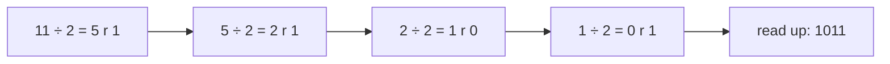

# Number Systems — Binary, Hex, Two's Complement and Floating Point

Every value in a computer — a count, a colour, a letter, a price, a pixel — is stored
as a row of bits. This chapter explains how: positional number systems, converting
between binary, decimal and hexadecimal, how negative numbers are stored (two's
complement) and why integers overflow, the bit tricks interviewers love, and how
floating-point numbers work — including why `0.1 + 0.2 != 0.3` and what to do about
it. It is the chapter that turns "weird computer bugs" into predictable arithmetic.

**Where this fits:** Part 1 · The language of maths, chapter 2 of 15. **Builds on:** nothing beyond school arithmetic and basic Python, so this is a fine first chapter. **Used again in:** 07, 13. **Next in order:** [03 Logic and proofs](03_logic_and_proofs.md).

## Where You Will Use This

| Situation | What you need from this chapter |
|---|---|
| Reading hex dumps, colours (`#FF8800`), memory addresses, hashes | Hex ↔ binary by nibbles |
| Integer overflow bugs, `abs(INT_MIN)`, the Year 2038 problem | Two's complement ranges and wrap-around |
| Bitmask DP, permissions flags, Bloom filters, compact sets | Bitwise operators and tricks |
| Money, measurements, ML numerics | Floating-point representation, rounding error, safe comparison |
| Networking and file formats | Bytes, endianness |

## Foundations — Counting With Places

### What a digit's position means

Look at 347. You read it as "three hundred and forty-seven" without thinking, but the
digits only mean that because of where they sit: 3 is in the hundreds place, 4 in the
tens, 7 in the ones.

$$
347 = 3 \cdot 10^2 + 4 \cdot 10^1 + 7 \cdot 10^0
$$

That is **positional notation**: each place is worth the **base** (here 10) times the
place to its right. Nothing forces the base to be 10 — we use ten digits because we
have ten fingers.

> **Analogy:** A car's odometer. Each wheel shows 0–9; when the rightmost wheel passes
> 9 it rolls back to 0 and nudges its neighbour forward by one. Now imagine an
> odometer whose wheels only have **0 and 1**: it counts 000, 001, 010, 011, 100, …
> That is binary. Every wheel is worth twice the one to its right.

### Why computers use base 2

A wire either carries a high voltage or it does not; a transistor is on or off; a
magnetic region points one way or the other. Two states are cheap to build and easy
to tell apart even with noise, so hardware stores **bits** (binary digits). Everything
else is conventions for grouping and interpreting bits:

| Unit | Bits | Distinct values |
|---|---|---|
| bit | 1 | 2 |
| nibble | 4 | 16 (one hex digit) |
| byte | 8 | 256 |
| 32-bit word | 32 | 4,294,967,296 (≈ 4.3 billion) |
| 64-bit word | 64 | ≈ 1.8 × 10¹⁹ |

> **Key idea:** n bits can represent exactly $2^n$ different patterns. What those
> patterns *mean* — an unsigned number, a signed number, a float, a character, a
> pixel — is a separate decision made by the program. The same byte `0xFF` is 255, −1,
> or the letter ÿ depending on how you read it.

## 1 · Converting Between Bases

### Any base to decimal: multiply out the places

$$
1011_2 = 1 \cdot 2^3 + 0 \cdot 2^2 + 1 \cdot 2^1 + 1 \cdot 2^0 = 8 + 0 + 2 + 1 = 11
$$

The subscript names the base. The code is the same loop for every base (this is
**Horner's method**: multiply the running value by the base, add the next digit):

```python
def to_decimal(digits: str, base: int) -> int:
    value = 0
    for d in digits:
        value = value * base + int(d, 36)   # int(d, 36) reads 0-9 and a-z as 0-35
    return value

print(to_decimal("1011", 2))    # → 11
print(to_decimal("ff", 16))     # → 255
print(to_decimal("777", 8))     # → 511
print(int("1011", 2), int("ff", 16))   # → 11 255
```

### Decimal to any base: repeated division

Divide by the base; the remainder is the last digit. Repeat with the quotient.



```python
def from_decimal(n: int, base: int) -> str:
    if n == 0:
        return "0"
    digits = "0123456789abcdefghijklmnopqrstuvwxyz"
    out = []
    while n > 0:
        n, r = divmod(n, base)
        out.append(digits[r])
    return "".join(reversed(out))

print(from_decimal(11, 2))      # → 1011
print(from_decimal(255, 16))    # → ff
print(bin(11), hex(255), oct(8))   # → 0b1011 0xff 0o10
print(f"{11:08b}")              # → 00001011
```

> **Notebook example:** Convert 156 to binary.
>
> **What you need:** binary is base 2: each place is worth twice the place to its right
> (1, 2, 4, 8, 16, 32, 64, 128, …), and each digit (a **bit**) is 0 or 1. To convert,
> use **repeated division**: divide by 2 and write down the **remainder** (what is left
> over, always 0 or 1). That remainder is the next bit, starting from the right-hand
> end. Then divide the **quotient** (the whole-number answer) by 2 again, and stop when
> the quotient reaches 0.
>
> **Plan:** divide by 2 again and again, writing down each remainder, then read the
> remainders from the last one back to the first.
>
> 1. **Divide 156 by 2.** $156 \div 2 = 78$ remainder **0**.
>    *Why:* the remainder says whether the number is odd, which is exactly the last bit.
> 2. **Divide the quotient, 78, by 2.** $78 \div 2 = 39$ remainder **0**.
>    *Why:* halving shifts every bit one place to the right, so the next bit is now last.
> 3. **Keep dividing each new quotient by 2.**
>    - $39 \div 2 = 19$ remainder **1**
>    - $19 \div 2 = 9$ remainder **1**
>    - $9 \div 2 = 4$ remainder **1**
>    - $4 \div 2 = 2$ remainder **0**
>    - $2 \div 2 = 1$ remainder **0**
>    - $1 \div 2 = 0$ remainder **1**
> 4. **Stop at quotient 0.** The last division gave quotient 0, so there are no more bits.
> 5. **Read the remainders from last to first.** Last remainder first:
>    1, 0, 0, 1, 1, 1, 0, 0. So $156 = 10011100_2$.
>    *Why:* the first remainder was the rightmost bit, so it must be written last.
>
> **Answer:** $156 = 10011100_2$ (the small 2 means "in base 2"). It fits in exactly one
> byte.
>
> **Check:** add up the place values under the 1s. The places are 128, 64, 32, 16, 8, 4,
> 2, 1, and the 1s sit under 128, 16, 8 and 4: $128 + 16 = 144$, $144 + 8 = 152$,
> $152 + 4 = 156$. ✓ Python's `bin(156)` prints `0b10011100`.

> **Your turn:** Convert 45 to binary.
>
> <details>
> <summary>Show the worked answer</summary>
>
> 1. **Divide 45 by 2.** $45 \div 2 = 22$ remainder 1.
> 2. **Divide the quotient, 22, by 2.** $22 \div 2 = 11$ remainder 0.
> 3. **Keep dividing each new quotient by 2.** $11 \div 2 = 5$ r 1, $5 \div 2 = 2$ r 1,
>    $2 \div 2 = 1$ r 0, $1 \div 2 = 0$ r 1.
> 4. **Read the remainders from last to first.** 1, 0, 1, 1, 0, 1.
>
> **Answer:** $45 = 101101_2$. Check: $32 + 8 + 4 + 1 = 45$. ✓
>
> </details>

> **Notebook example:** Convert $10011100_2$ (which is 156) to hex, then check by
> converting back to decimal.
>
> **What you need:** hex is base 16. Its digits are 0–9 and then A = 10, B = 11, C = 12,
> D = 13, E = 14, F = 15. Because $16 = 2^4$, one hex digit is exactly four bits (a
> **nibble**), and inside a nibble the places are worth 8, 4, 2, 1. In a two-digit hex
> number the left digit is worth 16 each and the right digit 1 each. Programmers write
> `0x` in front to say "this is hex".
>
> **Plan:** cut the bits into groups of four, turn each group into one hex digit, then
> multiply out to check.
>
> 1. **Group the bits in fours from the right.** `1001 1100`.
>    *Why:* starting from the right means any shortfall lands on the left, where extra
>    zeros change nothing.
> 2. **Translate the left group.** `1001` has 1s under 8 and 1: $8 + 1 = 9$. Hex digit 9.
> 3. **Translate the right group.** `1100` has 1s under 8 and 4: $8 + 4 = 12$. Hex digit C.
> 4. **Write the hex number.** $\text{0x9C}$.
> 5. **Convert back: multiply the left digit.** $9 \cdot 16 = 144$.
> 6. **Add the right digit.** $144 + 12 = 156$.
>
> **Answer:** $156 = \text{0x9C}$. A byte is always exactly two hex digits, which is why
> hex dumps are written in pairs.
>
> **Check:** step 6 landed back on 156, the number we started from. ✓ Python's
> `hex(156)` prints `0x9c`.

> **Your turn:** Convert $101101_2$ (which is 45) to hex, and check by converting back.
>
> <details>
> <summary>Show the worked answer</summary>
>
> 1. **Group the bits in fours from the right.** `10 1101`. The left group is short, so
>    pad it with zeros: `0010 1101`.
> 2. **Translate the left group.** `0010` is 2.
> 3. **Translate the right group.** `1101` is $8 + 4 + 1 = 13$, hex digit D.
> 4. **Write the hex number.** $\text{0x2D}$.
> 5. **Convert back.** $2 \cdot 16 = 32$, and $32 + 13 = 45$. ✓
>
> **Answer:** $45 = \text{0x2D}$.
>
> </details>

### Binary ↔ hex: group bits in fours

Because $16 = 2^4$, every hex digit is exactly four bits. No arithmetic needed — just
regroup:

```
binary   1101 0110 1111 0001
hex         D    6    F    1      →  0xD6F1
```

| Hex | 0 | 1 | 2 | 3 | 4 | 5 | 6 | 7 | 8 | 9 | A | B | C | D | E | F |
|---|---|---|---|---|---|---|---|---|---|---|---|---|---|---|---|---|
| Binary | 0000 | 0001 | 0010 | 0011 | 0100 | 0101 | 0110 | 0111 | 1000 | 1001 | 1010 | 1011 | 1100 | 1101 | 1110 | 1111 |

That is why programmers use hex: it is binary, compressed 4:1, and a byte is always
exactly two hex digits. A colour `#FF8800` is three bytes: red 255, green 136, blue 0.

> **In practice:** Octal (base 8, groups of three bits) survives in Unix file
> permissions: `chmod 754` is `111 101 100` = rwx for the owner, r-x for the group,
> r-- for others.

## 2 · Unsigned Integers and Their Limits

With n bits the unsigned values run from 0 to $2^n - 1$ (all ones). Adding one to all
ones carries out of the top bit and **wraps around to 0** — the arithmetic is really
**modulo $2^n$** (chapter 07 is all about modular arithmetic).

```python
MASK8 = 0xFF                       # keep only 8 bits, like a uint8 register
print((255 + 1) & MASK8)           # → 0
print((0 - 1) & MASK8)             # → 255
print(2**32 - 1)                   # → 4294967295
```

> **Watch out:** In C, `for (unsigned i = n - 1; i >= 0; i--)` never ends: an unsigned
> value is always ≥ 0, and 0 − 1 wraps to the maximum. Python hides this because its
> integers are arbitrary precision — they grow new digits instead of wrapping. That is
> convenient, and it also means Python will never show you the bug your C, Java or Go
> service has.

> **Notebook example:** An 8-bit unsigned register holds 200. Add 100. What does it hold?
>
> **What you need:** an 8-bit **unsigned** register (unsigned means "no negative
> numbers") has 8 places worth 128, 64, 32, 16, 8, 4, 2, 1, so it holds 0 to 255. If a
> result needs a 9th bit (worth 256), that bit simply falls off the top and is lost.
> This is called **wrap-around**, and it is the same as keeping the remainder after
> dividing by 256, written $\bmod 256$.
>
> **Plan:** add normally, write the true sum in binary, drop everything above 8 bits,
> then read what is left.
>
> 1. **Add as ordinary numbers.** $200 + 100 = 300$.
> 2. **Compare with the limit.** The largest 8-bit value is 255, and $300 > 255$, so the
>    sum does not fit.
> 3. **Split 300 into powers of two.** $300 = 256 + 44$, and $44 = 32 + 8 + 4$. So
>    $300 = 256 + 32 + 8 + 4$.
> 4. **Write 300 in binary.** Put 1s under 256, 32, 8 and 4: $1\,0010\,1100$. That is
>    **9** bits.
> 5. **Drop the 9th bit.** Keep the low 8 bits: $0010\,1100$.
>    *Why:* the register only has 8 places; the carry out of the top has nowhere to go.
> 6. **Read what is left.** $32 + 8 + 4 = 44$.
>
> **Answer:** 44. The register silently wrapped around. No error was raised; the 256 just
> vanished.
>
> **Check:** with mod arithmetic, $300 \bmod 256 = 300 - 256 = 44$. ✓ In Python,
> `(200 + 100) & 0xFF` gives 44 (the mask `0xFF` keeps only the low 8 bits).

> **Your turn:** The same 8-bit register holds 250. Add 10. What does it hold?
>
> <details>
> <summary>Show the worked answer</summary>
>
> 1. **Add as ordinary numbers.** $250 + 10 = 260$.
> 2. **Compare with the limit.** $260 > 255$, so it does not fit.
> 3. **Split 260 into powers of two.** $260 = 256 + 4$.
> 4. **Write 260 in binary.** $1\,0000\,0100$ (9 bits).
> 5. **Drop the 9th bit.** $0000\,0100$.
> 6. **Read what is left.** 4.
>
> **Answer:** 4. Check: $260 - 256 = 4$. ✓
>
> </details>

### KB or KiB?

Storage vendors count in powers of 10 ($1\,\text{KB} = 1000$ bytes); memory and
operating systems usually count in powers of 2 ($1\,\text{KiB} = 1024$ bytes).
$2^{10} = 1024 \approx 10^3$ is the handiest approximation in systems work: $2^{20}$ ≈
a million, $2^{30}$ ≈ a billion, $2^{40}$ ≈ a trillion.

## 3 · Negative Numbers: Two's Complement

### The problem

We need negative numbers, but a bit pattern has no minus sign. Three schemes have been
tried:

| Scheme | −3 in 4 bits | Problem |
|---|---|---|
| Sign-magnitude (first bit = sign) | `1011` | Two zeros (`0000` and `1000`); addition needs special cases |
| Ones' complement (flip all bits) | `1100` | Still two zeros |
| **Two's complement** | `1101` | None — every modern CPU uses it |

### The one idea behind two's complement

> **Key idea:** In n-bit two's complement, the top bit is worth $-2^{n-1}$ instead of
> $+2^{n-1}$. Everything else is ordinary binary.

For 8 bits the places are worth −128, 64, 32, 16, 8, 4, 2, 1. So:

- `0111 1111` = 64 + 32 + 16 + 8 + 4 + 2 + 1 = **127** (the largest)
- `1000 0000` = **−128** (the smallest)
- `1111 1111` = −128 + 127 = **−1**
- The range is −128 … 127: one more negative than positive.

**To negate a number: flip every bit, then add one.** Why? $x + \tilde{x}$ (x plus its
bit-flip) is all ones, which is −1. So $\tilde{x} + 1 = -x$.

```python
def as_signed8(bits: int) -> int:
    """Read the low 8 bits of `bits` as a two's-complement number."""
    bits &= 0xFF
    return bits - 256 if bits & 0x80 else bits

def negate8(x: int) -> int:
    return (~x + 1) & 0xFF

print(as_signed8(0b01111111))       # → 127
print(as_signed8(0b10000000))       # → -128
print(as_signed8(0b11111111))       # → -1
print(as_signed8(negate8(5)))       # → -5
print(as_signed8(negate8(0x80)))    # → -128
```

The last line is the famous edge case: **−(−128) = −128**. The most negative number has
no positive partner, so negating it overflows back to itself. That is why `abs(INT_MIN)`
is still negative in C and Java, and `Math.abs(Integer.MIN_VALUE) < 0` is `true`.

> **Intuition:** Two's complement is a clock. Put 0…255 around a circle; call the
> right half (128…255) the negative numbers −128…−1. Adding 1 always moves one step
> clockwise — for signed and unsigned numbers alike. That is the real reason CPUs use
> it: **one adder circuit** handles both, and subtraction is addition of the negation.

**Try it: flip bits and break arithmetic.** Click bits to build numbers and switch
between the unsigned and signed readings of the same pattern. Then press **127** and
**+1** in signed mode (overflow to −128), **255** and **+1** in unsigned mode (wrap to 0),
and **negate** on `1000 0000`. Watch the number line: overflow is just walking off one
end and reappearing at the other.

<div class="lab" data-viz="math-bits"></div>

> **Notebook example:** Write $-37$ as an 8-bit two's-complement number.
>
> **What you need:** in 8-bit **two's complement** the places are worth −128, 64, 32,
> 16, 8, 4, 2, 1: ordinary binary, except the top bit counts as **minus** 128. The recipe
> to turn x into −x is: write x in binary, **flip** every bit (0 becomes 1, 1 becomes 0),
> then **add one**.
>
> **Plan:** write 37 in 8 bits, flip, add one, then check by adding up the place values.
>
> 1. **Split 37 into powers of two.** $37 = 32 + 4 + 1$.
> 2. **Write the 8 bits.** Put 1s under 32, 4 and 1: $0010\,0101$.
> 3. **Flip every bit.** $0010\,0101$ becomes $1101\,1010$.
> 4. **Add one.** The last bit is 0, so adding 1 just turns it into 1, with no carry:
>    $1101\,1011$.
>    *Why:* x plus its flipped version is all ones, which is −1. So flipped + 1 = −x.
> 5. **Check with place values.** The top bit is worth −128. The other 1s sit under 64,
>    16, 8, 2 and 1: $64 + 16 + 8 + 2 + 1 = 91$. Then $-128 + 91 = -37$. ✓
>
> **Answer:** $-37 = 1101\,1011$ in 8-bit two's complement (that is $\text{0xDB}$).
>
> **Check:** Python's `format(-37 & 0xFF, '08b')` prints `11011011`. ✓ Read as unsigned,
> that pattern is 219, and $219 - 256 = -37$.

> **Your turn:** Write $-6$ as an 8-bit two's-complement number.
>
> <details>
> <summary>Show the worked answer</summary>
>
> 1. **Split 6 into powers of two.** $6 = 4 + 2$.
> 2. **Write the 8 bits.** $0000\,0110$.
> 3. **Flip every bit.** $1111\,1001$.
> 4. **Add one.** The last bit is 1, so it carries: $\ldots 01 + 1 = \ldots 10$. Result
>    $1111\,1010$.
> 5. **Check with place values.** $64 + 32 + 16 + 8 + 2 = 122$, and $-128 + 122 = -6$. ✓
>
> **Answer:** $-6 = 1111\,1010$.
>
> </details>

> **Notebook example:** Using $-37 = 1101\,1011$ from above, compute $50 + (-37)$ with an
> ordinary (unsigned) adder.
>
> **What you need:** the CPU's adder does not know about signs. It sees a bit pattern
> as an ordinary unsigned number (places 128, 64, …, 1), adds, and throws away any 9th
> bit, exactly like the wrap-around above. Two's complement is designed so that this
> still gives the right signed answer.
>
> **Plan:** read both patterns the way the adder does, add, drop the 9th bit, then read
> the result as a signed number.
>
> 1. **Write 50 in binary.** $50 = 32 + 16 + 2$, so $0011\,0010$.
> 2. **Read −37's pattern as unsigned.** $1101\,1011$ has 1s under 128, 64, 16, 8, 2, 1:
>    $128 + 64 + 16 + 8 + 2 + 1 = 219$.
>    *Why:* this is the number the adder actually sees.
> 3. **Add.** $50 + 219 = 269$.
> 4. **Drop the 9th bit.** $269$ is $1\,0000\,1101$ in binary. Dropping the 256 leaves
>    $269 - 256 = 13$, which is $0000\,1101$.
> 5. **Read the result as signed.** The top bit is 0, so the −128 place is not used and
>    the value is just $8 + 4 + 1 = 13$.
>
> **Answer:** $50 + (-37) = 13$, computed by the same adder that adds unsigned numbers. No
> subtraction circuit was needed.
>
> **Check:** $50 - 37 = 13$. ✓ In Python, `(50 + (-37 & 0xFF)) & 0xFF` gives 13.

> **Your turn:** Using $-6 = 1111\,1010$, compute $10 + (-6)$ the way the adder does.
>
> <details>
> <summary>Show the worked answer</summary>
>
> 1. **Write 10 in binary.** $10 = 8 + 2$, so $0000\,1010$.
> 2. **Read −6's pattern as unsigned.** $1111\,1010 = 128 + 64 + 32 + 16 + 8 + 2 = 250$.
> 3. **Add.** $10 + 250 = 260$.
> 4. **Drop the 9th bit.** $260 - 256 = 4$, which is $0000\,0100$.
> 5. **Read the result as signed.** Top bit 0, so it is 4.
>
> **Answer:** 4, which is $10 - 6$. ✓
>
> </details>

### Overflow is not hypothetical

**The binary search bug.** For years Java's standard library computed a midpoint as
`mid = (low + high) / 2`. With arrays over a billion elements, `low + high` exceeds
$2^{31} - 1$, wraps negative, and the index is garbage. It was found in 2006, roughly
two decades after the algorithm was published as proven correct. The fix is
`low + (high - low) / 2`.

```python
def wrap32(x: int) -> int:           # emulate Java's 32-bit int
    x &= 0xFFFFFFFF
    return x - 2**32 if x >= 2**31 else x

low, high = 1_500_000_000, 2_000_000_000
print(wrap32(low + high) // 2)           # → -397483648
print(low + (high - low) // 2)           # → 1750000000
```

**The Year 2038 problem.** Unix time counts seconds since 1970-01-01 UTC. Stored in a
signed 32-bit integer, it runs out at $2^{31} - 1$ seconds:

```python
from datetime import datetime, timezone
print(datetime.fromtimestamp(2**31 - 1, tz=timezone.utc))   # → 2038-01-19 03:14:07+00:00
print(datetime.fromtimestamp(-2**31, tz=timezone.utc))      # → 1901-12-13 20:45:52+00:00
```

One second later, a 32-bit clock wraps to December 1901. Modern systems use 64-bit
time, which lasts about 292 billion years.

## 4 · Bitwise Operations and the Tricks Built on Them

| Operator | Name | Rule per bit | Typical use |
|---|---|---|---|
| `a & b` | AND | 1 if both are 1 | keep only some bits (a **mask**), test a bit |
| `a \| b` | OR | 1 if either is 1 | set bits |
| `a ^ b` | XOR | 1 if they differ | toggle bits, find differences |
| `~a` | NOT | flip | invert a mask |
| `a << k` | shift left | move up k places | multiply by $2^k$ |
| `a >> k` | shift right | move down k places | floor-divide by $2^k$ |

The standard moves on bit `k` of `x`:

```python
x = 0b1010_0000
k = 5
print(bool(x & (1 << k)))      # → True
print(bin(x | (1 << 0)))       # → 0b10100001
print(bin(x & ~(1 << 7)))      # → 0b100000
print(bin(x ^ (1 << 7)))       # → 0b100000
```

### Tricks worth knowing (and why they work)

**Clear the lowest set bit: `x & (x - 1)`.** Subtracting 1 flips the lowest 1 to 0 and
every 0 below it to 1; AND-ing with the original kills exactly that lowest 1.

```
x       = 1011 0100
x - 1   = 1011 0011
x & x-1 = 1011 0000
```

So `x & (x - 1) == 0` tests "x is a power of two" (exactly one bit set), and repeating
it counts the set bits in as many steps as there are 1s (**Kernighan's popcount**).

**Isolate the lowest set bit: `x & -x`.** In two's complement, $-x = \tilde{x} + 1$,
which agrees with x only at the lowest 1 bit. Fenwick trees (binary indexed trees)
are built on this one expression.

**XOR cancels pairs.** $a \oplus a = 0$ and $a \oplus 0 = a$, and XOR is commutative
and associative — so XOR-ing a list in which every value appears twice except one
leaves just that one, in O(1) memory.

```python
def is_power_of_two(x): return x > 0 and x & (x - 1) == 0
def popcount(x):
    c = 0
    while x:
        x &= x - 1
        c += 1
    return c
def lowest_bit(x): return x & -x

print([n for n in range(1, 70) if is_power_of_two(n)])   # → [1, 2, 4, 8, 16, 32, 64]
print(popcount(0b1011_0100), bin(0b1011_0100).count("1"))   # → 4 4
print(lowest_bit(0b1011_0100))                           # → 4

from functools import reduce
from operator import xor
print(reduce(xor, [4, 1, 2, 1, 2]))                      # → 4
```

> **Notebook example:** Let $x = 44$. Work out `x & (x - 1)`, then repeat it to count
> the set bits of 44 (Kernighan's way).
>
> **What you need:** a **set bit** is a bit that is 1. `&` (AND) compares two numbers
> place by place: the result has a 1 only where **both** have a 1. The trick
> `x & (x - 1)` removes the lowest 1 of x. Repeating it until x reaches 0, and counting
> the rounds, counts the 1s (this is **Kernighan's popcount**).
>
> **Plan:** do one round slowly in binary, then repeat until nothing is left, counting
> rounds.
>
> 1. **Write x in binary.** $44 = 32 + 8 + 4$, so $0010\,1100$.
> 2. **Subtract one.** $43 = 32 + 8 + 2 + 1$, so $0010\,1011$.
>    *Why:* compare the two. The lowest 1 (worth 4) turned into 0, and the 0s below it
>    turned into 1s. Everything above stayed the same.
> 3. **AND them place by place.** $0010\,1100$ & $0010\,1011$ keeps only the places
>    where both have 1: the 32 and the 8. Result $0010\,1000 = 40$.
>    *Why:* the 4 is gone, because x has 1 there but $x - 1$ has 0.
> 4. **Repeat on 40.** $40 = 0010\,1000$ and $39 = 0010\,0111$. They share only the 32,
>    so $40$ & $39 = 32$.
> 5. **Repeat on 32.** $32 = 0010\,0000$ and $31 = 0001\,1111$. They share nothing, so
>    $32$ & $31 = 0$.
> 6. **Count the rounds.** $44 \to 40 \to 32 \to 0$ took 3 rounds.
>
> **Answer:** `44 & 43` is 40 (the lowest 1 removed), and 44 has **3** set bits. The
> loop runs once per 1 bit, not once per bit position.
>
> **Check:** count the 1s in $0010\,1100$ by eye: three. ✓ Python's `bin(44).count("1")`
> is 3.

> **Your turn:** Let $x = 12$. Work out `x & (x - 1)` and count the set bits.
>
> <details>
> <summary>Show the worked answer</summary>
>
> 1. **Write x in binary.** $12 = 8 + 4$, so $0000\,1100$.
> 2. **Subtract one.** $11 = 8 + 2 + 1$, so $0000\,1011$.
> 3. **AND them place by place.** Only the 8 is shared: $0000\,1000 = 8$.
> 4. **Repeat on 8.** $8 = 0000\,1000$ and $7 = 0000\,0111$ share nothing: 0.
> 5. **Count the rounds.** $12 \to 8 \to 0$: 2 rounds.
>
> **Answer:** `12 & 11` is 8, and 12 has 2 set bits.
>
> </details>

> **Notebook example:** Let $x = 44 = 0010\,1100$. Work out `x & -x`.
>
> **What you need:** in two's complement, $-x$ is "flip every bit of x, then add one".
> `&` keeps a 1 only where both numbers have a 1. The result of `x & -x` is the value of
> the **lowest set bit** of x on its own. Fenwick trees are built on this one expression.
>
> **Plan:** build $-x$ in 8 bits, then AND it with x.
>
> 1. **Write x.** $0010\,1100$.
> 2. **Flip every bit.** $1101\,0011$.
> 3. **Add one.** The last four bits $0011$ are 3, and $3 + 1 = 4 = 0100$. So
>    $-x = 1101\,0100$.
>    *Why:* the carry runs through the low 1s (which were x's low 0s) and stops at x's
>    lowest 1.
> 4. **AND with x place by place.** $0010\,1100$ & $1101\,0100$: the only place where
>    both have a 1 is the 4. Result $0000\,0100 = 4$.
>    *Why:* above the lowest 1, −x is just x flipped, so the two never agree there.
>
> **Answer:** `44 & -44` is 4: the value of 44's lowest 1 bit, all on its own.
>
> **Check:** $44 = 32 + 8 + 4$, and the smallest piece is 4. ✓ Python's `44 & -44` is 4.

> **Your turn:** Let $x = 40 = 0010\,1000$. Work out `x & -x`.
>
> <details>
> <summary>Show the worked answer</summary>
>
> 1. **Write x.** $0010\,1000$.
> 2. **Flip every bit.** $1101\,0111$.
> 3. **Add one.** The last four bits $0111$ are 7, and $7 + 1 = 8 = 1000$. So
>    $-x = 1101\,1000$.
> 4. **AND with x place by place.** Only the 8 is shared: $0000\,1000 = 8$.
>
> **Answer:** 8, the lowest set bit of $40 = 32 + 8$.
>
> </details>

> **Notebook example:** Let $x = 44 = 0010\,1100$. Toggle (flip) bit 5.
>
> **What you need:** bits are numbered from the right, starting at 0, and bit k is worth
> $2^k$: bit 0 is worth 1, bit 1 is worth 2, …, bit 5 is worth $2^5 = 32$. `^` (XOR,
> also written $\oplus$) gives a 1 where the two bits **differ**. So XOR with 1 flips a
> bit, and XOR with 0 leaves it alone. A **mask** is a number with 1s only in the places
> you want to change; `1 << 5` builds the mask for bit 5.
>
> **Plan:** build a mask with a single 1 at bit 5, then XOR it with x.
>
> 1. **Write x.** $0010\,1100$.
> 2. **Build the mask.** Bit 5 is worth 32: $0010\,0000$.
> 3. **XOR place by place.** $0010\,1100 \oplus 0010\,0000 = 0000\,1100$.
>    *Why:* at bit 5 both are 1, so they agree and give 0. Everywhere else the mask is 0,
>    so x's bit is copied unchanged.
> 4. **Read the result.** $8 + 4 = 12$.
>
> **Answer:** 12. Bit 5 was on, so toggling it turned it off and took away 32:
> $44 - 32 = 12$.
>
> **Check:** toggling twice must give back the original: $12 \oplus 32 = 44$. ✓ Python's
> `44 ^ (1 << 5)` is 12.

> **Your turn:** Toggle bit 1 of $x = 44$.
>
> <details>
> <summary>Show the worked answer</summary>
>
> 1. **Write x.** $0010\,1100$.
> 2. **Build the mask.** Bit 1 is worth 2: $0000\,0010$.
> 3. **XOR place by place.** $0010\,1100 \oplus 0000\,0010 = 0010\,1110$.
> 4. **Read the result.** $32 + 8 + 4 + 2 = 46$.
>
> **Answer:** 46. Bit 1 was off, so toggling it turned it on and added 2.
>
> </details>

> **Notebook example:** In the list 3, 7, 3, 5, 7 every value appears twice except one.
> Find it with XOR.
>
> **What you need:** two XOR facts. $a \oplus a = 0$ (a value cancels itself) and
> $a \oplus 0 = a$ (XOR with 0 changes nothing). Also, the order of XORs does not matter.
> So XOR-ing the whole list cancels every pair and leaves the loner. To XOR two small
> numbers, write them in binary and put a 1 wherever the bits differ.
>
> **Plan:** XOR the list from left to right, keeping a running total, like `sum` but
> with `^`.
>
> 1. **Write the values in binary.** $3 = 011$, $7 = 111$, $5 = 101$.
> 2. **XOR the first two.** $3 \oplus 7 = 011 \oplus 111 = 100 = 4$.
> 3. **XOR in the next 3.** $4 \oplus 3 = 100 \oplus 011 = 111 = 7$.
> 4. **XOR in the 5.** $7 \oplus 5 = 111 \oplus 101 = 010 = 2$.
> 5. **XOR in the last 7.** $2 \oplus 7 = 010 \oplus 111 = 101 = 5$.
>
> **Answer:** 5 is the unpaired value, found in one pass with one variable of memory.
>
> **Check:** regroup the same list into pairs: $(3 \oplus 3) \oplus (7 \oplus 7) \oplus 5
> = 0 \oplus 0 \oplus 5 = 5$. ✓ Python's `reduce(xor, [3, 7, 3, 5, 7])` is 5.

> **Your turn:** In the list 6, 2, 6, find the value without a partner using XOR.
>
> <details>
> <summary>Show the worked answer</summary>
>
> 1. **Write the values in binary.** $6 = 110$, $2 = 010$.
> 2. **XOR the first two.** $110 \oplus 010 = 100 = 4$.
> 3. **XOR in the last 6.** $100 \oplus 110 = 010 = 2$.
>
> **Answer:** 2.
>
> </details>

### Sets as bits: the bitmask

A subset of $\{0, 1, \dots, n-1\}$ is an n-bit number: bit i is 1 when element i is in
the set. Union is `|`, intersection is `&`, difference is `& ~`, and "all subsets"
is simply counting from 0 to $2^n - 1$. This is how bitmask dynamic programming
represents "which cities have I visited" in one integer.

```python
items = ["a", "b", "c"]
subsets = [[items[i] for i in range(3) if mask >> i & 1] for mask in range(1 << 3)]
print(len(subsets), subsets[5])   # → 8 ['a', 'c']
```

> **Interview angle:** "Find the one number that appears once when all others appear
> twice" (XOR everything), "count the bits" (`x & (x - 1)` loop), "is it a power of
> two", "swap without a temp" (three XORs — cute, but slower than a normal swap in
> practice and wrong if both names refer to the same memory), "generate all subsets"
> (count to $2^n$). Each is one identity from this section.

## 5 · Floating Point: Scientific Notation in Binary

### The idea

Integers cannot hold 0.5 or $6.02 \times 10^{23}$. Floating point stores numbers the
way scientists write them: a **sign**, a few **significant digits**, and an
**exponent** saying where the point goes. The IEEE 754 standard does this in base 2:

$$
\text{value} = (-1)^{\text{sign}} \times 1.\text{fraction}_2 \times 2^{\,\text{exponent} - \text{bias}}
$$

| Format | Total bits | Sign | Exponent | Fraction | Significant decimal digits | Largest |
|---|---|---|---|---|---|---|
| float32 (`float` in C/Java) | 32 | 1 | 8 (bias 127) | 23 (+1 hidden) | about 7 | ≈ 3.4 × 10³⁸ |
| float64 (`double`, Python `float`) | 64 | 1 | 11 (bias 1023) | 52 (+1 hidden) | about 15–16 | ≈ 1.8 × 10³⁰⁸ |

The "hidden 1": in binary scientific notation the leading digit of a non-zero number
is always 1, so it is not stored — a free extra bit of precision.

> **Analogy:** A floating-point number is a ruler whose markings get further apart
> the further you go from zero. Near 0 the marks are extremely fine; near 10¹⁵ they are
> whole numbers apart; past $2^{53}$ in float64 they are 2 apart. Every stored value
> is snapped to the nearest mark. The **relative** precision is roughly constant; the
> absolute precision is not.

**Try it: look inside a float.** The default is 0.1: see that it is stored as
0.100000001490116… in float32. Press **16777217** (2²⁴ + 1) — the first integer float32
cannot hold — and **next float ↑** to see the gap between neighbours. Then try 1e-45
(the smallest subnormal) and 3.4e38 (near the largest).

<div class="lab" data-viz="math-float"></div>

> **Notebook example:** Encode $-6.25$ as a float32, bit by bit.
>
> **What you need:** a float32 is 32 bits in three fields: 1 **sign** bit (0 for
> positive, 1 for negative), 8 **exponent** bits and 23 **fraction** bits. The value is
> $(-1)^{\text{sign}} \times 1.\text{fraction}_2 \times 2^{\,\text{exponent} - 127}$. The
> 127 is the **bias**: the stored exponent is the real power plus 127, so it never needs
> a minus sign. In binary, places after the point are worth $\tfrac12, \tfrac14,
> \tfrac18, \ldots$ **Normalising** means rewriting the number as $1.\text{something}
> \times 2^{\text{power}}$, like scientific notation.
>
> **Plan:** fill in the three fields one at a time (sign, then exponent, then fraction),
> glue them together, and read the result as hex.
>
> 1. **Choose the sign bit.** The number is negative, so the sign bit is 1. From now on
>    work with 6.25.
> 2. **Write the whole part in binary.** $6 = 4 + 2$, so $110_2$.
> 3. **Write the fractional part in binary.** $0.25 = \tfrac14$: 0 in the halves place,
>    1 in the quarters place, so $0.01_2$.
> 4. **Join them.** $6.25 = 110.01_2$.
> 5. **Normalise.** Move the point two places left: $110.01_2 = 1.1001_2 \times 2^2$.
>    *Why:* moving the point one place left halves the number, so we multiply by 2 once
>    for each place moved to keep the value the same.
> 6. **Add the bias to the power.** $2 + 127 = 129$.
> 7. **Write the exponent field.** $129 = 128 + 1$, so $1000\,0001$.
> 8. **Write the fraction field.** Take the bits after "1.", which are $1001$, and pad
>    with 19 zeros to make 23 bits: $1001\,0000\,0000\,0000\,0000\,000$.
>    *Why:* the leading 1 is always there after normalising, so it is not stored (the
>    "hidden 1").
> 9. **Glue the fields together.** sign, exponent, fraction:
>    `1 10000001 10010000000000000000000`.
> 10. **Regroup into fours and read as hex.** `1100 0000 1100 1000 0000 0000 0000 0000`
>     is C, 0, C, 8, 0, 0, 0, 0, so **0xC0C80000**.
>
> **Answer:** $-6.25$ is stored as $\text{0xC0C80000}$. It is exact, because 6.25 is built
> from halves and quarters. A number like 0.1 is not: doubling its fraction again and
> again gives the bits (0.2 → 0, 0.4 → 0, 0.8 → 0, 1.6 → 1, 1.2 → 1, 0.4 → 0, …), and
> the pattern repeats forever, so 0.1 must be rounded.
>
> **Check:** decode it again. $1.1001_2 = 1 + \tfrac12 + \tfrac1{16} = 1.5625$, then
> $1.5625 \times 2^2 = 1.5625 \times 4 = 6.25$, and the sign bit makes it $-6.25$. ✓
> Python's `struct.pack('>f', -6.25).hex()` prints `c0c80000`.

> **Your turn:** Encode $2.5$ as a float32.
>
> <details>
> <summary>Show the worked answer</summary>
>
> 1. **Choose the sign bit.** Positive, so 0.
> 2. **Write the whole and fractional parts in binary.** $2 = 10_2$ and
>    $0.5 = \tfrac12 = 0.1_2$, so $2.5 = 10.1_2$.
> 3. **Normalise.** Move the point one place left: $1.01_2 \times 2^1$.
> 4. **Add the bias to the power.** $1 + 127 = 128 = 1000\,0000$.
> 5. **Write the fraction field.** The bits after "1." are $01$, then 21 zeros.
> 6. **Glue and read as hex.** `0 10000000 01000000000000000000000` regroups as
>    `0100 0000 0010 0000 0000 …`, which is 0x40200000.
>
> **Answer:** $2.5$ is $\text{0x40200000}$.
>
> </details>

### Why 0.1 is not exact

In base 10, 1/3 = 0.3333… never ends, because 3 does not divide a power of 10. In base
2, a fraction terminates only if its denominator is a power of 2 — and 1/10 is not.
So 0.1 is $0.0001100110011\ldots_2$ repeating, and it must be cut off.

```python
print(0.1 + 0.2)              # → 0.30000000000000004
print(0.1 + 0.2 == 0.3)       # → False
print(0.5 + 0.25 == 0.75)     # → True
from decimal import Decimal
print(Decimal(0.1))           # → 0.1000000000000000055511151231257827021181583404541015625
```

`0.5` and `0.25` are exact (powers of two), so that sum is exact. `Decimal(0.1)` shows
the true value of the float64 nearest to 0.1.

### Machine epsilon and the integers you can trust

**Machine epsilon** is the gap between 1.0 and the next float: $2^{-52} \approx 2.2 \times 10^{-16}$
for float64. It is the relative precision of the format.

```python
import sys
print(sys.float_info.epsilon)          # → 2.220446049250313e-16
print(2.0**53 + 1 == 2.0**53)          # → True
print(float(2**53 + 1) == 2**53)       # → True
print(9007199254740993 == float(9007199254740993))   # → False
```

Every integer up to $2^{53}$ is exactly representable in float64, but $2^{53} + 1$ is
not — it rounds to $2^{53}$. That is JavaScript's `Number.MAX_SAFE_INTEGER` $= 2^{53} - 1$,
and why 64-bit IDs (tweet IDs, database keys) are sent to browsers as **strings**.

### Four rules for working with floats

1. **Never compare floats with `==`.** Compare with a tolerance:
   `math.isclose(a, b, rel_tol=1e-9)`.
2. **Never store money in floats.** Use integer cents or `decimal.Decimal`.
3. **Beware subtracting nearly equal numbers** (**catastrophic cancellation**): the
   leading digits cancel and only the noise remains.
4. **Summation order matters.** Adding many small numbers to a big one loses them;
   `math.fsum` (or Kahan summation) keeps the lost digits.

```python
import math
print(math.isclose(0.1 + 0.2, 0.3))        # → True
print(sum([0.1] * 10))                     # → 0.9999999999999999
print(math.fsum([0.1] * 10))               # → 1.0
big = 1e16
print(big + 1.0 - big)                     # → 0.0
print(1 - math.cos(1e-8), 2 * math.sin(0.5e-8) ** 2)   # → 0.0 5.0000000000000005e-17
```

The last line is cancellation in action: $1 - \cos x$ for tiny x is computed as 0, while
the algebraically identical $2\sin^2(x/2)$ gives the right answer, about $5 \times 10^{-17}$.
Rewriting a formula to avoid subtracting nearly equal values is a core numerical skill.

### Special values

| Value | How you get it | Behaviour |
|---|---|---|
| `inf`, `-inf` | overflow, `1.0 / 0.0` in most languages | bigger than every number |
| `nan` | `0/0`, `inf - inf`, `sqrt(-1)` | **not equal to anything, even itself** |
| `-0.0` | underflow of a negative, `-1e-320 * 1e-10` | equals `0.0`, but `1/-0.0 = -inf` |
| subnormals | numbers below about 10⁻³⁰⁸ | fill the gap near 0 with lower precision |

```python
nan = float("nan")
print(nan == nan, math.isnan(nan))    # → False True
print(float("inf") > 1e308)           # → True
```

> **Watch out:** Because NaN is not equal to itself, a NaN in a list breaks sorting and
> `max`, and a NaN key can be inserted into a dict "twice". Validate numeric input
> before it reaches your data structures.

## 6 · Bytes on the Wire: Endianness

A 32-bit integer is four bytes. Which one comes first in memory or on the network?
**Big-endian** stores the most significant byte first (like we write numbers);
**little-endian** stores the least significant first. x86 and ARM (as normally run)
are little-endian; network protocols are big-endian ("network byte order").

```python
n = 0x12345678
print(n.to_bytes(4, "big").hex())      # → 12345678
print(n.to_bytes(4, "little").hex())   # → 78563412
print(int.from_bytes(b"\x78\x56\x34\x12", "little") == n)   # → True
```

Endianness bugs show up the moment two machines or a machine and a file format
disagree: a length of 1 read with the wrong byte order becomes 16,777,216.

> **Notebook example:** The 32-bit value $\text{0x12345678}$ is stored at addresses 100
> to 103. What is in each byte, in big-endian and in little-endian order?
>
> **What you need:** a byte is 8 bits, which is exactly two hex digits, so a 32-bit
> value is four bytes. The **most significant** byte is the leftmost pair of hex digits
> (it is worth the most, like the thousands digit of a decimal number). **Big-endian**
> stores the most significant byte at the lowest address ("big end first").
> **Little-endian** stores the least significant byte there instead.
>
> **Plan:** cut the hex into bytes, then lay them out in each order.
>
> 1. **Split into bytes.** $\text{0x12345678}$ becomes `12`, `34`, `56`, `78`.
>    *Why:* each pair of hex digits is one byte.
> 2. **Spot the ends.** `12` is the most significant byte; `78` is the least.
> 3. **Lay out big-endian.** Most significant first: address 100 holds `12`, 101 holds
>    `34`, 102 holds `56`, 103 holds `78`.
> 4. **Lay out little-endian.** Least significant first: address 100 holds `78`, 101
>    holds `56`, 102 holds `34`, 103 holds `12`.
>
> **Answer:** in memory, big-endian reads `12 34 56 78` and little-endian reads
> `78 56 34 12`. Same number, opposite byte order. x86 and ARM normally use
> little-endian; network protocols use big-endian.
>
> **Check:** with `n = 0x12345678`, Python's `n.to_bytes(4, "big").hex()` is `12345678`
> and `n.to_bytes(4, "little").hex()` is `78563412`. ✓

> **Your turn:** The 16-bit value $\text{0xABCD}$ is stored at addresses 200 and 201. What
> is in each byte, in both orders?
>
> <details>
> <summary>Show the worked answer</summary>
>
> 1. **Split into bytes.** `AB` and `CD`.
> 2. **Spot the ends.** `AB` is most significant, `CD` least.
> 3. **Lay out big-endian.** 200 holds `AB`, 201 holds `CD`.
> 4. **Lay out little-endian.** 200 holds `CD`, 201 holds `AB`.
>
> **Answer:** big-endian `AB CD`, little-endian `CD AB`.
>
> </details>

> **Notebook example:** A receiver gets the four bytes `01 00 00 00`, in that order. What
> number is it if read as little-endian? As big-endian?
>
> **What you need:** to turn bytes into a number, decide which byte is most
> significant, then write the bytes from most to least significant to make one hex
> number. Little-endian means the **first** byte received is the **least** significant.
> Big-endian means the first byte is the **most** significant. In hex, each digit place
> is worth 16 times the one to its right, and one hex digit is 4 bits.
>
> **Plan:** read the same four bytes once in each order and convert each result to
> decimal.
>
> 1. **Read as little-endian.** The first byte, `01`, is the least significant, so it
>    goes on the right: $\text{0x00000001}$.
> 2. **Convert to decimal.** $\text{0x00000001} = 1$.
> 3. **Read as big-endian.** The first byte, `01`, is the most significant, so it goes
>    on the left: $\text{0x01000000}$.
> 4. **Count the places.** The 1 has six hex digits to its right. Each hex digit is 4
>    bits, so that is $6 \cdot 4 = 24$ bits.
> 5. **Convert to decimal.** A 1 with 24 bits below it is $2^{24} = 16{,}777{,}216$.
>
> **Answer:** the same four bytes mean 1 or 16,777,216, depending only on the agreed byte
> order. This is how "a length of 1" becomes 16 million when two systems disagree.
>
> **Check:** $2^{10} = 1024$, $2^{20} = 1{,}048{,}576$, and
> $2^{24} = 2^{20} \cdot 16 = 16{,}777{,}216$. ✓ Python's
> `int.from_bytes(b"\x01\x00\x00\x00", "little")` is 1, and with `"big"` it is 16777216.

> **Your turn:** A receiver gets the two bytes `00 02`. What number is it read as
> little-endian, and as big-endian?
>
> <details>
> <summary>Show the worked answer</summary>
>
> 1. **Read as little-endian.** The first byte, `00`, is least significant, so it goes
>    on the right: $\text{0x0200}$.
> 2. **Convert to decimal.** The 2 has two hex digits (8 bits) below it:
>    $2 \cdot 2^8 = 2 \cdot 256 = 512$.
> 3. **Read as big-endian.** The first byte is most significant: $\text{0x0002}$.
> 4. **Convert to decimal.** 2.
>
> **Answer:** 512 as little-endian, 2 as big-endian.
>
> </details>

## Common Mistakes

1. Treating bit patterns as having one meaning. `0xFF` is 255, −1 or a character, by
   convention only.
2. Assuming integers cannot overflow because Python's do not.
3. `(lo + hi) / 2` in languages with fixed-width integers.
4. Comparing floats with `==`, storing money as floats.
5. Forgetting that `-x` overflows for the most negative value.
6. `x % 2 == 1` as an odd test in C/Java (negative remainders; see chapter 01).
7. Shifting a signed negative number right and expecting a logical shift. Most
   languages do an **arithmetic** shift (copying the sign bit); Java has `>>>` for
   logical.

## Check Yourself

**1.** Convert 0xB7 to binary and to decimal, both unsigned and as signed 8-bit.

<details>
<summary>Open the answer</summary>

B = 1011, 7 = 0111, so `1011 0111`. Unsigned: 128 + 32 + 16 + 4 + 2 + 1 = 183. Signed:
the top bit is worth −128 instead, so −128 + 55 = −73 (equivalently 183 − 256).

</details>

**2.** Why does `x & (x - 1)` remove exactly the lowest set bit?

<details>
<summary>Open the answer</summary>

Subtracting 1 turns the lowest 1 into 0 and every 0 below it into 1, leaving higher
bits alone. AND-ing with x keeps the higher bits (same in both), zeroes the lowest 1
(0 in x − 1) and zeroes the bits below it (0 in x).

</details>

**3.** Why is 0.5 + 0.25 == 0.75 exactly true but 0.1 + 0.2 == 0.3 false?

<details>
<summary>Open the answer</summary>

0.5, 0.25 and 0.75 are sums of powers of two, so they are stored exactly and their sum
is exact. 0.1, 0.2 and 0.3 have infinite binary expansions; each is rounded, and the
rounding errors do not cancel.

</details>

**4.** Your service stores millisecond timestamps in a signed 32-bit integer. When does
it break?

<details>
<summary>Open the answer</summary>

$2^{31} - 1$ ms ≈ 2.1 billion ms ≈ 24.9 days after the epoch you count from. Counting
from service start, it wraps after about 25 days of uptime — a real class of bug
(uptime counters that crash monthly). Use 64-bit.

</details>

## What Each Level Should Know

| Level | Expected |
|---|---|
| **Getting started** | Convert between binary, hex and decimal; know $2^n$ values in n bits; read two's complement; know floats are approximate |
| **Interview-ready** | Bit tricks (power of two, popcount, lowest bit, XOR pairing, subset masks); overflow-safe midpoint; float comparison and money rules; explain `abs(INT_MIN)` |
| **Going deeper** | IEEE 754 layout, ulp and machine epsilon, subnormals, catastrophic cancellation and rewriting formulas; Kahan summation; endianness in protocols |

## Checklist

- [ ] I can convert between bases by hand and with `int(s, base)`, `bin`, `hex`, `format`.
- [ ] I can state the range of an n-bit signed and unsigned integer.
- [ ] I can negate a two's-complement number by hand and explain why it works.
- [ ] I know `x & (x-1)`, `x & -x`, XOR cancellation and subset masks, and why each works.
- [ ] I write `lo + (hi - lo) // 2` in fixed-width languages.
- [ ] I compare floats with a tolerance and never store money in them.
- [ ] I can explain why 2⁵³ + 1 is not a float64.
