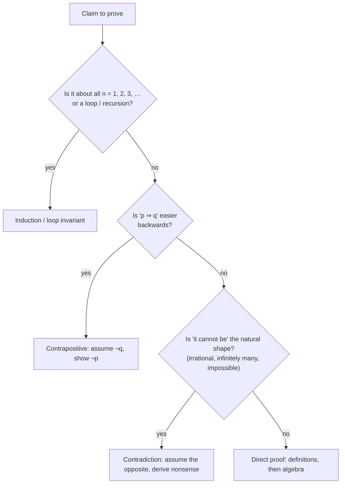

# Logic and Proofs — From If-Statements to Loop Invariants

Logic is the maths of `if`. Every condition you write is a formula in propositional
logic, every "for all inputs" guarantee is a quantified statement, and every correct
loop has a small proof hiding inside it. This chapter teaches the logic you already
use — and the parts that trip people up (implication, De Morgan, quantifier order,
SQL's `NULL`) — then shows how to *prove* things: direct proof, contrapositive,
contradiction, induction, and the programmer's version of induction, the loop
invariant.

**Where this fits:** Part 1 · The language of maths, chapter 3 of 15. **Builds on:** nothing beyond school arithmetic and basic Python, so this is a fine first chapter. **Used again in:** 04, 14. **Next in order:** [04 Sets, relations and functions](04_sets_relations_functions.md).

## Where You Will Use This

| Situation | What logic gives you |
|---|---|
| Simplifying a tangled `if (!(a && !b) \|\| …)` | De Morgan and the equivalence laws, checked by truth table |
| "Why does this loop give the right answer?" | A loop invariant: initialisation, maintenance, termination |
| SQL `WHERE x NOT IN (…)` returning nothing | Three-valued logic with `NULL` |
| Interview "prove that…" / "why does greedy work?" | Proof techniques and counterexamples |
| Specs, contracts, tests | Quantifiers: "for all valid inputs", "there exists a failing case" |

## Foundations — Statements That Are True or False

A **proposition** is a statement that is either true or false: "7 is prime", "the
list is sorted", `x > 0`. Questions and commands are not propositions. Neither is
"x > 0" until you know x — that is a **predicate**, a proposition with a blank to fill
in (a function that returns a boolean).

Propositions combine with **connectives**, which are exactly your boolean operators:

| Maths | Name | Python | True when… |
|---|---|---|---|
| $\neg p$ | not | `not p` | p is false |
| $p \land q$ | and (conjunction) | `p and q` | both are true |
| $p \lor q$ | or (disjunction) | `p or q` | at least one is true (inclusive) |
| $p \oplus q$ | exclusive or | `p != q` | exactly one is true |
| $p \to q$ | implies | `(not p) or q` | p is false, or q is true |
| $p \leftrightarrow q$ | if and only if | `p == q` | both have the same value |

> **Key idea:** A **truth table** lists every combination of inputs. With n variables
> there are $2^n$ rows, so it is an exhaustive test: if two formulas agree on every
> row they are **logically equivalent** and one can always replace the other. For
> small n you can check any claim in this chapter by brute force.

## 1 · Implication: the Connective Everyone Gets Wrong

$p \to q$ ("if p then q") is false in exactly **one** case: p true and q false.

| p | q | p → q |
|---|---|---|
| T | T | T |
| T | F | **F** |
| F | T | T |
| F | F | T |

The last two rows feel wrong at first. Why is "if p then q" true when p is false?

> **Analogy:** Implication is a **promise**. "If it rains, I will bring an umbrella."
> On a rainy day with an umbrella: promise kept. Rainy, no umbrella: promise broken —
> the only broken row. On a dry day, whatever I carry, I have not broken the promise.
> The promise only talks about rainy days.

A statement whose "if" part is false is **vacuously true**. It is the same idea as
`all([]) == True` from chapter 01.

> **Notebook example:** The rule is "if a pull request touches the database, it has a DBA
> review". You see four pull requests, but only one fact about each: (1) touches the
> database, (2) does not touch the database, (3) has a DBA review, (4) has no DBA review.
> Which ones must you open to check the rule?
>
> **What you need:** "if p then q", written $p \to q$, is broken in exactly **one**
> case: p is true and q is false. Every other combination keeps the rule. In
> particular, when p is false the rule simply does not apply (it is **vacuously true**:
> the promise was never triggered).
>
> **Plan:** name p and q, then ask of each pull request: "could this one turn out to be
> p true **and** q false?" Open only those.
>
> 1. **Name the parts.** p = "touches the database", q = "has a DBA review". The rule
>    is $p \to q$.
> 2. **Name the only bad case.** p true and q false: a pull request that touches the
>    database but has no DBA review.
> 3. **Look at PR 1 (touches the database).** p is true. We cannot see q; if it is false,
>    this is the bad case. **Open it.**
> 4. **Look at PR 2 (does not touch the database).** p is false, so the rule says
>    nothing about it. Skip it.
>    *Why:* the promise only talks about database changes; this one cannot break it.
> 5. **Look at PR 3 (has a DBA review).** q is true. The bad case needs q false, so this
>    one cannot be it, whatever p is. Skip it.
> 6. **Look at PR 4 (no DBA review).** q is false. If p turns out to be true, this is
>    the bad case. **Open it.**
>
> **Answer:** open PRs 1 and 4. Most people pick 1 and 3. Picking 3 is the converse
> error: checking $q \to p$ instead of $p \to q$.
>
> **Check:** list the truth-table rows each PR could be, written as "value of p → value
> of q". PR 1 is T→T or T→F; PR 2 is F→T or F→F;
> PR 3 is T→T or F→T; PR 4 is T→F or F→F. The broken row T→F appears only for PRs 1
> and 4. ✓ In code the rule is `(not p) or q`, which is `False` only when `p and not q`.

> **Your turn:** The rule is "if a function is public, it has a docstring". Four cards
> each show one fact: (A) private, (B) public, (C) no docstring, (D) has a docstring.
> Which must you turn over?
>
> <details>
> <summary>Show the worked answer</summary>
>
> 1. **Name the parts.** p = "is public", q = "has a docstring".
> 2. **Name the only bad case.** Public with no docstring.
> 3. **Look at A (private).** p false: the rule does not apply. Skip.
> 4. **Look at B (public).** p true: could be the bad case. **Turn over.**
> 5. **Look at C (no docstring).** q false: could be the bad case. **Turn over.**
> 6. **Look at D (has a docstring).** q true: cannot be the bad case. Skip.
>
> **Answer:** B and C.
>
> </details>

### Converse, inverse, contrapositive

From $p \to q$ you can build three related statements. Only one of them means the same
thing:

| Name | Form | Example ("if it is a square, it is a rectangle") | Same meaning? |
|---|---|---|---|
| Original | $p \to q$ | square ⇒ rectangle | — (true) |
| **Contrapositive** | $\neg q \to \neg p$ | not a rectangle ⇒ not a square | **yes** (true) |
| Converse | $q \to p$ | rectangle ⇒ square | no (false) |
| Inverse | $\neg p \to \neg q$ | not a square ⇒ not a rectangle | no (false) |

Confusing an implication with its converse is the most common error in reasoning —
in proofs, in code reviews ("all admins are logged in, so this logged-in user is an
admin"), and in debugging ("the bug makes the test fail; the test fails; so it is the
bug").

**Try it: compare statements row by row.** The lab starts with $p \to q$ against
$\neg p \lor q$ — equivalent. Press the preset buttons: the contrapositive agrees on every
row, the converse disagrees on two, and $\neg(p \land q)$ against $\neg p \lor \neg q$ is
De Morgan's law. Pick any other pair from the menus and predict before you look.

<div class="lab" data-viz="math-truth"></div>

### Necessary and sufficient

"p is **sufficient** for q" means $p \to q$: having p guarantees q. "p is **necessary**
for q" means $q \to p$: you cannot have q without p. "p **if and only if** q"
($p \leftrightarrow q$) means both. A valid ticket is necessary to board, not
sufficient (you also need to be on time).

## 2 · Laws of Logic: Refactoring Conditions Safely

| Law | Statement | In code |
|---|---|---|
| Double negation | $\neg\neg p \equiv p$ | `not not p` is `p` (for booleans) |
| **De Morgan** | $\neg(p \land q) \equiv \neg p \lor \neg q$ | `not (a and b)` ≡ `(not a) or (not b)` |
| **De Morgan** | $\neg(p \lor q) \equiv \neg p \land \neg q$ | `not (a or b)` ≡ `(not a) and (not b)` |
| Distributive | $p \land (q \lor r) \equiv (p \land q) \lor (p \land r)$ | factor a common test out of branches |
| Absorption | $p \lor (p \land q) \equiv p$ | a redundant clause can be deleted |
| Implication | $p \to q \equiv \neg p \lor q$ | guard clauses: `if not p: return` … |
| Contrapositive | $p \to q \equiv \neg q \to \neg p$ | |

Because a truth table is finite, you can **prove** an equivalence in code by trying
every row. That is a complete proof, not a test sample:

```python
from itertools import product

def equivalent(f, g, nvars):
    return all(f(*row) == g(*row) for row in product([False, True], repeat=nvars))

print(equivalent(lambda p, q: not (p and q), lambda p, q: (not p) or (not q), 2))   # → True
print(equivalent(lambda p, q: (not p) or q, lambda p, q: (not q) or p, 2))         # → False
print(equivalent(lambda p, q, r: p and (q or r), lambda p, q, r: (p and q) or (p and r), 3))   # → True
print(equivalent(lambda p, q: p or (p and q), lambda p, q: p, 2))                 # → True
```

> **Worked example:** A reviewer sees
> `if not (user.is_active and not user.is_banned): deny()`. Push the `not` inside with
> De Morgan: `(not is_active) or (not not is_banned)` → `if not user.is_active or
> user.is_banned: deny()`. Same behaviour, readable, and the brute-force check above
> proves it.

## 3 · Predicates and Quantifiers

A **predicate** is a statement with variables: $P(x)$ = "x is even". Quantifiers turn
it into a proposition about a whole set (chapter 01 introduced them as `all` and `any`):

- $\forall x \in S,\ P(x)$ — for every x in S, P(x) holds.
- $\exists x \in S,\ P(x)$ — at least one x in S satisfies P.

### Negation flips the quantifier

$$
\neg\, \forall x\, P(x) \equiv \exists x\, \neg P(x) \qquad\qquad \neg\, \exists x\, P(x) \equiv \forall x\, \neg P(x)
$$

"Not all tests passed" means "some test failed". This is De Morgan's law for
quantifiers: ∀ is a big AND, ∃ is a big OR.

### The order of quantifiers matters

> **Worked example:** Let x and y range over people.
>
> - $\forall x\, \exists y$: loves(x, y) — "everybody loves somebody" (possibly a
>   different somebody each).
> - $\exists y\, \forall x$: loves(x, y) — "there is somebody whom everybody loves".
>
> The second is far stronger. In code, $\forall x\, \exists y$ is
> `all(any(loves(x, y) for y in P) for x in P)`: for each x, search for a y.
> $\exists y\, \forall x$ is `any(all(loves(x, y) for x in P) for y in P)`: find one y
> that works for everyone.

```python
people = ["ana", "bo", "cy"]
loves = {("ana", "bo"), ("bo", "cy"), ("cy", "ana")}
L = lambda x, y: (x, y) in loves
print(all(any(L(x, y) for y in people) for x in people))   # → True
print(any(all(L(x, y) for x in people) for y in people))   # → False
```

This distinction is everywhere in CS definitions. Big-O is
"$\exists c, n_0\ \forall n \ge n_0$: $f(n) \le c\,g(n)$" — the constants are chosen
**once**, before n. Swap the quantifiers and every function would be O(1).

## 4 · What a Proof Is

A **proof** is a chain of steps, each following from definitions, known facts, or
earlier steps, that ends at the claim. Its job is to cover **every case at once** — the
thing no amount of testing can do.



### Direct proof

Assume the "if" part, unfold the definitions, compute.

> **Worked example:** *The sum of two odd numbers is even.* An odd number is one of the
> form $2k + 1$ for an integer k. Take odd numbers $a = 2j + 1$ and $b = 2k + 1$. Then
> $a + b = 2j + 2k + 2 = 2(j + k + 1)$, which is 2 times an integer, so it is even. ∎
>
> Notice what made it work: writing "odd" as a formula. Most direct proofs are just
> "replace every word by its definition, then do algebra".

### Proof by contrapositive

To prove $p \to q$, prove $\neg q \to \neg p$ instead — they are equivalent.

> **Worked example:** *If n² is even, then n is even.* Directly this is awkward
> (square roots of even numbers?). Contrapositive: *if n is odd, then n² is odd.* Let
> $n = 2k + 1$; then $n^2 = 4k^2 + 4k + 1 = 2(2k^2 + 2k) + 1$, which is odd. ∎

### Proof by contradiction

Assume the claim is **false** and derive something impossible. Then the assumption
was wrong.

> **Worked example:** *There are infinitely many primes* (Euclid, about 300 BC).
> Suppose there were finitely many: $p_1, p_2, \dots, p_k$. Let
> $N = p_1 p_2 \cdots p_k + 1$. Dividing N by any $p_i$ leaves remainder 1, so no
> $p_i$ divides N. But every integer greater than 1 has a prime factor — a prime
> missing from our "complete" list. Contradiction, so the primes never run out. ∎

Note what the proof does **not** say: N itself need not be prime.

```python
from math import prod
primes = [2, 3, 5, 7, 11, 13]
N = prod(primes) + 1
print(N, [p for p in range(2, 200) if N % p == 0])   # → 30031 [59]
```

$30031 = 59 \times 509$: not prime, but its prime factors are new.

> **Worked example:** *√2 is irrational.* Suppose $\sqrt{2} = a/b$ in lowest terms.
> Then $a^2 = 2b^2$, so $a^2$ is even, so a is even (the contrapositive proof above!):
> $a = 2c$. Then $4c^2 = 2b^2$, so $b^2 = 2c^2$ and b is even too. Both even
> contradicts "lowest terms". ∎

## 5 · Induction: Proving Infinitely Many Cases in Two Steps

To prove a statement $P(n)$ for every $n \ge 1$:

1. **Base case:** prove $P(1)$.
2. **Inductive step:** prove that for any k, **if** $P(k)$ is true **then**
   $P(k + 1)$ is true.

Then $P(1)$ holds; so $P(2)$; so $P(3)$; … for every n.

> **Analogy:** An infinite line of dominoes. The base case knocks over the first one.
> The inductive step guarantees each falling domino knocks over the next. You do not
> need to check the billionth domino — the chain reaches it.

**Try it: break a proof.** Press *Push the first domino* with both parts holding — every
domino falls. Then switch off the base case (nothing falls, even though every domino
would topple its neighbour), and set the step to fail at some k (the chain stops there).
Both parts are needed, every time.

<div class="lab" data-viz="math-induction"></div>

> **Worked example:** *Claim:* $1 + 2 + \dots + n = \frac{n(n+1)}{2}$.
>
> **Base case** (n = 1): the left side is 1, the right side is $\frac{1 \cdot 2}{2} = 1$. ✓
>
> **Inductive step:** assume $1 + \dots + k = \frac{k(k+1)}{2}$ (the **inductive
> hypothesis**). Then
> $$1 + \dots + k + (k+1) = \frac{k(k+1)}{2} + (k+1) = \frac{k(k+1) + 2(k+1)}{2} = \frac{(k+1)(k+2)}{2},$$
> which is the formula with $n = k + 1$. ∎

### Strong induction

Sometimes $P(k+1)$ needs more than $P(k)$ — it needs some earlier case. **Strong
induction** assumes $P(1), \dots, P(k)$ all hold. It is exactly as valid.

> **Worked example:** *Every integer n ≥ 2 is a product of primes.* If n is prime,
> done. Otherwise $n = a \cdot b$ with $2 \le a, b < n$; by the strong hypothesis both
> a and b are products of primes, so n is too. This is the recursion in trial-division
> factorisation: the proof and the algorithm have the same shape.

> **Key idea:** **Recursion and induction are the same idea.** A recursive function is
> correct if the base case returns the right answer and each call is right *assuming*
> its smaller recursive calls are right. That "assuming" is the inductive hypothesis —
> which is why "trust the recursion" is sound advice, not wishful thinking.

### A broken induction, to learn from

*"All horses are the same colour."* Base: one horse is the same colour as itself.
Step: in a group of k + 1 horses, the first k are the same colour (hypothesis) and so
are the last k; the two groups overlap, so all k + 1 match. The flaw: going from 1 to 2
horses, "the first 1" and "the last 1" **do not overlap**. The step fails at exactly
one k — and one failure breaks the whole chain.

## 6 · Loop Invariants: Induction for Code

A **loop invariant** is a statement that is true before every iteration of a loop.
Proving a loop correct takes three parts:

1. **Initialisation:** the invariant is true before the first iteration. *(base case)*
2. **Maintenance:** if it is true before an iteration, it is true after it.
   *(inductive step)*
3. **Termination:** when the loop stops, the invariant plus the stopping condition
   imply the result you wanted.

> **Worked example:** Binary search for `target` in a sorted list `a`.
> **Invariant:** *if `target` is in `a` at all, it is in `a[lo:hi]`.*
> Initialisation: `lo, hi = 0, len(a)` — the whole list. Maintenance: if `a[mid] <
> target`, everything at or left of `mid` is too small (the list is sorted), so moving
> `lo = mid + 1` keeps the invariant; symmetric for the other side. Termination: the
> range shrinks every iteration and the loop stops when it is empty (so target is
> absent) or when `a[mid] == target`.

Invariants are not just for proofs. Written as assertions, they turn a silent logic
error into a loud one at the exact iteration it happens:

```python
def binary_search(a, target):
    lo, hi = 0, len(a)
    while lo < hi:
        # invariant: target is not in a[:lo] and not in a[hi:]
        assert all(x != target for x in a[:lo]) and all(x != target for x in a[hi:])
        mid = (lo + hi) // 2
        if a[mid] == target:
            return mid
        if a[mid] < target:
            lo = mid + 1
        else:
            hi = mid
    return -1

data = [2, 3, 5, 7, 11, 13, 17]
print([binary_search(data, t) for t in (2, 13, 17, 4)])   # → [0, 5, 6, -1]
```

(The assertion makes each step O(n) — use such checks in tests, not production.)

### Proving termination: find something that shrinks

A loop terminates if some non-negative integer — a **variant** — strictly decreases
every iteration: it cannot decrease forever. For binary search it is `hi - lo`; for
Euclid's gcd (chapter 07) it is the second argument. If you cannot name a variant,
you may have an infinite loop.

## 7 · Counterexamples, Testing and Proof

To show a "for all" claim is **false**, one counterexample suffices. To show it is
true, examples are never enough:

```python
def is_prime(n):
    return n > 1 and all(n % d for d in range(2, int(n**0.5) + 1))

print(all(is_prime(n * n + n + 41) for n in range(40)))   # → True
print(is_prime(40 * 40 + 40 + 41), 40 * 40 + 40 + 41)     # → False 1681
```

Euler's polynomial $n^2 + n + 41$ is prime for the first 40 values, then fails:
$1681 = 41^2$. Forty passing tests, still false.

> **In practice:** Property-based testing (Hypothesis in Python, QuickCheck in
> Haskell) is **automated counterexample search**: you state a "for all inputs"
> property and the tool hunts for a violating input, then shrinks it to the smallest
> one. It finds bugs; it never proves their absence. Proof — or exhaustive checking
> of a finite space, like the truth tables above — is the only way to "for all".

> **Notebook example:** Is $n^2 - n + 11$ prime for every $n \ge 1$? Test it, then hunt
> for a counterexample on purpose.
>
> **What you need:** a **prime** is a whole number bigger than 1 that only 1 and itself
> divide exactly (2, 3, 5, 7, 11, 13, …). A "for every n" claim is false as soon as
> **one** n breaks it; that n is a **counterexample**. Passing tests never prove a "for
> every" claim. One useful fact: if every part of a sum is a multiple of 11, the whole
> sum is a multiple of 11.
>
> **Plan:** try a few small n to see why the claim looks believable, then choose an n
> that forces the answer to be a multiple of 11.
>
> 1. **Test n = 1.** $1^2 - 1 + 11 = 1 - 1 + 11 = 11$. Prime.
> 2. **Test a few more.** $n = 2$: $4 - 2 + 11 = 13$. $n = 3$: $9 - 3 + 11 = 17$.
>    $n = 4$: $16 - 4 + 11 = 23$. All prime (and so are n = 5 to 10: 31, 41, 53, 67,
>    83, 101). Tempting.
>    *Why:* this is evidence, not proof. We have no idea yet what happens at n = 1000.
> 3. **Look for a weak spot in the formula.** The constant is 11. If n is a multiple of
>    11, then $n^2$, n and 11 are all multiples of 11, so the whole result is too.
> 4. **Substitute n = 11.** $11^2 - 11 + 11$.
> 5. **Do the arithmetic.** $11^2 = 121$, then $121 - 11 = 110$, then $110 + 11 = 121$.
> 6. **Factor the result.** $121 = 11 \times 11$, so it is **not prime**.
>
> **Answer:** false, with $n = 11$ as the counterexample. Ten passing tests proved
> nothing, and one counterexample settled it. Asking "where would this break?" beats
> trying more random cases.
>
> **Check:** $11 \times 11 = 121$. ✓ With the `is_prime` function above,
> `is_prime(11 * 11 - 11 + 11)` is `False`.

> **Your turn:** Is $n^2 + n + 17$ prime for every $n \ge 1$? Use the same trick to find a
> counterexample.
>
> <details>
> <summary>Show the worked answer</summary>
>
> 1. **Test n = 1.** $1 + 1 + 17 = 19$. Prime, so the claim looks believable.
> 2. **Look for a weak spot in the formula.** The constant is 17, so try a multiple of
>    17.
> 3. **Substitute n = 17.** $17^2 + 17 + 17$.
> 4. **Do the arithmetic.** $17^2 = 289$, then $289 + 17 = 306$, then $306 + 17 = 323$.
> 5. **Factor the result.** $323 = 17 \times 19$. Not prime.
>
> **Answer:** false; $n = 17$ is a counterexample. (A search finds an even smaller one:
> $n = 16$ gives $289 = 17 \times 17$.)
>
> </details>

## 8 · When Logic Has Three Values: SQL and `NULL`

SQL's `NULL` means "unknown", and SQL logic has three values: TRUE, FALSE, and
UNKNOWN. Any comparison with `NULL` is UNKNOWN, and `WHERE` keeps only rows that are
TRUE. The consequences surprise even experienced engineers:

```python
import sqlite3
db = sqlite3.connect(":memory:")
q = lambda sql: db.execute(sql).fetchall()
print(q("SELECT NULL = NULL"))                  # → [(None,)]
print(q("SELECT 1 WHERE NULL = NULL"))          # → []
print(q("SELECT 3 NOT IN (1, 2)"))              # → [(1,)]
print(q("SELECT 3 NOT IN (1, 2, NULL)"))        # → [(None,)]
print(q("SELECT NULL IS NULL"))                 # → [(1,)]
```

`3 NOT IN (1, 2, NULL)` means `3 <> 1 AND 3 <> 2 AND 3 <> NULL` = TRUE AND TRUE AND
UNKNOWN = UNKNOWN. So `WHERE id NOT IN (SELECT manager_id FROM staff)` silently returns
**no rows at all** if any `manager_id` is `NULL`. Use `NOT EXISTS`, or filter the
`NULL`s out of the subquery. Test for missing values with `IS NULL`, never `= NULL`.

| AND | T | U | F |
|---|---|---|---|
| **T** | T | U | F |
| **U** | U | U | F |
| **F** | F | F | F |

Reading the table: FALSE AND anything is FALSE (it does not matter what the unknown
is), but TRUE AND UNKNOWN stays unknown.

> **Notebook example:** A table has two rows: row 1 has `age = NULL, city = 'Paris'`, row
> 2 has `age = NULL, city = 'Rome'`. Which rows does
> `WHERE age > 30 OR city = 'Paris'` return?
>
> **What you need:** `NULL` means "unknown". Any comparison with `NULL`, such as
> `NULL > 30`, gives **UNKNOWN**, not TRUE or FALSE. `WHERE` keeps a row only when the
> condition is **TRUE**; FALSE and UNKNOWN rows are both dropped. For OR: TRUE OR
> anything is TRUE, but FALSE OR UNKNOWN stays UNKNOWN.
>
> **Plan:** for each row, work out each side of the OR, combine them, and keep the row
> only if the result is TRUE.
>
> 1. **Row 1, left side.** `age > 30` is `NULL > 30`, which is UNKNOWN.
> 2. **Row 1, right side.** `city = 'Paris'` is `'Paris' = 'Paris'`, which is TRUE.
> 3. **Row 1, combine with OR.** UNKNOWN OR TRUE is **TRUE**, so row 1 is kept.
>    *Why:* whatever the missing age is, the right side already makes the OR true.
> 4. **Row 2, left side.** `NULL > 30` is UNKNOWN again.
> 5. **Row 2, right side.** `'Rome' = 'Paris'` is FALSE.
> 6. **Row 2, combine with OR.** UNKNOWN OR FALSE is **UNKNOWN**.
>    *Why:* the answer now depends entirely on the age, which nobody knows.
> 7. **Apply WHERE to row 2.** UNKNOWN is not TRUE, so row 2 is dropped.
>
> **Answer:** only row 1 (Paris) comes back. Row 2 is dropped, not because it failed the
> test, but because the test could not be decided.
>
> **Check:** running the query in `sqlite3` (as in the code above) returns only the
> Paris row. ✓

> **Your turn:** Rows: row 1 has `age = NULL, city = 'Oslo'`, row 2 has
> `age = NULL, city = 'Lima'`. Which rows does `WHERE age < 18 OR city = 'Lima'` return?
>
> <details>
> <summary>Show the worked answer</summary>
>
> 1. **Row 1, both sides.** `NULL < 18` is UNKNOWN; `'Oslo' = 'Lima'` is FALSE.
> 2. **Row 1, combine with OR.** UNKNOWN OR FALSE is UNKNOWN, so it is dropped.
> 3. **Row 2, both sides.** `NULL < 18` is UNKNOWN; `'Lima' = 'Lima'` is TRUE.
> 4. **Row 2, combine with OR.** UNKNOWN OR TRUE is TRUE, so it is kept.
>
> **Answer:** only row 2 (Lima).
>
> </details>

> **Notebook example:** Same table: both rows have `age = NULL`. Which rows do
> (b) `WHERE age > 30` and (c) `WHERE NOT (age > 30)` return?
>
> **What you need:** `NULL > 30` is UNKNOWN, and `WHERE` keeps only TRUE rows. For NOT:
> NOT TRUE is FALSE, NOT FALSE is TRUE, and **NOT UNKNOWN is still UNKNOWN** (if you
> do not know whether something is true, you do not know whether it is false either).
>
> **Plan:** work out the condition for each query, then see whether the two queries
> together cover the table the way they would with ordinary true/false logic.
>
> 1. **Evaluate `age > 30` in both rows.** The age is NULL, so it is UNKNOWN in both.
> 2. **Apply WHERE for (b).** UNKNOWN is not TRUE, so both rows are dropped. (b) returns
>    nothing.
> 3. **Apply NOT for (c).** NOT UNKNOWN is UNKNOWN, in both rows.
> 4. **Apply WHERE for (c).** Still UNKNOWN, so both rows are dropped. (c) returns
>    nothing.
> 5. **Add up the two results.** 0 rows from (b) plus 0 rows from (c) is 0 of the 2 rows.
>    *Why:* with ordinary booleans, every row passes exactly one of "condition" and
>    "NOT condition". NULL breaks that rule.
>
> **Answer:** both (b) and (c) return nothing. They look like they split the table in
> two, yet together they return 0 of 2 rows. Rows with NULL fall through every
> comparison; to catch them, test `age IS NULL`.
>
> **Check:** in `sqlite3`, both queries return `[]`. ✓

> **Your turn:** A table has one row, with `age = NULL`. Which rows do `WHERE age = 18`
> and `WHERE age <> 18` return? (`<>` means "not equal".)
>
> <details>
> <summary>Show the worked answer</summary>
>
> 1. **Evaluate `age = 18`.** `NULL = 18` is UNKNOWN.
> 2. **Apply WHERE.** UNKNOWN is not TRUE: dropped.
> 3. **Evaluate `age <> 18`.** `NULL <> 18` is UNKNOWN too.
> 4. **Apply WHERE.** Dropped again.
>
> **Answer:** both queries return nothing. Only `WHERE age IS NULL` finds the row.
>
> </details>

## Common Mistakes

1. **Affirming the consequent:** from $p \to q$ and q, concluding p (the converse).
2. **Denying the antecedent:** from $p \to q$ and ¬p, concluding ¬q (the inverse).
3. **Pushing `not` through `and` without flipping it to `or`.**
4. **Swapping ∀ and ∃** when reading or writing specifications.
5. **Induction without a base case**, or a step that silently fails for one k.
6. **Treating many passing tests as proof.**
7. **`= NULL` in SQL**, and `NOT IN` over a column that can be `NULL`.

## Check Yourself

**1.** "If the build is green, the deploy runs." The deploy ran. Was the build green?

<details>
<summary>Open the answer</summary>

Not necessarily. That reasons from q back to p — the converse. Something else may have
triggered the deploy (a manual run, a different pipeline). Only "the deploy did **not**
run, so the build was not green" follows (the contrapositive).

</details>

**2.** Simplify `not (x > 0 or y > 0)` and check it by brute force.

<details>
<summary>Open the answer</summary>

De Morgan: `x <= 0 and y <= 0`. Brute force over a small grid:
`all((not (x > 0 or y > 0)) == (x <= 0 and y <= 0) for x in range(-3, 4) for y in range(-3, 4))`
is `True`. (For the boolean skeleton, the 4-row truth table is a complete proof.)

</details>

**3.** Write the loop invariant for "find the maximum of a non-empty list" and check
all three parts.

<details>
<summary>Open the answer</summary>

`best = a[0]; for i in range(1, n): if a[i] > best: best = a[i]`. Invariant before
iteration i: `best == max(a[:i])`. Initialisation: i = 1, `best = a[0] = max(a[:1])`.
Maintenance: `max(a[:i+1]) = max(max(a[:i]), a[i])`, which is what the body computes.
Termination: at i = n, `best == max(a[:n])`, the whole list.

</details>

**4.** Prove by induction that $2^n \ge n + 1$ for all $n \ge 0$.

<details>
<summary>Open the answer</summary>

Base: $2^0 = 1 \ge 1$. Step: assume $2^k \ge k + 1$. Then
$2^{k+1} = 2 \cdot 2^k \ge 2(k + 1) = 2k + 2 \ge k + 2$ (since $k \ge 0$). ∎

</details>

## What Each Level Should Know

| Level | Expected |
|---|---|
| **Getting started** | Truth tables; implication and why its false-premise rows are true; De Morgan; ∀/∃ and their negation |
| **Interview-ready** | Contrapositive vs converse; direct, contrapositive, contradiction and induction proofs of short claims; loop invariants for binary search, two pointers and greedy loops; SQL `NULL` pitfalls |
| **Going deeper** | Strong induction and structural induction on trees; variants for termination; the link between recursion and induction; SAT as the canonical NP-complete problem (chapter 14) |

## Checklist

- [ ] I can write the truth table of $p \to q$ and explain the "promise" reading.
- [ ] I never confuse an implication with its converse.
- [ ] I can push a negation through and/or and through ∀/∃.
- [ ] I can prove a small claim directly, by contrapositive, by contradiction and by induction.
- [ ] I can state a loop invariant and prove initialisation, maintenance and termination.
- [ ] I know why `x NOT IN (…, NULL)` returns nothing.
