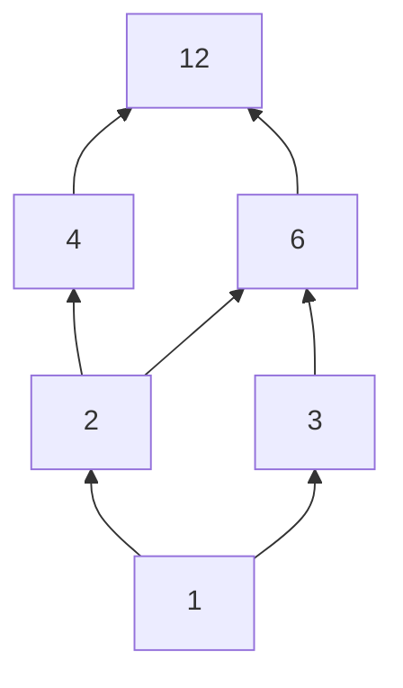

# Sets, Relations and Functions — The Data Model Under Everything

Sets, relations and functions are the maths that databases, type systems, hash tables
and graphs are built on. A set is a collection with no duplicates; a relation is a set
of pairs (a database table is literally one); a function is a relation where every
input has exactly one output (a hash function, a lookup table). This chapter builds
all three from scratch, then uses them to explain equivalence classes (union-find),
partial orders (dependency graphs and sorting comparators), the pigeonhole principle
(why collisions are unavoidable), and why some infinities are bigger than others
(why some problems can never be solved by any program).

**Where this fits:** Part 1 · The language of maths, chapter 4 of 15. **Builds on:** [03 Logic and proofs](03_logic_and_proofs.md) (logic and quantifiers). **Used again in:** 05, 08, 14. **Next in order:** [05 Counting, permutations and combinations](05_counting_and_combinatorics.md).

## Where You Will Use This

| Concept | Shows up as |
|---|---|
| Set operations, inclusion–exclusion | `set` in Python, SQL `UNION`/`INTERSECT`/`EXCEPT`, counting problems |
| Power set | "all subsets" backtracking, bitmask DP |
| Relations | Database tables, joins, graphs |
| Equivalence relations | Union-find, grouping anagrams, connected components |
| Partial orders | Build systems, task scheduling, topological sort, `Comparator` contracts |
| Injective / surjective / bijective | Hash collisions, encoding and decoding, permutations |
| Pigeonhole | Collision guarantees, "no compressor shrinks every file" |
| Countability | Why the halting problem is unsolvable |

## Foundations — What a Set Is

A **set** is a collection of distinct things, called its **elements**, with no order
and no duplicates. $\{1, 2, 3\}$, $\{3, 2, 1\}$ and $\{1, 1, 2, 3\}$ are the **same**
set. We write $x \in A$ for "x is an element of A" and $\lvert A \rvert$ for the number
of elements (the **cardinality**).

> **Analogy:** A set is a guest list. Writing a name twice does not invite them twice,
> and the order of the names does not matter. The only question a guest list answers
> is "is this person on it?" — which is exactly the operation a hash set makes O(1).

```python
A = {1, 2, 3}
print(A == {3, 2, 1}, A == {1, 1, 2, 3})   # → True True
print(2 in A, len({1, 1, 2, 3}))           # → True 3
```

Some sets have names: the **empty set** $\emptyset$ (no elements; `set()` — not `{}`,
which is an empty dict), and the number sets ℕ, ℤ, ℚ, ℝ from chapter 01. A is a
**subset** of B, $A \subseteq B$, if every element of A is in B.

## 1 · Set Operations

| Operation | Maths | Contains | Python | SQL |
|---|---|---|---|---|
| Union | $A \cup B$ | in A **or** B | `A \| B` | `UNION` |
| Intersection | $A \cap B$ | in A **and** B | `A & B` | `INTERSECT` |
| Difference | $A \setminus B$ or $A - B$ | in A, **not** in B | `A - B` | `EXCEPT` |
| Symmetric difference | $A \,\triangle\, B$ | in exactly one | `A ^ B` | — |
| Complement | $A^c$ or $\overline{A}$ | in the universe U, not in A | `U - A` | `NOT IN` |

Each set operation is a logic operation on membership: ∪ is OR, ∩ is AND, complement
is NOT, △ is XOR. So every law from chapter 03 has a set version — including
**De Morgan**: $(A \cup B)^c = A^c \cap B^c$.

**Try it: shade the result.** U is 1…20, A the even numbers, B the multiples of 3. Pick
each operation and read the result, the Python, SQL and bitmask equivalents. Compare
$(A \cup B)^c$ with $A^c \cap B^c$: De Morgan says they shade the same region.

<div class="lab" data-viz="math-venn"></div>

### Inclusion–exclusion: counting a union

Adding $\lvert A \rvert + \lvert B \rvert$ counts the overlap twice, so subtract it once:

$$
\lvert A \cup B \rvert = \lvert A \rvert + \lvert B \rvert - \lvert A \cap B \rvert
$$

For three sets, add the singles, subtract the pairs, add back the triple:

$$
\lvert A \cup B \cup C \rvert = \lvert A \rvert + \lvert B \rvert + \lvert C \rvert - \lvert A \cap B \rvert - \lvert A \cap C \rvert - \lvert B \cap C \rvert + \lvert A \cap B \cap C \rvert
$$

> **Worked example:** How many numbers below 1000 are multiples of 3 or 5? Multiples
> of 3: 333. Of 5: 199. Of both (that is, of 15): 66. Answer: 333 + 199 − 66 = 466 —
> no loop over 1000 numbers needed. Their **sum** follows the same pattern, using
> Gauss's formula for each multiple count.

```python
def count_multiples(k, below):
    return (below - 1) // k

def sum_multiples(k, below):
    m = (below - 1) // k
    return k * m * (m + 1) // 2

n = 1000
print(count_multiples(3, n) + count_multiples(5, n) - count_multiples(15, n))   # → 466
print(sum_multiples(3, n) + sum_multiples(5, n) - sum_multiples(15, n))         # → 233168
print(sum(x for x in range(n) if x % 3 == 0 or x % 5 == 0))                     # → 233168
```

## 2 · Subsets and the Power Set

The **power set** $\mathcal{P}(A)$ is the set of all subsets of A. If $\lvert A \rvert = n$
it has $2^n$ elements: for each of the n elements you independently decide **in or
out** — n yes/no choices.

Three ways to generate it, each teaching something:

```python
from itertools import combinations

def power_set_recursive(items):
    if not items:
        return [[]]
    rest = power_set_recursive(items[1:])
    return rest + [[items[0]] + s for s in rest]          # without the first, then with it

def power_set_bits(items):
    n = len(items)
    return [[items[i] for i in range(n) if mask >> i & 1] for mask in range(1 << n)]

def power_set_by_size(items):
    return [list(c) for k in range(len(items) + 1) for c in combinations(items, k)]

s = ["a", "b", "c"]
print(len(power_set_recursive(s)), len(power_set_bits(s)), len(power_set_by_size(s)))   # → 8 8 8
print(power_set_recursive(s))   # → [[], ['c'], ['b'], ['b', 'c'], ['a'], ['a', 'c'], ['a', 'b'], ['a', 'b', 'c']]
```

The recursive version *is* the proof that there are $2^n$ subsets: the subsets of n
items are the subsets of the other n − 1 items, once without the first item and once
with it — twice as many. It is also the shape of every "include or exclude" backtracking
solution.

> **Interview angle:** Whenever a brute force is "try every subset", its cost is
> $O(2^n)$ (times the work per subset). That is fine for n ≤ 20 or so and hopeless at
> n = 60 — the constraint in the problem statement is often the hint (chapter 06 and
> CS Fundamentals chapter 07).

> **Notebook example:** List every subset of $\{a, b, c\}$ with the "in or out" method.
>
> **What you need:** a **subset** is any selection of the elements, from none at all
> (the **empty set** $\varnothing$) up to all of them. The "in or out" method takes the
> elements one at a time. For each one, every subset found so far splits into two
> versions: one **without** the new element (out) and one **with** it (in). So each
> element doubles the list.
>
> **Plan:** start with the empty selection, then deal with a, then b, then c, doubling
> the list each time.
>
> 1. **Start with nothing decided.** The only selection is "nothing": $\varnothing$.
>    *Why:* before any choices, the empty set is the one subset you have.
> 2. **Decide about a.** Keep $\varnothing$ (a out) and add a copy with a in:
>    $\varnothing, \{a\}$.
> 3. **Decide about b.** Keep those 2, and add a copy of each with b in: $\{b\}, \{a, b\}$.
>    The list is now $\varnothing, \{a\}, \{b\}, \{a, b\}$.
> 4. **Decide about c.** Keep those 4, and add a copy of each with c in:
>    $\{c\}, \{a, c\}, \{b, c\}, \{a, b, c\}$.
> 5. **Write the full list.** $\varnothing, \{a\}, \{b\}, \{a, b\}, \{c\}, \{a, c\}, \{b, c\}, \{a, b, c\}$.
> 6. **Count.** The list went $1 \to 2 \to 4 \to 8$. So there are 8 subsets, which is
>    $2^3$.
>    *Why:* three yes/no choices, each doubling the count: $2 \cdot 2 \cdot 2 = 8$.
>
> **Answer:** 8 subsets, listed in step 5. This is exactly what `power_set_recursive`
> above does.
>
> **Check:** count them by size instead: 1 empty set, 3 with one letter, 3 with two
> letters, 1 with all three. $1 + 3 + 3 + 1 = 8$. ✓

> **Your turn:** List every subset of $\{x, y\}$ with the "in or out" method.
>
> <details>
> <summary>Show the worked answer</summary>
>
> 1. **Start with nothing decided.** $\varnothing$.
> 2. **Decide about x.** $\varnothing, \{x\}$.
> 3. **Decide about y.** Add a copy of each with y: $\varnothing, \{x\}, \{y\}, \{x, y\}$.
> 4. **Count.** $1 \to 2 \to 4$, which is $2^2$.
>
> **Answer:** $\varnothing, \{x\}, \{y\}, \{x, y\}$: 4 subsets.
>
> </details>

> **Notebook example:** How many subsets of $\{1, \dots, 10\}$ contain 1 but not 2?
>
> **What you need:** each element that is **free** gives a yes/no choice, and n free
> yes/no choices give $2^n$ combinations (each one doubles the count). An element whose
> answer is **forced** (it must be in, or must be out) has only one option, so it does
> not double anything.
>
> **Plan:** count how many elements are still free to choose, then raise 2 to that
> power.
>
> 1. **Count the elements.** $\{1, \dots, 10\}$ has 10 elements.
> 2. **Fix the forced ones.** 1 must be in and 2 must be out. Each has just one option.
> 3. **Count the free elements.** $10 - 2 = 8$ (the numbers 3 to 10).
> 4. **Multiply the choices.** Each free element is in or out: $2^8$.
> 5. **Work out the power.** Doubling from 1 eight times: 2, 4, 8, 16, 32, 64, 128, 256.
>    So $2^8 = 256$.
>
> **Answer:** 256 subsets contain 1 but not 2.
>
> **Check:** there are $2^{10} = 1024$ subsets in all, and the four combinations for 1
> and 2 (in/in, in/out, out/in, out/out) split them evenly. One quarter:
> $1024 \div 4 = 256$. ✓

> **Your turn:** How many subsets of $\{1, \dots, 6\}$ contain 6?
>
> <details>
> <summary>Show the worked answer</summary>
>
> 1. **Count the elements.** 6.
> 2. **Fix the forced ones.** 6 must be in.
> 3. **Count the free elements.** $6 - 1 = 5$ (the numbers 1 to 5).
> 4. **Multiply the choices.** $2^5 = 32$.
>
> **Answer:** 32. Check: half of all $2^6 = 64$ subsets contain 6, and
> $64 \div 2 = 32$. ✓
>
> </details>

## 3 · Ordered Pairs and the Cartesian Product

In a set, order does not matter; in an **ordered pair** $(a, b)$, it does:
$(1, 2) \ne (2, 1)$. The **Cartesian product** $A \times B$ is the set of all pairs
with the first from A and the second from B, so $\lvert A \times B \rvert = \lvert A \rvert \cdot \lvert B \rvert$.

```python
from itertools import product
sizes, colours = ["S", "M", "L"], ["red", "blue"]
print(len(list(product(sizes, colours))), list(product(sizes, colours))[:2])   # → 6 [('S', 'red'), ('S', 'blue')]
```

This is SQL's `CROSS JOIN`, a nested loop, and a grid's coordinates ($\mathbb{Z} \times \mathbb{Z}$).
A join without a join condition is a Cartesian product — the classic accidental query
that returns rows × rows results.

> **Notebook example:** Let $A = \{x, y\}$ and $B = \{1, 2, 3\}$. List $A \times B$ and
> compare it with $B \times A$.
>
> **What you need:** an **ordered pair** $(a, b)$ is two things where the order matters:
> $(x, 1)$ and $(1, x)$ are different pairs. The **Cartesian product** $A \times B$ is
> the set of all pairs whose first item comes from A and whose second item comes from
> B. It is the nested loop `for a in A: for b in B: (a, b)`.
>
> **Plan:** run the nested loop by hand: fix each element of A in turn and pair it with
> every element of B. Then build one pair of $B \times A$ and compare.
>
> 1. **Fix x and pair it with all of B.** $(x, 1), (x, 2), (x, 3)$.
> 2. **Fix y and pair it with all of B.** $(y, 1), (y, 2), (y, 3)$.
> 3. **Collect the pairs.** $A \times B = \{(x,1), (x,2), (x,3), (y,1), (y,2), (y,3)\}$.
> 4. **Count.** 6 pairs, which is $\lvert A \rvert \cdot \lvert B \rvert = 2 \cdot 3$.
>    *Why:* each of the 2 outer choices meets each of the 3 inner choices.
> 5. **Build a pair of $B \times A$.** Now the first item comes from B, for example
>    $(1, x)$.
> 6. **Compare.** Every pair in $A \times B$ starts with a letter, so $(1, x)$ is not in
>    it. Therefore $A \times B \ne B \times A$.
>    *Why:* order matters inside a pair, so $(1, x) \ne (x, 1)$.
>
> **Answer:** $A \times B$ is the 6 pairs in step 3. $B \times A$ also has 6 pairs, but
> they are different pairs, so the two products are not equal.
>
> **Check:** `list(itertools.product("xy", [1, 2, 3]))` gives the same 6 pairs in the same
> order. ✓

> **Your turn:** Let $A = \{p, q\}$ and $B = \{0, 1\}$. List $A \times B$. Is $(0, p)$ in it?
>
> <details>
> <summary>Show the worked answer</summary>
>
> 1. **Fix p and pair it with all of B.** $(p, 0), (p, 1)$.
> 2. **Fix q and pair it with all of B.** $(q, 0), (q, 1)$.
> 3. **Count.** 4 pairs, which is $2 \cdot 2$.
> 4. **Compare.** $(0, p)$ starts with a number, but every pair in $A \times B$ starts with
>    a letter. So it is not in $A \times B$.
>
> **Answer:** $A \times B = \{(p,0), (p,1), (q,0), (q,1)\}$, and $(0, p)$ is not in it.
>
> </details>

> **Notebook example:** A `CROSS JOIN` combines a 1,000-row table with a 500-row table.
> How many rows come back?
>
> **What you need:** a `CROSS JOIN`, or any join where you forgot the join condition,
> returns the Cartesian product of the rows: every row of the first table paired with
> every row of the second. Its size is $\lvert A \times B \rvert = \lvert A \rvert \cdot
> \lvert B \rvert$.
>
> **Plan:** count how many result rows one row produces, then multiply by the number of
> rows.
>
> 1. **Take one row of the first table.** It pairs with every row of the second table:
>    500 result rows.
>    *Why:* there is no join condition to throw any pairs away.
> 2. **Do the same for every row.** Each of the 1,000 rows produces its own 500.
> 3. **Multiply.** $1000 \cdot 500 = 500{,}000$.
>
> **Answer:** 500,000 rows. Forgetting a join condition does exactly this, and it grows
> as the product of the table sizes.
>
> **Check:** same rule as the small example above: 2 rows times 3 rows gave 6 pairs.
> Here, 500 per row times 1,000 rows is 500,000. ✓

> **Your turn:** A 200-row table is cross-joined with a 30-row table. How many rows come
> back?
>
> <details>
> <summary>Show the worked answer</summary>
>
> 1. **Take one row of the first table.** It pairs with all 30 rows of the second.
> 2. **Do the same for every row.** 200 rows, each giving 30.
> 3. **Multiply.** $200 \cdot 30 = 6000$.
>
> **Answer:** 6,000 rows.
>
> </details>

## 4 · Relations: Sets of Pairs

A **relation** R from A to B is any subset of $A \times B$. We write $a \mathrel{R} b$
when $(a, b) \in R$. That is all a relation is — a set of pairs that are "related".

> **In practice:** A database table *is* a relation: `enrolled(student, course)` is a
> set of pairs, and Edgar Codd named the relational model after exactly this idea. A
> directed graph is a relation on its vertices: $u \mathrel{R} v$ when there is an edge
> $u \to v$. "Follows" on a social network is a relation on users.

A relation on a single set A can have these properties:

| Property | Definition | Example that has it | Example that does not |
|---|---|---|---|
| **Reflexive** | $a \mathrel{R} a$ for every a | $=$, $\le$, "same birthday as" | $<$ |
| **Symmetric** | $a \mathrel{R} b \Rightarrow b \mathrel{R} a$ | "is a sibling of", "same birthday as" | "follows" |
| **Antisymmetric** | $a \mathrel{R} b$ and $b \mathrel{R} a \Rightarrow a = b$ | $\le$, $\subseteq$, "divides" (on positive integers) | "same birthday as" |
| **Transitive** | $a \mathrel{R} b$ and $b \mathrel{R} c \Rightarrow a \mathrel{R} c$ | $<$, "is an ancestor of" | "is the parent of", "is a friend of" |

```python
def props(R, A):
    return {
        "reflexive": all((a, a) in R for a in A),
        "symmetric": all((b, a) in R for a, b in R),
        "antisymmetric": all(a == b for a, b in R if (b, a) in R),
        "transitive": all((a, d) in R for a, b in R for c, d in R if b == c),
    }

A = range(1, 7)
divides = {(a, b) for a in A for b in A if b % a == 0}
same_mod3 = {(a, b) for a in A for b in A if a % 3 == b % 3}
print(props(divides, A))     # → {'reflexive': True, 'symmetric': False, 'antisymmetric': True, 'transitive': True}
print(props(same_mod3, A))   # → {'reflexive': True, 'symmetric': True, 'antisymmetric': False, 'transitive': True}
```

Those two combinations are the two most important kinds of relation.

> **Notebook example:** On $A = \{1, 2, 3\}$, let
> $R = \{(1,1), (2,2), (3,3), (1,2), (2,1), (2,3)\}$. Which of the four properties
> does R have?
>
> **What you need:** a relation is a set of pairs; read $(a, b) \in R$ as an arrow
> $a \to b$. The four properties, in plain words:
>
> - **Reflexive:** every element has an arrow to itself, $(a, a)$.
> - **Symmetric:** every arrow has its reverse: if $(a, b)$ is in R, so is $(b, a)$.
> - **Antisymmetric:** no two **different** elements point at each other both ways.
> - **Transitive:** every two-step chain $a \to b \to c$ has the shortcut $(a, c)$.
>
> Each is a "for every" rule, so a single missing (or forbidden) pair breaks it.
>
> **Plan:** test the four properties one at a time, hunting for one pair that breaks
> each.
>
> 1. **Test reflexive.** We need $(1,1)$, $(2,2)$ and $(3,3)$. All three are in R. ✓
> 2. **Test symmetric.** Check each arrow between different elements for its reverse.
>    $(1,2)$ has $(2,1)$. But $(2,3)$ needs $(3,2)$, which is missing. ✗
>    *Why:* one arrow without its reverse is enough to break it.
> 3. **Test antisymmetric.** Look for two different elements pointing both ways.
>    $(1,2)$ and $(2,1)$ are both in R, and $1 \ne 2$. ✗
> 4. **Test transitive.** Look for a chain $a \to b \to c$. $(1,2)$ then $(2,3)$ is the
>    chain $1 \to 2 \to 3$, which needs the shortcut $(1,3)$. It is missing. ✗
>
> **Answer:** R is reflexive only. When you answer, name the pair that breaks each
> property: $(3,2)$ is missing, $(1,2)$ and $(2,1)$ go both ways, $(1,3)$ is missing.
>
> **Check:** the `props` function above, run on this R with `A = [1, 2, 3]`, returns
> reflexive `True` and the other three `False`. ✓

> **Your turn:** On $A = \{1, 2, 3\}$, let
> $R = \{(1,1), (2,2), (3,3), (1,2), (2,3), (1,3)\}$. Which of the four properties does
> R have?
>
> <details>
> <summary>Show the worked answer</summary>
>
> 1. **Test reflexive.** $(1,1)$, $(2,2)$, $(3,3)$ are all there. ✓
> 2. **Test symmetric.** $(1,2)$ needs $(2,1)$, which is missing. ✗
> 3. **Test antisymmetric.** No two different elements point both ways (there is no
>    $(2,1)$, $(3,2)$ or $(3,1)$). ✓
> 4. **Test transitive.** The only chain through different elements is
>    $1 \to 2 \to 3$, and its shortcut $(1,3)$ is there. ✓
>
> **Answer:** reflexive, antisymmetric and transitive. This R is $\le$ on $\{1, 2, 3\}$,
> a partial order (section 6).
>
> </details>

## 5 · Equivalence Relations: "Same in the Way That Matters"

A relation that is **reflexive, symmetric and transitive** is an **equivalence
relation**. It captures "these are the same, for my purposes": same remainder mod 3,
same connected component, anagrams of each other, same user after case-folding the
email.

> **Key idea:** An equivalence relation **partitions** the set into disjoint groups
> called **equivalence classes**: every element is in exactly one class, and two
> elements are related exactly when they share a class. Mod 3 splits the integers into
> {…, 0, 3, 6, …}, {…, 1, 4, 7, …} and {…, 2, 5, 8, …}.

There are two standard ways to compute the classes, and both are interview staples:

1. **A canonical key.** Map each element to one representative of its class, then
   group by key. Anagrams: the key is the sorted letters.
2. **Union-find.** When the relation is given as a list of "these two are the same"
   facts, merge sets as the facts arrive; transitivity is handled automatically.

```python
from collections import defaultdict

def group_anagrams(words):
    groups = defaultdict(list)
    for w in words:
        groups["".join(sorted(w))].append(w)       # canonical key = sorted letters
    return sorted(groups.values())

print(group_anagrams(["eat", "tea", "tan", "ate", "nat", "bat"]))   # → [['bat'], ['eat', 'tea', 'ate'], ['tan', 'nat']]

def classes_from_pairs(n, same):
    parent = list(range(n))
    def find(x):
        while parent[x] != x:
            parent[x] = parent[parent[x]]          # path halving
            x = parent[x]
        return x
    for a, b in same:
        parent[find(a)] = find(b)
    groups = defaultdict(list)
    for x in range(n):
        groups[find(x)].append(x)
    return sorted(groups.values())

print(classes_from_pairs(6, [(0, 1), (1, 2), (4, 5)]))   # → [[0, 1, 2], [3], [4, 5]]
```

Note that 0 and 2 ended up together although no fact said so directly — that is
transitivity, done by the data structure.

> **Notebook example:** Six servers, 1 to 6. The facts "1 and 2 share a rack", "3 and 4
> share a rack" and "2 and 4 share a rack" arrive in that order. Which racks are there?
>
> **What you need:** "shares a rack with" is an **equivalence relation**: every server
> shares with itself (reflexive), sharing goes both ways (symmetric), and if a shares
> with b and b shares with c, then a shares with c (transitive). Such a relation splits
> the servers into separate groups, the **equivalence classes**, and every server is in
> exactly one. The **union-find** recipe builds the groups: start with everyone alone;
> for each fact "a and b", find a's group and b's group, and if they differ, merge the
> two **whole** groups.
>
> **Plan:** keep a list of groups and apply the facts one at a time, in order.
>
> 1. **Start with everyone alone.** $\{1\}, \{2\}, \{3\}, \{4\}, \{5\}, \{6\}$.
> 2. **Apply fact (1, 2).** 1 is in $\{1\}$ and 2 is in $\{2\}$. Merge them:
>    $\{1, 2\}, \{3\}, \{4\}, \{5\}, \{6\}$.
> 3. **Apply fact (3, 4).** Merge $\{3\}$ and $\{4\}$: $\{1, 2\}, \{3, 4\}, \{5\}, \{6\}$.
> 4. **Find the groups for fact (2, 4).** 2 is in $\{1, 2\}$ and 4 is in $\{3, 4\}$.
>    *Why:* we merge whole groups, not just the two servers, because 1 is already with 2
>    and 3 is already with 4.
> 5. **Merge those groups.** $\{1, 2, 3, 4\}, \{5\}, \{6\}$.
> 6. **Count the groups.** 3.
>
> **Answer:** three racks: $\{1, 2, 3, 4\}$, $\{5\}$ and $\{6\}$. No fact mentioned 1 and 3
> together, but they share a rack by transitivity. This is union-find, done by hand,
> and every server ended up in exactly one group.
>
> **Check:** each merge of two different groups lowers the count by one. We started with
> 6 groups and did 3 merges: $6 - 3 = 3$. ✓ `classes_from_pairs(7, [(1, 2), (3, 4), (2, 4)])`
> from the code above gives `[[0], [1, 2, 3, 4], [5], [6]]` (the extra `[0]` is because
> the code numbers from 0).

> **Your turn:** Five servers, 1 to 5. The facts "1 and 5", "2 and 3" and "5 and 3" share
> a rack arrive in that order. Which racks are there?
>
> <details>
> <summary>Show the worked answer</summary>
>
> 1. **Start with everyone alone.** $\{1\}, \{2\}, \{3\}, \{4\}, \{5\}$.
> 2. **Apply fact (1, 5).** $\{1, 5\}, \{2\}, \{3\}, \{4\}$.
> 3. **Apply fact (2, 3).** $\{1, 5\}, \{2, 3\}, \{4\}$.
> 4. **Find the groups for fact (5, 3).** 5 is in $\{1, 5\}$ and 3 is in $\{2, 3\}$.
> 5. **Merge those groups.** $\{1, 2, 3, 5\}, \{4\}$.
>
> **Answer:** two racks: $\{1, 2, 3, 5\}$ and $\{4\}$.
>
> </details>

## 6 · Partial Orders: "Must Come Before"

A relation that is **reflexive, antisymmetric and transitive** is a **partial order**.
$\le$ on numbers, $\subseteq$ on sets, "divides" on positive integers, and "must be
built before" in a build system are all partial orders. "Partial" because some pairs
may be **incomparable**: neither {1} ⊆ {2} nor {2} ⊆ {1}. If every pair is comparable
it is a **total order**.

A partial order is drawn as a **Hasse diagram**: an arrow from a to b when a comes
directly before b, leaving out anything implied by transitivity or reflexivity.



> **Key idea:** A **topological sort** extends a partial order to a total order — a
> line-up that respects every "must come before". Build tools, package managers,
> spreadsheet recalculation and course prerequisites all do this. It exists exactly
> when the dependency graph has **no cycle** (chapter 08).

### Why sorting comparators must be consistent

Sorting algorithms assume your comparison is a **strict weak order**: irreflexive
(`x < x` is false), transitive, and with "incomparable" itself transitive. Break the
rules and the result is garbage — Java's `TimSort` even throws
`IllegalArgumentException: Comparison method violates its general contract!`.

```python
import functools
# "Rock-paper-scissors" order: not transitive (r beats s, s beats p, p beats r)
beats = {("r", "s"), ("s", "p"), ("p", "r")}
cmp = lambda a, b: 0 if a == b else (1 if (a, b) in beats else -1)
print(sorted(["r", "p", "s"], key=functools.cmp_to_key(cmp)))   # → ['r', 'p', 's']
print(sorted(["s", "r", "p"], key=functools.cmp_to_key(cmp)))   # → ['s', 'r', 'p']
```

Same three items, different input orders, different "sorted" outputs — because there
is no correct answer to find. A comparator that compares floats containing NaN has the
same problem.

> **Notebook example:** Build steps: *compile* and *docs* both need *fetch*, *test* needs
> *compile*, and *package* needs *test* and *docs*. Find a valid order.
>
> **What you need:** a **topological sort** lines the steps up so that every step comes
> after everything it needs. The recipe: repeatedly pick a step that is waiting for
> nothing, write it down, and cross it off every other step's waiting list. When two
> steps are ready at once, either may go first; they are **incomparable** (neither needs
> the other).
>
> **Plan:** write each step's waiting list, then pick a ready step and cross it off,
> over and over, until every step is written down.
>
> 1. **Write each step's waiting list.** fetch: nothing. compile: fetch. docs: fetch.
>    test: compile. package: test, docs.
> 2. **Pick a step that waits for nothing.** Only fetch. Write down **fetch**.
> 3. **Cross fetch off.** compile and docs now wait for nothing. test still waits for
>    compile; package for test and docs.
> 4. **Pick a ready step.** compile and docs are both ready. Pick **compile**.
>    *Why:* either is fine; compile and docs do not depend on each other.
> 5. **Cross compile off.** test now waits for nothing. Ready: docs and test.
> 6. **Pick a ready step.** Pick **test**, then cross it off. package now waits only for
>    docs.
> 7. **Pick a ready step.** Only docs is ready. Pick **docs**, then cross it off. package
>    waits for nothing.
> 8. **Pick the last step.** **package**.
>
> **Answer:** fetch, compile, test, docs, package. Another valid order is fetch, docs,
> compile, test, package. compile and docs are **incomparable**, which is why more than
> one order works.
>
> **Check:** go through every requirement in the answer: compile (2nd) is after fetch
> (1st), docs (4th) is after fetch, test (3rd) is after compile (2nd), and package (5th)
> is after test and docs. ✓ Python's `graphlib.TopologicalSorter` produces a valid
> order the same way.

> **Your turn:** *build* and *lint* both need *checkout*, and *deploy* needs *build* and
> *lint*. Find a valid order.
>
> <details>
> <summary>Show the worked answer</summary>
>
> 1. **Write each step's waiting list.** checkout: nothing. build: checkout. lint:
>    checkout. deploy: build, lint.
> 2. **Pick a step that waits for nothing.** **checkout**. Cross it off: build and lint
>    are ready.
> 3. **Pick a ready step.** **build**. Cross it off: deploy still waits for lint.
> 4. **Pick a ready step.** **lint**. Cross it off: deploy is ready.
> 5. **Pick the last step.** **deploy**.
>
> **Answer:** checkout, build, lint, deploy (checkout, lint, build, deploy also works).
>
> </details>

## 7 · Functions, Precisely

With relations in hand, a **function** $f: A \to B$ is a relation from A to B in which
**every** $a \in A$ is related to **exactly one** $b \in B$. Three properties decide
what you can do with it:

| Property | Definition | Picture | CS meaning |
|---|---|---|---|
| **Injective** (one-to-one) | different inputs → different outputs | no two arrows land on the same target | no collisions; information is preserved |
| **Surjective** (onto) | every output is hit by some input | no target left without an arrow | every bucket/value is used |
| **Bijective** | both | a perfect pairing | invertible: you can decode |

**Try it: move the arrows.** Click an input to move its arrow. With 4 inputs and 4
outputs, make a bijection, then create a collision. Switch to 3 outputs (injective
becomes impossible — pigeonhole) and to 5 outputs (surjective becomes impossible).

<div class="lab" data-viz="math-function"></div>

> **Worked example:** Which are invertible?
> - `lambda x: 2 * x` on integers → injective (no collisions) but not surjective onto
>   ℤ (odd numbers are never hit). Invertible on its image (the even numbers).
> - `lambda x: x % 10` on integers → surjective onto {0…9} but hugely non-injective.
>   Not invertible: 3, 13, 23 all give 3.
> - A permutation of `range(n)` → bijection. Its inverse is the permutation that puts
>   each element back.
> - A cryptographic hash → from all strings to 256-bit values: cannot be injective
>   (infinitely many inputs, finitely many outputs). It is *designed* so collisions are
>   infeasible to *find*, not impossible.

```python
perm = [2, 0, 3, 1]                       # f(i) = perm[i], a bijection on {0,1,2,3}
inv = [0] * len(perm)
for i, p in enumerate(perm):
    inv[p] = i
print(inv, [inv[perm[i]] for i in range(4)])   # → [1, 3, 0, 2] [0, 1, 2, 3]
```

## 8 · The Pigeonhole Principle

> **Definition:** If more than n pigeons fly into n holes, some hole gets at least two
> pigeons. More generally, putting N items into k boxes puts at least
> $\lceil N / k \rceil$ items into some box.

It sounds too obvious to be useful. It is one of the most useful ideas in CS:

- **Hash collisions are unavoidable.** Any function from a bigger set to a smaller one
  cannot be injective. With 11 keys and 10 buckets, some bucket holds two.
- **No lossless compressor shrinks every file.** There are $2^n$ files of exactly n
  bits, but only $2^0 + 2^1 + \dots + 2^{n-1} = 2^n - 1$ shorter files. Some n-bit file
  cannot map to a shorter one without colliding with another — and a collision would
  make decompression ambiguous.
- **Repeated states mean a cycle.** A function on a finite set of m states, applied
  over and over, must repeat a state within m + 1 steps; from then on it cycles. This
  is why pseudo-random generators have periods and why Floyd's cycle detection works
  (chapter 07 and the linked-list cycle problems).
- **Birthdays.** Among 367 people, two share a birthday (366 possible days,
  including 29 February). Chapter 10 shows the far more surprising fact that 23 people
  are enough for a 50% chance.

```python
n = 16
print(2**n, sum(2**k for k in range(n)))   # → 65536 65535
```

> **Interview angle:** "Given n + 1 integers in the range 1…n, show some integer
> repeats" — pigeonhole. The follow-up, "find it in O(1) extra space without changing
> the array", treats the array as a function `i → a[i]` and finds the cycle that
> pigeonhole guarantees (Floyd's tortoise and hare).

> **Notebook example:** A drawer holds socks of 4 colours. How many must you pull out in
> the dark to be **sure** of a matching pair?
>
> **What you need:** the **pigeonhole principle**: if you put more items than there are
> boxes, some box gets at least two. Here the items are socks and the boxes are colours.
> "Sure" means it must work even with the worst possible luck.
>
> **Plan:** imagine the unluckiest possible draw, then add one more sock.
>
> 1. **Name the boxes.** The 4 colours.
> 2. **Imagine the worst luck.** You could pull out 4 socks that are all different
>    colours, one in each box. No pair yet.
>    *Why:* to be sure, we must beat the worst case, not the typical case.
> 3. **Add one more sock.** The 5th sock has to be one of the 4 colours, and every colour
>    already has a sock. So it matches one of them.
> 4. **Count.** $4 + 1 = 5$.
>
> **Answer:** 5 socks guarantee a matching pair: 5 items in 4 boxes.
>
> **Check:** 4 is not enough (one of each colour is possible), and 5 always is, because
> $5 > 4$. ✓

> **Your turn:** A hash table has 7 buckets. How many keys must you insert to be sure two
> keys land in the same bucket?
>
> <details>
> <summary>Show the worked answer</summary>
>
> 1. **Name the boxes.** The 7 buckets.
> 2. **Imagine the worst luck.** 7 keys could land in 7 different buckets.
> 3. **Add one more key.** The 8th key must land in a bucket that is already used.
> 4. **Count.** $7 + 1 = 8$.
>
> **Answer:** 8 keys guarantee a collision.
>
> </details>

> **Notebook example:** Among 100 people, what is the largest number you can be sure
> share a birth month?
>
> **What you need:** the general pigeonhole principle: putting N items into k boxes
> puts at least $\lceil N / k \rceil$ items into some box. The **ceiling**
> $\lceil x \rceil$ means "round up to the next whole number" ($\lceil 8.33 \rceil = 9$,
> but $\lceil 8 \rceil = 8$).
>
> **Plan:** divide people by months, round up, then confirm by imagining the most even
> spread.
>
> 1. **Name the items and the boxes.** $N = 100$ people, $k = 12$ months.
> 2. **Divide.** $100 \div 12 = 8.33\ldots$ (because $12 \cdot 8 = 96$, with 4 left over).
> 3. **Round up.** $\lceil 8.33 \rceil = 9$.
>    *Why:* if the average month has 8.33 people, at least one month must have more
>    than 8, and people come in whole numbers, so that month has at least 9.
>
> **Answer:** 9. Whatever the birthdays are, some month has at least 9 of the 100 people.
>
> **Check:** suppose every month had at most 8 people. Then there would be at most
> $12 \cdot 8 = 96$ people, but there are 100. Contradiction, so some month has at least
> 9. ✓ And 9 is the most you can promise: 4 months of 9 plus 8 months of 8 is
> $36 + 64 = 100$ people with no month above 9. In integer code, `(100 + 11) // 12` is 9.

> **Your turn:** 50 keys go into 8 buckets. What is the smallest number of keys the
> fullest bucket can have?
>
> <details>
> <summary>Show the worked answer</summary>
>
> 1. **Name the items and the boxes.** $N = 50$ keys, $k = 8$ buckets.
> 2. **Divide.** $50 \div 8 = 6.25$.
> 3. **Round up.** $\lceil 6.25 \rceil = 7$.
>
> **Answer:** 7. Check: 8 buckets of at most 6 hold only $8 \cdot 6 = 48 < 50$ keys. ✓
>
> </details>

## 9 · Infinity Comes in Sizes

Two sets have the **same size** if there is a bijection between them — you can pair
their elements off perfectly. For finite sets that is ordinary counting. For infinite
sets it gives surprising answers.

**Countable sets** can be paired with ℕ = {0, 1, 2, …}, i.e. listed as a sequence
where every element eventually appears:

- The even numbers: $n \mapsto 2n$. As many evens as naturals, although they are a
  proper subset.
- The integers: list them as 0, 1, −1, 2, −2, 3, …
- The rationals: list the fractions by $\lvert p \rvert + q$ (diagonal by diagonal).
- **All finite strings** over an alphabet — and so **all programs** in any language:
  list them by length, then alphabetically.

**The real numbers are not countable.** Cantor's **diagonal argument** (1891): suppose
you had a list of every real number between 0 and 1. Build a new number whose k-th
digit differs from the k-th digit of the k-th number on the list. It differs from
every listed number somewhere, so it is not on the list — contradiction.

```python
listing = ["0.5000", "0.1415", "0.7182", "0.4142"]        # any claimed "complete" list
diag = "".join("5" if s[2 + k] != "5" else "6" for k, s in enumerate(listing))
new = "0." + diag
print(new, new in listing)   # → 0.6555 False
```

> **Key idea:** The same diagonal trick proves the most important limit in computer
> science. Programs are countable; the set of all yes/no problems (subsets of ℕ) is
> not. So **there are problems no program can solve** — and chapter 14 exhibits one,
> the halting problem, using a diagonal argument of exactly this shape.

> **Notebook example:** Someone claims this is a complete list of numbers between 0 and
> 1: 0.5102…, 0.3333…, 0.2753…, 0.8885…. Build a number that is not on it.
>
> **What you need:** Cantor's **diagonal** recipe. Build a new number whose 1st digit
> (after the decimal point) differs from the 1st digit of the 1st number, whose 2nd
> digit differs from the 2nd digit of the 2nd number, and so on. Then the new number
> disagrees with every number on the list in at least one place, so it cannot be any
> of them. A simple rule for "differ": write 6 if the digit is 5, otherwise write 5.
> (Using only 5 and 6 avoids the 0s and 9s that would allow $0.4999\ldots = 0.5$.)
>
> **Plan:** read the diagonal digits, change each one, then glue the changed digits into
> a new number.
>
> 1. **Read digit 1 of number 1.** 0.**5**102…: the digit is 5.
> 2. **Read digit 2 of number 2.** 0.3**3**33…: the digit is 3.
> 3. **Read digit 3 of number 3.** 0.27**5**3…: the digit is 5.
> 4. **Read digit 4 of number 4.** 0.888**5**…: the digit is 5.
>    *Why:* these four digits run diagonally down the list, hence the name.
> 5. **Change each diagonal digit.** 5 becomes 6, 3 becomes 5, 5 becomes 6, 5 becomes 6.
> 6. **Glue the new digits together.** 0.6566….
>
> **Answer:** 0.6566… is missing from the list. The same recipe beats **any** list,
> however long, which is why the real numbers cannot be listed.
>
> **Check:** compare it with each row. It differs from number 1 in digit 1 (6 vs 5), from
> number 2 in digit 2 (5 vs 3), from number 3 in digit 3 (6 vs 5), and from number 4 in
> digit 4 (6 vs 5). ✓ The `diag` code above does exactly this.

> **Your turn:** The list is 0.1234…, 0.5555…, 0.9050…, 0.2468…. Build a number that is not
> on it.
>
> <details>
> <summary>Show the worked answer</summary>
>
> 1. **Read the diagonal digits.** Digit 1 of 0.1234… is 1, digit 2 of 0.5555… is 5,
>    digit 3 of 0.9050… is 5, digit 4 of 0.2468… is 8.
> 2. **Change each diagonal digit.** 1 becomes 5, 5 becomes 6, 5 becomes 6, 8 becomes 5.
> 3. **Glue the new digits together.** 0.5665….
>
> **Answer:** 0.5665… is not on the list.
>
> </details>

## Common Mistakes

1. Using `{}` for an empty set in Python (it is a dict). Use `set()`.
2. Adding counts of overlapping sets without inclusion–exclusion.
3. Forgetting that set order is not guaranteed — never rely on iteration order of a
   `set` for output.
4. A comparator that is not transitive or not consistent (random, NaN, "close enough"
   equality) — sorting results become input-dependent or the sort throws.
5. Assuming a hash function can be collision-free on unbounded input.
6. Treating "infinite" as one size.

## Check Yourself

**1.** How many relations are there on a set of n elements? How many are reflexive?

<details>
<summary>Open the answer</summary>

A relation is any subset of $A \times A$, which has $n^2$ pairs, so there are
$2^{n^2}$ relations. Reflexive ones must contain the n pairs $(a, a)$ and may contain
any subset of the other $n^2 - n$: $2^{n^2 - n}$.

</details>

**2.** Is "is within 1 of" ($\lvert a - b \rvert \le 1$) an equivalence relation on integers?

<details>
<summary>Open the answer</summary>

No. It is reflexive and symmetric but not transitive: 1 is within 1 of 2 and 2 of 3,
but 1 is not within 1 of 3. This is why "fuzzy equality" (floats within epsilon,
timestamps within a second) cannot be used to group items into consistent classes.

</details>

**3.** A URL shortener maps long URLs to 7-character codes from 62 symbols. Can it be
injective? When must collisions occur?

<details>
<summary>Open the answer</summary>

There are $62^7 \approx 3.5 \times 10^{12}$ codes. On all possible URLs (unboundedly
many) it cannot be injective — pigeonhole. It can be injective on the URLs actually
stored, as long as fewer than $62^7$ are stored and codes are assigned (e.g. from a
counter) rather than hashed. Random or hashed codes collide much earlier — around
$1.18\sqrt{62^7} \approx 2.2$ million URLs for a 50% chance (the birthday bound, chapter 10).

</details>

**4.** Why must every topological order of a DAG exist, and why is it not unique?

<details>
<summary>Open the answer</summary>

A finite DAG always has a vertex with no incoming edges (otherwise walking backwards
forever would repeat a vertex — a cycle, by pigeonhole). Output it, remove it, repeat.
It is not unique whenever two items are incomparable (no path between them): either can
go first.

</details>

## What Each Level Should Know

| Level | Expected |
|---|---|
| **Getting started** | Set operations and Venn diagrams; subsets and the $2^n$ power set; Cartesian products; injective/surjective/bijective |
| **Interview-ready** | Inclusion–exclusion counting; equivalence classes via canonical keys and union-find; partial orders and topological sort; pigeonhole arguments for collisions, duplicates and cycles; comparator contracts |
| **Going deeper** | Relational algebra as the theory of SQL; countable vs uncountable sets; Cantor's diagonal argument and its reuse in computability |

## Checklist

- [ ] I can compute unions, intersections, differences and complements, and count a union with inclusion–exclusion.
- [ ] I can generate a power set three ways and explain why it has $2^n$ elements.
- [ ] I can test a relation for the four properties and recognise equivalence relations and partial orders.
- [ ] I can group elements into equivalence classes with a canonical key or union-find.
- [ ] I can say when a function is invertible and connect it to hashing and encoding.
- [ ] I can use the pigeonhole principle to prove a collision, a duplicate or a cycle must exist.
- [ ] I can explain Cantor's diagonal argument and what it means for computability.
