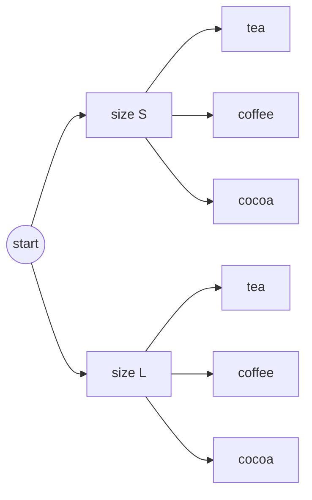
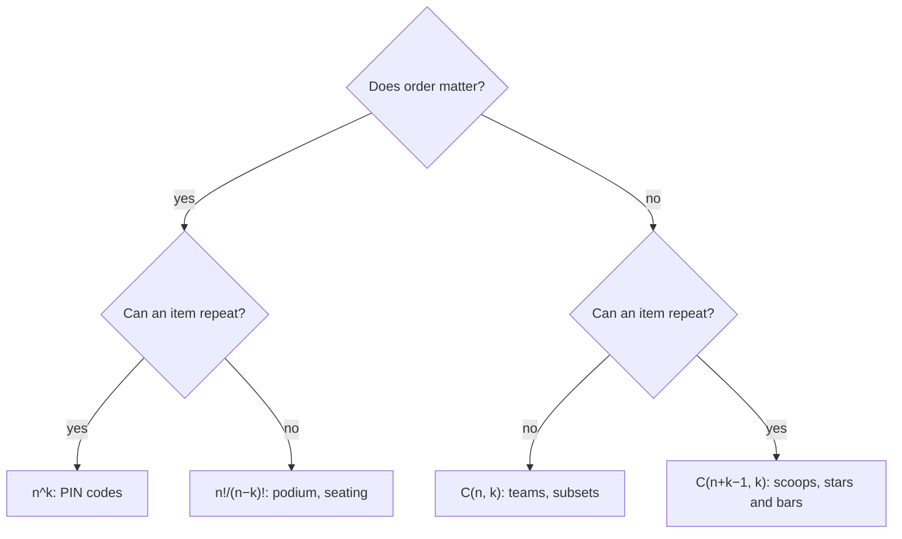

# Counting, Permutations and Combinations — How Many Ways?

Combinatorics is the art of counting without listing. How many passwords of length 8?
How many ways to order a playlist, pick a team, or walk across a grid? These questions
decide how long a brute-force search takes, what a probability is (favourable outcomes
over all outcomes), and what a dynamic-programming table should compute. This chapter
builds the whole toolkit from two rules — multiply for "and then", add for "or" — up to
permutations (with repeats, in a circle, with restrictions, next and k-th), combinations
(with conditions, generated in code), stars and bars, the binomial theorem, derangements, Catalan
numbers, and counting modulo a prime the way competitive programming requires.

**Where this fits:** Part 2 · Discrete maths, chapter 5 of 15. **Builds on:** [01 Reading maths like code](01_reading_maths_like_code.md) (Σ and Π notation); [04 Sets, relations and functions](04_sets_relations_functions.md) (sets and the pigeonhole principle). **Used again in:** 10, 15. **Next in order:** [06 Sequences, sums and recurrences](06_sequences_sums_recurrences.md).

## Where You Will Use This

| Question | Tool |
|---|---|
| How long will brute force take? | Product rule, factorials, $2^n$ |
| What is the probability of…? (chapter 10) | Count favourable outcomes ÷ count all outcomes |
| How many paths / subsets / arrangements satisfy X? | Combinations, stars and bars, DP |
| "Return the answer modulo 10⁹ + 7" | Modular factorials and inverses |
| Why does this recursion have 1, 2, 5, 14, 42 solutions? | Catalan numbers |
| Password or key strength | Product rule, then logs to get bits |

## Foundations — Count the Choices, Not the Results

Listing every outcome works for 10 outcomes, not for 10¹⁵. The trick is to describe
an outcome as **a sequence of choices** and count the choices.

> **Analogy:** Ordering at a café: 3 sizes, 4 drinks, 2 milk options. Every order is
> "pick a size, then a drink, then a milk". Draw it as a tree: 3 branches, each
> splitting into 4, each splitting into 2. The leaves are the orders:
> 3 × 4 × 2 = 24. You never have to draw the tree — you multiply the branching factors.



## 1 · The Two Rules

> **Definition:** **Product rule** — if a task is a sequence of steps, with $m$ ways to
> do the first and $n$ ways to do the second (whatever the first choice was), the task
> can be done in $m \cdot n$ ways. **Sum rule** — if a task can be done in one of
> several **non-overlapping** ways, add the counts.

In code: nested loops multiply, `if/elif` branches add.

> **Worked example:** Passwords of 8 characters from a–z, A–Z, 0–9 (62 symbols):
> $62^8$. Allowing lengths 6, 7 or 8 (non-overlapping cases): $62^6 + 62^7 + 62^8$.

```python
print(62**8)                           # → 218340105584896
print(62**6 + 62**7 + 62**8)           # → 221918520426688
import math
print(round(math.log2(62**8), 1))      # → 47.6
```

About 47.6 bits of entropy (chapter 13). At 10¹⁰ guesses per second (one GPU against a
fast hash), $62^8$ falls in about six hours — which is why password hashes are made
deliberately slow (bcrypt, scrypt, Argon2).

> **Watch out:** The sum rule needs **disjoint** cases. "Passwords that start with a
> digit or end with a digit" overlap (start *and* end with one), so use
> inclusion–exclusion from chapter 04: $\lvert A \cup B \rvert = \lvert A \rvert + \lvert B \rvert - \lvert A \cap B \rvert$.

## 2 · Permutations: Order Matters

How many ways to arrange n distinct items in a row? n choices for the first place,
n − 1 for the second, …, 1 for the last:

$$
n! = n \cdot (n-1) \cdots 2 \cdot 1, \qquad 0! = 1
$$

(0! = 1 because there is exactly one way to arrange nothing: the empty arrangement —
the empty-product rule from chapter 01.)

Arranging only $k$ of the n items ("k-permutations"):

$$
P(n, k) = n \cdot (n-1) \cdots (n-k+1) = \frac{n!}{(n-k)!}
$$

```python
import math
from itertools import permutations
print(math.factorial(10))                      # → 3628800
print(math.perm(10, 3), 10 * 9 * 8)            # → 720 720
print(len(list(permutations("abcd", 2))))      # → 12
print(f"{math.factorial(52):.3e}")             # → 8.066e+67
```

A shuffled deck of 52 cards is almost certainly an order that has never existed
before: $52! \approx 8 \times 10^{67}$.

> **Key idea:** Factorials grow faster than any exponential. $20! \approx 2.4 \times 10^{18}$
> — already more than a 64-bit counter can hold. "Try every ordering" is feasible only
> for about n ≤ 10–11 (the travelling salesman brute force); beyond that you need DP
> over subsets ($O(2^n n^2)$, workable to about n = 20) or heuristics.

> **Notebook example:** 8 runners race. In how many ways can the gold, silver and bronze
> medals be awarded?
>
> **What you need:** two yes/no questions decide every counting problem. **Does order
> matter?** Here yes: Ann-gold, Ben-silver is a different podium from Ben-gold,
> Ann-silver. **Can an item repeat?** Here no: one runner cannot win two medals. When
> order matters and nothing repeats, fill the places one at a time and use the
> **product rule**: if step one has a choices and step two has b choices (whatever was
> picked first), the two steps together have $a \times b$ outcomes. The result is
> written $P(n, k)$, "arrange k of n things": $P(n, k) = n \cdot (n-1) \cdots$ with k
> factors.
>
> **Plan:** fill the three medal places in order, count the choices for each, multiply.
>
> 1. **Draw the places.** `[gold] [silver] [bronze]`: three places to fill.
> 2. **Fill gold.** Any of the 8 runners can win it: **8 choices**.
> 3. **Fill silver.** The gold winner is used up, so $8 - 1 = 7$ runners are left:
>    **7 choices**.
>    *Why:* "no repeats" means each choice removes one runner from the pool.
> 4. **Fill bronze.** Two runners are used up: $8 - 2 = 6$ left, so **6 choices**.
> 5. **Multiply the first two.** $8 \times 7 = 56$ ways to award gold and silver.
>    *Why:* product rule. For each of the 8 gold winners there are 7 silver winners.
> 6. **Multiply in the third.** $56 \times 6 = 336$.
>
> **Answer:** 336 different podiums. In symbols this is $P(8, 3) = 8 \cdot 7 \cdot 6$:
> start at 8 and multiply 3 numbers, counting down.
>
> **Check:** shrink it to 3 runners (A, B, C) and 2 medals. The formula says
> $3 \times 2 = 6$. Listing gold-silver by hand: AB, AC, BA, BC, CA, CB, exactly 6. ✓ In
> Python this is `math.perm(8, 3)`, which prints 336.

> **Your turn:** 5 runners race. In how many ways can gold and silver be awarded?
>
> <details>
> <summary>Show the worked answer</summary>
>
> 1. **Draw the places.** `[gold] [silver]`: two places.
> 2. **Fill gold.** Any of the 5 runners: 5 choices.
> 3. **Fill silver.** The gold winner is used up: $5 - 1 = 4$ choices.
> 4. **Multiply.** $5 \times 4 = 20$.
>
> **Answer:** 20 ways, which is $P(5, 2)$.
>
> </details>

> **Notebook example:** The same 8 runners all finish. In how many different orders can
> they cross the line?
>
> **What you need:** this is the podium question with **all** places filled: order
> matters and nobody repeats, so multiply the choices for each place. Counting all the
> way down to 1 has its own name: **n factorial**,
> $n! = n \cdot (n-1) \cdots 2 \cdot 1$, the number of ways to put n different things in
> a row.
>
> **Plan:** 8 places, with 8, 7, 6, … choices; multiply one factor at a time.
>
> 1. **List the choices for each place.** 1st place: 8. 2nd: 7. 3rd: 6. … 8th: only 1
>    runner is left. So the count is $8 \cdot 7 \cdot 6 \cdot 5 \cdot 4 \cdot 3 \cdot 2 \cdot 1 = 8!$.
> 2. **Start from the podium count.** The first three factors are the podium
>    from the last example: $8 \cdot 7 \cdot 6 = 336$.
> 3. **Multiply by 5.** $336 \times 5 = 1680$.
> 4. **Multiply by 4.** $1680 \times 4 = 6720$.
> 5. **Multiply by 3.** $6720 \times 3 = 20{,}160$.
> 6. **Multiply by 2, then 1.** $20{,}160 \times 2 = 40{,}320$, and $\times 1$ changes
>    nothing.
>
> **Answer:** $8! = 40{,}320$ finishing orders, from only 8 runners. Factorials grow
> very fast.
>
> **Check:** count it a second way. Pick the podium first (336 ways), then put the other
> 5 runners in order behind it ($5! = 120$ ways): $336 \times 120 = 40{,}320$. ✓ In
> Python, `math.factorial(8)` prints 40320.

> **Your turn:** In how many orders can 4 runners finish?
>
> <details>
> <summary>Show the worked answer</summary>
>
> 1. **List the choices for each place.** 4, then 3, then 2, then 1: $4! = 4 \cdot 3 \cdot 2 \cdot 1$.
> 2. **Multiply step by step.** $4 \times 3 = 12$, $12 \times 2 = 24$, $24 \times 1 = 24$.
>
> **Answer:** $4! = 24$ orders.
>
> </details>

### When some items are identical: divide out the repeats

How many different words can you make from the letters of MISSISSIPPI? Not 11!, because
swapping two S's gives the same word.

> **Analogy:** Paint a tiny number on each S (S₁, S₂, S₃, S₄) so all 11 letters are
> different: now there are 11! arrangements. Wipe the numbers off, and every real word
> was counted once for each way to order the four S's among themselves: 4! times. Divide
> it out. Do the same for the I's (4!) and the P's (2!).

$$
\frac{n!}{n_1!\, n_2! \cdots n_r!} \qquad\text{MISSISSIPPI: } \frac{11!}{1!\,4!\,4!\,2!} = 34{,}650
$$

The same formula (the **multinomial coefficient**) counts ways to split people into
labelled groups: 10 people into a team of 5, a team of 3 and a team of 2 is
$\frac{10!}{5!\,3!\,2!}$. With only two kinds of item it is just $\binom{n}{k}$: a
binary string with 3 ones and 7 zeros is "choose where the ones go".

```python
import math
from itertools import permutations
print(math.factorial(11) // (math.factorial(4) * math.factorial(4) * math.factorial(2)))   # → 34650
print(len(set(permutations("BANANA"))), math.factorial(6) // (math.factorial(3) * math.factorial(2)))   # → 60 60
print(math.factorial(10) // (math.factorial(5) * math.factorial(3) * math.factorial(2)))  # → 2520
```

> **Notebook example:** How many different arrangements are there of the letters of
> LETTER?
>
> **What you need:** n different things can be put in a row in $n!$ ways. When some
> things are **identical**, swapping two identical ones makes no visible change, so
> $n!$ counts each real word several times. If a letter appears r times, its copies can
> be shuffled among themselves in $r!$ ways, so divide by $r!$ for each repeated letter:
> $\frac{n!}{r_1!\, r_2! \cdots}$.
>
> **Plan:** pretend every letter is different, count, then divide out the swaps that
> change nothing.
>
> 1. **Tally the letters.** L × 1, E × 2, T × 2, R × 1. That is $1 + 2 + 2 + 1 = 6$
>    letters.
> 2. **Pretend they are all different.** Paint tiny numbers on the copies: L, E₁, T₁,
>    T₂, E₂, R. Six different letters can be arranged in $6!$ ways.
> 3. **Work out 6!.** $6 \cdot 5 = 30$, $30 \cdot 4 = 120$, $120 \cdot 3 = 360$,
>    $360 \cdot 2 = 720$. So 720 painted arrangements.
> 4. **See the overcount for the E's.** The painted words E₁…E₂… and E₂…E₁… look the same
>    once the paint is wiped off. The 2 E's can be ordered in $2! = 2$ ways, so every real
>    word was counted 2 times because of the E's.
> 5. **See the overcount for the T's.** Same story: $2! = 2$ orders of T₁ and T₂, so
>    another factor of 2.
> 6. **Combine the overcounts.** Each real word was counted $2 \times 2 = 4$ times.
>    *Why:* the E-swap and the T-swap are independent choices, so they multiply.
> 7. **Divide.** $720 \div 4 = 180$. As one formula: $\frac{6!}{1!\,2!\,2!\,1!} = \frac{720}{4} = 180$.
>
> **Answer:** 180 different arrangements of LETTER.
>
> **Check:** test the method on something tiny. AAB: $\frac{3!}{2!} = \frac{6}{2} = 3$,
> and listing by hand gives AAB, ABA, BAA, exactly 3. ✓ In Python,
> `len(set(permutations("LETTER")))` prints 180.

> **Your turn:** How many different arrangements are there of the letters of TOOT?
>
> <details>
> <summary>Show the worked answer</summary>
>
> 1. **Tally the letters.** T × 2, O × 2: 4 letters.
> 2. **Pretend they are all different.** $4! = 4 \cdot 3 \cdot 2 \cdot 1 = 24$.
> 3. **Combine the overcounts.** T's: $2! = 2$. O's: $2! = 2$. Together $2 \times 2 = 4$.
> 4. **Divide.** $24 \div 4 = 6$.
>
> **Answer:** 6. By hand: TTOO, TOTO, TOOT, OTTO, OTOT, OOTT.
>
> </details>

### Arranging in a circle

Seat 5 people at a round table, where only who sits next to whom matters. Rotating
everyone one seat to the left gives the same seating, so each circular seating appears
5 times among the 5! row arrangements:

$$
\text{circular arrangements of } n = \frac{n!}{n} = (n-1)!
$$

Another way to see it: **fix one person's seat** (rotations no longer change anything),
then arrange the other $n - 1$ in a row. For a necklace or key ring, which can also be
flipped over, divide by 2 more: $(n-1)!/2$.

```python
from itertools import permutations

def canonical_rotation(p):
    return min(p[i:] + p[:i] for i in range(len(p)))

def canonical_necklace(p):
    return min(canonical_rotation(p), canonical_rotation(p[::-1]))

people = tuple("ABCDE")
print(len({canonical_rotation(p) for p in permutations(people)}))    # → 24
print(len({canonical_necklace(p) for p in permutations(people)}))    # → 12
```

> **Notebook example:** 4 friends, A, B, C and D, sit at a round table. Only who sits
> next to whom matters (rotating everyone one seat round counts as the same seating).
> How many seatings are there?
>
> **What you need:** in a row, n people can be arranged in $n!$ ways. Around a table,
> **rotations count as the same seating**, because everyone keeps the same neighbours.
> The trick: **fix one person's seat**. Once A is pinned to the top seat, rotating is no
> longer possible, and the others just fill the remaining seats like a row. So n people
> in a circle give $(n - 1)!$ seatings.
>
> **Plan:** sit A down first, then arrange the other three in the remaining seats.
>
> 1. **Fix A's seat.** Put A at the top of the table. This uses up the "which way round"
>    freedom.
>    *Why:* any seating can be rotated until A is at the top, so every seating has
>    exactly one version with A there. Counting those counts each seating once.
> 2. **Count who is left.** $4 - 1 = 3$ people: B, C, D.
> 3. **Arrange them clockwise from A.** 3 choices for the seat after A, then 2, then 1:
>    $3! = 3 \cdot 2 \cdot 1 = 6$.
>
> **Answer:** $(4 - 1)! = 6$ different seatings.
>
> **Check:** list them clockwise from A: ABCD, ABDC, ACBD, ACDB, ADBC, ADCB. That is 6. ✓
> Another way: 4 people in a row give $4! = 24$, and each seating appears 4 times (once
> per rotation), so $24 \div 4 = 6$. ✓

> **Your turn:** In how many ways can 5 people sit at a round table, if only neighbours
> matter?
>
> <details>
> <summary>Show the worked answer</summary>
>
> 1. **Fix one person's seat.** Pin the first person to the top seat.
> 2. **Count who is left.** $5 - 1 = 4$ people.
> 3. **Arrange them clockwise.** $4! = 4 \cdot 3 \cdot 2 \cdot 1 = 24$.
>
> **Answer:** $(5 - 1)! = 24$ seatings.
>
> </details>

> **Notebook example:** 6 people sit at a round table, and Ann and Ben insist on sitting
> together. How many seatings are there?
>
> **What you need:** two tools. (1) **Circle rule:** n units around a table can be
> seated in $(n - 1)!$ ways, because rotations are the same seating. (2) **Glue:** to
> force two people together, tape them into one block and treat the block as a single
> person. Afterwards, remember the people **inside** the block can still swap places.
>
> **Plan:** glue Ann and Ben, seat the units in a circle, then multiply by the orders
> inside the block.
>
> 1. **Glue Ann and Ben into one block.** Write it `[AnnBen]`.
>    *Why:* now they can never be separated, which is exactly the rule.
> 2. **Count the units.** The block plus the other 4 people: $1 + 4 = 5$ units.
> 3. **Seat 5 units in a circle.** $(5 - 1)! = 4!$.
> 4. **Work out 4!.** $4 \cdot 3 = 12$, $12 \cdot 2 = 24$, $24 \cdot 1 = 24$.
> 5. **Count the orders inside the block.** Ann-Ben or Ben-Ann: 2 ways.
>    *Why:* gluing fixed that they sit together, not who is on the left.
> 6. **Multiply.** $24 \times 2 = 48$.
>
> **Answer:** 48 seatings with Ann and Ben side by side.
>
> **Check:** count another way. All seatings of 6: $(6 - 1)! = 120$. Ann has 2
> neighbours, and Ben is equally likely to be in any of the other 5 seats, so he is next
> to her in $\frac{2}{5}$ of them: $120 \times 2 = 240$, and $240 \div 5 = 48$. ✓

> **Your turn:** 5 people sit at a round table, and two of them must sit together. How
> many seatings are there?
>
> <details>
> <summary>Show the worked answer</summary>
>
> 1. **Glue the two into one block.**
> 2. **Count the units.** The block plus 3 others: 4 units.
> 3. **Seat 4 units in a circle.** $(4 - 1)! = 3! = 6$.
> 4. **Count the orders inside the block.** 2.
> 5. **Multiply.** $6 \times 2 = 12$.
>
> **Answer:** 12 seatings.
>
> </details>

### Restrictions: together, apart, in a fixed place

Most exam and interview counting questions are an arrangement with a rule attached.
Three techniques cover almost all of them:

| Rule | Technique | 6 people in a row |
|---|---|---|
| A and B **sit together** | **Glue** them into one block, arrange the blocks, then arrange inside the block | $5! \times 2! = 240$ |
| A and B **never together** | **Complement:** all arrangements minus "together" | $720 - 240 = 480$ |
| A **at one of the ends** | **Fill the restricted place first**, then the rest | $2 \times 5! = 240$ |
| No two of three chosen people **adjacent** | **Gaps:** arrange the others, then drop the three into the gaps between them | $3! \times P(4, 3) = 6 \times 24 = 144$ |

> **Worked example:** The gap method. Seat the 3 unrestricted people first: $3! = 6$
> ways. They leave 4 gaps, `_ X _ X _ X _`, counting both ends. Put each of the 3
> restricted people in a different gap, in order: $4 \times 3 \times 2 = 24$ ways.
> Total $6 \times 24 = 144$. Because each gap holds at most one of them, no two can be
> neighbours.

```python
from itertools import permutations
rows = list(permutations("ABCDEF"))
together = sum(abs(p.index("A") - p.index("B")) == 1 for p in rows)
print(len(rows), together, len(rows) - together)                  # → 720 240 480
print(sum(p[0] == "A" or p[-1] == "A" for p in rows))             # → 240
spaced = sum(all(abs(p.index(x) - p.index(y)) > 1 for x, y in ["AB", "AC", "BC"]) for p in rows)
print(spaced)                                                     # → 144
```

> **Watch out:** After gluing, don't forget the arrangements **inside** the block (the
> $\times 2!$). And check brute force on a small case like the one above before trusting
> a formula. `itertools` makes that a three-line check.

### Listing permutations in order

Interviewers rarely ask for $n!$. They ask you to **produce** permutations: all of them
(backtracking), the next one in dictionary order, or the k-th one. `itertools.permutations`
already yields them in lexicographic order when the input is sorted. The next two
algorithms get from one permutation to another without listing everything.

**Next permutation** (the C++ `std::next_permutation`), in four steps:

1. Scan from the right for the first item that is smaller than its right neighbour: the
   **pivot**. Everything to its right is descending, so it is already as large as it
   can be.
2. In that suffix, find the rightmost item larger than the pivot: the **successor**.
3. Swap them.
4. Reverse the suffix, turning it from its largest order into its smallest.

**The k-th permutation** skips the listing entirely. With 4 items, the first item stays
the same for blocks of $3! = 6$ permutations: 1 first in #1–6, 2 first in #7–12, and so
on. So $(k - 1) \div 3!$ tells you the first item, the remainder says where you are
inside the block, and the same step repeats with $2!$, then $1!$. This is the
**factorial number system**: it works like an odometer whose wheels have n, n − 1, …, 1
positions.

```python
import math
from itertools import permutations

def next_permutation(a):
    a = list(a)
    i = len(a) - 2
    while i >= 0 and a[i] >= a[i + 1]:      # 1. pivot
        i -= 1
    if i < 0:
        return a[::-1]                      # last permutation: wrap to the first
    j = len(a) - 1
    while a[j] <= a[i]:                     # 2. successor
        j -= 1
    a[i], a[j] = a[j], a[i]                 # 3. swap
    a[i + 1:] = reversed(a[i + 1:])         # 4. reverse the suffix
    return a

def kth_permutation(n, k):                  # k counts from 1
    items, out, k = list(range(1, n + 1)), [], k - 1
    for pos in range(n, 0, -1):
        block = math.factorial(pos - 1)
        out.append(items.pop(k // block))
        k %= block
    return out

print(next_permutation([1, 3, 5, 4, 2]))           # → [1, 4, 2, 3, 5]
print(next_permutation([3, 2, 1]))                 # → [1, 2, 3]
print(kth_permutation(4, 10))                      # → [2, 3, 4, 1]
print(list(list(permutations(range(1, 5)))[9]))    # → [2, 3, 4, 1]
```

Both run in $O(n)$ and $O(n^2)$ time respectively, instead of $O(n!)$. Next
permutation also handles repeated items (use `>=` and `<=` as written), so it steps
through only the *distinct* arrangements.

> **Notebook example:** In dictionary order, which permutation comes right after
> `1 3 5 4 2`?
>
> **What you need:** **dictionary order** sorts permutations the way a dictionary sorts
> words: compare the first number, then the second, and so on (123 < 132 < 213 …). The
> **suffix** is the tail end of the list. The four-step recipe for the next one:
> find the **pivot** (scanning from the right, the first number smaller than the number
> to its right), find the **successor** (the rightmost number in the suffix after the
> pivot that is bigger than the pivot), swap them, then reverse the suffix.
>
> **Plan:** keep the left part as long as possible and change only the tail, making the
> smallest increase that is still an increase.
>
> 1. **Find the descending tail.** Read from the right: 2, then 4 (bigger), then 5
>    (bigger). The tail `5 4 2` goes down from left to right.
>    *Why:* a tail that goes down is already the biggest possible arrangement of those
>    numbers, so nothing can be gained by shuffling only the tail.
> 2. **Name the pivot.** The next number to the left is 3, and $3 < 5$, so the run of
>    "bigger" stops here. The pivot is **3**.
>    *Why:* the pivot is the rightmost place that can still be made bigger.
> 3. **Find the successor.** In the tail `5 4 2`, the numbers bigger than 3 are 5 and 4.
>    The rightmost of them is **4**.
>    *Why:* 4 is the smallest number bigger than 3 in the tail, so it gives the smallest
>    possible increase.
> 4. **Swap pivot and successor.** Swap 3 and 4: `1 4 5 3 2`.
> 5. **Reverse the tail.** The tail after the 4 is `5 3 2`. Reversed, it is `2 3 5`.
>    *Why:* after the swap the tail is still descending (its largest order); reversing
>    turns it into its smallest order.
> 6. **Write the result.** `1 4` followed by `2 3 5`: `1 4 2 3 5`.
>
> **Answer:** `1 4 2 3 5` comes right after `1 3 5 4 2`.
>
> **Check:** `1 3 5 4 2` is the largest permutation that starts `1 3`, so the next one
> must start `1 4` and then be as small as possible: `1 4 2 3 5`. ✓ The
> `next_permutation` function above prints the same.

> **Your turn:** Which permutation comes right after `1 2 4 3`?
>
> <details>
> <summary>Show the worked answer</summary>
>
> 1. **Find the descending tail.** From the right: 3, then 4 (bigger). The tail is `4 3`.
> 2. **Name the pivot.** Next to the left is 2, and $2 < 4$. The pivot is **2**.
> 3. **Find the successor.** In `4 3`, both are bigger than 2. The rightmost is **3**.
> 4. **Swap pivot and successor.** `1 3 4 2`.
> 5. **Reverse the tail.** The tail after the 3 is `4 2`; reversed it is `2 4`.
>
> **Answer:** `1 3 2 4`. (The list starts 1234, 1243, 1324.)
>
> </details>

> **Notebook example:** Without listing them all, find the 10th permutation of
> `1 2 3 4` in dictionary order.
>
> **What you need:** with 4 numbers, the permutations come in **blocks**. The first
> $3! = 6$ all start with 1, the next 6 start with 2, and so on, because once the first
> number is fixed the other 3 can be arranged in $3!$ ways. Inside a block, the same
> thing happens with blocks of $2! = 2$, then $1! = 1$. Whole-number division,
> "$a \div b = q$ remainder r", tells you which block you are in (q) and how far into
> it (r).
>
> **Plan:** turn 10 into a count from 0, then repeatedly divide by the block size to pick
> one number at a time.
>
> 1. **Count from 0.** $10 - 1 = 9$.
>    *Why:* the 1st permutation is "0 steps from the start", so the 10th is 9 steps on.
>    Counting from 0 makes the divisions line up with list positions.
> 2. **Divide by the block size 3! = 6.** $9 \div 6 = 1$ remainder 3.
> 3. **Pick the first number.** Quotient 1 means "skip 1 whole block". In the list
>    `1 2 3 4`, position 1 (counting from 0) is **2**. Cross it off: `1 3 4` is left.
> 4. **Divide the remainder by 2! = 2.** $3 \div 2 = 1$ remainder 1.
> 5. **Pick the second number.** Position 1 of `1 3 4` is **3**. Left: `1 4`.
> 6. **Divide the remainder by 1! = 1.** $1 \div 1 = 1$ remainder 0.
> 7. **Pick the third number.** Position 1 of `1 4` is **4**. Left: `1`.
> 8. **Take what is left.** Only **1** remains, so it goes last.
>
> **Answer:** the 10th permutation is `2 3 4 1`.
>
> **Check:** the 7th to 12th permutations are the "starts with 2" block: 2134, 2143,
> 2314, 2341, 2413, 2431. The 10th is the 4th in that block: 2341. ✓ This is
> `list(permutations(range(1, 5)))[9]` in Python.

> **Your turn:** Find the 4th permutation of `1 2 3` in dictionary order.
>
> <details>
> <summary>Show the worked answer</summary>
>
> 1. **Count from 0.** $4 - 1 = 3$.
> 2. **Divide by the block size 2! = 2.** $3 \div 2 = 1$ remainder 1.
> 3. **Pick the first number.** Position 1 of `1 2 3` is **2**. Left: `1 3`.
> 4. **Divide the remainder by 1! = 1.** $1 \div 1 = 1$ remainder 0.
> 5. **Pick the second number.** Position 1 of `1 3` is **3**. Left: `1`.
> 6. **Take what is left.** **1** goes last.
>
> **Answer:** `2 3 1`. (The list starts 123, 132, 213, 231.)
>
> </details>

**Try it: step through both algorithms.** In *next permutation* mode press **Step** and
watch the pivot rise, the successor light up, the swap, and the suffix flip. Start from
`1 1 2 3` to see the repeated item handled. In *k-th permutation* mode, drag k and read
each position off the division table.

<div class="lab" data-viz="math-perm"></div>

## 3 · Combinations: Order Does Not Matter

Choosing a **set** of k items from n — a team, a hand of cards, which bits are set:

$$
\binom{n}{k} = \frac{n!}{k!\,(n-k)!}
$$

read "n choose k". Why divide? $P(n, k)$ counts ordered selections; each unordered
set of k items appears in $k!$ orders, so divide by $k!$ to count each set once.

> **Worked example:** Choose 2 toppings from 5. Ordered: 5 × 4 = 20. Each pair, like
> {ham, olive}, was counted twice (ham-then-olive, olive-then-ham), so there are
> 20 / 2 = 10 pairs.

```python
import math
from itertools import combinations
print(math.comb(5, 2), len(list(combinations(range(5), 2))))   # → 10 10
print(math.comb(52, 5))                                        # → 2598960
print(math.comb(10, 3) == math.comb(10, 7))                    # → True
```

Symmetry, $\binom{n}{k} = \binom{n}{n-k}$: choosing which 3 to take is the same as
choosing which 7 to leave.

> **Notebook example:** A club has 8 members. How many different teams of 3 can be
> picked? (Work out $\binom{8}{3}$ by hand.)
>
> **What you need:** a team is a **set**: order does **not** matter ({Ann, Ben, Cat} is
> the same team as {Cat, Ann, Ben}), and nobody is picked twice. $\binom{n}{k}$, read
> "n choose k", counts the ways to pick k things from n when order does not matter. The
> recipe: count as if order mattered ($P(n, k)$, the podium count), then **divide by
> $k!$**, the number of orders each team was counted in.
>
> **Plan:** count ordered picks first, then divide out the orderings.
>
> 1. **Ask the two questions.** Order matters? No, it is a team. Repeats? No. So this is
>    $\binom{8}{3}$.
> 2. **Count as if order mattered.** Pick a first, second and third member:
>    $8 \cdot 7 = 56$, then $56 \cdot 6 = 336$ ordered picks.
> 3. **Count how often each team appears.** Take one team, {Ann, Ben, Cat}, written A, B, C for
>    short. The ordered count included it as ABC, ACB, BAC, BCA, CAB, CBA: $3! = 3 \cdot 2 \cdot 1 = 6$ times.
>    *Why:* 3 people can be put in order in $3!$ ways, and the ordered count saw every
>    one of those orders as different.
> 4. **Divide out the repeats.** Every team was counted exactly 6 times, so
>    $336 \div 6 = 56$.
>
> **Answer:** $\binom{8}{3} = 56$ different teams of 3.
>
> **Check:** do it the fraction way, cancelling before multiplying:
> $\frac{8 \cdot 7 \cdot 6}{3 \cdot 2 \cdot 1}$, and $3 \cdot 2 \cdot 1 = 6$ cancels the 6
> on top, leaving $8 \cdot 7 = 56$. ✓ In Python, `math.comb(8, 3)` prints 56.

> **Your turn:** How many different pairs can be picked from 6 people?
>
> <details>
> <summary>Show the worked answer</summary>
>
> 1. **Ask the two questions.** Order matters? No. Repeats? No. So $\binom{6}{2}$.
> 2. **Count as if order mattered.** $6 \cdot 5 = 30$.
> 3. **Count how often each pair appears.** $2! = 2$ (AB and BA).
> 4. **Divide out the repeats.** $30 \div 2 = 15$.
>
> **Answer:** $\binom{6}{2} = 15$ pairs.
>
> </details>

> **Notebook example:** A poker hand is 5 cards from a 52-card deck, which holds 4 aces
> and 48 other cards. How many hands contain **exactly two** aces?
>
> **What you need:** a hand is a set (order does not matter), so each pick is a
> $\binom{n}{k}$, computed as $\frac{n \cdot (n-1) \cdots}{k!}$ with k factors on top.
> When a hand is built in two independent parts ("these cards **and** those cards"),
> use the **product rule**: multiply the counts of the parts.
>
> **Plan:** split the hand into "2 aces" and "3 non-aces", count each part, multiply.
>
> 1. **Split the hand into parts.** Exactly two aces means 2 cards from the 4 aces
>    **and** $5 - 2 = 3$ cards from the 48 non-aces.
>    *Why:* "exactly two" rules out a third ace, so the other 3 must come from the
>    non-aces.
> 2. **Count the ace part.** $\binom{4}{2} = \frac{4 \cdot 3}{2 \cdot 1} = \frac{12}{2} = 6$.
> 3. **Set up the non-ace part.** $\binom{48}{3} = \frac{48 \cdot 47 \cdot 46}{3 \cdot 2 \cdot 1} = \frac{48 \cdot 47 \cdot 46}{6}$.
> 4. **Cancel first.** $48 \div 6 = 8$, so it becomes $8 \cdot 47 \cdot 46$.
>    *Why:* dividing early keeps the numbers small.
> 5. **Multiply.** $8 \cdot 47 = 376$, and $376 \cdot 46 = 17{,}296$.
> 6. **Combine the parts.** Any of the 6 ace pairs goes with any of the 17,296 non-ace
>    triples: $6 \times 17{,}296 = 103{,}776$.
>
> **Answer:** 103,776 hands have exactly two aces.
>
> **Check:** all hands: $\binom{52}{5} = 2{,}598{,}960$. Then
> $103{,}776 \div 2{,}598{,}960 \approx 0.04$, about 1 hand in 25, which sounds right for
> "two aces". ✓ A brute-force loop over `combinations(range(52), 5)` counting hands with
> two aces also gives 103,776.

> **Your turn:** From 4 seniors and 5 juniors, how many teams of 3 contain exactly 2
> seniors?
>
> <details>
> <summary>Show the worked answer</summary>
>
> 1. **Split the team into parts.** 2 from the 4 seniors **and** $3 - 2 = 1$ from the 5
>    juniors.
> 2. **Count the senior part.** $\binom{4}{2} = \frac{4 \cdot 3}{2} = 6$.
> 3. **Count the junior part.** $\binom{5}{1} = 5$.
> 4. **Combine the parts.** $6 \times 5 = 30$.
>
> **Answer:** 30 teams.
>
> </details>

### Choosing with conditions

A committee of 4 is chosen from 6 men and 5 women. Split the question into disjoint
cases, or count the complement:

| Condition | Count |
|---|---|
| Any 4 people | $\binom{11}{4} = 330$ |
| Exactly 2 women | $\binom{5}{2}\binom{6}{2} = 10 \times 15 = 150$ (choose the women **and** the men: multiply) |
| At least 1 woman | $330 - \binom{6}{4} = 330 - 15 = 315$ (all committees minus the all-male ones) |
| A and B are not both on it | $330 - \binom{9}{2} = 330 - 36 = 294$ (subtract the committees containing both) |

> **Watch out:** The tempting shortcut for "at least one woman" is *pick one woman,
> then any 3 of the other 10*: $5 \times \binom{10}{3} = 600$. That is more than all 330
> committees! A committee with two women, W₁ and W₂, is counted once with W₁ as "the"
> woman and once with W₂. Whenever you build "at least one" by first choosing a
> special member, you are double-counting. Use the complement.

```python
import math
from itertools import combinations
people = [f"M{i}" for i in range(6)] + [f"W{i}" for i in range(5)]
committees = list(combinations(people, 4))
women = lambda c: sum(p[0] == "W" for p in c)
print(len(committees), sum(women(c) == 2 for c in committees))                  # → 330 150
print(sum(women(c) >= 1 for c in committees), 5 * math.comb(10, 3))              # → 315 600
print(sum(not ("M0" in c and "W0" in c) for c in committees))                    # → 294
```

> **Notebook example:** From 6 men and 5 women, how many committees of 4 contain **at
> most one** woman?
>
> **What you need:** a committee is a set, so each pick is $\binom{n}{k}$ ("n choose k",
> order does not matter). Two rules glue the pieces together. **Multiply** for "and"
> (choose the women **and** the men). **Add** for "or", but only when the cases cannot
> both happen at once (**disjoint** cases). "At most one" means "0 or 1".
>
> **Plan:** split into the case "0 women" and the case "1 woman", count each, add.
>
> 1. **Split into cases.** At most one woman means exactly 0 women **or** exactly 1.
>    *Why:* a committee cannot have 0 and 1 women at the same time, so the cases are
>    disjoint and their counts can be added.
> 2. **Case 0 women: set it up.** All 4 members come from the 6 men: $\binom{6}{4}$.
> 3. **Case 0 women: use symmetry.** $\binom{6}{4} = \binom{6}{2}$.
>    *Why:* choosing which 4 men to take is the same as choosing which 2 to leave out.
> 4. **Case 0 women: compute.** $\binom{6}{2} = \frac{6 \cdot 5}{2} = \frac{30}{2} = 15$.
> 5. **Case 1 woman: choose her.** $\binom{5}{1} = 5$ ways.
> 6. **Case 1 woman: choose the men.** The other 3 seats go to men:
>    $\binom{6}{3} = \frac{6 \cdot 5 \cdot 4}{3 \cdot 2 \cdot 1} = \frac{120}{6} = 20$.
> 7. **Case 1 woman: combine.** Woman **and** men, so multiply: $5 \times 20 = 100$.
> 8. **Add the cases.** $15 + 100 = 115$.
>
> **Answer:** 115 committees have at most one woman.
>
> **Check:** count the other cases too. 2 women: $\binom{5}{2}\binom{6}{2} = 10 \times 15 = 150$.
> 3 women: $\binom{5}{3}\binom{6}{1} = 10 \times 6 = 60$. 4 women: $\binom{5}{4} = 5$.
> Those add to $150 + 60 + 5 = 215$, and $115 + 215 = 330 = \binom{11}{4}$, every
> possible committee. ✓

> **Your turn:** From 4 men and 3 women, how many committees of 3 contain at most one
> woman?
>
> <details>
> <summary>Show the worked answer</summary>
>
> 1. **Split into cases.** Exactly 0 women, or exactly 1.
> 2. **Case 0 women.** All 3 from the 4 men: $\binom{4}{3} = \binom{4}{1} = 4$.
> 3. **Case 1 woman.** Choose her: $\binom{3}{1} = 3$. Choose 2 men:
>    $\binom{4}{2} = \frac{4 \cdot 3}{2} = 6$. Multiply: $3 \times 6 = 18$.
> 4. **Add the cases.** $4 + 18 = 22$.
>
> **Answer:** 22 committees (out of $\binom{7}{3} = 35$ in all).
>
> </details>

### Every subset and every combination, in code

The $2^n$ subsets of n items match the $2^n$ binary numbers from 0 to $2^n - 1$: bit i
says whether item i is in. Combinations of size k are the subsets whose number has
exactly k one-bits. For the "generate them all" interview questions, backtracking builds
the same lists one choice at a time:

```python
def subsets(items):
    n = len(items)
    return [[items[i] for i in range(n) if mask >> i & 1] for mask in range(1 << n)]

def choose(items, k, start=0, cur=None):
    cur = [] if cur is None else cur
    if len(cur) == k:
        return [cur[:]]
    out = []
    for i in range(start, len(items)):
        cur.append(items[i])                    # take item i
        out += choose(items, k, i + 1, cur)     # later items only, so no repeats
        cur.pop()                               # undo, try the next item
    return out

print(subsets("abc"))           # → [[], ['a'], ['b'], ['a', 'b'], ['c'], ['a', 'c'], ['b', 'c'], ['a', 'b', 'c']]
print(choose("abcd", 2))        # → [['a', 'b'], ['a', 'c'], ['a', 'd'], ['b', 'c'], ['b', 'd'], ['c', 'd']]
```

Starting the loop at `i + 1` is what makes this combinations and not permutations: an
item can only be followed by later items, so each set appears once, in sorted order.
Loop over *all* unused items instead and you get permutations.

### Pascal's triangle and Pascal's rule

$$
\binom{n}{k} = \binom{n-1}{k-1} + \binom{n-1}{k}
$$

Proof by story (a **combinatorial proof**): look at one particular item. Either the
chosen set includes it (then choose the remaining $k - 1$ from the other $n - 1$) or it
does not (choose all $k$ from the other $n - 1$). The cases do not overlap, so add.
That sentence is also the recurrence for a DP table of binomial coefficients.

**Try it: explore the triangle.** Click any cell: it is the sum of the two cells above
(highlighted), and the chips show the factorial formula. Switch to *odd / even* to
reveal Sierpiński's triangle, and to *row sums* to see every row add up to $2^n$.

<div class="lab" data-viz="math-pascal"></div>

## 4 · Which Formula? The Four Cases

Almost every "how many ways" question is one of these, decided by two yes/no
questions: **does order matter?** and **can an item be picked more than once?**

| | Repetition allowed | No repetition |
|---|---|---|
| **Order matters** | $n^k$ — PIN codes, strings of length k | $\frac{n!}{(n-k)!}$ — podium places, seating |
| **Order does not matter** | $\binom{n+k-1}{k}$ — scoops of ice cream, multisets | $\binom{n}{k}$ — teams, lottery tickets, subsets |

```python
import math
from itertools import product, permutations, combinations, combinations_with_replacement
n, k, S = 4, 2, "abcd"
print(len(list(product(S, repeat=k))), n**k)                                    # → 16 16
print(len(list(permutations(S, k))), math.perm(n, k))                           # → 12 12
print(len(list(combinations(S, k))), math.comb(n, k))                           # → 6 6
print(len(list(combinations_with_replacement(S, k))), math.comb(n + k - 1, k))  # → 10 10
```

Python's `itertools` has one generator per cell of the table — a handy way to check a
count by brute force on small inputs before trusting a formula on big ones.



The next three examples each start by answering the two questions, then read the
formula off the table.

> **Notebook example:** How many 4-letter codes can be made from the letters A–Z, if
> letters may repeat (so AABA is allowed)?
>
> **What you need:** the two questions. **Order matters?** Yes: ABCD and DCBA are
> different codes. **Repeats allowed?** Yes. That is the top-left cell of the table:
> $n^k$, where n is the number of symbols and k the length. Why: each of the k positions
> independently has all n choices, and the product rule multiplies them.
>
> **Plan:** answer the two questions, then multiply 26 by itself 4 times.
>
> 1. **Ask the two questions.** Order matters: yes. Repeats: yes. So the formula is
>    $n^k$.
> 2. **Read off n and k.** $n = 26$ letters, $k = 4$ positions. Count $= 26^4$.
>    *Why:* every position has all 26 letters available, because using a letter does not
>    use it up.
> 3. **Multiply in the 2nd position.** $26 \times 26 = 676$.
> 4. **Multiply in the 3rd position.** $676 \times 26 = 17{,}576$.
> 5. **Multiply in the 4th position.** $17{,}576 \times 26 = 456{,}976$.
>
> **Answer:** 456,976 four-letter codes.
>
> **Check:** this is exactly four nested loops, `for a in letters: for b in letters: …`,
> and `len(list(product(letters, repeat=4)))` prints 456976. ✓ Estimate: $26^4$ is a bit
> more than $25^4 = 390{,}625$, so a number just under half a million is right.

> **Your turn:** A bike lock has 3 wheels, each showing a digit 0–9. How many
> combinations are there?
>
> <details>
> <summary>Show the worked answer</summary>
>
> 1. **Ask the two questions.** Order matters: yes (123 ≠ 321). Repeats: yes (007 is
>    fine). So $n^k$.
> 2. **Read off n and k.** $n = 10$ digits, $k = 3$ wheels: $10^3$.
> 3. **Multiply.** $10 \times 10 = 100$, $100 \times 10 = 1000$.
>
> **Answer:** 1000 combinations (000 to 999).
>
> </details>

> **Notebook example:** A club has 20 members. (a) How many ways can it elect a
> president, a secretary and a treasurer? (b) How many ways can it send 3 delegates to a
> conference?
>
> **What you need:** the two questions decide between two formulas. With roles,
> **order matters** (Ann-president differs from Ann-treasurer): use
> $P(n, k) = n \cdot (n-1) \cdots$ with k factors. Without roles, **order does not
> matter**: use $\binom{n}{k} = \frac{P(n, k)}{k!}$. The $k!$ is the number of ways to
> hand out k roles to the same k people.
>
> **Plan:** count the officers first, then turn that into delegates by dividing by $3!$.
>
> 1. **Ask the two questions for (a).** Order matters: yes, the roles differ.
>    Repeats: no, one person cannot hold two posts. So $P(20, 3)$.
> 2. **Count the officers.** President: 20 choices. Secretary: 19. Treasurer: 18.
>    $20 \cdot 19 = 380$, then $380 \cdot 18 = 6840$.
> 3. **Ask the two questions for (b).** Order matters: no, delegates are just a group.
>    Repeats: no. So $\binom{20}{3}$.
> 4. **Count role-assignments per group.** Any group of 3 people can fill the three
>    posts in $3! = 3 \cdot 2 \cdot 1 = 6$ ways.
>    *Why:* this is how many times each group of 3 appears in the 6840 officer count.
> 5. **Divide.** $6840 \div 6 = 1140$.
>
> **Answer:** (a) 6840 ways to elect officers; (b) 1140 ways to choose delegates. Same
> people, but roles make 6 times as many outcomes.
>
> **Check:** compute $\binom{20}{3}$ by cancelling:
> $\frac{20 \cdot 19 \cdot 18}{3 \cdot 2 \cdot 1}$, with $18 \div 6 = 3$, gives
> $20 \cdot 19 \cdot 3 = 380 \cdot 3 = 1140$. ✓ In Python, `math.perm(20, 3)` is 6840 and
> `math.comb(20, 3)` is 1140.

> **Your turn:** A team of 6 needs (a) a captain and a vice-captain, or (b) any 2
> players to send to a meeting. Count both.
>
> <details>
> <summary>Show the worked answer</summary>
>
> 1. **Ask the two questions for (a).** Order matters, no repeats: $P(6, 2)$.
> 2. **Count the officers.** $6 \cdot 5 = 30$.
> 3. **Ask the two questions for (b).** Order does not matter, no repeats: $\binom{6}{2}$.
> 4. **Count role-assignments per group.** $2! = 2$.
> 5. **Divide.** $30 \div 2 = 15$.
>
> **Answer:** (a) 30; (b) 15.
>
> </details>

> **Notebook example:** A doughnut shop has 3 flavours: plain, jam and iced. How many
> different boxes of 4 doughnuts can you buy? (Doughnuts of one flavour are identical,
> and only how many of each flavour matters.)
>
> **What you need:** **Order matters?** No: a box is a box, however you packed it.
> **Repeats?** Yes: you can take several jam doughnuts. That is the bottom-left cell,
> $\binom{n + k - 1}{k}$, with n flavours and k doughnuts. The reason is **stars and
> bars** (section 5): write the box as k stars (doughnuts) with $n - 1$ bars between
> the flavours. For example `★★|★|★` means 2 plain, 1 jam, 1 iced. Each box is one way
> to choose which of the $k + n - 1$ symbols are bars.
>
> **Plan:** answer the two questions, turn the box into stars and bars, count the bar
> positions.
>
> 1. **Ask the two questions.** Order: no. Repeats: yes. So $\binom{n + k - 1}{k}$.
>    *Why not just divide by $k!$ as before?* Ordered picks would be $3^4 = 81$, and
>    $81 \div 4! = 81 \div 24 = 3.375$, not even a whole number. A box like "4 jam" has
>    only 1 ordering, not 24, so there is no single number to divide by.
> 2. **Read off n and k.** $n = 3$ flavours, $k = 4$ doughnuts.
> 3. **Count the symbols.** 4 stars and $3 - 1 = 2$ bars: $4 + 2 = 6$ symbols in a row.
>    *Why:* 2 bars are enough to cut a row into 3 flavour groups.
> 4. **Choose where the bars go.** $\binom{6}{2} = \frac{6 \cdot 5}{2} = 15$. (Choosing
>    the 4 star places instead gives $\binom{6}{4}$, the same number by symmetry.)
>
> **Answer:** 15 different boxes.
>
> **Check:** count by the number of plain doughnuts. 0 plain: the 4 others split between
> jam and iced as 0+4, 1+3, 2+2, 3+1, 4+0, so 5 boxes. 1 plain: 4 boxes. 2 plain: 3.
> 3 plain: 2. 4 plain: 1. Total $5 + 4 + 3 + 2 + 1 = 15$. In Python,
> `len(list(combinations_with_replacement("PJI", 4)))` also prints 15. ✓

> **Your turn:** An ice-cream cup holds 3 scoops, from 2 flavours (vanilla and
> chocolate). How many different cups are there?
>
> <details>
> <summary>Show the worked answer</summary>
>
> 1. **Ask the two questions.** Order: no. Repeats: yes. So $\binom{n + k - 1}{k}$.
> 2. **Read off n and k.** $n = 2$ flavours, $k = 3$ scoops.
> 3. **Count the symbols.** 3 stars and $2 - 1 = 1$ bar: 4 symbols.
> 4. **Choose where the bar goes.** $\binom{4}{1} = 4$.
>
> **Answer:** 4 cups: VVV, VVC, VCC, CCC.
>
> </details>

**Try it: see all four cases.** Pick n and k and answer the two questions: the lab lists
every outcome, with each row holding the orderings of one selection. With *order
matters* on and *repeats* off, every row has exactly k! entries. Turn order off and each
row collapses to one: that is the division by k!. Then turn repeats on and notice the
rows now have **different** sizes. That is why the fourth cell needs stars and bars
instead of a division. The example buttons load a PIN code, a podium, a team and
ice-cream scoops.

<div class="lab" data-viz="math-choose"></div>

## 5 · Stars and Bars

How many ways to give 10 identical cookies to 3 children (some may get none)? Lay the
10 cookies in a row as stars and insert 2 bars to cut the row into 3 groups:

```
★★★|★★★★★|★★      → 3, 5, 2
|★★★★★★★★★★|      → 0, 10, 0
```

Every arrangement of 10 stars and 2 bars is one distribution, and vice versa. So count
the ways to place 2 bars among 12 positions: $\binom{12}{2} = 66$.

> **Definition:** The number of ways to write $n$ as an ordered sum of $k$ non-negative
> integers ($x_1 + \dots + x_k = n$, each $x_i \ge 0$) is $\binom{n + k - 1}{k - 1}$.
> If each child must get at least one, hand out one each first:
> $\binom{n - 1}{k - 1}$.

```python
import math
brute = sum(1 for a in range(11) for b in range(11) if 10 - a - b >= 0)
print(brute, math.comb(12, 2))   # → 66 66
print(math.comb(9, 2))           # → 36
```

This is the fourth cell of the table: choosing k scoops from n flavours with
repetition is distributing k identical scoops among n flavours.

> **Notebook example:** How many solutions does $x_1 + x_2 + x_3 + x_4 = 10$ have in
> non-negative integers, if $x_1 \ge 2$?
>
> **What you need:** **non-negative integers** are the whole numbers 0, 1, 2, …. A
> solution is a list $(x_1, x_2, x_3, x_4)$ that adds to 10, like (2, 5, 0, 3); order
> matters, so (3, 0, 5, 2) is a different solution. Think of it as handing out 10
> identical sweets to 4 children. **Stars and bars:** n sweets into k children is a row of
> n stars and $k - 1$ bars, and the count is $\binom{n + k - 1}{k - 1}$ (choose which
> positions hold bars). A **lower bound** like $x_1 \ge 2$ is handled by giving those
> sweets out before you start.
>
> **Plan:** remove the lower bound by pre-paying it, then use plain stars and bars.
>
> 1. **Pre-pay the lower bound.** Give child 1 their 2 sweets now.
>    *Why:* every allowed solution has $x_1 \ge 2$, so those 2 are fixed; only the rest
>    is a real choice.
> 2. **Count what is left to share.** $10 - 2 = 8$ sweets.
> 3. **Rename the first variable.** Let $y_1 = x_1 - 2$ (the extra sweets child 1 gets
>    on top of the 2). Now the question is $y_1 + x_2 + x_3 + x_4 = 8$ with every
>    variable $\ge 0$.
> 4. **Count stars and bars.** 8 stars (sweets) and $4 - 1 = 3$ bars (walls between 4
>    children): $8 + 3 = 11$ symbols in a row.
> 5. **Choose the bar positions.** $\binom{11}{3} = \frac{11 \cdot 10 \cdot 9}{3 \cdot 2 \cdot 1}$.
> 6. **Multiply the top.** $11 \cdot 10 = 110$, and $110 \cdot 9 = 990$.
> 7. **Divide.** $3 \cdot 2 \cdot 1 = 6$, and $990 \div 6 = 165$.
>
> **Answer:** 165 solutions have $x_1 \ge 2$.
>
> **Check:** test the method on a tiny case. $x_1 + x_2 = 2$ is 2 stars and 1 bar, so
> $\binom{3}{1} = 3$; the list (0,2), (1,1), (2,0) has 3. ✓ A brute-force loop over all
> $x_1, \dots, x_4$ from 0 to 10, counting the ones that add to 10 with $x_1 \ge 2$, also
> gives 165. ✓

> **Your turn:** How many solutions does $x_1 + x_2 + x_3 = 5$ have in non-negative
> integers, if $x_1 \ge 1$?
>
> <details>
> <summary>Show the worked answer</summary>
>
> 1. **Pre-pay the lower bound.** Give $x_1$ its 1 now.
> 2. **Count what is left to share.** $5 - 1 = 4$.
> 3. **Count stars and bars.** 4 stars and $3 - 1 = 2$ bars: 6 symbols.
> 4. **Choose the bar positions.** $\binom{6}{2} = \frac{6 \cdot 5}{2} = \frac{30}{2} = 15$.
>
> **Answer:** 15 solutions.
>
> </details>

## 6 · The Binomial Theorem

Expand $(a + b)^n$: each of the n brackets contributes either an a or a b. The terms
with exactly $k$ b's come from choosing which $k$ brackets supply them:

$$
(a + b)^n = \sum_{k=0}^{n} \binom{n}{k} a^{n-k} b^{k}
$$

So the rows of Pascal's triangle are the coefficients: $(a+b)^3 = a^3 + 3a^2b + 3ab^2 + b^3$.
Two quick consequences:

- Set $a = b = 1$: $\sum_k \binom{n}{k} = 2^n$ — every subset has some size.
- Set $a = 1, b = -1$: $\sum_k (-1)^k \binom{n}{k} = 0$ — a non-empty set has as many
  even-sized subsets as odd-sized ones.

```python
import math
n = 6
print(sum(math.comb(n, k) for k in range(n + 1)))                 # → 64
print(sum((-1)**k * math.comb(n, k) for k in range(n + 1)))       # → 0
```

> **In practice:** The binomial distribution in chapter 10 — "the chance of exactly k
> heads in n flips" — is $\binom{n}{k} p^k (1-p)^{n-k}$: one term of this expansion.

> **Notebook example:** Expand $(x + 2)^4$ (multiply it out into separate terms).
>
> **What you need:** the **binomial theorem**: $(a + b)^n$ is a sum of $n + 1$ terms,
> and term number k (counting k = 0, 1, …, n) is $\binom{n}{k} a^{n-k} b^k$. The power of
> a goes **down** by one each term while the power of b goes **up**. The numbers
> $\binom{n}{k}$ are row n of **Pascal's triangle** (each entry is the sum of the two
> above it): row 4 is 1, 4, 6, 4, 1. A **coefficient** is the plain number in front of
> a power of x, like the 8 in $8x^3$.
>
> **Plan:** here $a = x$, $b = 2$, $n = 4$. Write the 5 terms one by one, then add.
>
> 1. **Write down row 4.** 1, 4, 6, 4, 1. These are $\binom{4}{0}, \dots, \binom{4}{4}$.
> 2. **Term k = 0.** $1 \cdot x^4 \cdot 2^0 = 1 \cdot x^4 \cdot 1 = x^4$.
>    *Why:* $2^0 = 1$; anything to the power 0 is 1.
> 3. **Term k = 1.** $4 \cdot x^3 \cdot 2^1 = 4 \cdot 2 \cdot x^3 = 8x^3$.
> 4. **Term k = 2.** $6 \cdot x^2 \cdot 2^2 = 6 \cdot 4 \cdot x^2 = 24x^2$.
> 5. **Term k = 3.** $4 \cdot x^1 \cdot 2^3 = 4 \cdot 8 \cdot x = 32x$.
> 6. **Term k = 4.** $1 \cdot x^0 \cdot 2^4 = 1 \cdot 1 \cdot 16 = 16$.
> 7. **Add the terms.** $(x + 2)^4 = x^4 + 8x^3 + 24x^2 + 32x + 16$.
>
> **Answer:** $(x + 2)^4 = x^4 + 8x^3 + 24x^2 + 32x + 16$.
>
> **Check:** put $x = 1$ into both sides. Left: $(1 + 2)^4 = 3^4 = 81$. Right:
> $1 + 8 + 24 + 32 + 16 = 81$. ✓

> **Your turn:** Expand $(x + 2)^3$. Row 3 of Pascal's triangle is 1, 3, 3, 1.
>
> <details>
> <summary>Show the worked answer</summary>
>
> 1. **Term k = 0.** $1 \cdot x^3 \cdot 1 = x^3$.
> 2. **Term k = 1.** $3 \cdot x^2 \cdot 2 = 6x^2$.
> 3. **Term k = 2.** $3 \cdot x \cdot 4 = 12x$.
> 4. **Term k = 3.** $1 \cdot 1 \cdot 8 = 8$.
> 5. **Add the terms.** $x^3 + 6x^2 + 12x + 8$.
>
> **Answer:** $(x + 2)^3 = x^3 + 6x^2 + 12x + 8$. (At $x = 1$: $27 = 1 + 6 + 12 + 8$.)
>
> </details>

> **Notebook example:** Find the coefficient of $x^2$ in $(2x - 1)^5$, without
> expanding everything.
>
> **What you need:** term k of $(a + b)^n$ is $\binom{n}{k} a^{n-k} b^k$. Here
> $a = 2x$ (the whole thing, 2 included) and $b = -1$ (the minus sign belongs to b).
> The power of x in term k comes only from $a^{n-k} = (2x)^{n-k}$, so it is $n - k$.
>
> **Plan:** find which k gives $x^2$, then work out only that one term.
>
> 1. **Write the general term.** $\binom{5}{k}(2x)^{5-k}(-1)^k$.
> 2. **Match the power.** You want $x^2$, so $5 - k = 2$, which gives $k = 3$.
> 3. **Work out the binomial.** $\binom{5}{3} = \binom{5}{2} = \frac{5 \cdot 4}{2} = 10$.
>    *Why:* choosing 3 brackets to take is the same as choosing 2 to leave, and 2 is
>    less work.
> 4. **Work out the a-part.** $(2x)^2 = 2^2 x^2 = 4x^2$.
>    *Why:* the power applies to the 2 as well as the x. Forgetting this is the most
>    common slip.
> 5. **Work out the b-part.** $(-1)^3 = -1$.
>    *Why:* an odd number of minus signs multiplies to a minus.
> 6. **Multiply the numbers.** $10 \cdot 4 = 40$, and $40 \cdot (-1) = -40$.
>
> **Answer:** the $x^2$ term is $-40x^2$, so the coefficient is $-40$.
>
> **Check:** the full expansion is $32x^5 - 80x^4 + 80x^3 - 40x^2 + 10x - 1$. Its
> coefficients add to $32 - 80 + 80 - 40 + 10 - 1 = 1$, and indeed $(2 \cdot 1 - 1)^5 = 1$. ✓

> **Your turn:** Find the coefficient of $x$ in $(3x - 1)^3$.
>
> <details>
> <summary>Show the worked answer</summary>
>
> 1. **Write the general term.** $\binom{3}{k}(3x)^{3-k}(-1)^k$.
> 2. **Match the power.** $3 - k = 1$, so $k = 2$.
> 3. **Work out the binomial.** $\binom{3}{2} = 3$.
> 4. **Work out the a-part.** $(3x)^1 = 3x$.
> 5. **Work out the b-part.** $(-1)^2 = 1$.
> 6. **Multiply the numbers.** $3 \cdot 3 \cdot 1 = 9$.
>
> **Answer:** 9. (In full, $(3x - 1)^3 = 27x^3 - 27x^2 + 9x - 1$.)
>
> </details>

## 7 · From Formula to Dynamic Programming: Grid Paths

How many ways from the top-left to the bottom-right corner of an $r \times c$ grid,
moving only right or down? Every path is $r - 1$ downs and $c - 1$ rights in some
order, so choose which positions are downs: $\binom{r + c - 2}{r - 1}$.

Now block a few cells. The formula dies; the **recurrence** survives: the number of
ways to reach a cell is the ways to reach the cell above plus the ways to reach the
cell to the left (you arrive from exactly one of them — the sum rule), and a blocked
cell has 0 ways.

**Try it: from formula to DP.** Press *Fill the table* and watch each cell become the sum
of the cell above and the cell to its left. The corner equals the formula. Now click
cells to block them: the formula chip stops applying, but the table still counts
correctly.

<div class="lab" data-viz="math-paths"></div>

```python
import math

def grid_paths(rows, cols, blocked=frozenset()):
    ways = [[0] * cols for _ in range(rows)]
    for r in range(rows):
        for c in range(cols):
            if (r, c) in blocked:
                continue
            if r == 0 and c == 0:
                ways[r][c] = 1
            else:
                ways[r][c] = (ways[r - 1][c] if r else 0) + (ways[r][c - 1] if c else 0)
    return ways[-1][-1]

print(grid_paths(4, 6), math.comb(8, 3))       # → 56 56
print(grid_paths(4, 6, {(1, 1), (2, 3)}))      # → 14
```

> **Notebook example:** A grid has 3 rows and 4 columns, and the cell in row 1,
> column 1 (counting from 0) is blocked. Count the right/down paths from the top-left to
> the bottom-right corner.
>
> **What you need:** write ways(r, c) for the number of paths from the start to the cell
> in row r, column c. You can only arrive at a cell from the cell **above** it or the
> cell to its **left**, never both on the same path, so
> ways(r, c) = ways(above) + ways(left) (the sum rule). A blocked cell has 0 ways. This
> is a **DP table** (dynamic programming): fill it in an order where the cells you need
> are already done.
>
> **Plan:** fill the table one row at a time, left to right, then read the bottom-right
> corner.
>
> 1. **Fill the top row.** Every cell in row 0 can only be reached by going right along
>    the top, so each holds 1: `1 1 1 1`.
> 2. **Fill the left column.** Same idea going down: rows 0, 1, 2 of column 0 hold 1.
> 3. **Mark the blocked cell.** Row 1, column 1 holds 0.
>    *Why:* no path may pass through it, so nothing can arrive there or leave from it.
> 4. **Fill row 1, column 2.** Above is 1, left is the blocked 0: $1 + 0 = 1$.
> 5. **Fill row 1, column 3.** Above is 1, left is 1: $1 + 1 = 2$.
> 6. **Fill row 2, column 1.** Above is the blocked 0, left is 1: $0 + 1 = 1$.
> 7. **Fill row 2, column 2.** Above is 1, left is 1: $1 + 1 = 2$.
> 8. **Fill row 2, column 3.** Above is 2, left is 2: $2 + 2 = 4$. The finished table:
>    | | col 0 | col 1 | col 2 | col 3 |
>    |---|---|---|---|---|
>    | **row 0** | 1 | 1 | 1 | 1 |
>    | **row 1** | 1 | ✗ 0 | 1 | 2 |
>    | **row 2** | 1 | 1 | 2 | **4** |
>
> **Answer:** 4 paths reach the bottom-right corner while avoiding the blocked cell.
>
> **Check:** count it another way. With no block, a path is 2 downs and 3 rights in some
> order: choose where the 2 downs go among 5 moves, $\binom{5}{2} = 10$. Paths through
> the blocked cell: 2 ways in (right-down or down-right) times 3 ways out (1 down and 2
> rights, $\binom{3}{1} = 3$), so $2 \times 3 = 6$. Then $10 - 6 = 4$. ✓ The
> `grid_paths(3, 4, {(1, 1)})` function above prints 4.

> **Your turn:** A 3 × 3 grid has its centre cell (row 1, column 1) blocked. How many
> right/down paths go from the top-left to the bottom-right corner?
>
> <details>
> <summary>Show the worked answer</summary>
>
> 1. **Fill the top row and left column.** All 1.
> 2. **Mark the blocked cell.** Centre = 0.
> 3. **Fill row 1, column 2.** $1 + 0 = 1$.
> 4. **Fill row 2, column 1.** $0 + 1 = 1$.
> 5. **Fill row 2, column 2.** $1 + 1 = 2$.
>
> **Answer:** 2 paths: all the way round the top-right, or all the way round the
> bottom-left.
>
> </details>

> **Key idea:** A counting recurrence is a DP. "Ways to reach a state = sum over the
> last move of ways to reach the previous state" solves climbing stairs, coin-change
> counts, decode ways and unique paths. Whenever you can split outcomes by their
> **last step** into disjoint cases, add them up.

## 8 · Inclusion–Exclusion in Action: Derangements

A **derangement** is a permutation where nothing stays in its original place — every
guest leaves a party with someone else's coat. How many are there?

Start with all $n!$ permutations. Subtract those fixing at least one chosen item, add
back those fixing at least two (subtracted twice), and so on:

$$
D(n) = n! \sum_{k=0}^{n} \frac{(-1)^k}{k!}
$$

```python
import math
from itertools import permutations

def derangements_formula(n):
    return round(math.factorial(n) * sum((-1)**k / math.factorial(k) for k in range(n + 1)))

def derangements_brute(n):
    return sum(all(p[i] != i for i in range(n)) for p in permutations(range(n)))

print([derangements_formula(n) for n in range(1, 8)])   # → [0, 1, 2, 9, 44, 265, 1854]
print([derangements_brute(n) for n in range(1, 8)])     # → [0, 1, 2, 9, 44, 265, 1854]
print(round(derangements_formula(10) / math.factorial(10), 6), round(1 / math.e, 6))   # → 0.367879 0.367879
```

The sum is the start of the series for $e^{-1}$ (chapter 12), so the fraction of
permutations that are derangements approaches $1/e \approx 36.8\%$ — astonishingly, it
barely depends on n. A random Secret Santa draw has about a 37% chance that nobody
draws themselves.

> **Notebook example:** 4 people drop their coats in a pile and each grabs one at
> random. In how many ways does **nobody** get their own coat?
>
> **What you need:** a **derangement** is a shuffle where nobody ends up with their own
> item; $D(n)$ counts them. **Inclusion–exclusion** is the fix for overlapping groups:
> subtract the bad cases, but a case that is bad in two ways got subtracted twice, so
> add it back once; a case bad in three ways is now off again, so subtract; and so on,
> alternating minus and plus. Here "bad" means "a particular person got their own coat".
> If j chosen people get their own coats, the other $4 - j$ coats can go anywhere:
> $(4 - j)!$ ways.
>
> **Plan:** start from all shuffles and correct for "at least 1, 2, 3, 4 people get
> their own coat", alternating the sign.
>
> 1. **Count all shuffles.** 4 coats to 4 people: $4! = 24$.
> 2. **Subtract "some one person gets their own".** Choose the person:
>    $\binom{4}{1} = 4$ ways. Shuffle the other 3 coats freely: $3! = 6$. That is
>    $4 \times 6 = 24$ to subtract.
> 3. **Spot the double subtraction.** A shuffle where Ann **and** Ben both get their own
>    coats was subtracted twice: once in "Ann's group" and once in "Ben's group".
> 4. **Add back the pairs.** Choose the pair: $\binom{4}{2} = 6$. Shuffle the other 2:
>    $2! = 2$. That is $6 \times 2 = 12$ to add.
> 5. **Subtract the triples.** Choose 3 people: $\binom{4}{3} = 4$. The last coat has
>    $1! = 1$ place to go. That is $4 \times 1 = 4$ to subtract.
>    *Why:* the add-back overshoots. The shuffle where everyone gets their own coat was
>    subtracted 4 times in step 2 but added back 6 times in step 4. The signs keep
>    alternating until it is counted exactly 0 times: $1 - 4 + 6 - 4 + 1 = 0$.
> 6. **Add back all four.** $\binom{4}{4} = 1$ way, $0! = 1$: add 1.
> 7. **Combine, one operation at a time.** $24 - 24 = 0$. $0 + 12 = 12$. $12 - 4 = 8$.
>    $8 + 1 = 9$.
>
> **Answer:** $D(4) = 9$. In 9 of the 24 shuffles nobody gets their own coat: 37.5%,
> already close to $1/e \approx 36.8\%$.
>
> **Check:** list them. Writing the coat each of persons 1, 2, 3, 4 gets: 2143, 2341,
> 2413, 3142, 3412, 3421, 4123, 4312, 4321. That is 9. ✓ The recurrence
> $D(n) = (n - 1)\big(D(n-1) + D(n-2)\big)$ with $D(2) = 1$, $D(3) = 2$ agrees:
> $D(4) = 3 \times (2 + 1) = 9$. ✓

> **Your turn:** 3 people grab coats at random. In how many ways does nobody get their
> own? Use inclusion–exclusion.
>
> <details>
> <summary>Show the worked answer</summary>
>
> 1. **Count all shuffles.** $3! = 6$.
> 2. **Subtract "some one person gets their own".** $\binom{3}{1} \times 2! = 3 \times 2 = 6$.
> 3. **Add back the pairs.** $\binom{3}{2} \times 1! = 3 \times 1 = 3$.
> 4. **Subtract all three.** $\binom{3}{3} \times 0! = 1$.
> 5. **Combine, one operation at a time.** $6 - 6 = 0$, $0 + 3 = 3$, $3 - 1 = 2$.
>
> **Answer:** $D(3) = 2$: the shuffles 231 and 312.
>
> </details>

## 9 · Catalan Numbers: the Sequence Behind Recursion Puzzles

How many ways to write n pairs of balanced parentheses? For n = 3:
`((()))`, `(()())`, `(())()`, `()(())`, `()()()` — five. The sequence 1, 1, 2, 5, 14,
42, 132, … is the **Catalan numbers**:

$$
C_n = \frac{1}{n+1}\binom{2n}{n}, \qquad C_0 = 1, \qquad C_{n+1} = \sum_{i=0}^{n} C_i\, C_{n-i}
$$

The recurrence comes from splitting at the first `(`'s matching `)`: some balanced
string of i pairs inside it, and some string of $n - i$ pairs after it — a product
(both parts independently), summed over the split (disjoint cases).

The same numbers count the **shapes of binary search trees with n nodes** (pick the
root; left and right subtrees are independent), ways to triangulate a polygon,
mountain ranges, and valid stack push/pop sequences. When a recursive count gives 1,
2, 5, 14, you have met Catalan.

```python
import math
from functools import lru_cache

def catalan(n):
    return math.comb(2 * n, n) // (n + 1)

@lru_cache(None)
def bst_shapes(n):
    if n <= 1:
        return 1
    return sum(bst_shapes(i) * bst_shapes(n - 1 - i) for i in range(n))

def balanced(n):
    out = []
    def go(s, open_, close):
        if len(s) == 2 * n:
            out.append(s)
            return
        if open_ < n:
            go(s + "(", open_ + 1, close)
        if close < open_:
            go(s + ")", open_, close + 1)
    go("", 0, 0)
    return out

print([catalan(n) for n in range(8)])              # → [1, 1, 2, 5, 14, 42, 132, 429]
print([bst_shapes(n) for n in range(8)])           # → [1, 1, 2, 5, 14, 42, 132, 429]
print(len(balanced(4)), balanced(3))               # → 14 ['((()))', '(()())', '(())()', '()(())', '()()()']
```

> **Notebook example:** How many balanced strings can be made from 4 pairs of brackets?
> Use the recurrence.
>
> **What you need:** $C_n$ (the n-th **Catalan number**) is the number of balanced
> strings of n bracket pairs. Known small values: $C_0 = 1$ (the empty string),
> $C_1 = 1$ (`()`), $C_2 = 2$ (`(())`, `()()`), $C_3 = 5$. The **recurrence** (a rule
> that builds a value from smaller ones): every balanced string starts with `(`, and that
> bracket closes somewhere. Say i pairs sit **inside** it and the rest sit **after** it.
> With n pairs in total, one pair is the outer brackets themselves, so $n - 1 - i$ pairs
> are after. The inside and the after part are chosen independently (multiply), and
> different i are different cases (add).
>
> **Plan:** list the possible splits for n = 4, multiply each pair of known values, add.
>
> 1. **Count the pairs to share.** $n = 4$, and the first `(` with its partner uses 1
>    pair, so $4 - 1 = 3$ pairs are split between inside and after.
> 2. **List the splits.** Inside/after: 0/3, 1/2, 2/1, 3/0.
>    *Why:* the inside can hold anywhere from 0 to all 3 of the remaining pairs.
> 3. **Split 0/3.** $C_0 \cdot C_3 = 1 \cdot 5 = 5$.
> 4. **Split 1/2.** $C_1 \cdot C_2 = 1 \cdot 2 = 2$.
> 5. **Split 2/1.** $C_2 \cdot C_1 = 2 \cdot 1 = 2$.
> 6. **Split 3/0.** $C_3 \cdot C_0 = 5 \cdot 1 = 5$.
> 7. **Add the cases.** $5 + 2 = 7$, $7 + 2 = 9$, $9 + 5 = 14$.
>
> **Answer:** $C_4 = 14$ balanced strings. It is also the number of shapes of a binary
> search tree with 4 keys.
>
> **Check:** the closed formula $C_n = \frac{1}{n+1}\binom{2n}{n}$ gives
> $\binom{8}{4} = \frac{8 \cdot 7 \cdot 6 \cdot 5}{4 \cdot 3 \cdot 2 \cdot 1} = \frac{1680}{24} = 70$,
> and $70 \div 5 = 14$. ✓ The code above prints `len(balanced(4))` as 14.

> **Your turn:** Use the same recurrence to find $C_3$, and compare with the five strings
> listed at the start of this section.
>
> <details>
> <summary>Show the worked answer</summary>
>
> 1. **Count the pairs to share.** $3 - 1 = 2$.
> 2. **List the splits.** Inside/after: 0/2, 1/1, 2/0.
> 3. **Multiply each split.** $C_0 C_2 = 1 \cdot 2 = 2$. $C_1 C_1 = 1 \cdot 1 = 1$.
>    $C_2 C_0 = 2 \cdot 1 = 2$.
> 4. **Add the cases.** $2 + 1 + 2 = 5$.
>
> **Answer:** $C_3 = 5$, matching `((()))`, `(()())`, `(())()`, `()(())`, `()()()`.
>
> </details>

## 10 · Counting Modulo a Prime

Counts explode: $\binom{1000}{500}$ has 300 digits. Contest and interview problems
therefore ask for the answer **modulo $10^9 + 7$** (a prime, and small enough that the
product of two residues fits in 64 bits). Addition, subtraction and multiplication
work mod p (chapter 07). **Division does not** — you cannot compute $\frac{n!}{k!(n-k)!} \bmod p$
by dividing remainders. Instead multiply by **modular inverses**: since p is prime,
Fermat's little theorem gives $a^{-1} \equiv a^{p-2} \pmod p$.

```python
import math
MOD = 10**9 + 7

def make_ncr(limit):
    fact = [1] * (limit + 1)
    for i in range(1, limit + 1):
        fact[i] = fact[i - 1] * i % MOD
    inv = [1] * (limit + 1)
    inv[limit] = pow(fact[limit], MOD - 2, MOD)          # Fermat inverse, O(log MOD)
    for i in range(limit, 0, -1):
        inv[i - 1] = inv[i] * i % MOD                    # 1/(i-1)! = i / i!
    return lambda n, k: 0 if k < 0 or k > n else fact[n] * inv[k] % MOD * inv[n - k] % MOD

ncr = make_ncr(2000)
print(ncr(1000, 500))                           # → 159835829
print(math.comb(1000, 500) % MOD)               # → 159835829
print(len(str(math.comb(1000, 500))))           # → 300
```

After O(limit) setup, every $\binom{n}{k} \bmod p$ is O(1). Chapter 07 explains why
the inverse exists and why $p$ must be prime.

> **Notebook example:** Compute $\binom{5}{2} \bmod 7$ the way a program must, using
> inverses instead of division.
>
> **What you need:** $a \bmod p$ is the **remainder** after dividing a by p (like `a % p`
> in Python), and $a \equiv b \pmod p$ means a and b leave the same remainder. Programs
> keep only remainders so numbers stay small. Adding and multiplying remainders works,
> but dividing does not. Instead, multiply by an **inverse**: the inverse of a mod p is
> the number b with $a \times b \equiv 1 \pmod p$, so multiplying by b undoes
> multiplying by a, just as dividing would. Here
> $\binom{5}{2} = \frac{5!}{2! \cdot 3!}$, so you need the inverses of $2!$ and $3!$.
>
> **Plan:** reduce the top mod 7, find the inverses of the two bottom factors, multiply
> everything, reduce again.
>
> 1. **Compute the top.** $5! = 5 \cdot 4 \cdot 3 \cdot 2 \cdot 1 = 120$.
> 2. **Reduce the top mod 7.** $7 \times 17 = 119$, and $120 - 119 = 1$. So
>    $5! \equiv 1 \pmod 7$.
>    *Why you cannot just divide now:* the remainder 1 divided by $2! \cdot 3! = 12$ is
>    not a whole number. The remainder has forgotten that 120 was divisible by 12.
> 3. **Compute the bottom factors.** $2! = 2$ and $3! = 6$.
> 4. **Find the inverse of 2.** Try multipliers: $2 \times 4 = 8$, and
>    $8 = 7 + 1 \equiv 1$. So the inverse of 2 is **4**.
> 5. **Find the inverse of 6.** $6 \times 6 = 36$, and $36 = 35 + 1 \equiv 1$. So the
>    inverse of 6 is **6**.
> 6. **Multiply instead of dividing.** $1 \times 4 \times 6 = 24$.
> 7. **Reduce mod 7.** $7 \times 3 = 21$, and $24 - 21 = 3$.
>
> **Answer:** $\binom{5}{2} \equiv 3 \pmod 7$. This is exactly what `make_ncr` above
> does, with $10^9 + 7$ in place of 7.
>
> **Check:** directly, $\binom{5}{2} = 10$, and $10 - 7 = 3$. ✓ For big p, guessing
> inverses is too slow; Fermat's shortcut says the inverse of a is $a^{p-2} \bmod p$.
> For 2: $2^{5} = 32 = 28 + 4 \equiv 4$ (`pow(2, 5, 7)` in Python), the same 4 as
> step 4. ✓

> **Your turn:** Compute $\binom{4}{2} \bmod 5$ using inverses instead of division.
>
> <details>
> <summary>Show the worked answer</summary>
>
> 1. **Compute the top.** $4! = 24$.
> 2. **Reduce the top mod 5.** $24 - 20 = 4$.
> 3. **Compute the bottom factors.** $\binom{4}{2} = \frac{4!}{2! \cdot 2!}$, and $2! = 2$.
> 4. **Find the inverse of 2.** $2 \times 3 = 6 = 5 + 1 \equiv 1$, so it is **3**.
> 5. **Multiply instead of dividing.** One inverse per $2!$: $4 \times 3 \times 3 = 36$.
> 6. **Reduce mod 5.** $36 - 35 = 1$.
>
> **Answer:** 1. (Directly: $\binom{4}{2} = 6$, and $6 - 5 = 1$.)
>
> </details>

## 11 · How Big Is the Search Space?

Before coding a brute force, count what it enumerates:

| n | $n^2$ | $2^n$ (subsets) | $n!$ (orderings) |
|---|---|---|---|
| 10 | 100 | 1,024 | 3,628,800 |
| 20 | 400 | 1,048,576 | 2.4 × 10¹⁸ |
| 30 | 900 | 1.07 × 10⁹ | 2.7 × 10³² |
| 60 | 3,600 | 1.15 × 10¹⁸ | 8.3 × 10⁸¹ |

With roughly 10⁸ simple steps per second in a compiled language (10⁷ in Python),
subsets are fine to n ≈ 20–25 and orderings to n ≈ 10–11. The CS Fundamentals growth
lab turns this table into wall-clock time.

<div class="lab" data-viz="cs-growth"></div>

> **Notebook example:** The travelling salesman problem: visit 15 cities once each and
> return home, by the shortest loop (a **tour**). How many different tours would a
> brute-force search have to try, and how long would that take in a compiled language?
>
> **What you need:** a tour is a loop, like people round a table. As in circular
> seating, **fix one city** as the start, because starting elsewhere on the same loop
> gives the same tour; that leaves $(n - 1)!$ orders. A loop driven backwards is also the
> same tour, so each one appears twice: divide by 2. Rough speed: about $10^8$ simple
> steps per second in a compiled language.
>
> **Plan:** count the tours, then divide by the speed to get seconds.
>
> 1. **Fix the start city.** $15 - 1 = 14$ cities are left to put in order: $14!$ orders.
> 2. **Build up 14! from 10!.** The table above gives $10! = 3{,}628{,}800$. Then
>    $\times 11 = 39{,}916{,}800$, $\times 12 = 479{,}001{,}600$,
>    $\times 13 = 6{,}227{,}020{,}800$, $\times 14 = 87{,}178{,}291{,}200$.
> 3. **Halve for direction.** $87{,}178{,}291{,}200 \div 2 = 43{,}589{,}145{,}600$,
>    about $4.4 \times 10^{10}$ tours.
>    *Why:* A→B→C→A and A→C→B→A are the same loop with the same length.
> 4. **Divide by the speed.** $4.4 \times 10^{10} \div 10^8 = 4.4 \times 10^2 = 440$
>    seconds, even if checking a tour cost just 1 step.
> 5. **Turn it into minutes.** $440 \div 60 \approx 7.3$ minutes.
> 6. **Allow for the real cost per tour.** Adding up a tour's 15 road lengths is about 15
>    steps: $440 \times 15 = 6600$ seconds, which is $6600 \div 3600 \approx 1.8$ hours.
>
> **Answer:** about $4.4 \times 10^{10}$ tours: somewhere between minutes and a couple of
> hours. Brute force is borderline at 15 cities.
>
> **Check:** in Python, `math.factorial(14) // 2` prints 43589145600. ✓ The same rule,
> $(n - 1)!/2$, is the necklace count from section 2.

> **Your turn:** How many different tours does brute force try for 6 cities?
>
> <details>
> <summary>Show the worked answer</summary>
>
> 1. **Fix the start city.** $6 - 1 = 5$ cities left: $5! = 120$ orders.
> 2. **Halve for direction.** $120 \div 2 = 60$.
>
> **Answer:** 60 tours, which a computer checks instantly.
>
> </details>

> **Notebook example:** The smarter algorithm, **bitmask DP** (Held–Karp), solves the
> same 15-city problem in about $2^n \times n^2$ steps. How long does it take?
>
> **What you need:** the DP remembers, for every **set** of cities already visited and
> every city you could be standing in, the shortest route so far. There are $2^n$ sets
> (each city is in or out) and n current cities, and each entry tries up to n next
> cities: $2^n \cdot n \cdot n = 2^n n^2$ steps. "Bitmask" just means each set is stored
> as an n-bit number, one bit per city.
>
> **Plan:** work out $2^{15}$ and $15^2$, multiply them, divide by the speed.
>
> 1. **Count the sets.** $2^{10} = 1024$, so $2^{15} = 1024 \times 32 = 32{,}768$.
> 2. **Count the city pairs.** $15^2 = 15 \times 15 = 225$.
> 3. **Split the multiplication.** $32{,}768 \times 225 = 32{,}768 \times 200 + 32{,}768 \times 25$.
>    *Why:* 200 and 25 are easy to multiply by.
> 4. **Do each part.** $32{,}768 \times 200 = 6{,}553{,}600$, and
>    $32{,}768 \times 25 = 819{,}200$.
> 5. **Add the parts.** $6{,}553{,}600 + 819{,}200 = 7{,}372{,}800$, about
>    $7.4 \times 10^6$ steps.
> 6. **Divide by the speed.** $7.4 \times 10^6 \div 10^8 = 0.074$ seconds.
>
> **Answer:** about 0.07 seconds, against minutes-to-hours for brute force. At 20 cities
> brute force needs $19!/2 \approx 6 \times 10^{16}$ tours (about 19 years at $10^8$ per
> second), while the DP needs $2^{20} \times 400 \approx 4 \times 10^8$ steps, about
> 4 seconds. Counting first told you which algorithm to write.
>
> **Check:** in Python, `2**15 * 15**2` prints 7372800. ✓ Estimate: $2^{15} \approx 3 \times 10^4$
> and $225 \approx 2 \times 10^2$, so roughly $6 \times 10^6$, the same size. ✓

> **Your turn:** How many steps does the bitmask DP take for 10 cities?
>
> <details>
> <summary>Show the worked answer</summary>
>
> 1. **Count the sets.** $2^{10} = 1024$.
> 2. **Count the city pairs.** $10^2 = 100$.
> 3. **Multiply.** $1024 \times 100 = 102{,}400$.
>
> **Answer:** 102,400 steps, about a thousandth of a second.
>
> </details>

## Common Mistakes

1. **Using the sum rule on overlapping cases.** Check the cases are disjoint, or use
   inclusion–exclusion.
2. **Counting ordered selections when order does not matter** (forgetting to divide
   by $k!$), or the reverse.
3. **Double-counting symmetric situations**, e.g. counting a handshake between A and B
   twice; there are $\binom{n}{2}$ handshakes, not $n(n-1)$.
4. **Dividing remainders mod p.** Multiply by the modular inverse instead.
5. **Overflowing intermediate values** when computing $\binom{n}{k}$ as
   `factorial(n) / (factorial(k) * factorial(n-k))` in fixed-width integers; multiply
   and divide incrementally, or work mod p.

## Check Yourself

**1.** How many 4-digit PINs have all digits different? How many have at least one
repeated digit?

<details>
<summary>Open the answer</summary>

All different: $10 \cdot 9 \cdot 8 \cdot 7 = 5040$ (order matters, no repetition). At
least one repeat is easier by the **complement**: all PINs minus all-different,
$10^4 - 5040 = 4960$. "At least one" questions are almost always easier this way.

</details>

**2.** A tournament has 16 teams and every pair plays once. How many games? If it is
knock-out instead?

<details>
<summary>Open the answer</summary>

Round-robin: $\binom{16}{2} = 120$. Knock-out: 15 — every game eliminates exactly one
team and 15 must be eliminated. Counting by what each step *does* often beats counting
the steps directly.

</details>

**3.** How many non-negative integer solutions does $x + y + z = 7$ have? How many
with each variable at least 1?

<details>
<summary>Open the answer</summary>

Stars and bars: $\binom{7 + 2}{2} = 36$. With each ≥ 1, give one to each first, leaving
4: $\binom{4 + 2}{2} = 15$ (equivalently $\binom{6}{2}$).

</details>

**4.** How many binary strings of length 10 have exactly 3 ones? How many have at
most 3?

<details>
<summary>Open the answer</summary>

Choose the positions of the ones: $\binom{10}{3} = 120$. At most 3: $\binom{10}{0} + \binom{10}{1} + \binom{10}{2} + \binom{10}{3} = 1 + 10 + 45 + 120 = 176$.

</details>

**5.** How many different arrangements of the letters of BANANA are there? How many
with the three A's all together?

<details>
<summary>Open the answer</summary>

Identical items: $\frac{6!}{3!\,2!\,1!} = 60$ (three A's, two N's, one B). With the A's
glued into one block `AAA`, arrange 4 things (AAA, N, N, B) with two identical N's:
$\frac{4!}{2!} = 12$. Nothing extra is needed for the inside of the block, because the
A's are identical.

</details>

**6.** Eight people sit at a round table, and two of them refuse to sit next to each
other. How many seatings are there?

<details>
<summary>Open the answer</summary>

All circular seatings: $(8 - 1)! = 5040$. Seatings where the two *are* together: glue
them into a block, giving 7 units in a circle, $(7 - 1)! = 720$, times 2 for the order
inside the block, which is 1440. Complement: $5040 - 1440 = 3600$.

</details>

**7.** What is the 5th permutation of `1 2 3` in dictionary order, and what comes right
after `1 5 8 4 7 6 5 3 1`?

<details>
<summary>Open the answer</summary>

k-th: $k - 1 = 4$. Blocks of $2! = 2$: $4 \div 2 = 2$, so the first item is the third
remaining one, **3**; remainder 0, so the rest stays in order, **1 2**. Answer
`3 1 2` (the list is 123, 132, 213, 231, 312, 321).

Next: the pivot is **4** (the first item from the right that is smaller than its right
neighbour, 7); the suffix `7 6 5 3 1` is descending. The successor is the rightmost item
larger than 4, which is **5**. Swap to get `1 5 8 5 7 6 4 3 1`, then reverse the
suffix: `1 5 8 5 1 3 4 6 7`.

</details>

## What Each Level Should Know

| Level | Expected |
|---|---|
| **Getting started** | Product and sum rules; factorials; permutations vs combinations; Pascal's triangle |
| **Interview-ready** | The four-case table; identical items, circular seating and the glue, gap and complement methods; committees with conditions; generating subsets, combinations and permutations; next and k-th permutation; complement counting; stars and bars; turning a count into a DP recurrence by the last step; sizing brute-force search spaces; nCr mod p with precomputed factorials and Fermat inverses |
| **Going deeper** | Combinatorial proofs; inclusion–exclusion (derangements, surjections); Catalan numbers and their bijections; generating functions |

## Checklist

- [ ] I decide "order matters?" and "repetition allowed?" before choosing a formula.
- [ ] I use the complement for "at least one" questions, and never "pick one special member first".
- [ ] I can count arrangements with identical items, around a circle, and with together, apart or fixed-place rules.
- [ ] I can write next permutation and k-th permutation without looking them up.
- [ ] I can prove Pascal's rule with a story and use it as a DP.
- [ ] I can count distributions with stars and bars.
- [ ] I recognise Catalan numbers from their first terms.
- [ ] I can compute $\binom{n}{k} \bmod 10^9 + 7$ efficiently and explain why division needs an inverse.
