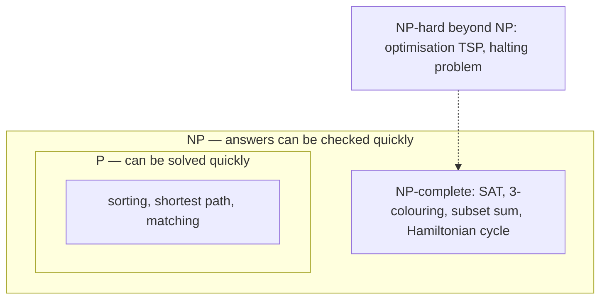

# Automata, Computability and Complexity — What Computers Can and Cannot Do

Every other chapter asks how to compute something. This one asks the deeper questions:
what can a machine with a given kind of memory recognise, what can **no** program ever
compute, and what can be computed in principle but — as far as anyone knows — not
efficiently? The answers are practical. They explain regular expressions and why
some regexes freeze servers, why you cannot parse HTML with a regex, how parsers and
compilers work, why perfect static analysis is impossible, and what to do when your
problem turns out to be NP-hard.

**Where this fits:** Part 4 · Maths behind computing, chapter 14 of 15. **Builds on:** [03 Logic and proofs](03_logic_and_proofs.md) (proof by contradiction); [04 Sets, relations and functions](04_sets_relations_functions.md) (countable and uncountable sets). **Used again in:** 15. **Next in order:** [15 Interview maths toolkit](15_interview_maths_toolkit.md).

## Where You Will Use This

| Where | Theory inside |
|---|---|
| Regex engines, lexers, input validation | Finite automata and regular languages |
| ReDoS (a regex that hangs a server) | Backtracking vs automaton-based matching |
| Parsers, compilers, JSON/SQL/config languages | Context-free grammars, recursive descent, stacks |
| Protocols and UI flows (TCP, checkout, auth) | State machines |
| Linters, type checkers, antivirus | Undecidability: they must approximate |
| "This scheduling/routing problem is slow" | NP-hardness; exact vs approximate vs heuristic |

## Foundations — Machines Defined by Their Memory

A **model of computation** is a precise, minimal description of a machine: what it can
read, what it can remember, and how it moves between steps. The models form a ladder, and
each rung is defined by its **memory**:

| Machine | Memory | Recognises | Everyday example |
|---|---|---|---|
| Finite automaton | a fixed number of states | **regular** languages | regexes, lexers, protocol state machines |
| Pushdown automaton | states + one **stack** | **context-free** languages | parsers for nested syntax (JSON, code) |
| Turing machine | states + unbounded **tape** | everything computable | every real computer (given enough memory) |

> **Analogy:** A finite automaton is a vending machine: it remembers only which state
> it is in ("25 cents inserted"), never the history. A pushdown automaton is a stack of
> plates: it can remember arbitrarily deep nesting, but only look at the top. A Turing
> machine is a clerk with unlimited scratch paper: it can remember and revisit anything.

A **language** here just means a set of strings — "all binary numbers divisible by 3",
"all balanced parenthesis strings", "all valid Python programs". Recognising a language
means answering yes/no for any input string.

## 1 · Finite Automata

> **Definition:** A **deterministic finite automaton** (DFA) has a finite set of
> states, an alphabet of input symbols, one start state, a set of accepting states, and
> a transition rule giving exactly one next state for every (state, symbol). It reads
> the input once, left to right, and accepts if it ends in an accepting state.

**Try it: step a machine through a string.** The default machine decides whether a binary
number is divisible by 3 using just three states — the remainder so far. Step through
`1001` (9) and watch it end in r0. Type your own inputs; switch machines to *contains “ab”*
(substring search) and *ends in “01”*.

<div class="lab" data-viz="math-dfa"></div>

In code a DFA is a dictionary of transitions and a loop — O(n) time, O(1) memory:

```python
def run_dfa(transitions, start, accepting, s):
    state = start
    for ch in s:
        state = transitions[(state, ch)]
    return state in accepting

# remainder mod 3 while reading binary: new = (2*old + bit) % 3
div3 = {(r, b): (2 * r + int(b)) % 3 for r in range(3) for b in "01"}
tests = ["0", "11", "110", "1001", "111", "10010"]
print([run_dfa(div3, 0, {0}, t) for t in tests])            # → [True, True, True, True, False, True]
print([int(t, 2) % 3 == 0 for t in tests])                  # → [True, True, True, True, False, True]
```

> **Notebook example:** Run the divisible-by-3 machine on the input `10101` and say whether
> it accepts.
>
> **What you need:** The machine has three **states**, r0, r1 and r2. Being in state r*k*
> means "the number read so far leaves remainder *k* when divided by 3". It starts in r0 and
> reads one bit at a time, left to right. After each bit it moves to a new state using the
> rule new = (2 × old + bit) mod 3, where "mod 3" means "the remainder after dividing by 3"
> (Python's `% 3`). The rule works because appending a bit to a binary number doubles it and
> adds the bit, just as appending a digit in decimal multiplies by 10 and adds the digit.
> r0 is the only **accepting state**: if the machine finishes there, the answer is yes.
>
> **Plan:** read the five bits one at a time, write down the state after each one, then look
> at where the machine ends.
>
> 1. **Start in r0.** Nothing has been read yet. The number so far is 0, and 0 leaves
>    remainder 0.
> 2. **Read the 1st bit, 1.** Old state r0: $2 \times 0 + 1 = 1$, and $1 \bmod 3 = 1$.
>    Now in **r1**.
> 3. **Read the 2nd bit, 0.** Old state r1: $2 \times 1 + 0 = 2$, and $2 \bmod 3 = 2$.
>    Now in **r2**.
> 4. **Read the 3rd bit, 1.** Old state r2: $2 \times 2 + 1 = 5$, and $5 \bmod 3 = 2$
>    (because $5 = 3 + 2$). Now in **r2**.
>    *Why:* the bits so far, `101`, are the number 5, and 5 leaves remainder 2. The state
>    tracks that without ever storing the 5.
> 5. **Read the 4th bit, 0.** Old state r2: $2 \times 2 + 0 = 4$, and $4 \bmod 3 = 1$.
>    Now in **r1**.
> 6. **Read the 5th bit, 1.** Old state r1: $2 \times 1 + 1 = 3$, and $3 \bmod 3 = 0$.
>    Now in **r0**.
> 7. **Look at the final state.** The input has ended and the machine is in r0, an accepting
>    state, so it **accepts**.
>
> **Answer:** the machine accepts, so `10101` is divisible by 3. It never stored the number
> itself, only the remainder so far, which is why three states are enough for numbers of
> any length.
>
> **Check:** $10101_2 = 16 + 4 + 1 = 21$, and $21 = 3 \times 7$. ✓ In the code above,
> `run_dfa(div3, 0, {0}, "10101")` returns `True`.

> **Your turn:** Run the same machine on `1101`. Does it accept?
>
> <details>
> <summary>Show the worked answer</summary>
>
> 1. **Start in r0.** Nothing read yet.
> 2. **Read the 1st bit, 1.** $2 \times 0 + 1 = 1$, and $1 \bmod 3 = 1$. Now in **r1**.
> 3. **Read the 2nd bit, 1.** $2 \times 1 + 1 = 3$, and $3 \bmod 3 = 0$. Now in **r0**.
> 4. **Read the 3rd bit, 0.** $2 \times 0 + 0 = 0$, and $0 \bmod 3 = 0$. Now in **r0**.
> 5. **Read the 4th bit, 1.** $2 \times 0 + 1 = 1$, and $1 \bmod 3 = 1$. Now in **r1**.
> 6. **Look at the final state.** r1 is not accepting, so the machine **rejects**.
>
> **Answer:** rejected. Indeed $1101_2 = 8 + 4 + 1 = 13 = 12 + 1$, which leaves remainder 1,
> exactly what state r1 says.
>
> </details>

> **In practice:** State machines are the cleanest way to write protocol and workflow
> logic: TCP connection states (LISTEN, SYN-RECEIVED, ESTABLISHED, …), an order
> (created → paid → shipped → delivered, with "cancelled" reachable only from some
> states), a login flow with MFA. Writing the transition table explicitly makes illegal
> transitions impossible to express by accident.

```python
ORDER = {
    ("created", "pay"): "paid", ("created", "cancel"): "cancelled",
    ("paid", "ship"): "shipped", ("paid", "cancel"): "refunded",
    ("shipped", "deliver"): "delivered",
}

def apply(state, events):
    for e in events:
        if (state, e) not in ORDER:
            return f"rejected: cannot {e} when {state}"
        state = ORDER[(state, e)]
    return state

print(apply("created", ["pay", "ship", "deliver"]))   # → delivered
print(apply("created", ["pay", "ship", "cancel"]))    # → rejected: cannot cancel when shipped
```

## 2 · Regular Expressions and Their Hidden Automata

**Kleene's theorem** (1956): regular expressions and finite automata describe exactly the
same languages. Every regex can be compiled into an automaton, and vice versa. A regex is
the friendly notation; the automaton is how it runs.

Compilation first builds a **nondeterministic** automaton (NFA), which may be in several
states at once (for `a|ab`, "I might be in either branch"), then either simulates all
current states in parallel or converts the NFA into a DFA (the **subset construction**:
each DFA state is a set of NFA states). Either way, matching takes **linear time** in the
input. RE2, Go's `regexp` and Rust's `regex` crate work like this.

> **Notebook example:** Run the NFA below on the input `aab`. It is meant to accept "strings
> of a's and b's that end in `ab`".
>
> | In state | on `a` it can go to | on `b` it can go to |
> |---|---|---|
> | q0 (start) | q0 or q1 | q0 |
> | q1 | nowhere | q2 |
> | q2 (accepting) | nowhere | nowhere |
>
> **What you need:** An **NFA** (nondeterministic finite automaton) is a state machine that
> may have several possible moves for one symbol, or none at all. Instead of guessing, we
> track the **set** of every state it could be in right now. A state with no move for the
> symbol just drops out of the set. The NFA **accepts** if, when the input ends, the set
> contains an accepting state (here q2). In words: q0 means "reading the early part", q1
> means "I just read an a that might be the second-to-last letter", q2 means "I just read
> the final b after that a".
>
> **Plan:** start with the set {q0}; for each symbol, follow every possible move from every
> state in the set and write down the new set.
>
> 1. **Start with the set {q0}.** Nothing has been read yet.
> 2. **Read the 1st symbol, a.** From q0, a can lead to q0 or q1. The set is now
>    **{q0, q1}**.
>    *Why:* the machine cannot yet know whether this a is the one just before the final b,
>    so it keeps both possibilities.
> 3. **Read the 2nd symbol, a.** From q0: q0 or q1. From q1: no move on a, so q1 drops out
>    (but q0 just put it back). The set is still **{q0, q1}**.
> 4. **Read the 3rd symbol, b.** From q0: q0. From q1: q2. The set is now **{q0, q2}**.
> 5. **Look for an accepting state.** The input has ended, and q2 is in {q0, q2}, so the NFA
>    **accepts**.
>
> **Answer:** `aab` is accepted, as it should be, since it ends in `ab`. Each set in this run
> ({q0}, then {q0, q1}, then {q0, q2}) is exactly one state of the equivalent DFA: that is
> the subset construction. Tracking the set costs one step per character and never
> backtracks.
>
> **Check:** by eye, `aab` ends in `ab`. ✓ In Python, `re.fullmatch(r"[ab]*ab", "aab")`
> finds a match.

> **Your turn:** Run the same NFA on `aba`. Is it accepted?
>
> <details>
> <summary>Show the worked answer</summary>
>
> 1. **Start with the set {q0}.**
> 2. **Read the 1st symbol, a.** From q0: q0 or q1. The set is **{q0, q1}**.
> 3. **Read the 2nd symbol, b.** From q0: q0. From q1: q2. The set is **{q0, q2}**.
> 4. **Read the 3rd symbol, a.** From q0: q0 or q1. From q2: no move, so q2 drops out. The
>    set is **{q0, q1}**.
> 5. **Look for an accepting state.** q2 is not in {q0, q1}, so the NFA **rejects**.
>
> **Answer:** rejected, which is right because `aba` ends in `ba`. q2 was in the set halfway
> through, but only the set at the very end counts.
>
> </details>

### Catastrophic backtracking (ReDoS)

Most regex engines — Python's `re`, Java, JavaScript, PCRE — do **not** use automata. They
**backtrack**: try one way to match, and on failure go back and try another. That enables
features automata cannot do (backreferences like `(\w+)\s\1`), but some patterns then
take **exponential** time. `(a+)+$` on `"aaaa…ab"` tries every way to split the a's
between the inner and outer `+` before giving up.

```python
# no-run — this hangs for large n; timings measured on the machine this chapter was written on
import re, time
for n in (18, 20, 22, 24):
    t = time.perf_counter()
    re.match(r"(a+)+$", "a" * n + "b")
    print(n, round(time.perf_counter() - t, 3))
```

| n | seconds |
|---|---|
| 18 | 0.013 |
| 20 | 0.049 |
| 22 | 0.195 |
| 24 | 0.803 |

Every extra character **doubles** the time; at n = 30 it is about a minute, at n = 40 over
half a day. An attacker who can send such a string to a server that runs such a regex stops it
with one request — **ReDoS** (regex denial of service), behind real outages including a
2019 Cloudflare incident. Defences: avoid nested quantifiers over overlapping patterns,
use an automaton-based engine (RE2) for untrusted input, or set a match timeout.

> **Notebook example:** Why does `(a+)+$` blow up? Count the ways the pattern can split
> `aaaa` (four a's) into groups.
>
> **What you need:** In a regex, `a+` means "one or more a's", so `(a+)+` means "one or more
> **groups**, each made of one or more a's". `$` means "end of the string". A run of a's can
> be cut into groups in many ways (`aaaa` as one group, or `aa` then `aa`, and so on). A
> **backtracking** engine tries one way; if the rest of the match fails, it goes back and
> tries the next way. On `aaaab` the `b` makes every attempt fail at `$`, so the engine tries
> **every** way before giving up. Counting the ways counts the work.
>
> **Plan:** turn "a way to split" into "a yes/no choice at each gap between letters", then
> count the choices.
>
> 1. **Mark the gaps.** Write `a|a|a|a`. Four letters have $4 - 1 = 3$ gaps between them.
> 2. **Turn a split into gap choices.** At each gap, either cut (end one group and start the
>    next) or don't cut. For example, cutting only the middle gap gives `aa` + `aa`.
>    *Why:* every split is exactly one pattern of cuts, and every pattern of cuts is exactly
>    one split, so counting one counts the other.
> 3. **Count the choices.** 3 gaps with 2 choices each: $2 \times 2 \times 2 = 8$.
>    *Why:* the product rule (chapter 05): independent choices multiply.
> 4. **List them to be sure.** Group sizes 4 | 3+1 | 1+3 | 2+2 | 2+1+1 | 1+2+1 | 1+1+2 |
>    1+1+1+1. That is 8.
> 5. **Generalise to n letters.** n letters have $n - 1$ gaps, so there are $2^{n-1}$ splits.
>
> **Answer:** `aaaa` can be split 8 ways, and n a's can be split $2^{n-1}$ ways. Each extra
> `a` doubles the number of attempts, which is the doubling in the timing table above.
>
> **Check:** the table adds 2 characters per row, so the time should grow by
> $2 \times 2 = 4$ per row. The measured ratios are 0.049 / 0.013 ≈ 3.8,
> 0.195 / 0.049 ≈ 4.0 and 0.803 / 0.195 ≈ 4.1. ✓

> **Your turn:** In how many ways can `(a+)+` split `aaaaa` (five a's)?
>
> <details>
> <summary>Show the worked answer</summary>
>
> 1. **Mark the gaps.** `a|a|a|a|a` has $5 - 1 = 4$ gaps.
> 2. **Turn a split into gap choices.** Each gap is either cut or not cut.
> 3. **Count the choices.** $2 \times 2 \times 2 \times 2 = 16$.
>
> **Answer:** 16 ways, twice the 8 ways for four a's. One more letter, double the work.
>
> </details>

## 3 · What Finite Memory Cannot Do

Is the language of **balanced parentheses** regular? No. Intuition: to accept `((((…))))`
the machine must remember how many `(` are open, and a DFA with k states cannot
distinguish k + 1 different depths — two depths land in the same state (pigeonhole,
chapter 04), and from then on the machine treats them identically, accepting a string it
should reject. (The formal version is the **pumping lemma**.)

> **Key idea:** Anything that needs **unbounded counting or nesting** — balanced
> brackets, matching HTML tags, nested comments, `aⁿbⁿ` — is beyond regular expressions.
> That is the real reason you cannot parse HTML or JSON with a regex. You need a stack.

> **Notebook example:** Prove that no DFA with 3 states accepts exactly the strings
> $a^n b^n$.
>
> **What you need:** $a^n b^n$ means n a's followed by the same number n of b's: `ab`,
> `aabb`, `aaabbb`, and so on. A DFA's only memory is which state it is in. So if two
> different inputs leave it in the **same state**, it can never tell them apart afterwards:
> whatever comes next, both behave identically. The **pigeonhole principle** (chapter 04):
> if you put more items than boxes, some box gets at least two items.
>
> **Plan:** the idea in plain words first. To recognise $a^n b^n$ the machine must remember
> how many a's it has seen, but 3 states can only remember 3 different things. Feed it 4
> different counts of a's, so two counts must share a state, then use that shared state to
> trick it into accepting a wrong string.
>
> 1. **Suppose it exists.** Assume some 3-state DFA accepts exactly the strings $a^n b^n$.
>    We will show this leads to nonsense (proof by contradiction, chapter 03).
> 2. **Pick 4 inputs.** Feed it `a`, `aa`, `aaa` and `aaaa` (1, 2, 3 and 4 a's), each from a
>    fresh start, and note the state each one ends in.
> 3. **Apply pigeonhole.** There are 4 inputs but only 3 states, so two of the inputs end in
>    the same state. Call their numbers of a's i and j, with $i \ne j$ (for example `aa` and
>    `aaaa`, so i = 2 and j = 4).
> 4. **Append i b's to the first.** $a^i b^i$ (for example `aabb`) is in the language, so the
>    machine must **accept** it.
> 5. **Append the same b's to the second.** $a^j$ ended in the same state as $a^i$, and now
>    it reads the same letters, so it follows exactly the same path and also **accepts**
>    $a^j b^i$ (for example `aaaabb`).
>    *Why:* a DFA's next move depends only on its current state and the next letter, never
>    on how it got there.
> 6. **Spot the contradiction.** $a^j b^i$ has j a's but i b's, and $j \ne i$, so it is
>    **not** in the language and must be rejected. The machine would have to accept and
>    reject the same string, which is impossible. So our assumption in step 1 was false.
>
> **Answer:** no 3-state DFA works. With k states, feed it k + 1 inputs and the same argument
> goes through, so **no** DFA of any size accepts $a^n b^n$. It needs unbounded counting,
> and that needs a stack.
>
> **Check:** a computer search over every possible 3-state machine on the letters a and b
> (5,832 of them, with the start state fixed) finds none that answers correctly on all
> strings of up to 8 letters. ✓

> **Your turn:** Prove that no DFA with 2 states accepts exactly the nested brackets `()`,
> `(())`, `((()))`, … (some number of `(` followed by the same number of `)`).
>
> <details>
> <summary>Show the worked answer</summary>
>
> 1. **Suppose it exists.** Assume a 2-state DFA accepts exactly these strings.
> 2. **Pick 3 inputs.** Feed it `(`, `((` and `(((`.
> 3. **Apply pigeonhole.** 3 inputs but only 2 states, so two of them, with i and j opening
>    brackets ($i \ne j$), end in the same state.
> 4. **Append i closing brackets to the first.** i opening then i closing is balanced, so the
>    machine must accept it.
> 5. **Append the same closing brackets to the second.** Same state, same letters, same path:
>    it also accepts j opening then i closing brackets.
> 6. **Spot the contradiction.** $j \ne i$, so that string is unbalanced and must be rejected.
>
> **Answer:** no 2-state DFA works, and the same argument with more inputs beats any number of
> states. This is why a regex cannot check balanced brackets.
>
> </details>

## 4 · Stacks, Grammars and Parsers

Add a stack to a finite automaton and you get a **pushdown automaton**, which recognises
**context-free languages**: those described by a **context-free grammar** — rules that
rewrite a name into a sequence of names and symbols.

```
expr   → term (("+" | "-") term)*
term   → factor (("*" | "/") factor)*
factor → NUMBER | "(" expr ")"
```

This grammar describes arithmetic with the usual precedence (* binds tighter than +,
because `term` sits below `expr`) and arbitrary nesting (`factor` can contain a whole
`expr`). A **recursive-descent parser** turns each rule into a function; the call stack
is the pushdown automaton's stack.

```python
import re

def evaluate(src):
    tokens = re.findall(r"\d+|[-+*/()]", src)        # the lexer: a regular language
    pos = 0
    def peek(): return tokens[pos] if pos < len(tokens) else None
    def take():
        nonlocal pos
        pos += 1
        return tokens[pos - 1]
    def expr():
        v = term()
        while peek() in ("+", "-"):
            v = v + term() if take() == "+" else v - term()
        return v
    def term():
        v = factor()
        while peek() in ("*", "/"):
            v = v * factor() if take() == "*" else v / factor()
        return v
    def factor():
        if peek() == "(":
            take()
            v = expr()
            take()                                    # ")"
            return v
        return int(take())
    return expr()

print(evaluate("2*(3+4)-5"), evaluate("2+3*4"), evaluate("((7))"))   # → 9 14 7
```

Note the division of labour: a **regex** (regular language) splits the text into tokens,
and a **grammar** (context-free) assembles the nested structure. Every compiler, JSON
parser and SQL engine is built this way.

> **Notebook example:** Parse and evaluate `2 + 3 * (4 - 1)` with the grammar above.
>
> **What you need:** The grammar, in plain words:
>
> - an **expr** is one or more terms joined by `+` or `-`;
> - a **term** is one or more factors joined by `*` or `/`;
> - a **factor** is a number, or a whole expr inside brackets.
>
> In a **recursive-descent parser** each rule is a function. When a rule needs a smaller
> piece it calls the rule below it, and `factor` calls `expr` again for a bracket: that is
> the **recursion**. Before parsing, a lexer splits the text into **tokens**, the separate
> numbers and symbols.
>
> **Plan:** start in `expr` and follow the calls, one token at a time, keeping track of which
> functions are still waiting for an answer.
>
> 1. **Split into tokens.** `2` `+` `3` `*` `(` `4` `-` `1` `)`.
> 2. **Read the first number.** `expr` calls `term`, `term` calls `factor`, and `factor`
>    takes the token `2` and returns 2.
>    *Why:* every expr starts with a term, and every term starts with a factor.
> 3. **Finish the first term.** `term` looks at the next token, `+`. It is not `*` or `/`,
>    so `term` is done and returns 2 to `expr`.
> 4. **Take the plus.** `expr` sees `+`, takes it, and calls `term` for the right-hand side.
> 5. **Read 3.** That `term` calls `factor`, which takes `3`.
> 6. **Take the times.** `term` sees `*`, takes it, and calls `factor` for the right-hand
>    side.
>    *Why:* `*` is handled inside `term`, one level deeper than `+`, so it gets finished
>    first. That is what precedence means.
> 7. **Open the bracket.** `factor` sees `(`, takes it, and calls `expr`. The call stack is
>    now expr → term → factor → expr.
> 8. **Read 4.** The inner `expr` calls `term`, which calls `factor`, which takes `4`. The
>    next token, `-`, is not `*` or `/`, so that `term` returns 4.
> 9. **Subtract.** The inner `expr` sees `-`, takes it, reads the next term, 1, and works out
>    $4 - 1 = 3$.
> 10. **Close the bracket.** The next token is `)`, not `+` or `-`, so the inner `expr`
>     returns 3. `factor` takes the `)` and returns 3.
> 11. **Multiply.** Back in the waiting `term`: $3 \times 3 = 9$. No `*` or `/` follows, so
>     it returns 9.
> 12. **Add.** Back in the outer `expr`: $2 + 9 = 11$. There are no tokens left.
>
> **Answer:** 11. The `*` was done before the `+` because `term` sits below `expr` in the
> grammar, not because of any special rule. The deepest call stack, expr → term → factor →
> expr → term → factor, grew by one level for the bracket: that is the stack a regex does
> not have.
>
> **Check:** Python itself evaluates `2 + 3 * (4 - 1)` to 11, and `evaluate("2 + 3 * (4 - 1)")`
> from the code above also returns 11. ✓

> **Your turn:** Parse and evaluate `(1 + 2) * 4` with the same grammar.
>
> <details>
> <summary>Show the worked answer</summary>
>
> 1. **Split into tokens.** `(` `1` `+` `2` `)` `*` `4`.
> 2. **Open the bracket.** `expr` calls `term`, which calls `factor`. `factor` sees `(`,
>    takes it, and calls `expr`.
> 3. **Add inside the bracket.** The inner `expr` reads 1, takes `+`, reads 2, and works out
>    $1 + 2 = 3$.
> 4. **Close the bracket.** `factor` takes the `)` and returns 3.
> 5. **Multiply.** `term` sees `*`, takes it, and reads the factor 4: $3 \times 4 = 12$.
> 6. **Finish.** No `+` or `-` follows, so `expr` returns 12.
>
> **Answer:** 12. The bracket wins over precedence because a bracket is a `factor`, the
> lowest level, so it is finished before anything else.
>
> </details>

## 5 · Turing Machines and the Church–Turing Thesis

Alan Turing (1936) modelled a person computing with pencil and paper: a finite set of
states, and an infinite tape of cells that a head can read, write, and move along one
cell at a time. That is all. Yet a **Turing machine** can compute anything any computer
can.

```python
def run_tm(rules, tape, state="right", head=0, blank="_", max_steps=10_000):
    tape = dict(enumerate(tape))
    for _ in range(max_steps):
        if state == "halt":
            break
        sym = tape.get(head, blank)
        write, move, state = rules[(state, sym)]
        tape[head] = write
        head += {"L": -1, "R": 1}[move]
    cells = [tape[i] for i in range(min(tape), max(tape) + 1)]
    return "".join(cells).strip(blank)

# binary increment: run to the right end, then add 1 with carries moving left
INC = {
    ("right", "0"): ("0", "R", "right"), ("right", "1"): ("1", "R", "right"),
    ("right", "_"): ("_", "L", "carry"),
    ("carry", "1"): ("0", "L", "carry"), ("carry", "0"): ("1", "L", "halt"),
    ("carry", "_"): ("1", "L", "halt"),
}
print(run_tm(INC, "1011"), run_tm(INC, "111"))   # → 1100 1000
```

> **Notebook example:** Run the binary-increment machine above on the tape `1011`.
>
> **What you need:** A Turing machine has a **tape** of cells (`_` is a blank cell), a
> **head** that points at one cell (shown here in square brackets), and a **state**. Each
> step it reads the symbol under the head, looks up the rule for (state, symbol), writes a
> symbol, moves one cell left (L) or right (R), and switches state. This machine's rules, in
> plain words:
>
> - state **right**, reading 0 or 1: leave it, move right (walk to the end of the number);
> - state **right**, reading `_`: leave it, move left, switch to **carry** (step back onto
>   the last digit);
> - state **carry**, reading 1: write 0, move left, stay in carry ($1 + 1 = 10$ in binary:
>   write 0, carry the 1 on);
> - state **carry**, reading 0 or `_`: write 1, move left, **halt** (the carry is used up).
>
> **Plan:** apply one rule per step and write the tape, head position and state after each.
>
> 1. **Read 1 in state right.** Tape `[1]011`. Leave it, move right. Now `1[0]11`, state
>    right.
> 2. **Read 0 in state right.** Leave it, move right. Now `10[1]1`, state right.
> 3. **Read 1 in state right.** Leave it, move right. Now `101[1]`, state right.
> 4. **Read 1 in state right.** Leave it, move right. Now `1011[_]`, state right.
>    *Why:* the head has walked past the last digit onto a blank cell, so it knows where the
>    number ends.
> 5. **Read _ in state right.** Move left and switch to carry. Now `101[1]`, state carry.
>    *Why:* adding 1 starts at the rightmost digit, just as you add by hand.
> 6. **Read 1 in state carry.** Write 0, move left. Now `10[1]0`, state carry.
>    *Why:* $1 + 1 = 2$, which is `10` in binary: write 0 and carry 1 to the next column.
> 7. **Read 1 in state carry.** Write 0, move left. Now `1[0]00`, state carry.
> 8. **Read 0 in state carry.** Write 1, move left, halt. Now `[1]100`, state halt.
>    *Why:* $0 + 1 = 1$ with nothing left to carry, so the job is done.
>
> **Answer:** the tape reads `1100`, which is 12, and the input `1011` was 11. Just a finite
> rule table and a tape, and yet this is the same kind of machine as your laptop.
>
> **Check:** $1011_2 = 8 + 2 + 1 = 11$ and $1100_2 = 8 + 4 = 12$, and $11 + 1 = 12$. ✓ The
> code above prints `1100` for `run_tm(INC, "1011")`.

> **Your turn:** Run the same machine on the tape `11`.
>
> <details>
> <summary>Show the worked answer</summary>
>
> 1. **Read 1 in state right.** `[1]1` becomes `1[1]`, state right.
> 2. **Read 1 in state right.** Move right: `11[_]`, state right.
> 3. **Read _ in state right.** Move left, switch to carry: `1[1]`, state carry.
> 4. **Read 1 in state carry.** Write 0, move left: `[1]0`, state carry.
> 5. **Read 1 in state carry.** Write 0, move left onto a blank: `[_]00`, state carry.
> 6. **Read _ in state carry.** Write 1, move left, halt. The tape reads `100`.
>
> **Answer:** `100`, which is 4, and $3 + 1 = 4$. ✓ The rule for a blank in state carry is
> what lets the number grow by a digit when the carry runs off the left end.
>
> </details>

> **Definition:** The **Church–Turing thesis** says that anything computable by any
> mechanical procedure is computable by a Turing machine. It is not a theorem (it relates
> maths to the physical world), but every model proposed since — lambda calculus, real
> CPUs, cellular automata, quantum computers — computes exactly the same set of
> functions. Any language that can simulate a Turing machine (given unbounded memory) is
> **Turing-complete**: Python, C, SQL with recursive CTEs, even Excel formulas and
> Minecraft redstone.

## 6 · Undecidable Problems: the Halting Problem

Can we write `halts(program, input)` that always answers, correctly, whether a program
finishes on an input? Turing proved **no** — with a diagonal argument (chapter 04):

```python
# no-run — a proof by contradiction, written as code
def halts(program, data) -> bool:
    ...                                  # suppose this always answered correctly

def troublemaker(program):
    if halts(program, program):          # would `program` halt when given itself?
        while True:                      # ...then loop forever
            pass
    return                               # ...otherwise halt

# Does troublemaker(troublemaker) halt?
#   If halts() says yes, troublemaker loops forever: halts() was wrong.
#   If halts() says no, troublemaker returns at once: halts() was wrong.
# Either way halts() is wrong on this input, so no correct halts() can exist.
```

> **Notebook example:** See the halting proof as a table. Rows are programs and columns are
> inputs, and each entry says whether the program **H**alts or **L**oops forever on that
> input.
>
> | | input P1 | input P2 | input P3 |
> |---|---|---|---|
> | **P1** | **H** | L | H |
> | **P2** | L | **L** | H |
> | **P3** | H | H | **L** |
>
> **What you need:** Picture this table going on forever, with a row for **every** program
> that exists. Programs are just text, so one program can be the input to another, or even
> to itself. If `halts()` existed, it could fill in any entry. `troublemaker(P)` asks
> `halts(P, P)` and then does the **opposite**: it loops if P would halt on itself, and halts
> if P would loop. The **diagonal** is the entries where a program is run on itself (bold
> above).
>
> **Plan:** the idea in plain words first. Build troublemaker's row from the diagonal, show
> that it disagrees with every row in at least one place, so it is none of the programs in
> the table, even though it must be one of them.
>
> 1. **Read the diagonal.** P1 on P1 is H, P2 on P2 is L, P3 on P3 is L. So: H, L, L.
> 2. **Flip each entry.** troublemaker does the opposite, so its row is L, H, H.
>    *Why:* that is exactly what the code does: if `halts` says "halts", loop, and the
>    other way round.
> 3. **Compare with row P1.** In column P1, P1 says H but troublemaker says L. Different.
> 4. **Compare with row P2.** In column P2, P2 says L but troublemaker says H. Different.
> 5. **Compare with row P3.** In column P3, P3 says L but troublemaker says H. Different.
>    *Why:* this is no accident. By construction, troublemaker differs from row k in column
>    k, for every k, however big the table is.
> 6. **Conclude troublemaker is not in the table.** Its row differs from every row.
> 7. **Spot the contradiction.** If `halts()` existed, troublemaker would be an ordinary
>    program (a few lines that call `halts()`), so it would have to be one of the rows. It
>    cannot both be a row and not be a row, so `halts()` cannot exist.
>
> **Answer:** no `halts()` can exist. This is Cantor's diagonal from chapter 04, with
> programs in place of digits.
>
> **Check:** compare L, H, H with the three rows directly: H L H, L L H and H H L. None of
> them is L H H. ✓

> **Your turn:** Here is a different table. Find troublemaker's row and show it differs from
> every row.
>
> | | input P1 | input P2 | input P3 |
> |---|---|---|---|
> | **P1** | L | H | H |
> | **P2** | H | H | L |
> | **P3** | L | L | H |
>
> <details>
> <summary>Show the worked answer</summary>
>
> 1. **Read the diagonal.** P1 on P1 is L, P2 on P2 is H, P3 on P3 is H: L, H, H.
> 2. **Flip each entry.** troublemaker's row is H, L, L.
> 3. **Compare with row P1.** Column P1: L against H. Different.
> 4. **Compare with row P2.** Column P2: H against L. Different.
> 5. **Compare with row P3.** Column P3: H against L. Different.
>
> **Answer:** troublemaker's row H, L, L is not any row of the table, so again it cannot be
> one of the programs.
>
> </details>

> **Key idea:** **Rice's theorem** generalises this: **every** non-trivial question about
> what a program *does* (not how it is written) is undecidable — "does it ever divide by
> zero?", "does it leak this secret?", "are these two functions equivalent?", "is this
> malware?". Static analysers, type checkers and antivirus tools are not bad at their
> jobs; they are forced to **approximate**, accepting some false alarms or some misses.

Undecidable does not mean "hard for big inputs"; it means **no algorithm at all** answers
correctly for every input. Timeouts, sound-but-conservative type systems and restricted
languages (a config language without loops, SQL without recursion) are how engineering
lives with it.

## 7 · Complexity: P, NP and NP-Completeness

Among problems that **can** be solved, complexity theory asks which can be solved
**efficiently** — in polynomial time, $O(n^k)$.

| Class | Informal meaning | Examples |
|---|---|---|
| **P** | can be **solved** in polynomial time | sorting, shortest paths, matching, 2-colouring, linear programming, primality testing |
| **NP** | a proposed answer can be **checked** in polynomial time | everything in P, plus sudoku, subset sum, scheduling, 3-colouring, SAT |
| **NP-complete** | in NP, and every NP problem reduces to it — the hardest problems in NP | SAT, 3-colouring, Hamiltonian cycle, subset sum, knapsack (decision), vertex cover |
| **NP-hard** | at least as hard as NP-complete (need not be in NP) | TSP optimisation, the halting problem |



The difference between **finding** and **checking** is the heart of it:

```python
from itertools import combinations

nums, target = [3, 34, 4, 12, 5, 2], 9

def check(certificate):                   # verifying a claimed answer: O(n)
    return all(c in nums for c in certificate) and sum(certificate) == target

def find():                               # searching for one: up to 2^n subsets
    for k in range(len(nums) + 1):
        for combo in combinations(nums, k):
            if sum(combo) == target:
                return combo

print(check((4, 5)), find())   # → True (4, 5)
```

> **Notebook example:** For the numbers 3, 34, 4, 12, 5, 2, is there a subset that sums to 9?
> Compare the work of **checking** a proposed answer with the work of **finding** one.
>
> **What you need:** A **subset** is any selection of the numbers, from none of them to all
> of them. A proposed answer that someone hands you is called a **certificate**. **P** is
> the class of problems that can be *solved* in polynomial time (work growing like n, n² or
> n³, not like $2^n$). **NP** is the class where a certificate can be *checked* in
> polynomial time. The product rule (chapter 05): n independent in-or-out choices give
> $2^n$ subsets.
>
> **Plan:** count the work to check the claim {4, 5}, then count the work for a blind search,
> and see how both grow when the list gets longer.
>
> 1. **Check the numbers are in the list.** Is 4 in the list? Yes. Is 5? Yes.
> 2. **Add the claim.** $4 + 5 = 9$.
> 3. **Compare with the target.** $9 = 9$, so the claim is correct. ✓
>    *Why:* checking needs at most one look-up and one addition per number in the claim, so
>    the work grows like n: polynomial.
> 4. **Count the subsets for a blind search.** Each of the 6 numbers is in or out:
>    $2^6 = 64$ subsets.
> 5. **Scale up to 60 numbers.** Checking is still at most about 60 additions. Blind search
>    is $2^{60} \approx 1.15 \times 10^{18}$ subsets.
> 6. **Turn it into time.** At a billion ($10^9$) subsets per second,
>    $1.15 \times 10^{18} / 10^9 = 1.15 \times 10^9$ seconds, which is about 36 years.
>
> **Answer:** yes, {4, 5} sums to 9. Checking took a handful of steps; finding by brute force
> grows like $2^n$. Whether every quickly checkable problem is also quickly solvable is
> exactly the P vs NP question.
>
> **Check:** the code above prints `True (4, 5)`. ✓ And $2^{10} \approx 10^3$, so
> $2^{60} = (2^{10})^6 \approx 10^{18}$, matching step 5.

> **Your turn:** For the numbers 2, 7, 1, 8 and target 10, someone claims {2, 8}. Check the
> claim, then count the subsets a blind search would face for these 4 numbers and for 30
> numbers.
>
> <details>
> <summary>Show the worked answer</summary>
>
> 1. **Check the numbers are in the list.** 2 is in the list, and so is 8.
> 2. **Add the claim.** $2 + 8 = 10$.
> 3. **Compare with the target.** $10 = 10$, so the claim is correct. ✓
> 4. **Count the subsets for a blind search.** $2^4 = 16$.
> 5. **Scale up to 30 numbers.** Checking: about 30 additions. Searching:
>    $2^{30} \approx 1.07 \times 10^9$ subsets.
>
> **Answer:** the claim is right. With 30 numbers, checking is about 30 steps but blind search
> is about a billion.
>
> </details>

**P vs NP** — whether every quickly-checkable problem is also quickly solvable — is the
most famous open problem in computer science (a Clay Millennium Prize problem). Most
researchers believe P ≠ NP; modern cryptography depends on problems (like factoring)
being hard to solve but easy to check.

### Reductions: how hardness is proved

To show a new problem X is NP-hard, **reduce** a known NP-complete problem to it: show
that a fast algorithm for X would give a fast algorithm for the known one. The same move
is useful in interviews in the other direction — "this is just shortest path on a graph
whose vertices are states" is a reduction **to** an easy problem.

## 8 · Living With NP-Hard Problems

Real systems solve NP-hard problems every day (scheduling, routing, packing, register
allocation, dependency resolution). The strategies:

| Strategy | Idea | Example |
|---|---|---|
| **Small n, exact** | exponential but fine for small inputs | bitmask DP for TSP up to ~20 cities: $O(2^n n^2)$ |
| **Pseudo-polynomial** | polynomial in the numeric **values**, not their bit length | subset sum / knapsack DP in $O(n \cdot W)$ |
| **Approximation** | a guaranteed ratio from optimal | vertex cover within 2×; metric TSP within 1.5× (Christofides) |
| **Heuristics / local search** | good answers, no guarantee | greedy, simulated annealing, genetic algorithms |
| **Special structure** | the general problem is hard; your instance may not be | 2-colouring, trees, planar or bounded-width graphs |
| **Solvers** | decades of engineering on hard problems | SAT/SMT solvers (package managers, verification), ILP solvers |

```python
def subset_sum_dp(nums, target):                 # pseudo-polynomial: O(n * target)
    reachable = {0}
    for x in nums:
        reachable |= {s + x for s in reachable if s + x <= target}
    return target in reachable

def vertex_cover_2approx(edges):                 # take both ends of any uncovered edge
    cover = set()
    for u, v in edges:
        if u not in cover and v not in cover:
            cover |= {u, v}
    return cover

print(subset_sum_dp([3, 34, 4, 12, 5, 2], 9), subset_sum_dp([3, 34, 4, 12, 5, 2], 30))   # → True False
star = [(0, i) for i in range(1, 6)]
print(len(vertex_cover_2approx(star)))           # → 2
```

The optimal cover of a star is just its centre (size 1); the approximation returns 2 —
within the guaranteed factor. The chosen edges share no vertex, and any cover must take
one end of each, so the result is never more than twice optimal.

> **Notebook example:** Solve subset sum for the numbers 3, 4, 5, 2 with target 9 using the
> pseudo-polynomial DP: track every reachable sum.
>
> **What you need:** A sum is **reachable** if some subset of the numbers seen so far adds up
> to it. When a new number x arrives, each old reachable sum s gives two options: skip x (s
> stays reachable) or take x (s + x becomes reachable). So the new set is the old set
> **merged** (∪, "union", keeping one copy of each value) with the old sums plus x. Sums
> bigger than the target are thrown away: the numbers are positive, so a sum can only grow
> and can never come back down to 9. This is **pseudo-polynomial**: the work depends on how
> big the target is, not on how many subsets there are.
>
> **Plan:** start from {0} and process the numbers one at a time: add the number to every
> sum, drop anything over 9, merge, and look for 9.
>
> 1. **Start with {0}.**
>    *Why:* choosing no numbers at all gives the sum 0.
> 2. **Add 3 to every sum.** $0 + 3 = 3$. New sums: {3}.
> 3. **Merge.** {0} ∪ {3} = **{0, 3}**.
> 4. **Add 4 to every sum.** $0 + 4 = 4$ and $3 + 4 = 7$. New sums: {4, 7}.
> 5. **Merge.** {0, 3} ∪ {4, 7} = **{0, 3, 4, 7}**.
> 6. **Add 5 to every sum.** $0 + 5 = 5$, $3 + 5 = 8$, $4 + 5 = 9$, $7 + 5 = 12$. Drop 12,
>    which is over 9. New sums: {5, 8, 9}.
> 7. **Merge.** {0, 3, 4, 7} ∪ {5, 8, 9} = **{0, 3, 4, 5, 7, 8, 9}**.
> 8. **Look for the target.** 9 is in the set, so the answer is yes. We can stop: the last
>    number, 2, could only add more sums, never remove 9.
>
> **Answer:** yes. Tracing back, 9 first appeared as $4 + 5$ in step 6. The work is at most
> (number of items) × (target + 1) = $4 \times 10 = 40$ entries, however many subsets there
> are. That is small when the numbers are small, which is why "weights ≤ 10⁴" in a problem
> statement is a hint.
>
> **Check:** `subset_sum_dp([3, 4, 5, 2], 9)` from the code above returns `True`, and
> $4 + 5 = 9$. ✓

> **Your turn:** Use the same method on the numbers 2, 5, 6 with target 10.
>
> <details>
> <summary>Show the worked answer</summary>
>
> 1. **Start with {0}.**
> 2. **Add 2 and merge.** $0 + 2 = 2$, so the set is {0, 2}.
> 3. **Add 5 and merge.** $0 + 5 = 5$ and $2 + 5 = 7$, so the set is {0, 2, 5, 7}.
> 4. **Add 6 and merge.** $0 + 6 = 6$, $2 + 6 = 8$, $5 + 6 = 11$, $7 + 6 = 13$. Drop 11 and 13
>    (over 10). The set is {0, 2, 5, 6, 7, 8}.
> 5. **Look for the target.** 10 is not in the set.
>
> **Answer:** no subset of 2, 5, 6 sums to 10. (All the subset sums are 0, 2, 5, 6, 7, 8, 11
> and 13.)
>
> </details>

> **Interview angle:** Recognising that a problem is NP-hard is a strong signal, not a
> dead end. Say so, then ask about the constraints: "n ≤ 20? bitmask DP. Weights ≤ 10⁴?
> pseudo-polynomial DP. Otherwise a greedy heuristic with this worst case, or an ILP
> solver." That is exactly the judgement interviewers look for.

## Common Mistakes

1. **Parsing nested structures with regex.**
2. **Running backtracking regexes with nested quantifiers on untrusted input.**
3. **Assuming a static analyser (or a test suite) can prove a program correct** in
   general.
4. **Calling an NP-hard problem "impossible".** It is solvable; it is (probably) not
   solvable fast in the worst case.
5. **Confusing NP with "not polynomial".** NP means "checkable in polynomial time"; P is
   inside NP.
6. **Missing the pseudo-polynomial escape hatch** when the numbers are small.

## Check Yourself

**1.** Design a DFA for binary strings with an even number of 0s and an even number of
1s. How many states?

<details>
<summary>Open the answer</summary>

Four: track (parity of 0s, parity of 1s) ∈ {even, odd}². Reading a 0 flips the first
component, a 1 the second. Accept only (even, even). Finite memory suffices because only
parities matter, not counts.

</details>

**2.** Why can a regex validate an email's shape but not check that brackets in a
formula are balanced?

<details>
<summary>Open the answer</summary>

An email's shape (`local@domain.tld`, with character rules) needs bounded memory — a
regular language. Balanced brackets need to count unbounded nesting depth, which no
finite automaton can do (pigeonhole on its states). You need a stack or a counter.

</details>

**3.** Your team wants a linter that flags every function that can ever raise
`KeyError` and nothing else. Possible?

<details>
<summary>Open the answer</summary>

Not exactly: by Rice's theorem "can this function ever raise KeyError?" is undecidable.
A real linter must either miss some cases or flag some safe code. Choose which error you
prefer and make the tool conservative in that direction.

</details>

**4.** Scheduling exams into the fewest slots so no student has two at once — what is
this, and what would you do for 500 exams?

<details>
<summary>Open the answer</summary>

Graph colouring (exams = vertices, shared students = edges; slots = colours), NP-hard in
general. For 500 exams: a greedy colouring by decreasing degree (DSatur) usually gives
near-optimal results quickly; if a proven optimum matters, an ILP or SAT solver can often
handle this size.

</details>

## What Each Level Should Know

| Level | Expected |
|---|---|
| **Getting started** | State machines and DFAs; regexes as automata; why regex cannot parse nesting; the halting problem in one paragraph; what P and NP mean |
| **Interview-ready** | Designing state machines for protocols and workflows; ReDoS and how to avoid it; recursive-descent parsing; Rice's theorem and its consequences for tooling; recognising NP-hard problems and choosing exact/pseudo-polynomial/approximate/heuristic approaches |
| **Going deeper** | NFA→DFA subset construction and minimisation; pumping lemmas; the Chomsky hierarchy; reductions and NP-completeness proofs; approximation guarantees; SAT/SMT solving |

## Checklist

- [ ] I can draw a DFA for a simple property and implement it as a transition table.
- [ ] I can explain why `(a+)+$` is dangerous and how RE2-style engines avoid it.
- [ ] I can explain why regexes cannot parse nested structures and what can.
- [ ] I can write a recursive-descent parser for a small grammar.
- [ ] I can sketch the halting-problem proof and state Rice's theorem.
- [ ] I can define P, NP, NP-complete and NP-hard, and give examples of each.
- [ ] Faced with an NP-hard problem, I can name four practical ways forward.
