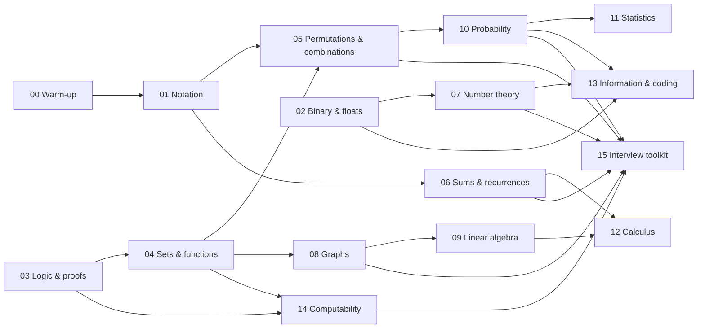

# Maths for CS Engineers — Start Here

The maths a software engineer actually uses, taught from zero to interview depth: reading
notation as code, binary and floating point, logic and proof, sets and functions,
counting, sums and recurrences, number theory, graphs, linear algebra, probability,
statistics, calculus, information theory, and the limits of computation. Every idea
comes with a plain-language explanation, an everyday analogy, notebook examples solved
by hand one small move at a time (with a *why* for each move), a **Your turn** problem to
try yourself, and runnable Python whose printed results are machine-checked. And 47 live,
interactive labs let you poke at the ideas until they click.

Rusty at school maths, or never liked it? Start with
[00 Maths warm-up](00_maths_warm_up.md): negative numbers, fractions, powers and
rearranging equations, gently, in under an hour. Everything else stands on it.

## Where to Start

Three steps, about five minutes, and you will know exactly which page to open.

### Step 1 · Find your starting chapter (2-minute check)

Answer each question in your head, in order, without looking anything up. **Start at the
first chapter whose question you cannot answer confidently.** Everything before it you
already know well enough; skim those chapters' checklists later.

| # | Can you answer this? | If not, start at |
|---|---|---|
| 0 | What is $\frac12 + \frac13$? If $3x + 5 = 20$, what is x? | [00 Maths warm-up](00_maths_warm_up.md) |
| 1 | What is $\sum_{i=1}^{4} i^2$, and how would you write it as a loop? | [01 Reading maths like code](01_reading_maths_like_code.md) |
| 2 | What is −1 as an 8-bit two's-complement number? | [02 Number systems and binary](02_number_systems_and_binary.md) |
| 3 | Does "if p then q" mean the same as "if q then p"? | [03 Logic and proofs](03_logic_and_proofs.md) |
| 4 | How many subsets does a 5-element set have? | [04 Sets, relations and functions](04_sets_relations_functions.md) |
| 5 | How many ways to **choose** 3 people from 10? To **line up** 3 of 10? | [05 Counting, permutations and combinations](05_counting_and_combinatorics.md) |
| 6 | Roughly how many steps does binary search take on a million items? | [06 Sequences, sums and recurrences](06_sequences_sums_recurrences.md) |
| 7 | What is $3^4 \bmod 5$? | [07 Number theory](07_number_theory.md) |
| 8 | A tree has 10 vertices. How many edges does it have? | [08 Graph theory](08_graph_theory.md) |
| 9 | What is the determinant of $\begin{pmatrix} 2 & 1 \\ 1 & 1 \end{pmatrix}$, and what does it mean? | [09 Linear algebra](09_linear_algebra.md) |
| 10 | Two fair dice: what is the probability the sum is 7? | [10 Probability](10_probability.md) |
| 11 | Mean and median of 1, 2, 3, 4, 100? Which one describes "typical"? | [11 Statistics](11_statistics.md) |
| 12 | What is the slope of $x^3$ at $x = 2$? | [12 Calculus](12_calculus.md) |
| 13 | How many bits of information are in one fair coin flip? | [13 Information theory and coding](13_information_theory_and_coding.md) |
| 14 | Can a regular expression match balanced brackets of any depth? | [14 Automata, computability and complexity](14_automata_computability_complexity.md) |

<details>
<summary>Open the answers</summary>

0. $\frac36 + \frac26 = \frac56$. Take 5 from both sides ($3x = 15$), then divide both
   sides by 3: $x = 5$.
1. $1 + 4 + 9 + 16 = 30$; `sum(i * i for i in range(1, 5))`.
2. `1111 1111`.
3. No. "If q then p" is the **converse**, a different statement.
4. $2^5 = 32$.
5. Choose: $\binom{10}{3} = 120$. Line up: $10 \times 9 \times 8 = 720$.
6. About 20, because $2^{20} \approx 10^6$.
7. $81 \bmod 5 = 1$.
8. 9.
9. $2 \cdot 1 - 1 \cdot 1 = 1$: the matrix keeps areas the same, and it can be undone.
10. 6 of the 36 outcomes, so $\frac16$.
11. Mean 22, median 3. The median describes "typical"; one outlier dragged the mean.
12. The derivative is $3x^2$, so 12.
13. 1 bit.
14. No. It needs unbounded counting, which takes a stack (a parser), not a finite
    automaton.

All correct? Go straight to [15 Interview maths toolkit](15_interview_maths_toolkit.md)
and use the other chapters as reference.

</details>

> **Watch out:** A gap in the middle matters more than where you start. If you could
> answer 0–4 but not 5, start at 05, but later come back for any question you got wrong
> further down.

### Step 2 · Pick your route

From your starting chapter, follow the route that matches your goal. Chapters you
already passed in Step 1 can be skipped.

| Your goal | Route | Time at 1 hour a day |
|---|---|---|
| **Rusty or never liked maths** — build it all from zero | 00 → 15 in order. Nothing is assumed beyond counting and basic Python; 00 rebuilds the school maths | 6–8 weeks |
| **Coding interviews** | 01 → 02 → 05 → 06 → 07 → 15, then 03 §6 (loop invariants) and 08 §3–7 | about 2 weeks |
| **System design and production work** | 02 (floats, overflow) → 06 → 10 → 11 → 13 → 15 §3 (estimation) | about 2 weeks |
| **ML and data foundations** | 01 → 06 → 09 → 10 → 11 → 12 → 13 | about 3 weeks |

The diagram under *The Learning Path* shows which chapters each one builds on, so you
can safely skip around. Each chapter also opens with a **Where this fits** line naming
what it needs and what comes next.

### Step 3 · Work every chapter the same way

1. **Read "Where you will use this"** and pick one row you care about.
2. **Read Foundations** slowly. The analogy is the part to remember.
3. **Do each Notebook example on paper, one step at a time.** Read *What you need* and
   the *Plan*, try the first move yourself, then press **Show step 1** (in the web app)
   to compare. Keep going step by step; the answer appears after the last one. Then do
   the **Your turn** problem under it before opening its worked answer.
4. **Play with each lab** as its *Try it* paragraph says. Predict before you press play.
5. **Run the code** and change one number; predict the new output first.
6. **Answer Check yourself out loud** before opening the answers. Tick the checklist only
   when you can do it without the page.

Stuck on a formula? Chapter 01 §7 shows how to read one you have never seen.

## The Learning Path

The chapters are numbered in learning order and grouped into four parts; the web app
lists them this way.

| Part | Chapters | After this part you can… |
|---|---|---|
| **0 · Warm-up** (optional) | [00 Maths warm-up](00_maths_warm_up.md) | Handle negatives, fractions, percentages, powers and roots; solve and rearrange an equation; read a straight-line graph; estimate and sanity-check an answer |
| **1 · The language of maths** | [01 Reading maths like code](01_reading_maths_like_code.md), [02 Number systems and binary](02_number_systems_and_binary.md), [03 Logic and proofs](03_logic_and_proofs.md), [04 Sets, relations and functions](04_sets_relations_functions.md) | Read any formula as code, reason about bits and floats, simplify conditions, prove a loop correct, and use sets, relations and functions precisely |
| **2 · Discrete maths** | [05 Counting, permutations and combinations](05_counting_and_combinatorics.md), [06 Sequences, sums and recurrences](06_sequences_sums_recurrences.md), [07 Number theory](07_number_theory.md), [08 Graph theory](08_graph_theory.md) | Count search spaces and DP states, derive any complexity bound, work modulo a prime, explain RSA, and reason about graphs and their algorithms |
| **3 · Continuous maths** | [09 Linear algebra](09_linear_algebra.md), [10 Probability](10_probability.md), [11 Statistics](11_statistics.md), [12 Calculus](12_calculus.md) | Work with vectors, matrices and eigenvectors; reason about randomness, collisions, experiments and percentiles; and understand gradients and optimisation |
| **4 · Maths behind computing** | [13 Information theory and coding](13_information_theory_and_coding.md), [14 Automata, computability and complexity](14_automata_computability_complexity.md), [15 Interview maths toolkit](15_interview_maths_toolkit.md) | Explain compression, entropy and error correction; know what is undecidable or NP-hard and what to do about it; and perform under interview pressure |



## How Every Chapter Teaches

Each chapter follows the same shape, because each part does a different job for your
memory:

| Part | What it does | How to use it |
|---|---|---|
| **Where you will use this** | Connects the topic to real engineering before any theory | Pick one row you care about and keep it in mind while reading |
| **Foundations** | The idea in plain language, with an **analogy** you can reuse | Read it even if you think you know the topic; the analogy is the hook |
| **Numbered sections** | The mechanism, formulas (rendered), diagrams and **worked examples** | One section per sitting; redo each worked example on paper |
| **Notebook examples** | One problem, one skill, solved by hand: *What you need*, a *Plan*, one small move per numbered step (each with a *why*), then the answer and a check | Try each move on paper, then reveal that step and compare. The web app shows one step at a time |
| **Your turn** | A similar problem right after each notebook example, with a hidden worked answer | Solve it fully before opening the answer. This is where the skill becomes yours |
| **Runnable code** | Python that *proves* the claims — `print(x)  # → value` lines are verified | Run it, then change a number and predict the new output first |
| **Live labs** | Interactive, animated experiments next to the text they explain | Do what the **Try it** paragraph says; **predict before you press play** |
| **Callouts** | 💡 key ideas, 🧩 analogies, 🧠 intuition, ⚠️ traps, 🎯 interview angles | Skim them all again before an interview |
| **Common mistakes** | The specific errors people make with this topic | Check your own code against them |
| **Check yourself** | Questions with hidden, worked answers | Answer out loud *before* opening — retrieval beats rereading |
| **Levels table and checklist** | What getting-started, interview-ready and deeper knowledge looks like | Tick the checklist only when you can do it without the page |

### Four habits that make it stick

1. **Predict, then check.** Before running code or pressing *Play*, say what you expect.
   Being surprised is when learning happens.
2. **Translate every formula into code** (chapter 01 shows how). If you can write the
   loop, you understand the Σ.
3. **Explain it to someone who does not know it** — or to a rubber duck. If you reach for
   jargon, go back to the analogy.
4. **Come back later.** Re-answer a chapter's *Check yourself* questions a day, a week
   and a month after reading it. Spaced retrieval is the most reliable way to remember.

### How to read a notebook example

Every notebook example has the same five parts, so after two or three you know exactly
where to look:

| Part | What it gives you |
|---|---|
| **What you need** | The one rule or formula the example uses, restated in plain words, so you never have to scroll back |
| **Plan** | The strategy in one sentence, before any working: *what* you will do and in which order |
| **Numbered steps** | One small move each, with its name in bold (*Substitute*, *Cancel*, *Count*…) and a *Why* line when the reason is not obvious. Every bit of arithmetic is written out |
| **Answer** | The result and what it means in everyday or engineering terms |
| **Check** | A second, independent way to confirm the answer (plug it back in, try a tiny case, run one line of Python) |

The bold step names are a recipe: when you meet a new problem of the same kind, the same
moves in the same order will usually solve it. If a step loses you, reread *What you
need*. It holds everything that step uses.

## Live Labs: Learn by Poking at It

Every lab sits next to the section it explains, with a *Try it* paragraph saying what to
do and what to notice.

| Chapter | Lab | What you see |
|---|---|---|
| 01 | Σ is a for-loop | A sum run term by term as code, bars and a running total, checked against the closed form |
| 02 | Eight bits | Clickable bits read as unsigned, signed (two's complement) and hex; overflow, negation and shifts |
| 02 | Inside a 32-bit float | Sign, exponent and fraction bits; the exact stored value; the gap to the next float |
| 03 | Truth tables side by side | Implication, contrapositive vs converse, De Morgan — equivalent or not, row by row |
| 03 | Induction dominoes | Base case and inductive step as falling dominoes; break either and watch the proof fail |
| 04 | Venn diagram operations | Union, intersection, difference, complement shaded, with Python, SQL and bitmask equivalents |
| 04 | Functions as arrows | Injective, surjective, bijective; the pigeonhole principle forcing collisions |
| 05 | Next and k-th permutation | The next-permutation algorithm step by step; the k-th permutation read off factorial-sized blocks |
| 05 | Arrange or choose? | Every outcome of the four counting cases listed, orderings grouped by selection and collapsing by k! |
| 05 | Pascal's triangle | C(n, k) and its two parents, Sierpiński parity, row sums of 2ⁿ |
| 05 | Grid paths | The binomial formula, then DP when cells are blocked |
| 05 | Growth-rate race | How far each complexity class gets in one second |
| 06 | Adding forever | Geometric, harmonic and arithmetic partial sums: settle or explode |
| 06 | A logarithm counts halvings | Binary search halving a list, on linear and log scales |
| 06 | Dynamic-array growth, recursion trees | Amortized doubling; the master theorem level by level |
| 07 | Sieve of Eratosthenes | Crossing off multiples from p², stopping at √N |
| 07 | Euclid's algorithm | gcd as squares tiling a rectangle, with the division table |
| 07 | Clock arithmetic | Adding, multiplying and powering mod m; when inverses exist |
| 08 | Graph playground | Build graphs; degrees, BFS rings, 2-colouring, Euler paths |
| 09 | Norms, dot product | L1/L2/L∞ distance; cosine similarity and projection |
| 09 | A matrix moves the plane | Drag î and ĵ; determinant, reflection, singular matrices, eigenvectors |
| 09 | Gaussian elimination | Row operations step by step; one, none or infinitely many solutions |
| 09 | PageRank | Power iteration and a random surfer converging to the same ranks |
| 09 | SVD and PCA | Rebuild an image from its top singular values; the direction of most variance |
| 10 | Base rates, distributions | Bayes with 1,000 people; common distributions and sampling |
| 10 | Birthday paradox | Collision probability for 365 days, 2¹⁶ and 2³² buckets, with simulation |
| 10 | Monte Carlo π | The law of large numbers and the 1/√n error band |
| 11 | Latency percentiles | Mean vs median vs p99 as the tail grows; fan-out amplification |
| 11 | Central limit theorem | Averages of skewed data becoming a bell curve with σ/√n spread |
| 11 | Coin-fairness test | p-values, false positives at α = 0.05, and power |
| 11 | Least squares | Squared errors and how outliers pull the fit |
| 12 | Secant to tangent | The derivative as a limit; the slope function; a corner with no derivative |
| 12 | Optimisers, backprop | Gradient descent variants on a loss surface; the chain rule node by node |
| 12 | Riemann sums | Left, right, midpoint and trapezoid rules and how fast their errors shrink |
| 12 | Taylor series, Newton's method | Polynomials rebuilding sin and eˣ; tangents doubling correct digits |
| 13 | Huffman coding, entropy | Building an optimal prefix code; entropy, cross-entropy and KL |
| 13 | Hamming(7,4), erasure coding | Three parity circles locating a flipped bit; replication vs Reed–Solomon |
| 14 | Finite automaton | Stepping DFAs (divisible by 3, contains "ab", …) through input strings |
| 15 | Cross product geometry | Orientation, segment intersection, shoelace area and convexity |

## Every Number Is Checked

The module follows this repository's rule: numbers are measured, not asserted. Every
Python block in these chapters is executed, and every line written as
`print(expression)  # → value` must print exactly that value:

```bash
python3 tools/check_maths_snippets.py        # all chapters
python3 tools/check_maths_snippets.py 07 10  # just these chapters
```

The code uses only the Python standard library (NumPy appears in one clearly marked
non-run block in chapter 09). Blocks within a chapter run in order in one namespace, like
notebook cells, so later examples may reuse earlier functions.
