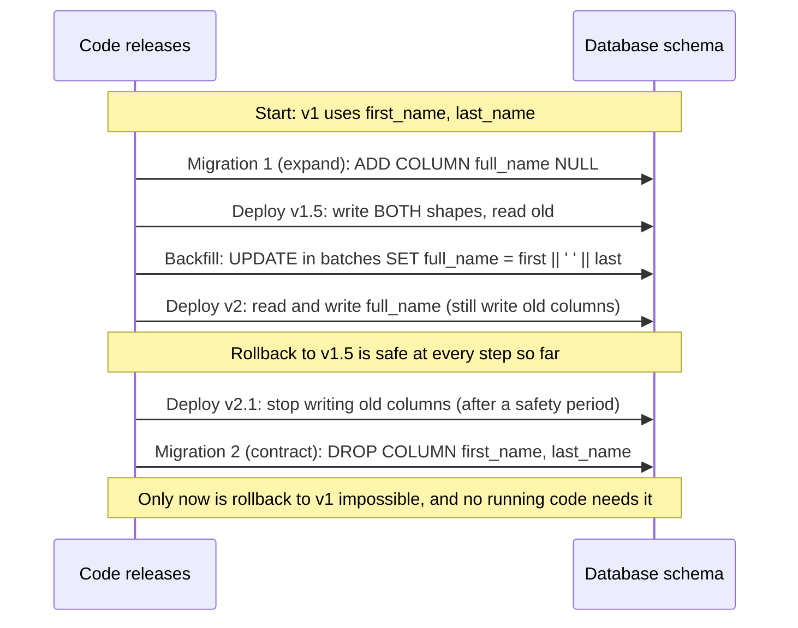

# Feature Flags and Rollbacks

Deploying code and releasing a feature used to be the same event. If you deployed bad
code, the only way to "un-release" it was to roll back the deployment, which takes
minutes, happens under stress, and cannot undo what the bad version already wrote to the
database. This chapter covers the two tools that make failure cheap: **feature flags**,
which separate *release* from *deploy* so a feature can be switched off in seconds, and
**rollback discipline**, which covers code, infrastructure and the hardest part, data.
The design of a large-scale flag *platform* (SDKs, distribution, bucketing at 50 billion
evaluations a day) is a system design problem of its own and is covered in
[Feature Flags](../../interview-core/SystemDesign/solutions/019_feature_flags_solution.md); this chapter is about using flags
and rollbacks well as a delivery practice.

## Foundations — How do you undo a change that is already in production?

### Deploy vs release, again

Chapter 02 separated **deploying** (new code is on the servers) from **releasing** (users
experience new behaviour). A feature flag is the simplest way to create that gap: the new
code path ships to production but sits behind an `if` whose condition is controlled from
outside the code, at runtime, without a new deploy.

```python
def process_payment(order):
    if flags.is_enabled("use_new_stripe_api", user_id=order.user_id):
        return stripe_v2.charge(order)
    return stripe_v1.charge(order)
```

### Why this matters

When something goes wrong in production, the first question is not "what is the bug?" but
"how fast can we stop the damage?" The options, roughly from fastest to slowest:

| Undo mechanism | Typical time to take effect (≈) | Undoes |
|---|---|---|
| Turn a feature flag off | Seconds (as fast as flag updates reach the SDKs) | The behaviour behind that flag only |
| Shift canary traffic back to stable | Seconds | The new version, for canary traffic |
| Switch blue/green back | Seconds | The whole new version |
| `kubectl rollout undo` / redeploy previous digest | Minutes (a full rolling update) | Code and pod spec |
| `git revert` + GitOps sync | Minutes | Everything declared in Git |
| Fix forward (new commit through the pipeline) | Tens of minutes or more | Whatever the fix fixes |
| Restore data from backup | Hours, and loses recent writes | Data, at a cost |

The further down the table you have to go, the worse the incident. Good delivery practice
is mostly about making sure that for any change, there is an undo high up in this table,
**and that the data layer never forces you to the bottom row**.

### An everyday example

A bank ships a new fraud model. The code has been in production for a week behind a flag
that is off. On Monday the team turns it on for employees; Tuesday for 1% of customers;
Wednesday 10%. On Wednesday afternoon, the false-positive rate for one card type jumps and
legitimate purchases are declined. The on-call engineer turns the flag off; within
seconds every server is back on the old model. No deploy, no rollback, no midnight
revert. The fix ships on Thursday, and the rollout resumes.

## 1. Feature flags: kinds, lifetimes and mechanics

### Not all flags are the same

Pete Hodgson's widely cited taxonomy (published on martinfowler.com) sorts flags by how
long they live and how dynamic they are:

| Kind | Purpose | Lifetime | Who flips it | Example |
|---|---|---|---|---|
| Release toggle | Hide unfinished or unreleased work so trunk stays deployable | Days to weeks, then **deleted** | Engineering | `new_checkout_flow` |
| Experiment toggle | Split users into A/B cohorts to measure impact | Duration of the experiment | Experimentation platform | `pricing_page_variant` |
| Ops toggle / kill switch | Turn off an expensive or risky path under load or during an incident | Some are permanent | On-call, sometimes automation | `disable_recommendations` |
| Permission toggle | Enable features for a plan, customer or group | Long-lived, part of the product | Product, sales, entitlements | `enterprise_sso` |

Mixing them up causes trouble: a release toggle that is never deleted becomes permanent
dead code; a permission toggle stored in the release-flag system gets deleted by someone
cleaning up "old flags".

### How flag evaluation works

A modern flag system does **not** make a network call per `is_enabled`. The application
embeds an SDK that holds a local snapshot of all flag rules, kept current by streaming or
polling from the flag service, and evaluates rules in-process in microseconds. If the flag
service is down, the SDK keeps serving its last snapshot, falling back to a
code-specified default if it has never loaded one. The details (snapshot distribution,
relays, bootstrap, audit) are in [Feature Flags](../../interview-core/SystemDesign/solutions/019_feature_flags_solution.md).

```arch
%% caption: Flag changes flow from the control plane to SDKs inside each service; evaluation is local, so a flag-service outage does not block requests.
grid 170x110
node eng "Engineer / on-call" at 0,0 icon=admin sub="flip, target, ramp"
node cp "Flag control plane" at 1,0 icon=flag sub="rules, audit, RBAC"
node relay "Stream / relay" at 2,0 icon=stream sub="push changes"
group svc "Service instance" color=orange icon=server
node sdk "Flag SDK" at 2,1 in svc icon=memory sub="local snapshot"
node code "App code" at 1,1 in svc icon=code sub="if flag: new path"
node users "Users" at 0,1 icon=users
node ev "Exposure events" at 2,2 icon=metrics sub="who saw what"
eng -> cp
cp -> relay
relay ..> sdk : "updates"
users -> code
code <-> sdk : "evaluate, ≈µs"
sdk ..> ev
```

**Deterministic percentage rollout.** "5% of users" must mean the *same* 5% on every
request and every server, and raising it to 20% must keep the original 5% in. The
standard technique is to hash the flag key, a salt and the user ID into a bucket and
compare the bucket with the percentage. This small, runnable version shows the
properties:

```python
import hashlib
from dataclasses import dataclass, field

BUCKETS = 100_000  # 0.001% resolution


def bucket(flag_key: str, salt: str, user_key: str) -> int:
    """Deterministic bucket in [0, BUCKETS) for one user and one flag."""
    digest = hashlib.sha256(f"{flag_key}.{salt}.{user_key}".encode()).digest()
    return int.from_bytes(digest[:8], "big") % BUCKETS


@dataclass
class Flag:
    key: str
    enabled: bool = True          # the kill switch: False beats every rule
    percent: float = 0.0          # share of users who get the new path
    allow: set = field(default_factory=set)   # always on (employees, QA)
    salt: str = "v1"

    def is_on(self, user_key: str) -> bool:
        if not self.enabled:
            return False
        if user_key in self.allow:
            return True
        return bucket(self.key, self.salt, user_key) < self.percent * BUCKETS / 100


if __name__ == "__main__":
    users = [f"user-{i}" for i in range(100_000)]
    flag = Flag("new-stripe-api", percent=5, allow={"alice@corp"})

    on_at_5 = {u for u in users if flag.is_on(u)}
    flag.percent = 20
    on_at_20 = {u for u in users if flag.is_on(u)}

    print(f"5%  -> {len(on_at_5)} users on")
    print(f"20% -> {len(on_at_20)} users on")
    print("sticky: everyone on at 5% is still on at 20%:", on_at_5 <= on_at_20)
    print("allow-listed employee on:", flag.is_on("alice@corp"))

    flag.enabled = False  # kill switch
    print("after kill switch:", sum(flag.is_on(u) for u in users), "users on")
```

Output of a run:

```text
5%  -> 4910 users on
20% -> 20105 users on
sticky: everyone on at 5% is still on at 20%: True
allow-listed employee on: True
after kill switch: 0 users on
```

Including the flag key in the hash means different flags pick different users, so the
same unlucky 5% do not receive every new feature first. Note also that 5% of 100,000 is
4,910 here, not exactly 5,000: percentage rollouts are statistical.

### Vendor-neutral code with OpenFeature

OpenFeature (a CNCF incubating project) defines a standard evaluation API with
pluggable providers for LaunchDarkly, Unleash, Flagsmith, GrowthBook, flagd, cloud
services and home-grown systems, so application code does not lock into one vendor:

```python
from openfeature import api
from openfeature.evaluation_context import EvaluationContext

# At startup: api.set_provider(<the provider for your flag system>)
client = api.get_client()

def process_payment(order):
    ctx = EvaluationContext(targeting_key=order.user_id, attributes={"country": order.country})
    if client.get_boolean_value("use_new_stripe_api", False, ctx):   # False = safe default
        return stripe_v2.charge(order)
    return stripe_v1.charge(order)
```

The default value in the call is not decoration: it is what runs when the flag system is
unreachable or the flag does not exist. Choose it deliberately per flag, usually the old,
known-good path.

## 2. Rolling out with flags, and cleaning up after

### The workflow (owner's steps, with the checks that make them safe)

1. **Deploy dark**: ship the new code path with the flag off everywhere. The code is
   *deployed*, not *released*. Verify the deploy itself did not change behaviour.
2. **Internal users first** (allow-list employees or a test tenant). Catch the obvious.
3. **1–5% of users**, chosen by deterministic bucketing. Watch error rate, latency and the
   business metric the feature touches, *split by flag variation*, so the comparison is
   on-vs-off, not before-vs-after.
4. **Ramp** (10%, 25%, 50%) with a hold at each step long enough to see real traffic
   patterns (a full business day for anything with daily cycles).
5. **100%**, then keep the flag for a short safety period.
6. **Delete the flag and the old code path.** The owner's outline said "a month later";
   many teams put an expiry date on each release flag at creation and have tooling open a
   cleanup ticket or fail a lint check when it passes.

### Kill switches

The owner's point stands: if the new integration fails at 50%, you do not revert a
commit, wait for CI, and roll pods; you turn the flag off and every server takes the old
path within seconds. Two refinements:

- A kill switch only helps if **the old path still works**. If the migration behind the
  feature has already dropped the old column, the old path crashes. Flags and schema
  changes must be planned together (section 5).
- Long-lived **ops toggles** for degradation ("turn off recommendations", "serve cached
  search results") are worth building on purpose for expensive dependencies, and
  exercising in game days, so they work during overload. See
  [Overload Control and Graceful Degradation](../../interview-core/SystemDesign/building_blocks/28_overload_control_and_graceful_degradation.md).

### Flag debt is real debt

- Every flag doubles the number of code paths through the code it guards; ten independent
  flags imply 1,024 combinations nobody has tested. Test the combinations that will
  actually exist in production (current default, and each flag's new state), not all.
- **Knight Capital, 2012**: a deploy reached only seven of eight servers, and a
  repurposed flag activated old, dead code ("Power Peg") on the eighth. The firm lost about
  $440 million in 45 minutes. The lessons are about flags as much as deploys: never
  reuse a flag name for a new meaning, delete dead code behind old flags, and verify that
  every server runs the same version.
- Flag changes are production changes. They need an audit log (who, when, why), access
  control, and ideally the same progressive, observable rollout as a deploy.

## 3. Rollback vs roll forward

```arch
%% caption: Mitigate first with the fastest safe lever; only fix forward when rolling back is impossible or slower.
grid 170x110
node inc "Regression after a change" at 1,0 shape=pill color=red
node flag "Behind a flag?" at 1,1 shape=diamond color=amber
node off "Turn the flag off" at 0,1 shape=card icon=flag color=green sub="seconds"
node prog "Canary still running?" at 1,2 shape=diamond color=amber
node abort "Abort rollout" at 0,2 shape=card icon=stop color=green sub="traffic to stable"
node data "Data change blocks v1?" at 1,3 shape=diamond color=amber
node back "Roll back" at 0,3 shape=card icon=sync color=green sub="revert or previous digest"
node fwd "Fix forward" at 2,3 shape=card icon=rocket color=orange sub="expedited pipeline"
inc -> flag
flag -> off : "yes"
flag -> prog : "no"
prog -> abort : "yes"
prog -> data : "no"
data -> back : "no"
data -> fwd : "yes"
```

**Mitigate first, debug second.** During an incident the goal is to stop user impact,
not to understand the bug. The team rule that works is "if a recent change is a plausible
cause, roll it back now and investigate afterwards"; Google's SRE practice treats a
rollback as the default first response to a regression that correlates with a release.

When **roll forward** (ship a fix) is the right call:

- The rollback path is broken or unsafe: the old version cannot read data the new version
  wrote, or the change was a one-way migration.
- The fix is trivial, obvious and faster through the pipeline than the rollback would be.
- Rolling back would reintroduce a worse problem (a security fix).

Rolling forward under pressure skips steps, so the expedited path should still run the
tests and the canary, just with shorter bake times.

## 4. Rolling back code and infrastructure

Not everything can be flagged: a framework upgrade, a new base image, a change to
resource limits or Ingress configuration. These need a real rollback.

### Kubernetes rollouts

A Deployment keeps its old ReplicaSets (up to `revisionHistoryLimit`, default 10):

```bash
# See the history of rollouts (add --revision=N for the pod template of one revision)
kubectl rollout history deployment/my-api

# Revert to the previous ReplicaSet's pod template (a normal rolling update)
kubectl rollout undo deployment/my-api

# Or a specific revision
kubectl rollout undo deployment/my-api --to-revision=7
```

**Precision notes on `rollout undo`**, which the owner described as "instantly revert":

- It is **not instant**. It starts a rolling update back to the old pod template, which
  takes as long as the forward rollout.
- It reverts **only the pod template**. ConfigMaps and Secrets the pods read, Services,
  Ingresses, HPAs and anything else changed in the same release are untouched. If the bad
  change was in a ConfigMap edited in place, `undo` does nothing useful. (Hashed
  ConfigMap names, from [Continuous Deployment (CD) and Delivery](02_cd_and_delivery.md), make config part of the pod template and
  therefore part of what `undo` restores.)
- In a GitOps setup with self-heal, the controller re-applies what Git says within
  moments, undoing your undo. Revert in Git instead ([GitOps and Argo CD](04_gitops_and_argocd.md)).
- Argo Rollouts has its own `abort` and `undo`; use those for Rollout objects.

### Rolling back everything else

| Thing that changed | Rollback | Watch out |
|---|---|---|
| Container image | Redeploy the previous digest (or `git revert` in GitOps) | Keep old images in the registry; retention policies can delete them |
| Helm release | `helm rollback <release> <revision>` | Hooks rerun; CRD changes are not rolled back by Helm |
| Infrastructure as code | Revert the commit and `terraform apply` | Some resources cannot be recreated identically (deleted data, new IPs); review the plan |
| Serverless function | Point the alias back at the previous version | Event source mappings and permissions may have changed too |
| Mobile app | You cannot; use server-side flags and backward-compatible APIs | Old app versions live for months or years |
| Data and schema | Usually cannot be undone; design so you never need to (section 5) | See below |

**Practise it.** A rollback path that has never been exercised is a hope, not a plan.
Teams that roll back routinely (every failed canary is one) find broken rollback paths
before incidents do.

## 5. Database rollbacks: the hard part

Rolling back code is easy. Rolling back data is dangerous, because the new version has
already written data in its new shape and users have kept using the system since.

The owner's example is the classic failure:

1. v1 reads and writes `first_name` and `last_name`.
2. v2 ships with a migration that combines them into `full_name`, drops the old columns,
   and writes only `full_name`.
3. v2 has a critical bug. You roll the code back to v1.
4. v1 starts, queries `first_name`, and crashes: the column is gone. Every rollback
   option in section 3's table is now useless, and you are restoring from backup and
   losing every write since the migration.

A "down" migration that recreates the columns does not save you either: it cannot
reconstruct which `full_name` values came from which first/last split, and anything v2
wrote in the meantime exists only in the new column.

### Expand and contract (parallel change)

The rule: **never make a schema change that the currently running version, or the
version you might roll back to, cannot live with.** Split every incompatible change into
backward-compatible steps, each shipped and verified separately:



1. **Expand**: add the new column, nullable, with no default that rewrites the table.
   Old code ignores it.
2. **Dual-write**: deploy code that writes both the old and new shapes but still reads the
   old one. Rollback to v1 is safe.
3. **Backfill** existing rows in small batches (to avoid long locks and replication lag),
   idempotently, so it can be stopped and resumed.
4. **Switch reads** to the new column, behind a flag if possible, and verify (compare old
   and new in shadow reads for a while).
5. **Stop writing the old shape** after a safety period in which rollback past this point
   is no longer plausible.
6. **Contract**: drop the old columns in a later release.

Each step is independently deployable and reversible, and at no point does a running
version depend on a schema that is not there. The same pattern applies to renaming a
column or table, splitting a table, changing a type, and changing message and API formats.
Postgres-specific details (which `ALTER TABLE` forms take long locks, `CREATE INDEX
CONCURRENTLY`, `NOT VALID` constraints) are in [Schema Migrations](../../data-and-apis/SQL/12_schema_migrations.md); the broader
design view is in [Data Design and Schema Evolution in Code](../../interview-core/SoftwareDesign/09_data_design_and_schema_evolution.md).

### Other data-rollback rules

- **Migrations run as their own pipeline step**, before the code that needs them (a
  `PreSync` hook, a Job, a Flyway/Liquibase/Atlas/Alembic step), never lazily at app
  start on every replica.
- **Data written by the new version must be readable by the old one**: new enum values,
  new JSON fields, new message types. Tolerant readers and schema registries help.
- **Destructive operations** (drop, delete, truncate) go in their own, later release, with
  a backup verified restorable beforehand.
- **Point-in-time recovery** is the last resort, not a rollback strategy: it loses every
  write after the restore point.

## 6. Putting it together: a release plan for a risky change

For "move payments from Stripe API v1 to v2, which also changes how we store payment
methods":

1. Expand migration: add new columns and tables; deploy with no behaviour change.
2. Deploy the v2 integration code dark behind `use_new_stripe_api` (default off); canary
   the deploy itself.
3. Dual-write payment-method data; backfill in batches; verify counts and checksums.
4. Ramp the flag: employees, 1%, 10%, 50%, 100%, with error rate, authorisation rate and
   latency dashboards split by variation, and a documented kill-switch owner.
5. Keep the old path and old columns for a safety period; then delete the flag and the old
   code; then the contract migration.

At every step, the undo is either "flag off" or "redeploy the previous digest", both at
the top of the undo table, and none requires touching data.

## Common interview questions

**1. What is the difference between deploying and releasing, and how do flags help?**
Deploying puts code on servers; releasing exposes behaviour to users. Flags keep new code
off in production so deploys are low risk, then release it gradually and turn it off in
seconds without a deploy.

**2. What kinds of feature flags are there?**
Release (short-lived, deleted after rollout), experiment (A/B tests), ops/kill switches
(sometimes permanent, for degradation and incidents) and permission (entitlements,
long-lived). They differ in lifetime, who changes them and how they should be managed.

**3. How do you make a percentage rollout sticky per user?**
Hash the flag key, a salt and the user ID into a fixed number of buckets and enable the
flag for buckets below the percentage. The same user always lands in the same bucket, and
raising the percentage only adds users.

**4. What happens if the flag service goes down?**
With local-evaluation SDKs, services keep evaluating against their last snapshot, and if
they have none, use the default passed in code. That is why defaults must be the safe
path, and why evaluation must never block on a network call.

**5. Why is `kubectl rollout undo` not a complete rollback?**
It only restores the previous pod template via another rolling update. ConfigMaps,
Secrets, Services, HPAs, database schema and data are untouched, and in GitOps the
controller re-applies Git and undoes it.

**6. A release dropped a column and the new version is broken. What now, and how do you prevent it?**
The old version cannot run, so you must fix forward or restore data. Prevent it with
expand/contract: add the new shape, dual-write, backfill, switch reads, stop old writes,
and drop the old column only in a later release when no possible rollback target needs it.

**7. When do you roll forward instead of back?**
When rollback is impossible or unsafe (one-way data change, reintroducing a security
hole) or the fix is trivial and faster through the pipeline. Otherwise mitigate by
rolling back first and debug afterwards.

**8. What are the risks of feature flags?**
Combinatorial code paths, stale flags and dead code (Knight Capital), inconsistent
defaults, flags reused for new meanings, and flag changes made without audit or
progressive rollout. Manage flags with owners, expiry dates, cleanup and change control.

## What Each Engineering Level Should Know

| Level | Industry title | Google ladder | What they should know |
|---|---|---|---|
| Student/Intern | Intern | Intern | What a feature flag is and why deploy and release are different; that rolling back code does not roll back data |
| Junior (L3) | Software Engineer / New Grad | L3 | Wraps new behaviour in a flag with a safe default; deletes flags after rollout; can run `rollout undo` and knows what it does not revert; writes backward-compatible migrations with guidance |
| Mid (L4) | Software Engineer II | L4 | Plans a percentage rollout with metrics split by variation; implements expand/contract for a schema change with batched backfills; chooses between flag-off, rollback and fix-forward during an incident |
| Senior (L5) | Senior Software Engineer | L5 | Designs release plans for risky changes that keep a fast undo at every step; sets flag hygiene (owners, expiry, audit); ensures rollback paths are exercised; reasons about compatibility of data, events and APIs across versions |
| Staff+ (L6+) | Staff / Principal Engineer | L6–L7+ | Sets organisation-wide policy: flag platform choice or design (see the 019 solution), kill-switch standards for critical dependencies, migration review and tooling, and incident rules that make "mitigate first, roll back by default" the norm |

## Interview checklist

- [ ] I can explain deploy vs release and rank undo mechanisms by speed.
- [ ] I can name the four kinds of flags and how their lifetimes differ.
- [ ] I can explain local SDK evaluation and why the default value matters.
- [ ] I can implement deterministic percentage bucketing and explain stickiness and per-flag independence.
- [ ] I can describe a safe flag ramp, with metrics compared by variation.
- [ ] I can explain flag debt and the Knight Capital lesson.
- [ ] I can decide between flag-off, abort, rollback and fix-forward during an incident.
- [ ] I can say exactly what `kubectl rollout undo` does and does not revert, and why GitOps changes the answer.
- [ ] I can walk through expand/contract for renaming or merging columns, including backfill and when the contract step is safe.
- [ ] I can write a release plan for a risky change that keeps a fast undo at every step.

Related: [Feature Flags](../../interview-core/SystemDesign/solutions/019_feature_flags_solution.md) (designing the flag
platform), [Experimentation Platform](../../interview-core/SystemDesign/solutions/037_experimentation_platform_solution.md),
[Schema Migrations](../../data-and-apis/SQL/12_schema_migrations.md), [Data Design and Schema Evolution in Code](../../interview-core/SoftwareDesign/09_data_design_and_schema_evolution.md),
[Deployment Strategies](03_deployment_strategies.md), [GitOps and Argo CD](04_gitops_and_argocd.md).
