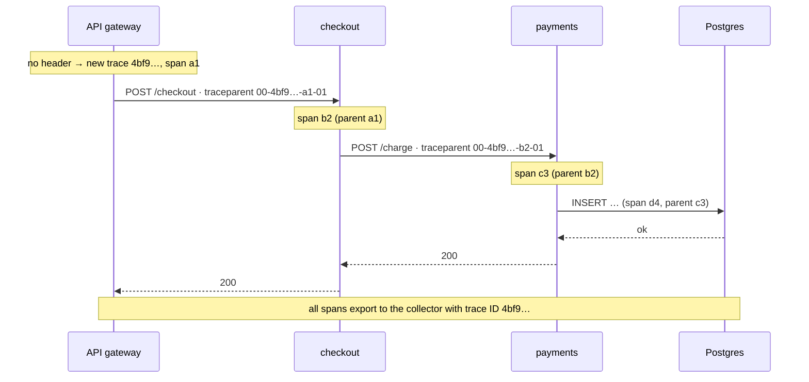

# Observability and Monitoring

Observability is the ability to understand what a system is doing inside, including
failures nobody predicted, from the data it emits. Monitoring is the part that watches
for known problems and alerts on them. In a system of dozens of services, one slow
checkout can involve ten processes on twenty machines, and without good telemetry the
only debugging tool left is guessing. This chapter starts with the signals (metrics, logs,
traces and profiles) and what each is good at, then covers the tools that dominate in
2026: Prometheus and PromQL, Grafana, structured logging pipelines, distributed tracing
with OpenTelemetry, SLOs and burn-rate alerting, and cost and cardinality control. It ends
with a debugging workflow that connects all of them.

## Foundations — How do you know what a running system is doing?

### The problem

Your API's error rate jumps at 14:02. Questions you need answered within minutes: is it
all endpoints or one? All regions or one? Did a deploy just happen? Which dependency is
failing? Which customers are affected? A system you can't answer those questions about
is a system you can only restart and hope. **Telemetry** is the data your software emits
so you can answer them: numbers over time, records of events, and the path of individual
requests.

### Monitoring vs observability

- **Monitoring** asks predefined questions: "is the error rate above 1%?" "is the disk
  90% full?" It powers dashboards and alerts for failure modes you anticipated.
- **Observability** is the property that lets you ask **new** questions without shipping
  new code: "why are only Android users in Brazil on app version 7.3 slow since 14:02?"
  That needs high-detail, well-correlated data (traces and structured events with rich
  attributes), not just a few pre-aggregated graphs.

You need both: monitoring tells you *that* something is wrong; observability helps you
find *why*.

### The signals

| Signal | What it is | Good at | Weak at | Everyday analogy |
|---|---|---|---|---|
| **Metrics** | Numbers aggregated over time, with labels (`http_requests_total{route="/pay",code="500"}`) | Cheap trends, dashboards, alerting | Individual requests, high-cardinality detail | A car's dashboard gauges |
| **Logs** | Timestamped records of discrete events, ideally structured (JSON) | Exact detail of what happened, errors with context | Expensive at volume; hard to aggregate | The ship's logbook |
| **Traces** | The path of one request across services, as a tree of timed **spans** | Where latency and errors come from in a distributed call | Sampled; heavier to collect | A parcel's tracking history |
| **Profiles** | Where CPU time or memory goes, by function, continuously | Why a service is slow or big at the code level | Not request-scoped by default | An X-ray |

The popular phrase is "three pillars" (metrics, logs, traces); profiles are increasingly
the fourth. The more useful idea is that the signals are **correlated**: a metric spike
links to example traces (exemplars), a trace links to the logs written during it (via
`trace_id`), and a trace span links to the profile of that code.

### How it fits together

```arch
%% caption: Services emit telemetry through OpenTelemetry SDKs; a collector processes and routes it to a store per signal; Grafana queries them all and alerts go to on-call.
grid 170x105
group apps "Your services" color=orange icon=service
node svc1 "checkout" at 0,0 in apps icon=service sub="OTel SDK"
node svc2 "payments" at 1,0 in apps icon=service sub="OTel SDK"
node col "OTel Collector" at 1,1 icon=workflow sub="batch, filter, sample"
group st "Backends" color=pink icon=monitor
node prom "Prometheus / Mimir" at 0,2 in st icon=prometheus sub="metrics"
node loki "Loki / Elastic" at 1,2 in st icon=logs sub="logs"
node tempo "Tempo / Jaeger" at 2,2 in st icon=trace sub="traces"
node graf "Grafana" at 1,3 icon=grafana sub="dashboards, explore"
node am "Alertmanager" at 0,3 icon=alert sub="routes to on-call"
svc1 -> col
svc2 -> col : "OTLP"
col -> prom
col -> loki
col -> tempo
prom -> graf
loki -> graf
tempo -> graf
prom -> am
```

### Vocabulary table

| Term | Meaning |
|---|---|
| Time series | One metric name + one exact label set, with (timestamp, value) samples |
| Cardinality | The number of distinct time series (or distinct values of a label) |
| Scrape | Prometheus pulling `/metrics` from a target over HTTP |
| Span / trace | One timed operation / the tree of spans for one request, sharing a trace ID |
| Context propagation | Passing the trace ID (and parent span ID) across process boundaries, e.g. in the `traceparent` header |
| SLI / SLO / error budget | A measured indicator / a target for it over a window / the allowed failure (1 − SLO) |
| OTLP | The OpenTelemetry Protocol for sending telemetry (gRPC or HTTP) |
| Exemplar | A sample trace ID attached to a metric data point |

## 1. Metrics and the Prometheus data model

### Metric types

| Type | Behavior | Examples | Query with |
|---|---|---|---|
| **Counter** | Only goes up (resets to 0 on restart) | Requests served, errors, bytes sent | `rate()`, `increase()`; never graph raw |
| **Gauge** | Goes up and down | Queue depth, memory in use, in-flight requests | Directly, `avg_over_time()` |
| **Histogram** | Counts observations into buckets (`le` = less than or equal), plus `_sum` and `_count` | Request duration, payload size | `histogram_quantile()` over `rate()` of buckets |
| **Summary** | Quantiles computed in the client | Legacy latency metrics | Can't be aggregated across instances |

**Prefer histograms to summaries for latency**: you can sum histogram buckets from 50
pods and compute a fleet-wide p99, but you can't average fifty p99s into a correct p99.
Prometheus 3.x also supports **native histograms** (exponential buckets chosen
automatically, stored as one series), which give much better resolution at lower cost
than hand-picked classic buckets.

### How a quantile is estimated from buckets

`histogram_quantile(0.99, …)` finds the bucket where the 99th percentile observation
falls and **linearly interpolates** inside it. The answer can only be as precise as your
bucket boundaries. This runnable sketch reproduces the calculation:

```python
def histogram_quantile(q, buckets):
    """buckets: list of (upper_bound, cumulative_count), sorted, last bound = inf."""
    total = buckets[-1][1]
    rank = q * total
    prev_bound, prev_count = 0.0, 0
    for bound, count in buckets:
        if count >= rank:
            if bound == float("inf"):
                return prev_bound               # Prometheus returns the highest finite bound
            in_bucket = count - prev_count
            frac = (rank - prev_count) / in_bucket if in_bucket else 0
            return prev_bound + (bound - prev_bound) * frac
        prev_bound, prev_count = bound, count
    return float("nan")

# per-second rates of http_request_duration_seconds_bucket over 5 minutes
buckets = [(0.05, 800), (0.1, 930), (0.25, 985), (0.5, 996), (1.0, 999), (float("inf"), 1000)]
for q in (0.5, 0.9, 0.99, 0.999):
    print(f"p{q * 100:g} ≈ {histogram_quantile(q, buckets) * 1000:.0f} ms")
```

It prints p50 ≈ 31 ms, p90 ≈ 88 ms, p99 ≈ 364 ms and p99.9 ≈ 1000 ms. Note the p99.9 is
just the edge of the `1.0` bucket: if your SLO threshold is 300 ms, put a bucket boundary
at 0.3 so the question "what fraction was under 300 ms" has an exact answer.

### Labels and the cardinality trap

Every distinct combination of label values is a separate time series, stored and indexed
separately. `http_requests_total{route, method, code}` with 50 routes × 5 methods × 10
codes is at most 2,500 series per instance, which is fine. Add `user_id` with a million users and
you have billions: Prometheus runs out of memory. Rules:

- Labels must have **bounded** values: route templates (`/users/{id}`), not raw paths;
  status class or code, not error messages.
- **Never** put user IDs, request IDs, emails, full URLs or timestamps in labels. That
  detail belongs in traces and logs.
- Watch `prometheus_tsdb_head_series` and per-metric series counts; many teams budget
  series per service.

### Exposing and scraping

Applications expose a text endpoint that Prometheus scrapes on an interval (commonly
15–60 s):

```text
# HELP http_requests_total Requests served.
# TYPE http_requests_total counter
http_requests_total{route="/pay",method="POST",code="200"} 10432
http_requests_total{route="/pay",method="POST",code="500"} 17
# TYPE http_request_duration_seconds histogram
http_request_duration_seconds_bucket{route="/pay",le="0.1"} 9120
http_request_duration_seconds_bucket{route="/pay",le="0.3"} 10301
http_request_duration_seconds_bucket{route="/pay",le="+Inf"} 10449
http_request_duration_seconds_sum{route="/pay"} 812.4
http_request_duration_seconds_count{route="/pay"} 10449
```

```yaml
# prometheus.yml (excerpt)
global:
  scrape_interval: 30s
  evaluation_interval: 30s
rule_files: ["rules/*.yml"]
alerting:
  alertmanagers:
    - static_configs: [{ targets: ["alertmanager:9093"] }]
scrape_configs:
  - job_name: kubernetes-pods
    kubernetes_sd_configs: [{ role: pod }]
    relabel_configs:
      - source_labels: [__meta_kubernetes_pod_annotation_prometheus_io_scrape]
        action: keep
        regex: "true"
```

On Kubernetes most teams use the **Prometheus Operator** (`ServiceMonitor` /
`PodMonitor` objects) via the kube-prometheus-stack Helm chart, which also brings
node-exporter, kube-state-metrics, Alertmanager and Grafana.

**Pull vs push.** Prometheus pulls: it knows when a target is down (`up == 0`), targets
don't need to know where monitoring lives, and you can curl `/metrics` yourself.
Short-lived batch jobs can't be scraped reliably; they push to a Pushgateway or, more and
more, send OTLP metrics to a collector. Prometheus 3.x can also **receive** OTLP metrics
directly, and **remote-write** everything to long-term storage.

## 2. PromQL you actually use

```promql
# Per-second request rate over the last 5 minutes, per route
sum by (route) (rate(http_requests_total[5m]))

# Error ratio (5xx / all)
sum(rate(http_requests_total{code=~"5.."}[5m]))
  / sum(rate(http_requests_total[5m]))

# p99 latency across all pods, per route (classic histogram)
histogram_quantile(0.99,
  sum by (le, route) (rate(http_request_duration_seconds_bucket[5m])))

# Fraction of requests faster than 300 ms (an SLI)
sum(rate(http_request_duration_seconds_bucket{le="0.3"}[5m]))
  / sum(rate(http_request_duration_seconds_count[5m]))

# CPU throttling ratio per container (Kubernetes, cAdvisor metrics)
sum by (pod, container) (rate(container_cpu_cfs_throttled_periods_total[5m]))
  / sum by (pod, container) (rate(container_cpu_cfs_periods_total[5m]))

# Targets that are down
up == 0

# Disk full in 4 hours at the current trend
predict_linear(node_filesystem_avail_bytes{mountpoint="/"}[6h], 4 * 3600) < 0
```

Precision points interviewers probe:

- **`rate` before `sum`, always.** `rate()` handles counter resets per series; summing raw
  counters first makes a restart look like a huge negative spike.
- **`rate` vs `irate` vs `increase`.** `rate` is the per-second average over the window
  (use for alerts and most graphs); `irate` uses only the last two samples (spiky, for
  high-resolution debugging graphs); `increase` is `rate × window`, for "how many in the
  last hour". The window should be at least 4× the scrape interval.
- **Aggregate buckets by `le`** before `histogram_quantile`, or you get per-pod quantiles.
- **Recording rules** precompute expensive expressions (`job:http_errors:ratio_rate5m`)
  so dashboards and alerts are fast and consistent.

## 3. Scaling metrics beyond one Prometheus

A single Prometheus is a single node with local storage (default retention 15 days).
Beyond that:

| Need | Options |
|---|---|
| Long retention, global query across clusters | **Thanos** (sidecar uploads blocks to object storage), **Grafana Mimir** or **Cortex** (remote-write, horizontally scalable), **VictoriaMetrics** |
| High availability | Two identical Prometheus replicas scraping the same targets, deduplicated in the query layer |
| Managed | Amazon Managed Prometheus, Google Cloud Managed Service for Prometheus, Grafana Cloud, Datadog, New Relic, Chronosphere |
| Less agent sprawl | OpenTelemetry Collector or Grafana Alloy scraping and remote-writing |

## 4. What to measure: RED, USE, golden signals and SLOs

- **RED** (for request-driven services): **R**ate, **E**rrors, **D**uration (as a
  histogram; look at p50/p95/p99, never only the average, which hides the slow tail).
- **USE** (for resources: CPU, memory, disks, NICs, pools, queues): **U**tilization,
  **S**aturation (queued work: run-queue length, throttling, connection-pool waits),
  **E**rrors.
- **Google SRE's four golden signals:** latency, traffic, errors, saturation. RED plus
  saturation.

These are prompts, not a checklist; see
[Observability and Reliability](../../interview-core/SystemDesign/building_blocks/15_observability_and_reliability.md) for how they drive
design discussions.

### SLIs, SLOs and error budgets

An **SLI** is a ratio of good events to valid events, measured where users feel it
(ideally at the load balancer or client). An **SLO** is a target for it over a window.
The **error budget** is what is left: `1 − SLO`.

| SLO over 30 days | Error budget | Allowed full-outage time |
|---|---|---|
| 99% | 1% | ≈ 7.2 hours |
| 99.9% | 0.1% | ≈ 43 minutes |
| 99.95% | 0.05% | ≈ 21.6 minutes |
| 99.99% | 0.01% | ≈ 4.3 minutes |

The budget turns reliability into a decision: while budget remains, ship features; when
it is spent, prioritize reliability work. Example SLOs: "99.9% of `POST /pay` requests
return a non-5xx response in a rolling 30 days" and "99% of them complete in under
300 ms".

### Alerting on burn rate, not on thresholds

"Error rate > 1% for 5 minutes" pages people for blips that barely touch the budget, and
misses slow leaks. **Burn rate** is how fast you're consuming the budget relative to
plan: burn rate 1 spends exactly the budget over the SLO window; burn rate 14.4 spends 2%
of a 30-day budget in one hour. Google's SRE workbook recommends **multi-window,
multi-burn-rate** alerts: page when both a long and a short window burn fast (the short
window makes the alert stop quickly after recovery), open a ticket for slow burns.

```yaml
# rules/checkout-slo.yml — SLO 99.9% availability over 30 days (budget 0.001)
groups:
  - name: checkout-slo
    rules:
      - record: job:slo_errors:ratio_rate5m
        expr: |
          sum(rate(http_requests_total{job="checkout",code=~"5.."}[5m]))
          / sum(rate(http_requests_total{job="checkout"}[5m]))
      - record: job:slo_errors:ratio_rate1h
        expr: |
          sum(rate(http_requests_total{job="checkout",code=~"5.."}[1h]))
          / sum(rate(http_requests_total{job="checkout"}[1h]))
      - record: job:slo_errors:ratio_rate30m
        expr: |
          sum(rate(http_requests_total{job="checkout",code=~"5.."}[30m]))
          / sum(rate(http_requests_total{job="checkout"}[30m]))
      - record: job:slo_errors:ratio_rate6h
        expr: |
          sum(rate(http_requests_total{job="checkout",code=~"5.."}[6h]))
          / sum(rate(http_requests_total{job="checkout"}[6h]))
      - alert: CheckoutErrorBudgetFastBurn
        expr: |
          job:slo_errors:ratio_rate1h > (14.4 * 0.001)
          and job:slo_errors:ratio_rate5m > (14.4 * 0.001)
        labels: { severity: page }
        annotations:
          summary: "checkout is burning its 30-day error budget ≈14× too fast"
          runbook_url: "https://runbooks.example.com/checkout/error-budget"
      - alert: CheckoutErrorBudgetSlowBurn
        expr: |
          job:slo_errors:ratio_rate6h > (6 * 0.001)
          and job:slo_errors:ratio_rate30m > (6 * 0.001)
        labels: { severity: page }
```

Tools such as Sloth, Pyrra and OpenSLO generate these rules from a short SLO spec.

## 5. Logs

### Structured logging

Write logs as structured events (JSON), one per line, to **stdout/stderr**. The container
runtime captures them and an agent ships them; the app never manages log files or
rotation. Every line should carry the same core fields so you can filter and join:

```python
import json
import logging
import sys
import time

class JsonFormatter(logging.Formatter):
    def format(self, record):
        event = {
            "ts": time.strftime("%Y-%m-%dT%H:%M:%S", time.gmtime(record.created))
                  + f".{int(record.msecs):03d}Z",
            "level": record.levelname.lower(),
            "logger": record.name,
            "msg": record.getMessage(),
        }
        event.update(getattr(record, "fields", {}))      # structured context
        if record.exc_info:
            event["exc"] = self.formatException(record.exc_info)
        return json.dumps(event)

handler = logging.StreamHandler(sys.stdout)
handler.setFormatter(JsonFormatter())
log = logging.getLogger("checkout")
log.addHandler(handler)
log.setLevel(logging.INFO)

log.info("payment declined", extra={"fields": {
    "service": "checkout", "version": "1.9.0",
    "trace_id": "4bf92f3577b34da6a3ce929d0e0e4736", "span_id": "00f067aa0ba902b7",
    "order_id": "981", "psp_code": "insufficient_funds", "duration_ms": 184,
}})
```

Good practice:

- **Levels mean something.** ERROR = someone may need to act; WARN = unexpected but
  handled; INFO = significant business events; DEBUG off in production (or sampled).
- **Include `trace_id` and `span_id`** in every log line (OpenTelemetry logging bridges
  do this automatically) so you can jump from a trace to its logs.
- **Log the event, not the story:** `payment declined` with fields, not a sentence with
  values baked into the text (which can't be aggregated).
- **No secrets or personal data.** Redact tokens, card numbers, passwords, and minimize
  PII; logs are copied widely and retained long.
- **Sample or rate-limit noisy logs.** A hot loop logging each iteration can cost more
  than the service itself.

### Log pipelines

| Stage | Common tools |
|---|---|
| Collect on each node | Fluent Bit, Vector, OpenTelemetry Collector, Grafana Alloy (DaemonSets tailing container logs) |
| Parse, enrich, route | The same agents, or Logstash in classic ELK |
| Store and search | **Elasticsearch / OpenSearch** (full-text index on every field: powerful, expensive), **Grafana Loki** (indexes only labels, stores compressed chunks in object storage: cheap, grep-like queries), ClickHouse-based stores, cloud services (CloudWatch Logs, Cloud Logging), Datadog, Splunk |
| View | Kibana / OpenSearch Dashboards, Grafana |

The classic **ELK** stack is Elasticsearch, Logstash, Kibana (with Beats agents).
Loki's design choice matters in interviews: because it indexes only a few labels
(namespace, app, level), label cardinality rules from §1 apply to Loki too; the log body
is filtered at query time (`{app="checkout"} |= "declined" | json | duration_ms > 500`).

Cost control: retention tiers (hot for days, cheap object storage for weeks), dropping
debug logs at the agent, sampling successful-request logs, and turning high-volume logs
into metrics at the collector.

## 6. Distributed tracing

### Spans and traces

A **trace** is the full journey of one request. It is a tree of **spans**; each span is
one operation with a name, start and end time, status, attributes (`http.route`,
`db.system`, `messaging.destination`), events and a parent span ID. The waterfall view of
a trace shows at a glance where time went: 400 ms of a 480 ms request spent waiting on
one database query, or ten sequential calls that could run in parallel.

### Context propagation

For spans in different processes to join one trace, each outgoing call must carry the
trace context. The W3C Trace Context standard defines the `traceparent` header:

```text
traceparent: 00-4bf92f3577b34da6a3ce929d0e0e4736-00f067aa0ba902b7-01
             │  │                                │                └ flags (01 = sampled)
             │  │                                └ parent span ID (16 hex)
             │  └ trace ID (32 hex)
             └ version
```



Propagation must also cross **asynchronous** boundaries: put `traceparent` in Kafka
record headers or AMQP message properties, and have the consumer start a span linked to
it. W3C **Baggage** carries application key-values (tenant, experiment) alongside.

This runnable snippet parses and validates the header and creates a child context:

```python
import re
import secrets

TRACEPARENT = re.compile(r"^([0-9a-f]{2})-([0-9a-f]{32})-([0-9a-f]{16})-([0-9a-f]{2})$")

def parse_traceparent(value):
    m = TRACEPARENT.match(value.strip().lower())
    if not m:
        return None
    version, trace_id, parent_id, flags = m.groups()
    if version == "ff" or trace_id == "0" * 32 or parent_id == "0" * 16:
        return None                      # invalid per the spec: start a new trace instead
    return {"trace_id": trace_id, "parent_id": parent_id, "sampled": int(flags, 16) & 1 == 1}

def child_traceparent(ctx):
    span_id = secrets.token_hex(8)       # this service's new span becomes the downstream parent
    return f"00-{ctx['trace_id']}-{span_id}-{'01' if ctx['sampled'] else '00'}"

incoming = "00-4bf92f3577b34da6a3ce929d0e0e4736-00f067aa0ba902b7-01"
ctx = parse_traceparent(incoming)
print(ctx)
print("outgoing:", child_traceparent(ctx))
print("bad header ->", parse_traceparent("00-" + "0" * 32 + "-00f067aa0ba902b7-01"))
```

In real code you never write this: the OpenTelemetry SDK's propagators and
auto-instrumentation for HTTP clients/servers, gRPC, database drivers and messaging
libraries do it.

### Sampling

Tracing every request at high volume is expensive. Options:

| Strategy | Decided | Pros | Cons |
|---|---|---|---|
| **Head sampling** (e.g. keep 5% by trace ID) | At the first service, propagated in the flags | Cheap, consistent across services | Keeps 5% of errors too; rare slow requests are likely dropped |
| **Tail sampling** | In the collector, after the whole trace has arrived | Keep 100% of errors and slow traces, a small % of the rest | Collector must buffer complete traces (memory, and all spans of a trace must reach the same collector instance) |
| Always on | — | Complete data | Only affordable at low volume |

### OpenTelemetry

**OpenTelemetry (OTel)**, a CNCF project formed in 2019 from OpenTracing and OpenCensus,
is the vendor-neutral standard for generating and shipping telemetry:

- **API and SDKs** per language to create spans, metrics and logs; tracing and metrics are
  stable in major languages, and logs are stable in several; profiling is the newest
  signal.
- **Auto-instrumentation** (Java agent, Python/Node/.NET instrumentation, and eBPF-based
  zero-code instrumentation for Go and others) that traces common frameworks without code
  changes.
- **Semantic conventions**: standard attribute names (`http.request.method`,
  `http.response.status_code`, `db.system`, `service.name`), so every backend understands
  the data.
- **OTLP**, the wire protocol, and the **Collector**, a pipeline of receivers →
  processors → exporters that decouples apps from backends: switch vendors by changing
  collector config, not code.

```yaml
# otel-collector.yaml: receive OTLP, batch, tail-sample traces, export to three backends
receivers:
  otlp:
    protocols:
      grpc: { endpoint: 0.0.0.0:4317 }
      http: { endpoint: 0.0.0.0:4318 }
processors:
  memory_limiter: { check_interval: 1s, limit_percentage: 80, spike_limit_percentage: 20 }
  batch: {}
  tail_sampling:
    decision_wait: 10s
    policies:
      - { name: errors, type: status_code, status_code: { status_codes: [ERROR] } }
      - { name: slow, type: latency, latency: { threshold_ms: 500 } }
      - { name: baseline, type: probabilistic, probabilistic: { sampling_percentage: 5 } }
exporters:
  otlp/tempo: { endpoint: tempo:4317, tls: { insecure: true } }
  prometheusremotewrite: { endpoint: http://mimir:9009/api/v1/push }
  otlphttp/loki: { endpoint: http://loki:3100/otlp }
service:
  pipelines:
    traces:  { receivers: [otlp], processors: [memory_limiter, tail_sampling, batch], exporters: [otlp/tempo] }
    metrics: { receivers: [otlp], processors: [memory_limiter, batch], exporters: [prometheusremotewrite] }
    logs:    { receivers: [otlp], processors: [memory_limiter, batch], exporters: [otlphttp/loki] }
```

(`tail_sampling` and `prometheusremotewrite` ship in the collector's "contrib"
distribution.) Collectors typically run as an **agent** (DaemonSet or sidecar, close to
the app) plus a **gateway** tier for tail sampling and routing. Trace backends: Jaeger,
Grafana Tempo, Zipkin, and commercial ones (Honeycomb, Datadog, Lightstep/ServiceNow,
New Relic, Dynatrace).

## 7. Alerting and on-call

**Alertmanager** receives firing alerts from Prometheus and handles the human side:

- **Grouping**: 200 pods failing the same way become one notification.
- **Inhibition**: if the whole cluster is down, suppress the 500 per-service alerts.
- **Silences**: mute during planned maintenance.
- **Routing**: `severity=page` to PagerDuty/Opsgenie for the owning team, `severity=ticket`
  to Slack or the issue tracker.

What makes alerts good:

1. **Alert on symptoms users feel** (SLO burn, error rate, latency at the edge), not on
   every cause (CPU 80% on one node). Causes go on dashboards.
2. **Every page is actionable** and urgent; anything that can wait until morning is a
   ticket. Pages that are routinely ignored train people to ignore pages.
3. **Every alert has a runbook link** and an owner.
4. **Review alert noise** in each on-call handoff; delete or fix flapping alerts.
5. Also monitor the monitoring: a "dead man's switch" alert that always fires, and pages
   when it *stops* arriving.

## 8. Profiling and eBPF

**Continuous profiling** (Grafana Pyroscope, Parca, Google Cloud Profiler, Datadog)
samples stacks from production at low overhead (≈ 1–2% is typical) and shows flame
graphs over time: which function got slower after a deploy, where allocations come from.
OpenTelemetry has added profiles as a signal, still maturing in 2026.

**eBPF** lets tools run sandboxed programs in the Linux kernel to observe syscalls,
network flows and function calls without changing applications: Pixie, Cilium Hubble
(network flows), Parca's profiler, and OTel's eBPF instrumentation. It gives visibility
into code you can't instrument (third-party binaries, the kernel), at the cost of needing
privileged node agents.

## 9. A debugging workflow that connects the signals

```arch
%% caption: Start from the symptom, narrow with metrics, pick an example trace, then read the logs and profile for that exact request.
grid 170x100
node alert "Page: SLO burn" at 0,0 icon=alert sub="checkout 5xx"
node dash "RED dashboard" at 1,0 icon=dashboard sub="which route, region, version"
node ex "Exemplar" at 2,0 icon=metrics sub="trace ID on a spike"
node trace "Trace waterfall" at 2,1 icon=trace sub="payments → PSP 2.1 s"
node logs "Logs by trace_id" at 1,1 icon=logs sub="timeout, retries"
node prof "Profile / deploy diff" at 0,1 icon=code sub="what changed"
alert -> dash -> ex -> trace -> logs -> prof
```

1. **Scope** with metrics: which service, route, region, version, customer tier? Did a
   deploy, config change or traffic spike line up with 14:02? (Put deploy events on
   dashboards as annotations.)
2. **Pick an example**: click an exemplar on the latency panel or query traces with
   `status=error` in the window.
3. **Read the trace**: which span is slow or failing? Is it one dependency, a retry storm,
   a lock, a cold cache?
4. **Read the logs for that trace ID**: the actual error message and context.
5. **Mitigate first** (roll back, fail over, shed load), then find the root cause with
   profiles and code, and write the postmortem.

## 10. Cost and cardinality management

Telemetry can cost as much as the service it watches. Levers:

| Signal | Lever |
|---|---|
| Metrics | Drop unused metrics and labels at scrape (`metric_relabel_configs` with `action: drop`/`labeldrop`), recording rules plus lower retention for raw data, native histograms instead of many classic buckets |
| Logs | Level discipline, sampling success logs, dropping at the agent, short hot retention, cheaper stores for archives |
| Traces | Tail sampling (keep errors and slow traces), dropping health-check spans, limiting attribute size |
| All | Per-team usage dashboards and budgets; the collector as the single choke point for policy |

## Common interview questions

**"What's the difference between monitoring and observability?"**
Monitoring checks known conditions and alerts on them. Observability is the ability to
answer new questions about system behavior from its telemetry without new code, which
requires rich, correlated, high-detail data such as traces and structured events.

**"Metrics, logs and traces: when do you use each?"**
Metrics for cheap aggregate trends and alerting; logs for detailed records of specific
events; traces to see how one request flowed across services and where its time went.
Correlate them with trace IDs and exemplars.

**"Why use histograms instead of averages for latency?"**
Averages hide the tail: a 50 ms average can coexist with a 2 s p99 that hits every user
who makes many calls. Histograms let you compute percentiles and aggregate them across
instances; summaries can't be aggregated.

**"Explain `rate()` and why you apply it before `sum()`."**
`rate()` computes the per-second increase of a counter over a window, compensating for
counter resets. Summing raw counters across pods first turns a single pod restart into a
drop that looks like a negative rate.

**"What is high cardinality and why does it matter?"**
Each unique label combination is a separate series. Unbounded labels like user ID or
request path explode the series count and memory of Prometheus. Keep labels bounded and
put per-request detail in traces and logs.

**"How does distributed tracing work across services?"**
Each service reads the incoming `traceparent` header, starts a child span with the same
trace ID, and injects its own span ID into outgoing calls, including message headers for
async hops. Spans are exported via OTLP to a collector and backend, which assembles them
by trace ID.

**"Head vs tail sampling?"**
Head sampling decides at the start, cheaply, but drops most errors along with everything
else. Tail sampling decides after the trace completes, so it can keep all errors and slow
requests, at the cost of buffering whole traces in the collector.

**"How would you alert on an SLO?"**
Define the SLI as good/valid events, set the SLO and error budget, and page on
multi-window burn rates (for example 14.4× over 1 h and 5 m for a 30-day window), with
slower burns as tickets; don't page on raw thresholds of causes.

**"Why is Prometheus pull-based, and what about batch jobs?"**
Pull makes target health visible (`up`), keeps targets simple and decoupled from the
monitoring system, and lets you inspect `/metrics` by hand. Short-lived jobs push to a
Pushgateway or send OTLP to a collector.

## What Each Engineering Level Should Know

| Level | Industry title | Google ladder | What they should know |
|---|---|---|---|
| Student/Intern | Intern | — | Name metrics, logs and traces and what each is for; read a Grafana dashboard; write useful log lines |
| Junior (L3) | Software Engineer I / New grad | L3 | Add counters, gauges and histograms to a service with bounded labels; write structured logs with trace IDs; basic PromQL (`rate`, `sum by`); follow a runbook when paged |
| Mid (L4) | Software Engineer II | L4 | RED/USE dashboards for their services, `histogram_quantile` done right, OpenTelemetry instrumentation and propagation (including async hops), actionable alerts with runbooks, debugging from metric to trace to log |
| Senior (L5) | Senior Software Engineer | L5 | Define SLIs/SLOs and burn-rate alerts with the product owner, design sampling and cardinality budgets, choose storage (Prometheus vs Mimir/Thanos, Loki vs Elasticsearch), lead incident response and postmortems |
| Staff+ (L6+) | Staff / Principal Engineer | L6–L7 | Own the org's observability strategy: OTel standardization, collector architecture, vendor vs self-hosted economics, SLO culture and error-budget policy, telemetry cost governance, and observability requirements in design reviews |

## Interview checklist

- [ ] I can explain monitoring vs observability and the four signals, and how they correlate.
- [ ] I can pick counter, gauge, histogram or summary for a measurement and explain why.
- [ ] I can explain how `histogram_quantile` interpolates and why bucket boundaries matter.
- [ ] I can explain cardinality and name labels that must never be used.
- [ ] I can write PromQL for rate, error ratio, p99 latency and a latency SLI.
- [ ] I can explain pull vs push and how batch jobs are handled.
- [ ] I can apply RED, USE and the four golden signals.
- [ ] I can compute an error budget and write a multi-window burn-rate alert.
- [ ] I can write structured logs with trace correlation and no secrets.
- [ ] I can compare Loki and Elasticsearch for logs.
- [ ] I can explain spans, the `traceparent` header and propagation across HTTP and queues.
- [ ] I can compare head and tail sampling.
- [ ] I can describe OpenTelemetry's SDK, OTLP and Collector pipeline.
- [ ] I can design alert routing, grouping and inhibition, and keep pages actionable.
- [ ] I can walk the alert → dashboard → trace → logs → profile debugging path.

Related: [Observability and Reliability](../../interview-core/SystemDesign/building_blocks/15_observability_and_reliability.md) (SLOs, alert
design and incidents in design interviews), `content/data-and-apis/API/Observability/` (instrumenting APIs),
[Monitoring and Model Drift](../../ai-engineering/MLOps/04_model_drift_and_monitoring.md) (monitoring models),
[Kubernetes and Orchestration](02_kubernetes_and_helm.md) (cluster metrics and throttling),
[Performance and Load Testing](10_performance_and_load_testing.md) (measuring latency under load).
