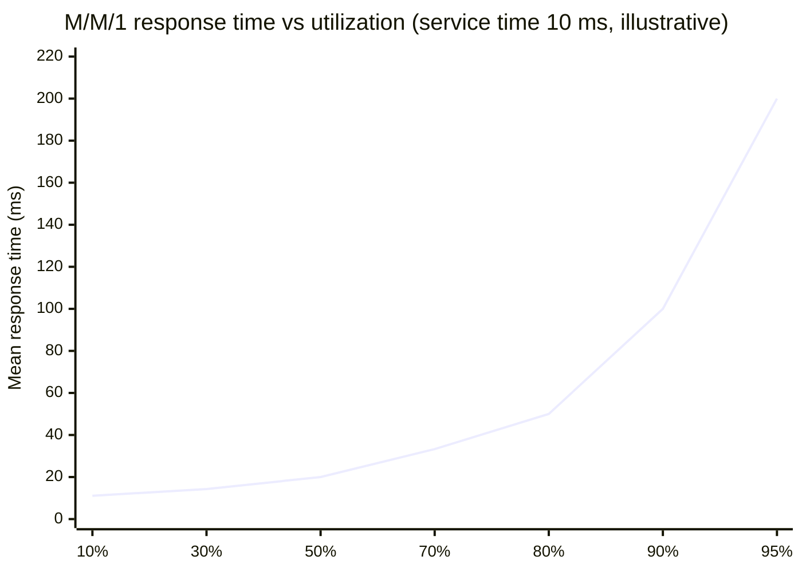

# Performance and Load Testing

You cannot know whether your system will handle 10,000 requests per second by running a
single `curl` command, and you do not want to find out on launch day. **Load testing**
means generating realistic traffic on purpose, measuring how the system behaves, and
finding the point where it stops coping, before users do. This chapter explains the
vocabulary from zero (throughput, latency percentiles, concurrency, Little's Law), how
to design a test that measures the truth (open vs closed models and the coordinated
omission trap), the tools (wrk/wrk2, k6, Locust, Gatling, vegeta), how to find the
bottleneck once the numbers go bad, and how to turn results into capacity plans and CI
checks.

## Foundations — What does it mean for a system to be "fast enough"?

### The four numbers everything is built on

Think of a supermarket. Customers arrive, queue, get served and leave.

| Term | Supermarket | Service | Unit |
|---|---|---|---|
| **Throughput** | customers served per minute | requests completed per second | RPS / QPS |
| **Latency** (response time) | time from joining the queue to leaving | time from sending a request to receiving the full response | ms |
| **Concurrency** | customers inside the shop right now | requests in flight at once | count |
| **Error rate** | customers who give up or are turned away | non-2xx responses, timeouts | % |

A fifth word ties them together: **saturation**, how close a resource is to fully busy.
When checkout staff are busy 50% of the time, a queue rarely forms. At 95% a queue is
almost always there, and it grows fast with every extra customer. The same curve
governs CPUs, thread pools, connection pools and disks.

### Little's Law

For any stable system, averaged over time:

**concurrency (L) = throughput (λ) × latency (W)**

A service doing 2,000 RPS at 150 ms average latency has ≈300 requests in flight at any
moment. That single multiplication sizes thread pools (you need at least ≈300 workers or
async slots), database connection pools and the number of connections a load generator
must open. It also explains a classic failure: if latency doubles because the database
slows down, concurrency doubles at the same throughput, and a fixed pool of 300 is
suddenly exhausted.

### Why "average latency" is the wrong number

Latency distributions have long right tails: most requests are fast, a few are very
slow (a cache miss, a GC pause, a lock wait, a retry). The **mean** is dragged around by
the tail yet hides how bad the tail is. Use **percentiles**: p50 (median, the typical
request), p95, p99 and p99.9 (the slow requests some users *will* hit on every page
load). SLOs are written in percentiles: "p99 < 300 ms at 2,000 RPS with < 0.1% errors".

This runnable example makes it concrete:

```python
"""Why averages lie, and why tails get worse with fan-out. Standard library only."""
import random
import statistics

random.seed(7)

# 10,000 requests: 98% are fast (~20 ms), 2% hit a slow path (~800 ms).
lat = [random.gauss(20, 4) if random.random() < 0.98 else random.gauss(800, 100)
       for _ in range(10_000)]


def pct(data, p):
    """Nearest-rank percentile."""
    s = sorted(data)
    k = max(0, min(len(s) - 1, round(p / 100 * len(s)) - 1))
    return s[k]


print(f"mean   {statistics.mean(lat):7.1f} ms")
print(f"median {pct(lat, 50):7.1f} ms")
print(f"p95    {pct(lat, 95):7.1f} ms")
print(f"p99    {pct(lat, 99):7.1f} ms")

# Fan-out: a page calls N backends in parallel and waits for all of them.
# If each backend is slow 1% of the time, how often is the page slow?
for n in (1, 10, 50, 100):
    print(f"fan-out {n:3d}: P(at least one slow call) = {1 - 0.99 ** n:5.1%}")

# Little's Law: requests in flight = arrival rate x time in system.
rps, latency_s = 2_000, 0.150
print(f"in flight at {rps} rps and {latency_s * 1000:.0f} ms: {rps * latency_s:.0f}")
```

Output:

```text
mean      36.1 ms
median    20.2 ms
p95       27.5 ms
p99      795.4 ms
fan-out   1: P(at least one slow call) =  1.0%
fan-out  10: P(at least one slow call) =  9.6%
fan-out  50: P(at least one slow call) = 39.5%
fan-out 100: P(at least one slow call) = 63.4%
in flight at 2000 rps and 150 ms: 300
```

The mean (36 ms) describes no real request: typical requests take 20 ms and the slow
2% take ≈800 ms. And a page that fans out to 100 backends sees a backend's p99 on
nearly two out of three loads, which is why large systems care so much about tail
latency ("The Tail at Scale", Dean and Barroso, 2013).

### An everyday example

Before Black Friday, an e-commerce team knows last year's peak was 4,000 checkout-page
RPS and expects +50%. They replay a realistic user journey (browse, add to cart, check
out) against a production-sized staging environment, ramping to 6,000 RPS and then
beyond, watching p99 latency, error rate and every resource's saturation. At 5,200 RPS
the database connection pool saturates and p99 jumps from 180 ms to 2 s. They raise the
pool, add a read replica for catalog queries, re-run, and reach 7,500 RPS within the
SLO, giving them 25% headroom. That loop, *measure, find the bottleneck, change one
thing, measure again*, is the whole discipline.

## 1. The methodology

1. **Write down the question and the pass criteria first.** "Can checkout sustain
   6,000 RPS with p99 < 300 ms and errors < 0.1% for 30 minutes?" is testable; "is it
   fast?" is not.
2. **Build a representative environment.** Same instance types, same configuration,
   production-like data volume (a query plan on 1,000 rows says nothing about 100
   million), same dependencies or realistic stand-ins. Know what differs and say so in
   the report.
3. **Model real traffic.** The request mix (80% reads / 20% writes), realistic payloads,
   realistic key distribution (a few hot products, a long tail), think time between
   user actions, authentication, cache hit rates.
4. **Warm up.** JIT compilation, connection pools, caches and autoscalers all need time.
   Discard the warm-up window from results.
5. **Establish a baseline.** Run the current system; record throughput, latency
   percentiles, error rate and resource usage.
6. **Watch the system, not only the load generator.** Server-side dashboards (CPU,
   memory, GC, pool usage, queue depth, DB metrics) during the test tell you *why* the
   numbers look the way they do. Correlate with the RED/USE signals from
   [Observability and Monitoring](06_observability_and_monitoring.md).
7. **Change one thing at a time**, re-run, compare. Two changes at once make results
   uninterpretable.
8. **Repeat runs.** Results vary run to run; three runs with similar results are worth
   more than one impressive one.

```arch
%% caption: A load test is three systems: the load generator (which must not be the bottleneck), the system under test in a production-like environment, and observability that explains the numbers.
grid 170x105
group gen "Load generation" color=amber icon=speed
node script "Test script" at 0,0 in gen icon=code sub="journeys, mix, pass criteria"
node lg "Load generators" at 1,0 in gen icon=worker sub="k6 / Locust, N machines"
group sut "System under test (prod-like)" color=blue icon=cloud
node lb "Load balancer" at 1,1 in sut icon=lb
node app "App instances" at 1,2 in sut icon=server sub="same size + config"
node db "Database" at 0,3 in sut icon=db sub="prod-sized data"
node cache "Cache" at 2,3 in sut icon=cache
node obs "Observability" at 2.5,0 icon=dashboard sub="RED, USE, traces, profiles"
script -> lg
lg -> lb : "open-model traffic"
lb -> app
app -> db
app -> cache
app:R ..> obs:B : "metrics"
lg:R ..> obs:L : "client latency"
```

## 2. Types of load test

| Type | Shape | Question it answers | Typical length |
|---|---|---|---|
| **Smoke** | 1–5 users | Does the script work and is the system up? Run it before every bigger test. | 1–2 min |
| **Load** (average / peak) | ramp to the expected peak, hold | Do we meet the SLO at the traffic we expect? | 15–60 min |
| **Stress** | keep increasing past the peak | Where is the breaking point, *how* does it fail (graceful degradation or collapse, corrupted data?), and does it recover when load drops? | until failure |
| **Spike** | jump from low to very high in seconds | Viral event, push notification, marketing email. Do autoscaling, connection pools and caches cope with the jump, or does a cold cache melt the database? | minutes |
| **Soak** (endurance) | moderate load for hours | Memory leaks, connection or file-descriptor leaks, log/disk growth, slow GC degradation, certificate or token expiry mid-run. | 4–24 h |
| **Breakpoint / capacity** | slow step increase | The maximum sustainable throughput per instance, for capacity planning. | 30–90 min |
| **Scalability** | same test at 1, 2, 4, 8 instances | Does throughput scale linearly, or does a shared component (DB, lock, cache key) cap it? | per step |

## 3. Open versus closed models, and coordinated omission

This is the topic that separates people who have run load tests from people who have
read about them.

- A **closed model** has a fixed number of virtual users, each looping: send a request,
  wait for the response, (think), send the next. `wrk`, JMeter thread groups, Locust
  users and k6's default VU executors are closed. The catch: **when the system slows
  down, the generator slows down with it**. Ten VUs against a server that takes 1 s per
  request produce 10 RPS, not the 1,000 RPS you meant to test.
- An **open model** sends requests at a fixed *arrival rate* regardless of how fast
  responses come back, like real users on the internet who do not wait for each other.
  When the system slows down, requests pile up exactly as they would in production.
  k6's `constant-arrival-rate` / `ramping-arrival-rate` executors, `wrk2`, `vegeta` and
  Gatling's open injection profiles work this way.

**Coordinated omission** (a term from Gil Tene) is the measurement bug closed models
cause. Suppose the server stalls for 2 s. A closed-model client that should have sent
200 requests during those 2 s sent only one (it was stuck waiting), records one slow
sample and 199 samples that were never taken. The reported p99 looks fine while real
users would have seen 2 s delays on hundreds of requests. Tools that fix this measure
latency from when a request *should have been sent* according to the schedule
(`wrk2` does this; open-model executors avoid most of it by design).

Rule of thumb: use a **closed model** when simulating a known, fixed population (a
batch of workers, internal users) or to find maximum throughput; use an **open model**
for anything internet-facing and for latency SLO verification.

## 4. `wrk` and friends: the blunt instruments

`wrk` is a small C program that drives HTTP with a few threads, each running an event
loop (epoll/kqueue) over many connections. It is excellent for finding the upper
throughput limit of one endpoint.

```bash
# 30 seconds, 12 threads, 400 open connections (closed model)
wrk -t12 -c400 -d30s --latency http://127.0.0.1:8080/api/users
```

```text
Running 30s test @ http://127.0.0.1:8080/api/users
  12 threads and 400 connections
  Thread Stats   Avg      Stdev     Max   +/- Stdev
    Latency    45.12ms   12.34ms 105.40ms   80.12%
    Req/Sec   750.12    105.45     1.10k    75.00%
  Latency Distribution
     50%   43.80ms
     75%   51.20ms
     90%   60.70ms
     99%   88.10ms
  270043 requests in 30.10s, 85.12MB read
Requests/sec:   8971.52
Transfer/sec:      2.83MB
```

(Output is illustrative.) Sanity-check it with Little's Law: 400 connections ÷ 45 ms
≈ 8,900 RPS, which matches. When those two numbers disagree, something (errors,
non-2xx, a saturated client) is off. Note the "Non-2xx or 3xx responses" line if present:
`wrk` counts a flood of fast 503s as great throughput.

Related tools:

| Tool | Model | Notes |
|---|---|---|
| `wrk` | closed | Lua scripting for custom requests; susceptible to coordinated omission |
| `wrk2` | open (`-R 5000` = constant 5,000 RPS) | corrects coordinated omission; HdrHistogram output |
| `vegeta` | open, constant rate | Go; `echo "GET http://x" \| vegeta attack -rate=500/s -duration=60s \| vegeta report` |
| `hey`, `oha` | closed | quick ad-hoc checks (`oha` has a live TUI) |
| `ghz` | both | gRPC load testing |
| `ab` (ApacheBench) | closed | old, single-threaded, HTTP/1.0 by default; prefer the above |

## 5. k6: scripted user journeys

Real users log in, fetch a profile, wait, and then submit a form. **k6** (Grafana Labs;
engine in Go, tests written in JavaScript, with native TypeScript support since k6 1.0
in 2025) scripts those journeys, applies pass/fail **thresholds**, and exits non-zero
when they fail, so it fits in CI.

A closed-model journey (the owner's original, with the login request fixed to send JSON;
passing a plain object to `http.post` sends it form-encoded):

```javascript
import http from 'k6/http';
import { check, sleep } from 'k6';

export const options = {
  stages: [
    { duration: '30s', target: 20 }, // ramp up to 20 virtual users
    { duration: '1m', target: 20 },  // hold
    { duration: '30s', target: 0 },  // ramp down
  ],
  thresholds: {
    http_req_duration: ['p(95)<500', 'p(99)<1000'], // fail the run if breached
    http_req_failed: ['rate<0.01'],                  // < 1% errors
    checks: ['rate>0.99'],
  },
};

const BASE = __ENV.BASE_URL || 'https://staging.example.com';

export default function () {
  // 1. Log in
  const loginRes = http.post(
    `${BASE}/login`,
    JSON.stringify({ user: 'test', pass: '123' }),
    { headers: { 'Content-Type': 'application/json' }, tags: { name: 'login' } },
  );
  check(loginRes, { 'logged in': (r) => r.status === 200 });
  const token = loginRes.json('token');

  // 2. Think time: real users pause between actions
  sleep(1);

  // 3. Fetch data with the token
  const dataRes = http.get(`${BASE}/profile`, {
    headers: { Authorization: `Bearer ${token}` },
    tags: { name: 'profile' },
  });
  check(dataRes, { 'fetched profile': (r) => r.status === 200 });
}
```

An open-model test that ramps the *arrival rate*, which is what you want for an SLO
check or a breakpoint search:

```javascript
import http from 'k6/http';
import { check } from 'k6';

export const options = {
  scenarios: {
    browse: {
      executor: 'ramping-arrival-rate',
      startRate: 100,
      timeUnit: '1s',            // rates below are iterations per second
      preAllocatedVUs: 200,
      maxVUs: 2000,              // k6 adds VUs if responses slow down
      stages: [
        { target: 1000, duration: '5m' },
        { target: 1000, duration: '10m' },
        { target: 3000, duration: '10m' },
      ],
    },
  },
  thresholds: {
    'http_req_duration{name:product}': ['p(99)<300'],
    http_req_failed: [{ threshold: 'rate<0.001', abortOnFail: true }],
    dropped_iterations: ['count<100'], // k6 could not keep up with the schedule
  },
};

export default function () {
  const id = Math.floor(Math.random() ** 3 * 50000); // skewed: low ids are "hot" products
  const r = http.get(`${__ENV.BASE_URL}/api/products/${id}`, { tags: { name: 'product' } });
  check(r, { ok: (res) => res.status === 200 });
}
```

```bash
k6 run -e BASE_URL=https://staging.example.com script.js
k6 run --out experimental-prometheus-rw script.js   # stream metrics to Prometheus/Grafana
```

Details that matter: tag requests with a `name` so URLs containing IDs aggregate into
one metric instead of 50,000; `dropped_iterations` above zero means the generator could
not start iterations on schedule (not enough VUs, or the generator itself is overloaded);
`setup()` runs once before the test (create test users, fetch a token) and `teardown()`
after. For browser-level performance (Core Web Vitals under load), k6 has a `k6/browser`
module that drives Chromium.

## 6. Other tools

| Tool | Language for tests | Model | Strength |
|---|---|---|---|
| **k6** | JavaScript / TypeScript | closed and open executors | CI-friendly thresholds, good docs, Grafana integration, distributed via k6 Operator or Grafana Cloud |
| **Locust** | Python | closed (users) | tests are plain Python classes; easy to share logic with the app's test code; web UI; distributed master/workers |
| **Gatling** | Scala, Java, Kotlin, JavaScript/TypeScript | open and closed injection profiles | efficient (async engine), detailed HTML reports |
| **JMeter** | GUI / XML | closed (thread groups) | protocol coverage (JDBC, JMS, LDAP, FTP), large ecosystem; heavy |
| **Artillery** | YAML + JavaScript | open (arrival rate) | quick scenario files, WebSocket and Socket.IO support |
| **vegeta / wrk2** | CLI | open, constant rate | precise single-endpoint rate tests |

A Locust test for comparison:

```python
from locust import HttpUser, task, between


class Shopper(HttpUser):
    wait_time = between(1, 3)  # think time

    def on_start(self):
        r = self.client.post("/login", json={"user": "test", "pass": "123"})
        self.client.headers["Authorization"] = f"Bearer {r.json()['token']}"

    @task(5)
    def browse(self):
        self.client.get("/api/products?page=1", name="/api/products")

    @task(1)
    def add_to_cart(self):
        self.client.post("/api/cart", json={"sku": "A-100", "qty": 1})
```

`locust -f shopper.py --headless -u 500 -r 50 --run-time 10m --host https://staging.example.com`
runs 500 users, spawning 50 per second.

## 7. Finding the bottleneck

Load tests tell you *that* the system breaks at 5,200 RPS; the value is in finding *why*.

### The shape of the curve

As load rises, throughput climbs linearly while latency stays flat, until some resource
nears saturation. Then latency bends sharply upward (queueing) while throughput
plateaus, and past that point throughput can even *fall* as the system wastes work on
timeouts, retries and context switches. The simplest queueing model (M/M/1) makes the
bend explicit: time in system = service time ÷ (1 − utilization).



Real systems differ in the numbers but not the shape, which is why you keep headroom
(often a 60–70% target on critical pools) instead of running at 95%. The derivation is
in [Application Resilience Patterns](../../interview-core/SystemDesign/building_blocks/12_application_resilience_patterns.md).

### Where to look

Walk every resource with the USE method (utilization, saturation, errors), from the
outside in:

| Symptom under load | Common cause | How to confirm |
|---|---|---|
| p99 jumps, CPU is low | waiting: DB, a downstream call, a lock, a pool | traces (where is the time?), pool wait metrics, `pg_stat_activity` |
| "connection pool exhausted" / timeouts acquiring a connection | pool smaller than λ × W | pool metrics; Little's Law |
| CPU at 100% on the app | real computation, serialization, logging, regex, TLS | profiler: flame graph (`perf`, `pprof`, `py-spy`, `async-profiler`) |
| periodic latency spikes | GC pauses, cron jobs, checkpoints, log rotation | GC logs, align spikes with timestamps |
| DB CPU or IOPS maxed | missing index, N+1 queries, lock contention | `EXPLAIN ANALYZE`, `pg_stat_statements`, slow query log |
| throughput stops scaling with more instances | shared bottleneck: one DB primary, one hot key, one lock, a rate-limited third party | scalability test at 1/2/4/8 instances |
| errors appear at a specific concurrency | file-descriptor limit, ephemeral port exhaustion, `somaxconn` backlog | `ss -s`, `dmesg`, `/proc/PID/limits` ([CLI and Linux System Mastery](07_cli_and_linux_mastery.md)) |
| memory grows through the soak test | a leak (caches without bounds, listeners, goroutines) | heap profiles at two points in time |
| results look too good | the load generator is saturated, or responses are fast errors or cache hits only | generator CPU, error counts, cache hit ratio |

The load generator is itself a common bottleneck: a single k6 or wrk machine tops out
somewhere around tens of thousands of simple RPS depending on hardware, TLS and script
complexity. Watch its CPU and network, and distribute generation across machines for
large tests.

## 8. Capacity planning and performance in CI

**From test result to capacity plan.** If a breakpoint test shows one instance sustains
600 RPS within the SLO, and the forecast peak is 6,000 RPS, then you need 10 instances
for the load, plus headroom for losing an availability zone (with 3 zones, one-third
capacity can disappear: 10 ÷ (2/3) = 15), plus margin for autoscaling lag during
spikes. Re-run the test whenever the architecture or the traffic mix changes
significantly. [Back-of-the-Envelope Estimation](../../interview-core/SystemDesign/building_blocks/18_back_of_envelope_estimation.md) covers
the estimation side.

**Performance regression tests in CI.** Full load tests are too slow and noisy for every
pull request, so teams layer:

- **Microbenchmarks** for hot code paths (`go test -bench`, `pytest-benchmark`, JMH),
  compared against the main branch with statistical tools (`benchstat`) because single
  runs are noisy.
- **A short, fixed k6 run** (a few minutes, a fixed arrival rate) against an ephemeral
  environment on merges to `main`, with thresholds loose enough not to flap but tight
  enough to catch a 2× regression.
- **Scheduled full tests** (nightly or weekly, and before known peaks) on a
  production-like environment.

**Testing in production.** Staging never matches production perfectly. Teams also use
shadow (mirrored) traffic, where a proxy copies real requests to a new version and
discards its responses; canary releases watched on latency SLOs
([Deployment Strategies](../CICD/03_deployment_strategies.md)); and, carefully, synthetic load against production
during low-traffic windows with clearly tagged test data.

## 9. Pitfalls that invalidate results

- **Unrealistic data**: every virtual user requests the same product, so everything is
  a cache hit; or IDs are uniformly random, so nothing is. Real traffic is skewed
  (Zipf-like).
- **Wrong environment**: half-size database, empty tables, a different instance family,
  missing TLS, or a test that bypasses the load balancer.
- **Ignoring errors**: high RPS made of fast 429/503 responses. Always report
  throughput of *successful* requests.
- **Load from one IP** hitting rate limits or sticky load balancing (every request pinned
  to one backend), or DNS caching that pins all traffic to one LB node.
- **No warm-up**, or a test so short that autoscaling, GC and caches never reach steady
  state.
- **Hitting third parties**: a load test that charges your real payment provider or
  emails real users. Stub them, or use their sandbox with its rate limits in mind.
- **Averages in the report**: report p50/p95/p99/max, throughput, errors and the
  resource that saturated first.

## Common interview questions

**Why use percentiles instead of the average for latency?**
Latency distributions are skewed; the mean describes no real request and hides the
tail. p99 is what a meaningful fraction of users experience, and with fan-out most page
loads touch some backend's tail.

**What is Little's Law and how do you use it?**
Concurrency = throughput × latency. It sizes thread and connection pools, validates load
test results (connections ÷ latency ≈ RPS) and explains why a latency increase exhausts
pools at constant traffic.

**What is coordinated omission?**
A closed-model load generator waits for slow responses and therefore does not send the
requests it should have during a stall, so the slow period is under-sampled and
percentiles look far better than reality. Fix with open-model (constant arrival rate)
generators or tools that correct for it, such as `wrk2`.

**Load test versus stress test versus soak test?**
Load: expected peak, verify the SLO. Stress: beyond peak, find the breaking point and
failure mode, check recovery. Soak: moderate load for hours, find leaks and slow
degradation.

**Latency rises sharply at 70% CPU. Why not at 100%?**
Queueing: waiting time grows like ρ/(1 − ρ), so queues form well before full
utilization, especially with variable request costs and multiple shared resources. Keep
headroom and alert on saturation (queue depth, pool waits), not average CPU.

**Your service handles 1,000 RPS on one instance. Will 10 instances handle 10,000?**
Only if nothing shared saturates first: the database, a cache hot key, a lock, a
downstream rate limit or the load balancer. Run a scalability test at increasing
instance counts and watch the shared components.

**How would you load test a checkout flow before a big sale?**
Define the SLO and target (peak × growth × headroom), script the real journey with a
realistic mix and data skew, stub the payment provider, warm up, ramp with an open
model, watch server-side RED/USE metrics and traces, find and fix the first bottleneck,
repeat, then run a spike test and a soak test.

**How do you know the load generator is not the bottleneck?**
Watch its CPU, network and k6's `dropped_iterations`; check that connections ÷ latency
matches RPS; add generator machines and confirm results do not change.

## What Each Engineering Level Should Know

| Level | Industry title | Google ladder | What they should know |
|---|---|---|---|
| Student/Intern | Intern | — | Throughput vs latency, what p50/p95/p99 mean, and how to run a simple `wrk` or k6 test against a local service. |
| Junior (L3) | Software Engineer I | L3 | Write a k6 or Locust script with checks and thresholds, run smoke and load tests, read percentiles and error rates, and not trust averages. |
| Mid (L4) | Software Engineer II | L4 | Design a test plan (mix, data, warm-up, pass criteria), use Little's Law, choose open vs closed models, find a bottleneck with metrics, traces and a profiler. |
| Senior (L5) | Senior Software Engineer | L5 | Explain coordinated omission and queueing behaviour, run stress, spike, soak and scalability tests, turn results into capacity plans with zone-failure headroom, and put performance regression checks into CI. |
| Staff+ (L6+) | Staff / Principal Engineer | L6+ | Own performance and capacity strategy across services: SLO-driven targets, tail-latency budgets under fan-out, production testing (shadow traffic, canaries), and cost vs headroom trade-offs for peak events. |

## Interview checklist

- [ ] I can define throughput, latency, concurrency, error rate and saturation, and apply Little's Law.
- [ ] I can explain why percentiles beat averages and how fan-out amplifies tail latency.
- [ ] I can describe smoke, load, stress, spike, soak, breakpoint and scalability tests.
- [ ] I can explain open vs closed workload models and coordinated omission.
- [ ] I can write a k6 script with checks, thresholds, tags and an arrival-rate executor.
- [ ] I can list the methodology: pass criteria, representative environment and data, warm-up, baseline, one change at a time.
- [ ] I can explain the latency-vs-load knee with queueing and why headroom matters.
- [ ] I can map load-test symptoms to bottlenecks (pools, GC, DB, locks, fd limits, the generator itself).
- [ ] I can turn a per-instance result into a capacity plan with zone-failure headroom.
- [ ] I can describe performance testing in CI and in production (shadow traffic, canaries).

Related: [Application Resilience Patterns](../../interview-core/SystemDesign/building_blocks/12_application_resilience_patterns.md) (queueing
and headroom), [Back-of-the-Envelope Estimation](../../interview-core/SystemDesign/building_blocks/18_back_of_envelope_estimation.md),
[Overload Control and Graceful Degradation](../../interview-core/SystemDesign/building_blocks/28_overload_control_and_graceful_degradation.md),
[Observability and Monitoring](06_observability_and_monitoring.md) (RED/USE dashboards), [CLI and Linux System Mastery](07_cli_and_linux_mastery.md)
(server-side triage), [The Testing Pyramid and Unit Tests](../TestingAndQuality/01_testing_pyramid.md).
